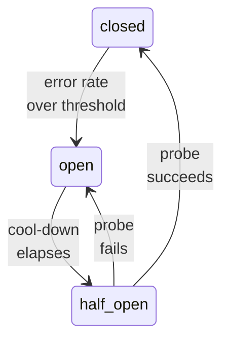
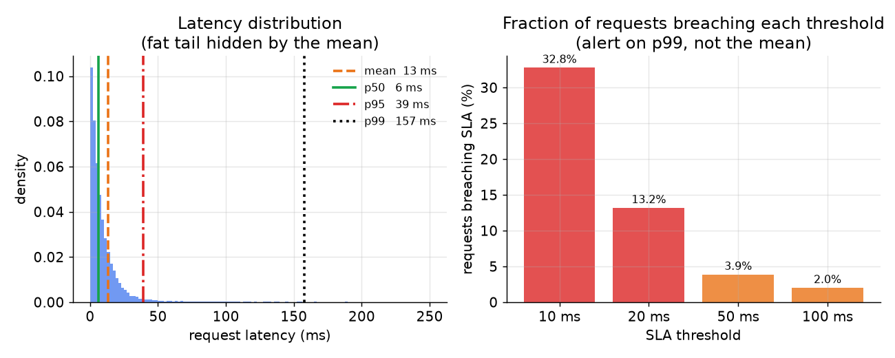

# 6. Reliability

## Timeouts and circuit breakers

A model server that is slow is worse than a model server that is down. A slow
downstream blocks threads, exhausts connection pools, and turns one overloaded
replica into a latency cascade across the whole fleet. Every call into the
model server from the application layer needs a **hard timeout**: if no
response within, say, 45 ms on a 50 ms p99 budget, return a fallback rather
than waiting.

A **circuit breaker** (a switch that "trips open" to stop calls to a failing
dependency, like a household fuse) goes one step further: if the error rate or
timeout rate from a replica exceeds a threshold, stop sending it traffic for a
cool-down period. This breaks the feedback loop where a struggling replica
receives more retries, making it struggle more.

```python
def circuit_open(error_count, total, threshold):   # trip when error rate exceeds threshold
    if total == 0:
        return False                                # no traffic yet, stay closed
    return (error_count / total) > threshold
# circuit_open(12, 20, 0.5) -> True  (60% errors > 50%, stop sending this replica traffic)
```

The state machine the breaker walks through:



The practical choice of timeout value: set it just inside the p99 budget so the
slow-tail requests trip the timeout rather than breaching the SLA by a large
margin.

## Fallbacks and graceful degradation

Every online serving path should have a defined fallback for when the model is
unavailable or too slow. Options in roughly increasing freshness cost:

- **Pre-computed static scores.** Booking.com precomputes static fallback
  scores for every property so the ranking page can still answer when the live
  model is down. The output is stale but present.
- **A cheaper model.** Serve a smaller, faster model version when the full
  ranker is overloaded. Quality degrades gracefully rather than the service
  failing.
- **Popularity-based default.** Return popular items without personalization.
  Users get a valid response; the team loses the incremental lift of the model
  for that period.
- **Cached prediction.** If the same entity was scored recently and the cache
  is warm, return the cached result. Works well for slowly-changing inputs.

The key principle: **define the fallback chain before the incident, not during
it.** At incident time the only question should be "is the fallback already
triggering?" not "what should our fallback be?"

## What "high availability" actually means for serving

High availability for a model serving fleet means:

1. No single host failure takes the service down (replicas absorb the
   load when one drops; the load balancer's health check removes the
   failed replica quickly).
2. No single model version deploy takes the service down (gradual rollout
   with the old version staying warm; serve-while-loading prevents cold
   replicas from receiving traffic before they are ready).
3. No upstream dependency failure takes the service down (feature store
   unavailability triggers the fallback chain, not a 5xx cascade to the
   caller).

## p99 as a first-class alert



*The mean hides the fat tail. Here 7% of requests take 10x longer than the
median, but the mean looks reasonable. The p99 is what breaches the SLA.
Alerting on the mean lets the problem grow silently. Illustrative simulation.*

Set your on-call alert thresholds on p99 (and p999 for fan-out services), not
on average latency or error rate alone. A latency spike that only shows in the
tail is an SLA breach for every user whose request lands there, even if the
average looks fine.

## Bottlenecks and how to attack them

| Bottleneck | First sign | Fix | Tradeoff |
|---|---|---|---|
| Tail latency over budget | p99 above SLA while p50 is fine | Tune batch window, add replicas, cap model size | Throughput vs tail latency |
| GPU lanes idle under load | Hardware underutilized, QPS below capacity | Increase dynamic batch size or window | Adds batch wait latency |
| Cold start on new replicas | Replicas take traffic before warming, p99 spikes during scale-out | Readiness probes, pre-warm synthetic requests, keep headroom | Idle capacity cost |
| Autoscaling on wrong signal | Fleet scales late or thrashes on CPU spikes | Scale on queue depth, GPU utilization, or batch latency | Tuning and observability cost |
| Embedding table too large for one replica | OOM errors, slow model loads | Shard tables across replicas, quantize (store weights in lower precision like int8 or 4-bit to shrink memory), host-memory tiering | Lookup latency, slight quality loss |
| Deploy blast radius | A bad version hits 100% of traffic | Shadow then canary then gradual ramp | Slower, higher-cost rollouts |
| Slow rollback | Incident drags on while old version is rebuilt | Registry pointer rollback, keep prior version warm | Cost of idle warm replica |
| Feature fetch on the critical path | Latency before inference dominates | Cache hot keys, batch feature reads, co-locate the online store | Freshness vs latency |
| Training-serving skew | Model serves fine but degrades over time | Log served features and compare to training distribution | Logging cost and storage |

**Details worth naming.** Two rows look similar but need opposite responses. "Tail latency over budget" with a healthy p50 is almost always a queueing effect, not a slow model: requests pile up behind a full batch or a GC pause, so the fix is on the batch window and replica count, not the forward pass. "GPU lanes idle under load" is the inverse, throughput left on the table, where a larger batch or window helps; pushing both knobs at once is a contradiction, so read p50-vs-p99 first to know which regime you are in. The cold-start row is why autoscaling reactively on a traffic spike still spikes p99: a freshly booted replica must load weights and warm caches before its first forward pass is representative, so readiness probes must gate traffic until a synthetic warm-up request has returned, and the pre-warm cost is the price of not serving cold. On the serving frameworks themselves (Triton Inference Server from NVIDIA, TorchServe from Meta), the same batch-window knob that fills idle GPU lanes is the one that inflates tail latency, so it is tuned against the SLA, never maximized.
