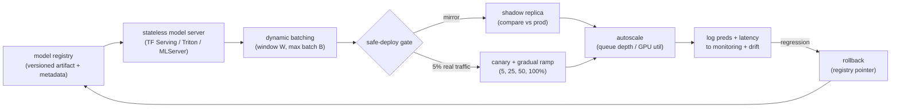

# 7. How teams do it in production

Every mature ML serving stack converges on the same skeleton: a versioned
artifact loaded into a stateless server fleet behind autoscaling, staged through
shadow or canary before widening, and reverting with a registry pointer when
something breaks. What actually differs is who owns the platform, where inference
runs, how batches form, and how safe-deploy is automated versus left to the team.

## Where the real designs diverge

| System | Serving stack | Batching | Deploy safety | Centralized vs decentralized | Distinctive choice |
|---|---|---|---|---|---|
| Uber Michelangelo | In-house fleet, hundreds of machines | Batched RPC, sub-10 ms p95 | Registry plus staged rollout | Centralized platform | UUID plus tag aliases make promotion and rollback a pointer change with no client changes |
| Grab Catwalk | TF Serving on Kubernetes | K8s autoscaling, per-pod | Serve-while-loading; rollback to prior version in seconds | Centralized self-serve | Scientists export to S3; TF Serving auto-discovers new versions, cutting deploy cycle from days to minutes |
| Pinterest GPU serving | GPU fleet, custom batching | Large GPU batch, CUDA graphs, single device copy | (not documented in first-party source) | Centralized GPU inference | Moved from CPU scatter-gather to GPU to serve a 100x larger model at neutral cost; hybrid DRAM plus SSD embedding cache |
| Lyft LyftLearn | In-house inference platform | ms-latency predictions | Versioning plus shadow mirroring before ship | Decentralized per-team | Each team owns inference; shadow proves no breakage before any user sees the new model |
| Shopify Merlin | Ray on GKE, per-use-case service | MLServer request batching, REST plus gRPC | CI/CD pipeline (Buildkite plus Shipit), isolated Workspaces | Decentralized, dedicated service per model | Ladder from no-code MLServer to full FastAPI custom lets simple models ship fast |
| Netflix Kayenta | Canary analysis tool (not a serving stack) | N/A | Automated canary gate: baseline vs canary metrics with statistical testing | Centralized rollout gate | Automates the go/no-go decision so daily deploys do not need a human in the loop |
| Booking.com | Multi-phase ranking on K8s, hundreds of pods | Phase-split scoring; fan-out chunking | Shadow-traffic mirroring, p999 budgets | Centralized ranking platform | Multi-phase scoring runs cheap early phases to cut the candidate set before the expensive model touches it |
| LinkedIn Pensieve | Embedding feature platform | Nearline pre-computation | Versioned embeddings served from a fast store | Centralized embedding platform | Pushes embedding inference off the real-time critical path by precomputing in nearline |
| RISELab Clipper | Research serving layer, framework-agnostic | Adaptive batching plus prediction caching | Model abstraction for hot-swap | Framework layer over any backend | Caching pays when identical inputs repeat; per-framework containers isolate a slow model from the rest |

The core dividing line is a centralized shared platform versus a decentralized
per-team service, and how much of shadow, canary, and rollback each one
automates rather than leaves to the caller.

## What these systems share

Strip away the names and the skeleton is identical everywhere: a versioned
artifact leaves the registry, loads into a stateless server, a candidate is
proven through shadow or canary before it widens, autoscaling tracks a
serving-specific signal, and everything served is logged so monitoring can trip
a rollback that is a registry pointer move, not a rebuild.

## The systems (first-party links)

- **Berkeley RISELab** [Clipper: A Low-Latency Online Prediction Serving System](https://arxiv.org/abs/1612.03079): serving layer with adaptive batching, prediction caching, and model abstraction over heterogeneous frameworks.
- **Google** [Rules of Machine Learning](https://developers.google.com/machine-learning/guides/rules-of-ml): deployment discipline, staged rollout, and keeping serving aligned with training.
- **Uber** [Meet Michelangelo: Uber's Machine Learning Platform](https://www.uber.com/us/en/blog/michelangelo-machine-learning-platform/): online prediction cluster at sub-10 ms p95 with batched RPC, UUID plus tag versioning, and registry-backed rollout.
- **Grab** [Catwalk: serving machine learning models at scale](https://engineering.grab.com/catwalk-serving-machine-learning-models-at-scale): self-service TF Serving on Kubernetes with autoscaling for hundreds of models; serve-while-loading gives zero-downtime deploys.
- **Lyft** [Millions of real-time decisions with LyftLearn Serving](https://eng.lyft.com/powering-millions-of-real-time-decisions-with-lyftlearn-serving-9bb1f73318dc): decentralized inference platform with versioning and shadow mirroring before production.
- **Netflix** [Automated Canary Analysis with Kayenta](https://netflixtechblog.com/automated-canary-analysis-at-netflix-with-kayenta-3260bc7acc69): automated canary gate comparing baseline vs canary metrics to gate rollouts without a human in the loop.
- **Pinterest** [GPU-accelerated ML inference at Pinterest](https://medium.com/@Pinterest_Engineering/gpu-accelerated-ml-inference-at-pinterest-ad1b6a03a16d): GPU serving with CUDA graphs, single device copy, and sub-linear latency scaling under dynamic batching.
- **Shopify** [Real-time predictions with Shopify's ML platform](https://shopify.engineering/shopifys-machine-learning-platform-real-time-predictions): Merlin deploys each use case as a dedicated Ray-on-GKE service with an MLServer-to-FastAPI serving ladder.
- **Booking.com** [The engineering behind a high-performance ranking platform](https://medium.com/booking-com-development/the-engineering-behind-booking-coms-ranking-platform-a-system-overview-2fb222003ca6): multi-phase ranking with shadow-traffic mirroring and p999 latency budgets across hundreds of Kubernetes pods.
- **LinkedIn** [Pensieve: an embedding feature platform](https://www.linkedin.com/blog/engineering/ai/pensieve): pushes embedding inference to nearline pre-computation, serving results from a fast store to keep the critical path clean.
