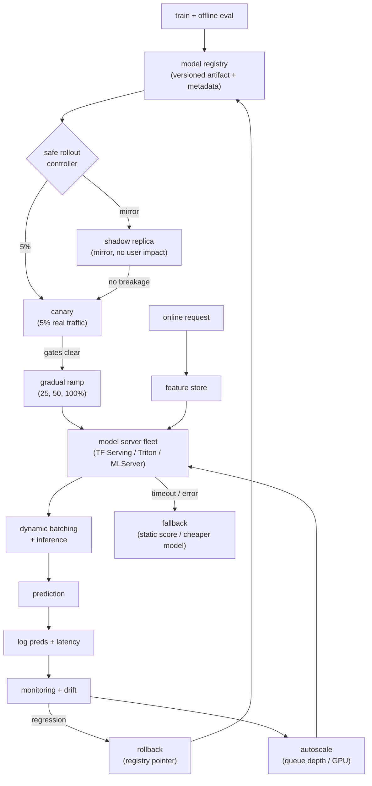

# 9. Summary

## One-page recap

- **Separate the model from the server.** The model is the trained artifact; the
  server is infrastructure that loads it, batches requests, and hot-swaps
  versions. Conflating them produces un-rollbackable serving code.
- **Design backwards from the p99 budget.** The total budget (50 ms, say) is
  shared across network, feature fetch, batch wait, and inference. Size batch
  window and hardware so the model fits inside the budget slice left after the
  other steps.
- **Alert on p99 and p999, never the mean.** Average latency hides the fat tail
  that breaches the SLA for the requests that matter.
- **Dynamic batching is the throughput lever.** A wider window fills the
  accelerator but adds tail latency. On GPU the cost curve is sub-linear;
  batch larger. On CPU it is linear; size conservatively.
- **Shadow proves no breakage; canary proves it helps.** They measure different
  things and both are necessary. "Great in shadow, tanked in canary" is expected.
- **Rollback must be faster than rollout.** Keep the prior version in the
  registry. Wire an automated trigger off a health or metric regression.
  A deploy you cannot reverse in seconds is not a safe deploy.
- **Scale on the right signal.** The bottleneck for inference is queue depth or
  GPU utilization, not CPU. Scaling on CPU lets the queue grow while the
  autoscaler waits.
- **Push work to batch when freshness allows.** Not everything needs online
  serving. Precompute stable predictions in batch and serve from a fast lookup;
  reserve live inference for what depends on real-time context.

## The system on one page

## Test yourself

1. Why must the server and the model be separate artifacts, and what breaks when
   they are coupled?
2. Given a 50 ms p99 budget and a feature store that costs 10 ms, how do you
   decide on the maximum batch wait window?
3. Shadow passed. Canary failed. Is that a bug in the deploy process? Explain
   why or why not.
4. Your autoscaler is firing on CPU utilization and latency is still breaching
   SLA. What two things do you check first?
5. When would you choose blue-green over canary-plus-ramp, and what does the
   choice cost?
6. A colleague proposes removing the model registry and copying the artifact
   file directly into the serving container on each deploy. What breaks?

## Further reading

- Dense reference with comparison table, math, and case teardowns:
  [../../topics/05-realtime-serving-and-deployment.md](../../topics/05-realtime-serving-and-deployment.md).
- System comparisons side by side:
  [../../tools/comparisons/05.md](../../tools/comparisons/05.md).
- Per-company teardowns with interview questions and gotchas:
  [../../tools/teardowns/05.md](../../tools/teardowns/05.md).
