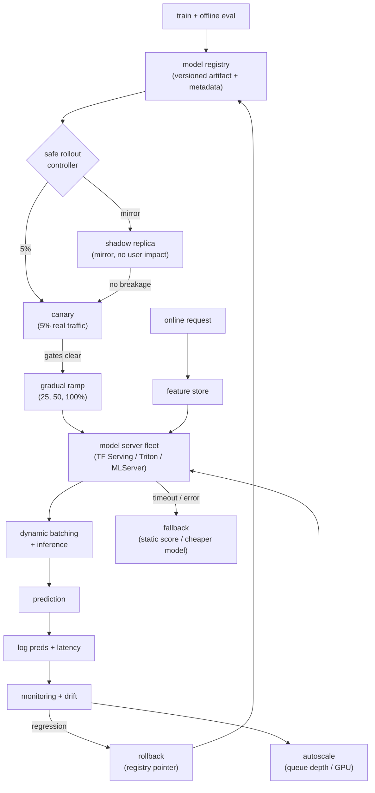

# 9. Summary

## One-page recap

- **Separate the model from the server.** The model is the trained artifact; the
  server is infrastructure that loads it, batches requests, and hot-swaps
  versions. Conflating them produces un-rollbackable serving code.
- **Design backwards from the p99 budget.** The total budget (50 ms, say) is
  shared across network, feature fetch, batch wait, and inference. Size batch
  window and hardware so the model fits inside the budget slice left after the
  other steps.
- **Alert on p99 and p999, never the mean.** Average latency hides the fat tail
  that breaches the SLA for the requests that matter.
- **Dynamic batching is the throughput lever.** A wider window fills the
  accelerator but adds tail latency. On GPU the cost curve is sub-linear;
  batch larger. On CPU it is linear; size conservatively.
- **Shadow proves no breakage; canary proves it helps.** They measure different
  things and both are necessary. "Great in shadow, tanked in canary" is expected.
- **Rollback must be faster than rollout.** Keep the prior version in the
  registry. Wire an automated trigger off a health or metric regression.
  A deploy you cannot reverse in seconds is not a safe deploy.
- **Scale on the right signal.** The bottleneck for inference is queue depth or
  GPU utilization, not CPU. Scaling on CPU lets the queue grow while the
  autoscaler waits.
- **Push work to batch when freshness allows.** Not everything needs online
  serving. Precompute stable predictions in batch and serve from a fast lookup;
  reserve live inference for what depends on real-time context.

## The system on one page

```mermaid
flowchart TD
  TRAIN["train + offline eval"]
  REG["model registry<br/>(versioned artifact + metadata)"]
  CTRL{"safe rollout<br/>controller"}
  SHADOW["shadow replica<br/>(mirror, no user impact)"]
  CANARY["canary<br/>(5% real traffic)"]
  RAMP["gradual ramp<br/>(25, 50, 100%)"]
  SRV["model server fleet<br/>(TF Serving / Triton / MLServer)"]
  BATCH["dynamic batching<br/>+ inference"]
  FEAT["feature store"]
  AS["autoscale<br/>(queue depth / GPU)"]
  LOG["log preds + latency"]
  MON["monitoring + drift"]
  RB["rollback<br/>(registry pointer)"]
  FALLBACK["fallback<br/>(static score / cheaper model)"]

  TRAIN --> REG
  REG --> CTRL
  CTRL -->|"mirror"| SHADOW
  CTRL -->|"5%"| CANARY
  CANARY -->|"gates clear"| RAMP
  RAMP --> SRV
  SHADOW -->|"no breakage"| CANARY
  REQ["online request"] --> FEAT
  FEAT --> SRV
  SRV --> BATCH
  BATCH --> RESP["prediction"]
  RESP --> LOG
  LOG --> MON
  MON -->|"regression"| RB
  RB --> REG
  SRV -->|"timeout / error"| FALLBACK
  AS --> SRV
  MON --> AS
```

**How it works.** Two paths meet at the server fleet. On the deploy path a trained
artifact passes offline eval, lands in the registry as a versioned entry, and the
safe-rollout controller stages it: mirror to a shadow replica to prove no breakage,
then a 5 percent canary, then a gradual ramp to full traffic once each gate clears.
On the serving path an online request fetches its inputs from the feature store,
hits the model server fleet, is grouped by dynamic batching for inference, and
returns a prediction. Every prediction and its latency are logged to monitoring and
drift detection, which both feeds autoscaling on queue depth or GPU utilization and
trips a rollback (a registry pointer move) when it sees a regression. A timeout or
error on the server short-circuits to a fallback, a static score or cheaper model,
so the caller always gets an answer.

## Test yourself

Answers are collapsed. Attempt each question before opening one.

1. Why must the server and the model be separate artifacts, and what breaks when
   they are coupled?

   

Answer

   Because they change on different schedules and fail in different ways. The
   **model** is the trained artifact (embedding tables, weight tensors, the
   computation graph); the **server** is infrastructure that loads a version from
   the registry by pointer, warms it, batches requests, exposes per-version
   metrics, and hot-swaps versions without dropping traffic. Couple them and a
   daily checkpoint swap becomes an application release, so the model timeline and
   the app timeline are locked together. You also lose the ability to run two
   versions side by side, which removes the mechanism shadow and canary depend on:
   both need incumbent and candidate live at the same time. Section
   [2](02-the-serving-problem.md) names the end state precisely, bespoke,
   unmonitored, un-rollbackable serving code per team, where every team
   reimplements warm-up and batching badly and nobody gets the per-version latency
   histograms that distinguish a slow version from a slow host. Separation is what
   makes a deploy a pointer change and a rollback a pointer change back
   ([4](04-deployment-strategies.md)).

   

2. Given a 50 ms p99 budget and a feature store that costs 10 ms, how do you
   decide on the maximum batch wait window?

   

Answer

   Spend the budget backwards, starting from the constraint
   $T_{p99} \geq L_{\text{net}} + L_{\text{feat}} + W + L_{\text{model}}(B)$.
   Subtract the hops you do not control first: 10 ms of feature fetch plus roughly
   5 ms of network round trip leaves about 35 ms to be shared by the wait window
   $W$ and the forward pass $L_{\text{model}}(B)$. The chapter's committed build
   spends that as **W = 5 ms with max batch B = 32 and a 25 ms forward pass**,
   totalling 45 ms with 5 ms of headroom, and puts the caller's timeout at 45 ms so
   tail requests trip the fallback instead of breaching the SLA
   ([10](10-putting-it-together.md), [6](06-reliability.md)). So $W$ is bounded
   above by what the forward pass leaves, never chosen for throughput, even though
   a wider window does raise delivered QPS
   ($\text{QPS} \approx B / (W + L_{\text{model}}(B))$). The trap is benching on
   idle hardware: batch fill
   $\eta = \min(\lambda W, B_{\max}) / B_{\max}$ is low at low load, so a
   low-traffic bench suggests a much larger window than the tail can afford under
   real traffic ([3](03-batching-and-throughput.md)).

   

3. Shadow passed. Canary failed. Is that a bug in the deploy process? Explain
   why or why not.

   

Answer

   No, it is the expected outcome, because the two stages measure different things.
   **Shadow** mirrors live traffic to the candidate and throws the output away, so
   it can only prove mechanical facts: no crash on real inputs, no p99 regression,
   no collapse in the prediction distribution. **Canary** routes a real 5 percent
   slice, so it is the first stage where the candidate's predictions actually reach
   users and can move engagement, conversion, or coverage. Anything that flows
   through user reaction has exactly zero samples in shadow no matter how long you
   run it, because during shadow users are always shown the incumbent's output, so
   the candidate is graded on a world it never influenced
   ([8](08-interview-qa.md)). That is why "great in shadow, tanked in canary" is a
   correct pipeline doing its job: shadow retired the breakage risk cheaply, canary
   caught the user-impact risk on a bounded blast radius rather than on everyone
   ([4](04-deployment-strategies.md)). The bug would be treating a shadow pass as
   permission to ramp to 100 percent.

   

4. Your autoscaler is firing on CPU utilization and latency is still breaching
   SLA. What two things do you check first?

   

Answer

   First, **the scaling signal itself**, because CPU is almost never the
   bottleneck for an inference service. The heavy work runs on the accelerator
   while the CPU parses requests and does IO, so when the GPU saturates, requests
   pile up in the queue and the CPU can actually get quieter: the trigger condition
   and the failure condition move in opposite directions. Switch to a
   serving-specific signal, request queue depth or queue wait, GPU utilization, or
   a batch-latency percentile ([5](05-autoscaling-and-cost.md)). Second, **whether
   the new replicas are warm**, since cold start on a large ranker runs 30 to 90
   seconds for weight loading, JIT kernels, and cache priming; a replica that takes
   traffic before its warm-up pass returns blows the budget for every request it
   touches, which is why scale-out events show up as p99 spikes. The fixes are a
   readiness probe gated on a synthetic warm-up inference and headroom
   $h \gtrsim T_{\text{coldstart}} / T_{\text{scale-interval}}$ so you are not
   reacting to a spike that already arrived. If both check out, look at batch fill:
   at low load the window wait dominates and the batch runs mostly empty
   ([3](03-batching-and-throughput.md)).

   

5. When would you choose blue-green over canary-plus-ramp, and what does the
   choice cost?

   

Answer

   Choose **blue-green** for rare, high-stakes deploys where instant cutover and
   instant rollback are worth two full fleets: a serving-stack rewrite or a major
   architecture change, not a daily checkpoint. It stands the candidate (green) up
   as a complete parallel fleet next to production (blue), cuts all traffic over in
   one switch, and keeps blue warm so reverting is a traffic switch rather than a
   rebuild. The cost is running two full fleets simultaneously, which at 50 000 QPS
   on GPU hardware is usually prohibitive, and it also gives up the graduated
   exposure that catches scale-dependent bugs, since a single cutover has no
   5-25-50-100 gate to fail at ([4](04-deployment-strategies.md)). For a daily
   cadence, canary plus ramp with an automated rollback trigger delivers the same
   rollback speed at roughly half the capacity, because rollback speed comes from
   the registry holding the last known-good version plus a controller that can
   repoint in seconds, and both already exist in the canary setup
   ([8](08-interview-qa.md)). The one property the second idle fleet genuinely buys
   is instant cutover at full capacity, which a routine checkpoint swap never
   exercises. Note the reverse case: at three CPU replicas on a low-QPS fraud
   model, blue-green is nearly free and becomes the cheapest safe deploy available
   ([10](10-putting-it-together.md)).

   

6. A colleague proposes removing the model registry and copying the artifact
   file directly into the serving container on each deploy. What breaks?

   

Answer

   Rollback breaks first, and it is the load-bearing one at a daily deploy cadence.
   With a registry, production points at a versioned immutable artifact, so a
   deploy is a pointer change and a rollback is a pointer change back that takes
   seconds; with file copies there is no last-known-good pointer to move, so
   reverting means rebuilding and redeploying a container under incident pressure,
   which takes minutes to hours and is not a real rollback
   ([4](04-deployment-strategies.md)). The automated rollback trigger loses its
   target too, since the rollout controller has nothing to repoint. Safe deploy
   goes with it: shadow, canary, and the 5-25-50-100 ramp all require the incumbent
   and the candidate to be addressable as distinct versions at the same time, and a
   copied-over file has replaced the incumbent in place. You also lose the
   provenance and stage metadata (training lineage, offline metrics, staging vs
   production vs archived) that make a version auditable, and the server's
   load-version-by-pointer path from section
   [2](02-the-serving-problem.md), which is what lets it hot-swap without dropping
   traffic. Uber Michelangelo's UUID-plus-tag aliases exist for exactly this:
   promotion and rollback become pointer changes with no client change at all
   ([7](07-how-teams-do-it-in-production.md)).

   

## Further reading

- The capstone: [the complete build](10-putting-it-together.md), where every
  choice in this chapter is committed once for the scenario, sized, rebuilt
  under two other constraint sets, and compressed into a runnable one-file replica-pool simulation.
- Dense reference with comparison table, math, and case teardowns:
  [../../topics/05-realtime-serving-and-deployment.md](../../topics/05-realtime-serving-and-deployment.md).
- System comparisons side by side:
  [../../tools/comparisons/05.md](../../tools/comparisons/05.md).
- Per-company teardowns with interview questions and gotchas:
  [../../tools/teardowns/05.md](../../tools/teardowns/05.md).
