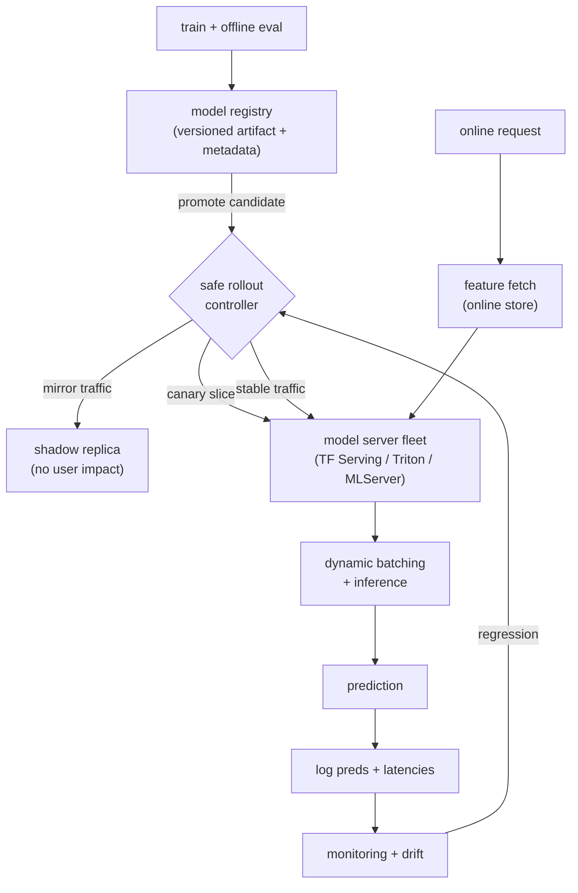

# Real-Time ML Serving and Deployment

> **Style note.** This chapter follows the same teach-first, book-like structure
> as the rest of this series. It opens with a candidate-interviewer dialogue to
> scope the problem, then builds the serving stack, the latency budget, batching,
> deployment strategies, autoscaling, and reliability in one consistent arc. Each
> section answers the question an interviewer would actually ask next. Split into
> one file per section so no single file gets long.

A trained model that scores well offline is not a product until it answers
requests reliably, at p99 latency inside a hard budget, under real traffic, and
survives a bad deploy without a global outage. That is the problem this chapter
solves. The design is mostly infrastructure, not modeling: the signal is that you
separate the model from the server that runs it, talk in p99 not averages, and
reach for shadow then canary then gradual rollout before anyone asks.

## Sections

1. [Clarifying the requirements](01-clarifying-requirements.md) -- the dialogue that scopes latency, scale, and safety.
2. [The serving problem](02-the-serving-problem.md) -- latency budget arithmetic, the model server pattern.
3. [Batching and throughput](03-batching-and-throughput.md) -- dynamic batching, Little's law, the latency-throughput tradeoff.
4. [Deployment strategies](04-deployment-strategies.md) -- shadow, canary, blue-green, rollback, and when to reach for each.
5. [Autoscaling and cost](05-autoscaling-and-cost.md) -- which signal to scale on, CPU vs GPU cost curves.
6. [Reliability](06-reliability.md) -- timeouts, fallbacks, graceful degradation, and the bottlenecks table.
7. [How teams do it in production](07-how-teams-do-it-in-production.md) -- named companies, divergence table, and first-party links.
8. [Interview Q&A](08-interview-qa.md) -- commonly asked, tricky, and commonly answered wrong.
9. [Summary](09-summary.md) -- one-page recap, mermaid, test-yourself, and further reading.

## The whole system on one page

Read the sections in order the first time; they build on each other. Each opens
with the question an interviewer would ask next, then answers it.
