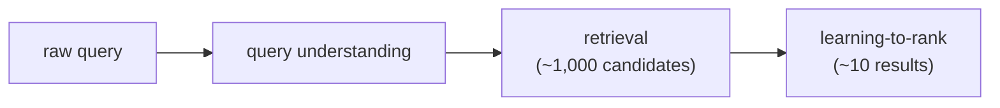

# 2. Framing it as an ML task

## Defining the ML objective

Users want the most relevant product at the top of the list. We translate that
into an ML objective we can optimize: **learn a scoring function that, given a
query and a set of candidate documents, produces a ranking such that more-relevant
documents appear above less-relevant ones.** If we have that function, search
becomes "score these candidates and sort."

The catch is that we cannot run that scoring function over hundreds of millions of
products per query. The latency budget from the previous section forces a two-stage
design.

## Specifying the input and output

The full system takes a **query string** and returns a **ranked list of product
IDs**, each with an estimated relevance. That single sentence hides three
sequential sub-problems:

1. **Query understanding.** Turn the raw string into something the system can act
   on: correct spelling, classify intent (navigational, informational,
   transactional), expand synonyms.
2. **Retrieval.** From hundreds of millions of products, find roughly a thousand
   plausible candidates in milliseconds.
3. **Ranking.** Score the thousand candidates with a rich model and return the top
   ten or so.

Each stage has its own input/output contract. Understanding produces a clean query
plus intent features. Retrieval produces a candidate set. Ranking produces a score
per candidate. Keep the stages separate in your design: mixing their objectives
causes the classic mistake of optimizing ranking precision at the retrieval stage,
which hurts recall.

## Choosing the right ML category

This is a **learning-to-rank** problem. The model's job is not to predict an
absolute relevance score (regression) or a binary label (classification), but to
produce a *relative ordering* of documents for a query. That distinction matters
because the metric (NDCG) is position-weighted: getting position 1 right is worth
far more than getting position 10 right.

Retrieval is a **representation-learning** sub-problem: learn embeddings for
queries and documents such that relevant pairs are close in the shared space. This
is the same two-tower structure as candidate retrieval in recommendation, with the
query taking the user's place.

**When to use which framing.**

| Reach for | When | Instead of |
|---|---|---|
| Two-stage funnel (retrieval then rank) | corpus is too large for a single model to score every document per query | scoring all docs at full model cost, which no latency budget allows |
| Lexical retrieval (BM25) | queries hit exact terms, product codes, or rare strings | a semantic-only pipeline that drifts on exact matches |
| Dense retrieval (dual-encoder) | queries use synonyms, paraphrases, or natural language that lexical matching misses | lexical alone, which cannot bridge the vocabulary gap |
| Learning-to-rank with pairwise or listwise loss | the task is ordering candidates by graded relevance | pointwise regression, which optimizes absolute scores and wastes capacity deep in the list |
| Pointwise regression | the task is essentially match-or-not per candidate (Yelp business matching) | LambdaMART, when the ordering of many candidates is the real job |

The next section builds the data pipeline that teaches these models what relevance
means.
