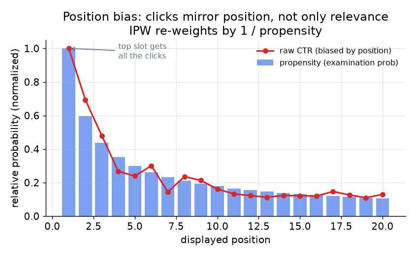

# 3. Data preparation

## Clicks as labels: abundant, free, and biased

The interaction log is your richest training signal. Each row records that a user
issued a query, a result was shown at some position, and the user either clicked
or did not. In raw form:

| query | product_id | position | clicked | dwell_sec |
|---|---|---|---|---|
| "running shoes" | p_4421 | 1 | 1 | 142 |
| "running shoes" | p_0882 | 2 | 0 | 0 |
| "running shoes" | p_3301 | 4 | 1 | 8 |

A naive reading treats click as "relevant" and no-click as "irrelevant." This is
wrong on two counts:

- **Position bias.** Users click position 1 far more than position 5, regardless
  of relevance. If you train on raw clicks, the model learns to predict the
  displayed position, not the document's quality. Clicking position 10 is rarer
  and therefore a *stronger* relevance signal, not a weaker one.
- **Dwell-time filtering.** A click followed by an instant back-button is a
  mismatch signal, not a positive. Threshold on dwell time (e.g., at least
  30 seconds) to discard dissatisfied clicks before they reach the training set.

## Debiasing with inverse-propensity weighting

The standard fix for position bias is **inverse-propensity weighting (IPW)**. For
each logged click, instead of counting it equally, you weight it by the inverse of
the propensity: the probability that a result at that position was ever examined at
all.

$$L_{\text{IPW}} = \sum_{i} \frac{y_i}{p(\text{pos}_i)} \cdot \ell\!\left(f(x_i),\, y_i\right)$$

A click at position 10 is divided by a small propensity, so it counts for more
than a click at position 1. The propensity $p(\text{pos}_i)$ is estimated from
either a small randomization experiment (swap a few results to random positions
and measure click rates) or a dedicated position model trained on logged data. The
whole debiasing rests on the quality of this estimate; a bad propensity estimate
produces a badly debiased model.

The complementary trick is **position as a train-time feature**: feed the
displayed position to the model during training so it can explain away the
position-driven component of a click, then fix that feature to a neutral constant
at serving time. The model learns relevance net of position without explicitly
estimating propensities.

*Click probability drops steeply with position (red) because users examine higher
results first. The blue bars are the estimated propensities. IPW re-weights each
click by the inverse of its position's propensity, so a rare lower-position click
contributes more signal than a top-slot click. Illustrative.*

## Human judgments: the gold anchor

Human judgments are expensive but trustworthy. Trained raters grade
query-product pairs on a four-point scale (perfect, good, fair, bad) following
detailed guidelines. They cover the head query distribution and a sample of the
tail, and they are the gold standard against which you calibrate the click-derived
labels. The Wayfair WANDS dataset is a public example of what a well-constructed
human-judgment set looks like.

In practice you fuse both: human judgments anchor calibration and cover the head,
click-derived labels supply volume, freshness, and tail coverage. Neither alone is
sufficient. Stating that both are needed, and why each alone fails, is the answer
that separates strong candidates.

## Feature engineering

The ranker's features fall into four families.

**Query-document match features.** BM25 score, field-level matches (title, brand,
category versus body description), the cosine similarity from the dual-encoder,
exact-phrase and proximity flags. These are the core signal: they measure how well
the document answers the query.

**Document quality and popularity features.** Historical click-through rate for
this product (normalized by position to avoid bias), average purchase rate, spam
and quality classifier scores, review count and rating. A relevant but low-quality
page should not beat a slightly less relevant but trusted one.

**Freshness features.** Recency of the listing and of its last price update. For
time-sensitive queries, recency matters; for evergreen product searches, it barely
does. A freshness feature combined with an intent signal lets the model learn when
to care.

**Personalization and context features.** User language, device, location, and
light behavioral signals such as recent category views. Keep these secondary; they
disambiguate but do not dominate for most queries.

**When to use which feature treatment.**

| Reach for | When | Instead of |
|---|---|---|
| BM25 as a ranker feature | exact-term signals should carry weight even after the retrieval stage | recomputing lexical scores inside the ranker from scratch |
| Dual-encoder cosine similarity as a feature | semantic relevance should inform ranking independently of term overlap | treating retrieval scores as a black box the ranker cannot see |
| Position-normalized CTR | document quality from historical clicks without baking in position | raw CTR, which is as much a function of slot as of relevance |
| Point-in-time join for behavioral features | you join clicks that happened *after* the query; features must reflect what was known *at query time* | a naive join by key, which leaks future labels and inflates offline NDCG |
| Human-judged labels as the calibration anchor | click labels need a clean ground-truth reference | click labels alone, which have no reliable zero-position baseline |
