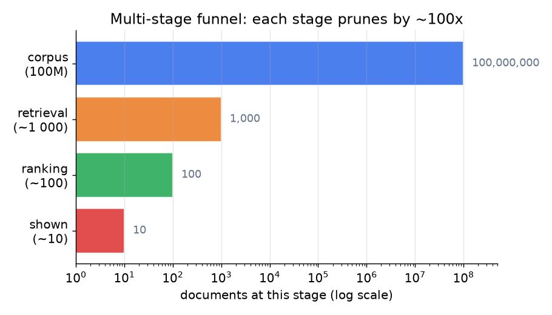
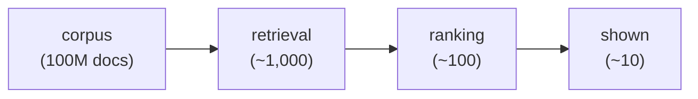
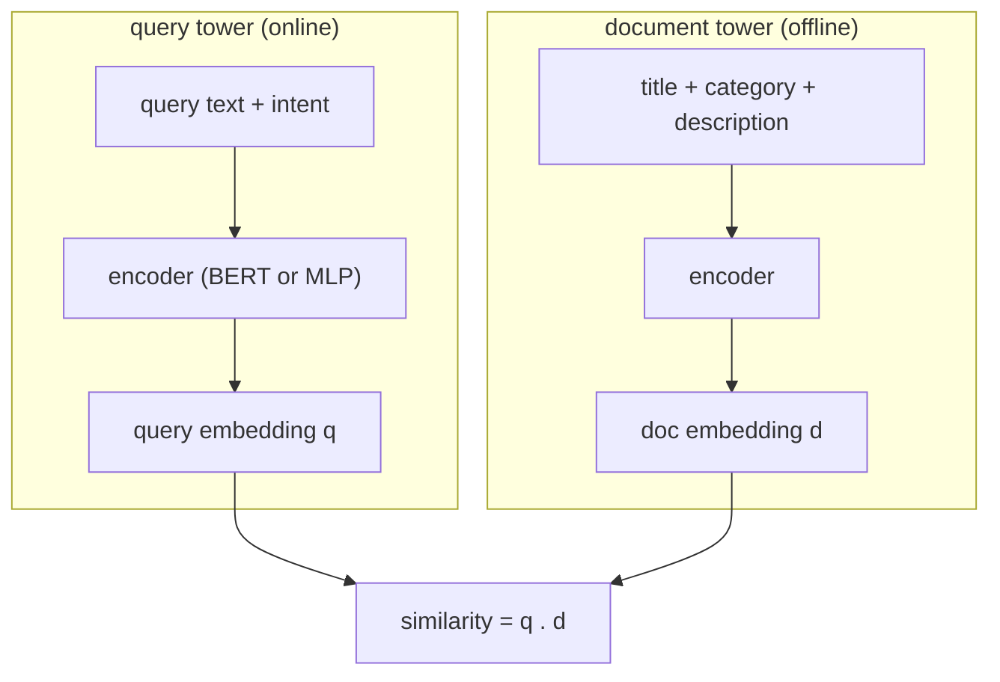
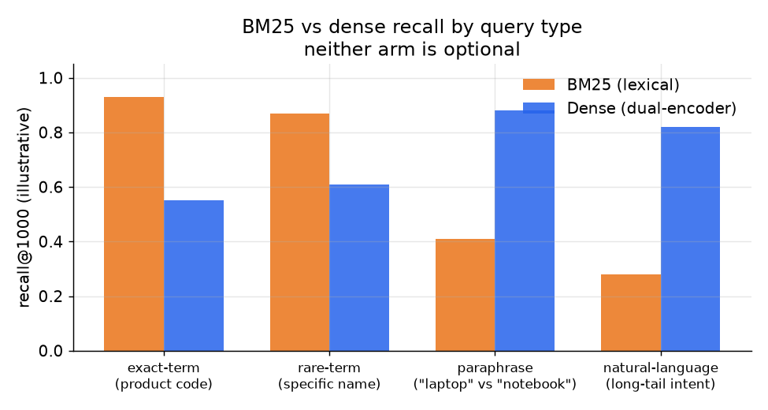

# 4. Model development

## The three-stage pipeline

The latency budget forces a funnel. Each stage prunes by roughly a factor of a
hundred; the ranker only ever scores the survivors of the previous stage.



*Corpus to retrieval to ranking to shown: each stage prunes by roughly 100x.
The final ranker scores only ~1,000 documents, making a heavy model feasible
within the tens-of-millisecond budget. Illustrative.*



## Stage 1: lexical retrieval with BM25

BM25 scores a document $D$ for query $Q$ by summing over query terms. Each term
contributes its inverse document frequency (how rare the term is in the corpus)
weighted by a saturating function of term frequency in the document, normalized by
document length:

$$\text{BM25}(Q, D) = \sum_{t \in Q} \text{IDF}(t) \cdot \frac{f(t,D) \cdot (k_1 + 1)}{f(t,D) + k_1 \cdot \left(1 - b + b \cdot \frac{|D|}{L_{\text{avg}}}\right)}$$

where $k_1 \approx 1.2$ controls term-frequency saturation and $b \approx 0.75$
controls length normalization. BM25 runs over an inverted index: at query time the
index maps each query term to its posting list (the sorted list of documents
containing it), and BM25 scores documents by merging those lists.

```python
import math
def bm25_term(tf, df, N, dl, avgdl, k1=1.2, b=0.75):   # tf: term freq in doc; df: docs with term; N: corpus size; dl: doc length
    idf = math.log((N - df + 0.5) / (df + 0.5) + 1)     # rarer terms (small df) score higher
    tf_part = (tf * (k1 + 1)) / (tf + k1 * (1 - b + b * dl / avgdl))   # term freq saturates, longer docs discounted
    return idf * tf_part                                 # a document's BM25 score sums this over the query terms
# bm25_term(3, 100, 1_000_000, 90, 100) -> 14.782...  (rare term, appears 3x in a slightly-short doc)
```

BM25 is unbeatable on **exact-term and rare-term queries** (a product code, a
specific brand name) and is extremely fast. Its weakness is the vocabulary gap: it
cannot match "laptop" to "notebook computer" because the terms do not overlap.

## Stage 2: semantic retrieval with a dual-encoder

A dual-encoder (also called a bi-encoder or two-tower model) embeds the query and
every document into a shared vector space, so that a query is retrieved by
proximity rather than term overlap. This is identical in structure to the
candidate-retrieval two-tower: the query takes the place of the user, and the
document takes the place of the item.



Document embeddings are precomputed offline and indexed with ANN (HNSW or IVF, two
index structures that make approximate nearest-neighbor lookup fast).
At query time only the query tower runs; the rest is a nearest-neighbor lookup.
The key difference from BM25: semantic retrieval closes the vocabulary gap but
can drift on exact strings and rare proper nouns, which is exactly where BM25 is
strong.



*BM25 leads on exact-term and rare-term queries; dense retrieval leads on
paraphrases and natural-language queries. Neither arm is optional. Illustrative.*

The dual-encoder trains with in-batch negatives (using the other documents in the
same training batch as the wrong answers, so no separate negative sampling is
needed) and an InfoNCE-style loss. For a
batch of $B$ (query, document) pairs, the loss asks the model to score each query
most similar to its own document:

$$L_{\text{tower}} = -\frac{1}{B}\sum_{i=1}^{B} \log \frac{\exp\!\left(\text{sim}(q_i, d_i)/\tau\right)}{\sum_{j=1}^{B} \exp\!\left(\text{sim}(q_i, d_j)/\tau\right)}$$

```python
import numpy as np
def info_nce(sims, tau=0.2):   # sims[i][j]: similarity of query i to doc j; the diagonal holds the true (q, d) pairs
    logits = np.array(sims) / tau
    logits = logits - logits.max(axis=1, keepdims=True)      # subtract row max for numerical stability before exp
    p = np.exp(logits) / np.exp(logits).sum(axis=1, keepdims=True)   # softmax over each query's candidate docs
    return float(-np.mean(np.log(np.diag(p))))               # reward making each query most similar to its own doc
# info_nce([[0.8, 0.4], [0.3, 0.7]]) -> 0.127  (both queries already prefer their own doc, so the loss is small)
```

Temperature $\tau$ sharpens the contrast. The same false-negative and popularity
risks as recommendation retrieval apply here; see the
[candidate-retrieval chapter](../candidate-retrieval/04-model-development.md) for
the correction strategies.

## Fusing the two retrieval arms

The arms produce candidate sets with incomparable score scales. Two fusion
strategies:

- **Union with re-scoring:** take the union, strip the retrieval scores, and let
  the downstream ranker build its own score from combined features. Clean but
  discards retrieval signal.
- **Reciprocal rank fusion (RRF):** score each document in the merged set by its
  rank in each arm, summing the reciprocal ranks with a damping constant $k$
  (often 60):

$$\text{RRF}(d) = \sum_{a \in \{\text{lex},\, \text{sem}\}} \frac{1}{k + r_a(d)}$$

RRF works even when the two arms' raw scores are on different scales, because it
only uses rank. In code it is one pass per arm, accumulating reciprocal ranks into
a shared score table:

```python
def rrf(rankings, k=60):                 # rankings: one ranked id list per retrieval arm
    scores = {}
    for ranked in rankings:
        for rank, doc in enumerate(ranked):   # rank is 0-based, so the position is rank + 1
            scores[doc] = scores.get(doc, 0.0) + 1.0 / (k + rank + 1)   # add this arm's reciprocal rank
    return sorted(scores, key=scores.get, reverse=True)   # highest summed score first
# rrf([['a', 'b', 'c'], ['a', 'c', 'b']]) -> ['a', 'b', 'c']  (a ranks first in both arms, so it wins)
```

## Stage 3: the learning-to-rank model

The ranker sees the union of the retrieval candidates (roughly a thousand) and
must produce a final ordering. The choice of loss is the heart of the interview
answer.

### Three objectives: pointwise, pairwise, listwise

**Pointwise** regression predicts an absolute relevance score per document
independently of the other candidates:

$$L_{\text{point}} = \sum_{i} \left(f(x_i) - y_i\right)^{2}$$

```python
def pointwise_loss(scores, labels):   # squared error between the predicted score and the graded relevance label
    return sum((s - y) ** 2 for s, y in zip(scores, labels))
# pointwise_loss([2.5, 0.0, 1.0], [3, 0, 1]) -> 0.25  (each candidate scored on its own, order ignored)
```

Simple, but it optimizes the wrong thing: the metric is about *order* and is
position-weighted. Pointwise spends capacity getting absolute scores right deep in
the list where it does not matter.

**Pairwise** (RankNet) takes pairs of documents for the same query and learns
which should rank higher. The loss on pair $(i, j)$ where document $i$ is more
relevant than document $j$:

$$L_{\text{pair}} = \sum_{(i,j):\, rel_i \gt rel_j} \log\!\left(1 + e^{-(s_i - s_j)}\right)$$

```python
import math
def pairwise_loss(scores, labels):   # sum over ordered pairs where doc i is more relevant than doc j
    total = 0.0
    for i in range(len(scores)):
        for j in range(len(scores)):
            if labels[i] > labels[j]:                   # i should rank above j
                total += math.log(1 + math.exp(-(scores[i] - scores[j])))   # penalty shrinks as s_i beats s_j
    return total
# pairwise_loss([2.0, 1.0], [1, 0]) -> 0.313  (one correctly-ordered pair, small residual loss)
```

This matches the task: ranking is fundamentally about relative order. Pairwise is
the workhorse and the right default for most ranking problems.

**Listwise** (LambdaRank / LambdaMART) defines the loss over the whole ranked
list at once. LambdaMART weights each pairwise gradient by how much swapping the
pair would change NDCG, so the model directly concentrates on moves that improve
the metric:

$$\lambda_{ij} = \frac{\partial L_{\text{pair}}}{\partial s_i} \cdot |\Delta \text{NDCG}_{ij}|$$

The model is a gradient-boosted tree ensemble (many small decision trees added one
after another, each new tree correcting the errors left by the ones before it) over
hand-crafted ranking features.
LambdaMART is the senior default when the metric is NDCG and you want the loss
aligned with what you actually report.

Deep rankers (DLRM, DCN V2, Wide and Deep) build on the same idea but use learned
embedding tables for sparse features and deep MLPs instead of tree ensembles. They
handle more features automatically but need more data and are harder to debug.

> **Trace the models live.** A dual-encoder retrieval model and a DLRM ranker are
> both available in the [Model Zoo](https://github.com/neurarch-ai/awesome-llm-model-zoo).
> Open the dual-encoder and trace the query and document towers down to the
> similarity layer; note that they never share features until the final dot product.
> Then open DLRM and find the embedding tables for sparse query-document features,
> the pairwise-interaction layer, and the top MLP. Those two structural details
> explain why one retrieves and the other ranks.

## When to use which

**Retrieval arm.**

| Reach for | When | Instead of |
|---|---|---|
| Lexical BM25 | exact-term and rare-term queries (product codes, names), fast and interpretable | a semantic-only stack that drifts on exact matches |
| Dense dual-encoder (Spotify, Pinterest) | synonyms, paraphrases, multilingual queries with vocabulary gap | lexical alone, which misses non-literal matches |
| Hybrid union with RRF | production default, failure modes are complementary | one arm alone; neither is optional |

**Learning-to-rank objective.**

| Reach for | When | Instead of |
|---|---|---|
| LambdaMART / listwise | metric is position-weighted NDCG and top-slot order dominates | pointwise regression, which optimizes scores list-deep |
| Pairwise RankNet | workhorse when relative order matters and you want a simpler loss than listwise | pointwise, whenever the task is ordering many candidates |
| Pointwise regression | task is essentially match-or-not per candidate (Yelp business matching) | LambdaMART when ordering many candidates is the real job |
| Deep ranker (DLRM, DCN V2) | many sparse categorical features and you can afford the training and serving complexity | a tree ensemble, when feature engineering is affordable and latency is tight |

**Provenance.** Dated origins for the named methods: lexical BM25 (Robertson and Walker, 1994); the dense dual-encoder from the two-tower / DSSM line (Microsoft, 2013), with DPR (Meta FAIR, 2020) and the late-interaction ColBERT (Stanford, 2020) as the retrieval variants; hybrid fusion via Reciprocal Rank Fusion (Cormack et al., 2009); the ANN index as HNSW (Malkov and Yashunin, 2016), served through FAISS (Meta) or ScaNN (Google); learning-to-rank as LambdaMART (Microsoft, 2010) and RankNet (Microsoft, 2005); and the deep rankers DLRM (Meta, 2019) and DCN-v2 (Google, 2020). When a cross-encoder reranks the shortlist, that is the Sentence-BERT cross-encoder line (UKP Darmstadt, 2019).

**Tools.** Lexical BM25 runs on Elasticsearch or OpenSearch (both over the Lucene engine) or the lightweight rank-bm25 library. The dense dual-encoder is built with sentence-transformers and indexed for ANN with FAISS (Meta) or an HNSW library such as hnswlib, and reciprocal rank fusion is a few lines over the two ranked lists. For learning-to-rank, LightGBM (Microsoft) and XGBoost both ship LambdaMART objectives, TensorFlow Ranking covers pairwise and listwise losses, and the deep rankers (DLRM, DCN V2) come from TorchRec (Meta) or DeepCTR.

**Worked example.** A marketplace search product wires up its funnel by matching each arm to its failure mode. Exact product codes and brand names are where lexical scoring is unbeatable, so it keeps a BM25 arm (OpenSearch); paraphrase and synonym queries are where lexical drifts, so it adds a dense dual-encoder (sentence-transformers) indexed in FAISS, then fuses the two with reciprocal rank fusion because neither arm is optional. For the final ranker, its reported metric is position-weighted NDCG and top-slot order dominates, so it trains LambdaMART (LightGBM) rather than a pointwise regressor that spends capacity list-deep. Pairwise RankNet stays in reach as a simpler loss when relative order is all that matters. It only moves to a deep ranker (TorchRec) once it has many sparse categorical features and can afford the extra training and serving complexity that a tree ensemble avoids.
