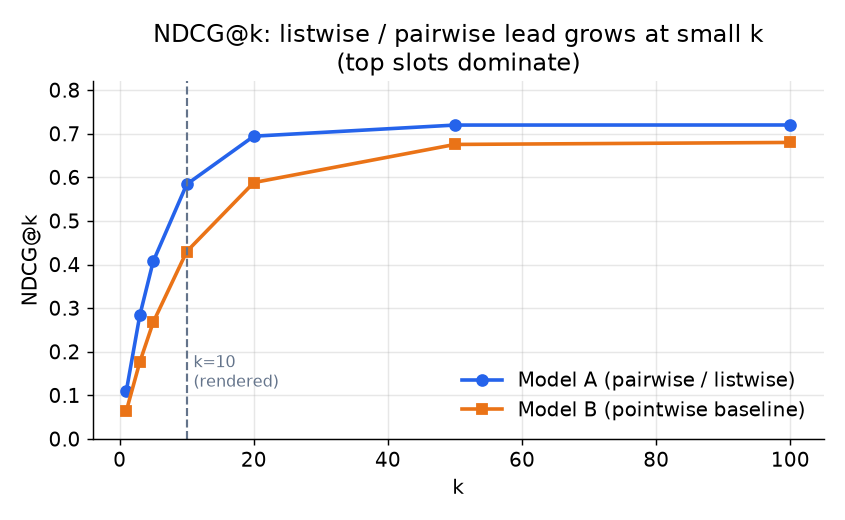
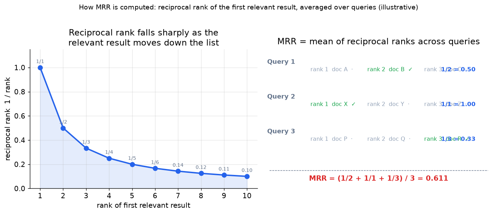

# 5. Evaluation

Search ranking is judged by a position-weighted, graded relevance metric. Using
the wrong metric is a quick way to optimize the wrong thing.

## Offline metric: NDCG@k

The standard offline metric is **NDCG** (normalized discounted cumulative gain).
It rewards putting the most relevant document closest to the top, accounts for
graded relevance labels, and normalizes the score to lie in $[0, 1]$ by dividing
by the ideal ordering.

- **Input / output.** The metric takes a ranked list of K documents, each assigned
  a graded relevance label $rel_i \ge 0$ (e.g., 3 = perfect, 2 = good, 1 = fair,
  0 = bad), and returns a scalar in $[0, 1]$; 1.0 means the returned order is the
  ideal ordering.
- **How it is computed.**

$$\text{DCG}@K = \sum_{i=1}^{K} \frac{rel_i}{\log_2(i+1)}, \qquad \text{NDCG}@K = \frac{\text{DCG}@K}{\text{IDCG}@K}$$

where $\text{IDCG}@K$ is the DCG of the ideal re-ordering of those same documents.

Why NDCG and not accuracy or precision? Because the metric must be (1) graded
(match the four-point relevance scale) and (2) position-weighted (reflect that
positions 1 and 2 are worth far more than positions 9 and 10). Accuracy and
precision are binary. Precision@k (= relevant items in top k divided by k)
treats all positions equally. NDCG is the one metric that is both.

The choice of $k$ matters. NDCG@10 evaluates the ten results the user sees.
NDCG@100 evaluates a much deeper list. Tune and report at the $k$ that matches
your rendering, and sanity-check at one or two others.

*A pairwise or listwise model (blue) consistently leads the pointwise baseline
(orange) at small $k$, where positions matter most. The gap narrows at large $k$
because both models eventually rank the clearly relevant documents above the
clearly irrelevant ones. Evaluate at the $k$ you actually render. Illustrative.*

## MRR for navigational queries

**MRR** (mean reciprocal rank) is a simpler companion metric for navigational
queries, where the user wants exactly one right answer (a product page, a
documentation URL) and cares only about how far down it appears.

- **Input / output.** Takes a set of queries $Q$ and, for each query, the rank
  position of the first relevant result; returns a scalar in $(0, 1]$.
- **How it is computed.**

$$\text{MRR} = \frac{1}{|Q|} \sum_{q \in Q} \frac{1}{\text{rank}_q}$$

where $\text{rank}_q$ is the position of the first relevant result for query $q$.
MRR weights the first relevant result; NDCG weights all of them. Use both for a
diverse query mix: NDCG for graded informational queries, MRR as a sanity check on
navigational ones.

*Left: the reciprocal rank $1/\text{rank}$ drops sharply as the first relevant result slides down the list; moving from rank 1 to rank 2 already cuts the score in half. Right: three illustrative queries showing that MRR is simply the mean of those reciprocal ranks: $(1/2 + 1/1 + 1/3) / 3 \approx 0.611$. Illustrative.*

## Offline guardrails: the time-based split

Two rules that apply to any offline ranking eval:

- **Use a time-based split, not a random split.** Evaluate against future
  interactions held out from training. A random split leaks future clicks into the
  training features (especially behavioral aggregates) and flatters the model.
- **Point-in-time correctness.** Features computed from document history (CTR,
  conversion rate) must reflect what was known at the moment the query was issued,
  not what was known later. A naive join leaks post-query clicks into training
  features, inflating offline NDCG. GetYourGuide and LinkedIn both flag this
  explicitly as the most common data-pipeline mistake.

## Online metrics

Offline NDCG is a pre-gate, not a ship decision. The label set is biased clicks
plus a thin layer of human judgments, so offline NDCG can be optimistic. The
ship decision is:

- **Interleaving experiment**: randomly interleave control and treatment results
  at the result-row level and let users implicitly vote by clicking. Interleaving
  is the most statistically efficient method for ranking evaluation; it detects
  differences with far less traffic than an A/B test.
- **A/B test on engagement and reformulation rate**: click-through rate and dwell
  measure satisfaction; query reformulation rate (issuing a second query shortly
  after the first) measures failure.

State the online gate explicitly: "I would gate the launch on an interleaving test
or an A/B against engagement and reformulation rate, not on offline NDCG alone."

## When to use which metric

| Reach for | When | Instead of |
|---|---|---|
| NDCG@k (at the rendered k) | graded relevance and position-weighted evaluation | precision@k, which treats all positions equally |
| MRR | navigational queries with a single correct answer | NDCG alone, when "did the right answer appear first" is the question |
| Interleaving | efficient online comparison of two ranking models | a full A/B split, which needs more traffic for the same statistical power |
| A/B on engagement + reformulation | the final ship decision | offline NDCG as the ship gate; it can lie |
| Time-based split | any offline ranking eval | random split, which leaks the future |

The guardrail to state out loud: an offline NDCG gain must survive an online
interleaving or A/B test against engagement and reformulation rate before it ships.
NDCG is computed against labels that are themselves biased clicks plus a thin
layer of human judgments; it is the fastest signal, not the most reliable one.
