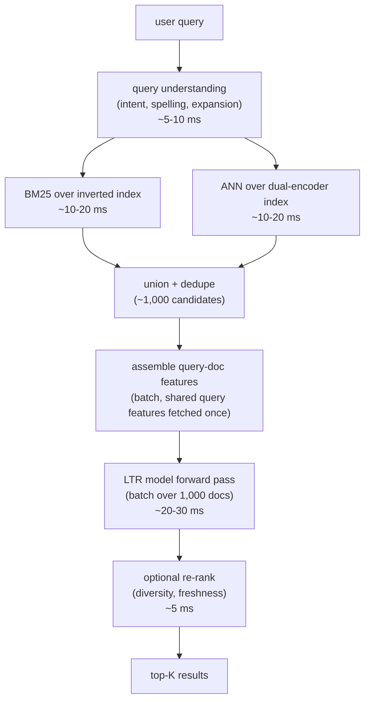

# 6. Serving and scaling

## The online path

Every search request follows the same sequence of stages, each with its own
latency budget. The key to meeting the end-to-end target is running the two
retrieval arms in parallel rather than in series, and batching the ranker's
forward pass over candidates.

## Query understanding

Query understanding must complete in single-digit milliseconds because nothing
else can start until it does. Three tools:

- **Spelling correction**: a noisy-channel model or a small seq2seq trained on
  query reformulation logs. Cache the corrections for the head of the query
  distribution, which is heavy and stable.
- **Intent classification**: a fast text classifier that labels the query as
  navigational, informational, or transactional. The label becomes a ranking
  feature and steers how the ranker weights freshness versus quality.
- **Query expansion**: synonyms and stems added to the query to lift recall on
  the lexical arm. Done conservatively; over-expansion drifts the query and hurts
  precision. Semantic retrieval handles most of the expansion implicitly via
  embedding proximity, so explicit expansion is mainly for the lexical arm.

## Retrieval: parallel arms, not sequential

The two retrieval arms are independent and run in parallel after query
understanding completes. Both return a scored candidate list; the lists are unioned
and deduped before ranking. Running them in series would add 10 to 20 ms
unnecessarily.

Document embeddings for the dense arm are precomputed on a batch schedule and
indexed with ANN (HNSW for stable catalogs, IVF for catalogs with heavy churn or
filter requirements). New products are re-embedded and upserted into the index
within minutes of listing, driven by a streaming embedding pipeline (Shopify's
Dataflow pipeline is the reference implementation for this pattern).

## Ranking: batch the forward pass

The ranker scores roughly a thousand candidates per query. The critical serving
trick is to batch the forward pass: assemble all candidate feature vectors into a
single matrix, run one model inference call, and collect all scores together.
Fetching the shared query features (embedding, intent label, BM25 query-level
stats) once and reusing them across all candidates avoids redundant feature
computation.

The model is deployed as a low-latency service, typically on CPU for tree-ensemble
rankers (LambdaMART with ONNX or LightGBM serving) or GPU for deep rankers (DLRM,
DCN V2). The deployed artifact is versioned so control and treatment models can be
served side by side for interleaving experiments without a code change.

## Caching

Three caching layers reduce latency for the heavy head of the query distribution:

- **Spelling-correction cache**: the most common misspellings are corrected
  without running the correction model.
- **Query-embedding cache**: the top-N most frequent queries are precomputed and
  cached so the query encoder does not run for them at serving time.
- **Full-result cache**: for the very head of the distribution (the top few hundred
  queries that drive a large fraction of traffic), cache the entire ranked result
  set and serve it directly. Invalidate on catalog or model changes.

Caching is most valuable for the lexical arm, where the inverted-index fan-out on
very common terms (like "shoes") can be the largest latency contributor.

## Bottlenecks table

| Bottleneck | First sign | Fix | Tradeoff |
|---|---|---|---|
| Inverted-index fan-out on broad terms | tail latency spikes on head queries like "shoes" or "shirt" | shard the index by document, use early termination (WAND) | slightly lower recall on broad queries |
| ANN search latency at corpus scale | p99 dense retrieval creeps up | tune HNSW probe depth or IVF probe count, shard the ANN index | recall vs latency |
| Ranker forward pass over budget | ranking p99 over the tens-of-ms target | batch scoring, shrink model width or depth, reduce candidate count | accuracy vs latency |
| Position-bias bleeding into labels | model learns to predict position, offline NDCG inflates | IPW debiasing, position-as-train-time-feature, small randomization experiments | labeling complexity |
| Stale document index | new products not searchable | minutes-cadence streaming embed and upsert pipeline | write-path and indexing infra |
| Offline-online metric gap | NDCG improves, engagement and reformulation flat | interleaving and A/B as the ship gate | slower iteration cycle |
| Query expansion drift | recall up, precision down, user reformulates | conservative expansion, keep original query as a fallback | recall vs precision tradeoff |

**Details worth naming.** The ANN latency row is tuning the HNSW (Malkov and Yashunin, 2016) graph: raising `efSearch` (probe depth) widens the beam through the proximity-graph layers, trading recall against latency, while the alternative IVF probe count (`nprobe`) controls how many inverted-list cells FAISS (Meta) scans; both are the same recall-versus-latency dial expressed in different index structures. The broad-term fan-out fix, WAND early termination, works by keeping a running score threshold and skipping postings whose upper-bound contribution cannot enter the top-k, so head queries like "shoes" stop scanning most of a very long postings list; it is a pruning optimization, not a recall improvement, hence the small recall tradeoff noted. The position-bias row is why offline NDCG can inflate without any real gain: clicks are recorded at biased positions, so inverse-propensity weighting (IPW) reweights each observed click by one over its estimated examination probability to recover an unbiased relevance signal.
