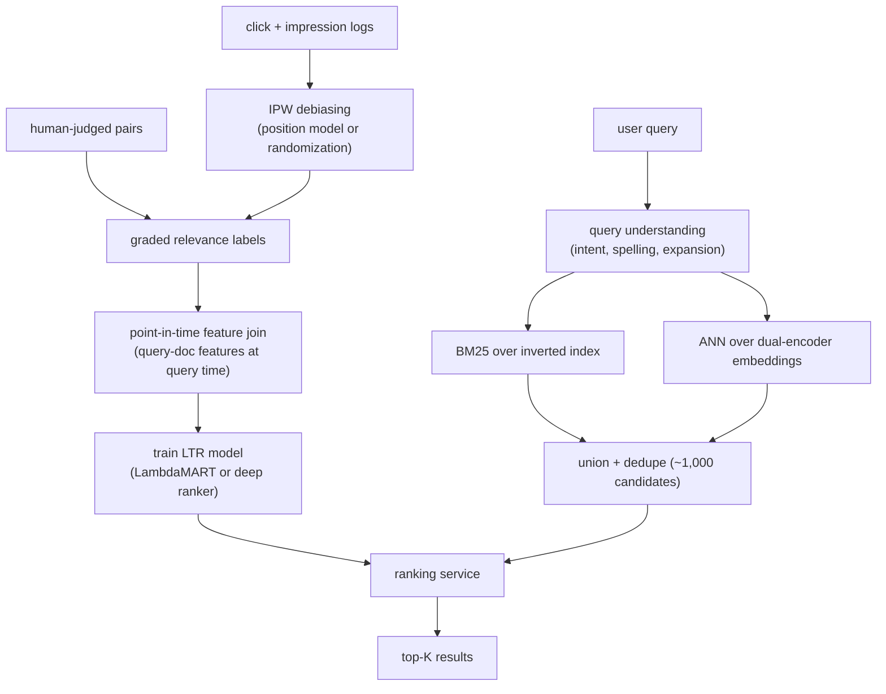

# 9. Summary

## One-page recap

- **Two stages are forced by scale.** A ranker that scores every document per
  query cannot meet the latency budget. Retrieval narrows hundreds of millions of
  candidates to roughly a thousand cheaply; ranking scores the survivors with a
  richer model.

- **Retrieval needs two arms, not one.** BM25 over an inverted index covers
  exact-term and rare-term queries; a dual-encoder with ANN search covers
  synonyms and paraphrase queries. Their failure modes are complementary.
  Union them. Neither is optional.

- **The dominant label problem is position bias.** Users click higher positions
  regardless of relevance. Training on raw clicks teaches the model to predict
  rank, not relevance. Fix with IPW (weight each click by the inverse propensity
  of its position) or position-as-a-train-time-feature (feed displayed position
  during training, fix it to a neutral constant at serving). Without this, the
  system locks in whatever order you already shipped.

- **Match the loss to the metric.** NDCG is graded and position-weighted, so the
  top slots dominate. Pairwise (RankNet) and listwise (LambdaMART) losses optimize
  order directly; pointwise regression wastes capacity on absolute scores deep in
  the list where they do not matter.

- **Offline NDCG is a pre-gate, not the ship decision.** It is computed against
  biased click labels plus a thin layer of human judgments. A model that predicts
  position better can lift offline NDCG while degrading user experience. The ship
  gate is an interleaving experiment or A/B test on engagement and reformulation
  rate.

- **Point-in-time correctness is load-bearing.** Clicks and conversions happen
  after the ranking event; joining them naively leaks future labels into features
  and inflates offline NDCG. Build the training set with point-in-time joins.

## The system on one page

**How it works.** The diagram has two halves that meet at the ranking service. The
training half starts from click and impression logs, which are IPW-debiased to
undo position bias, merged with human-judged pairs into graded relevance labels,
joined to point-in-time query-document features, and used to train the LTR model
that is loaded into the ranking service. The serving half starts from a user query
that goes through query understanding (intent, spelling, expansion), then fans out
to two retrieval arms in parallel: BM25 over an inverted index and ANN over
dual-encoder embeddings. Their results are unioned and deduplicated into roughly a
thousand candidates, which the ranking service scores with the trained model to
produce the top-K results. The offline training loop and the online query loop
share exactly one component, the ranking service, which is why the model contract
is the seam that has to stay stable.

## Test yourself

1. Why does running the two retrieval arms in parallel matter, and what happens
   to the latency budget if you run them in series?
2. What exactly does IPW weighting change about the training loss, and why does
   the quality of the propensity estimate matter so much?
3. You have a model with higher NDCG@10 offline but flat online engagement. Name
   three root causes and how you would diagnose each.
4. When would you use LambdaMART over a deep neural ranker, and when would you
   flip that choice?
5. A new product is listed but never appears in search. Trace through every stage
   of the system to find where it might be stuck.
6. How does RRF let you fuse lexical and dense retrieval scores without worrying
   about their different score scales?

## Further reading

- Dense reference (comparison, math, all case studies): [topics/09-search-ranking.md](../../topics/09-search-ranking.md).
- Side-by-side comparison of named systems: [tools/comparisons/09.md](../../tools/comparisons/09.md).
- Per-company teardowns: [tools/teardowns/09.md](../../tools/teardowns/09.md).
- Trace a dual-encoder retrieval model live: [Model Zoo two-tower](https://www.neurarch.com/?import=https://raw.githubusercontent.com/neurarch-ai/awesome-llm-model-zoo/main/architectures/two-tower/model.json).
- Trace a DLRM ranker live: [Model Zoo DLRM](https://www.neurarch.com/?import=https://raw.githubusercontent.com/neurarch-ai/awesome-llm-model-zoo/main/architectures/dlrm/model.json).
