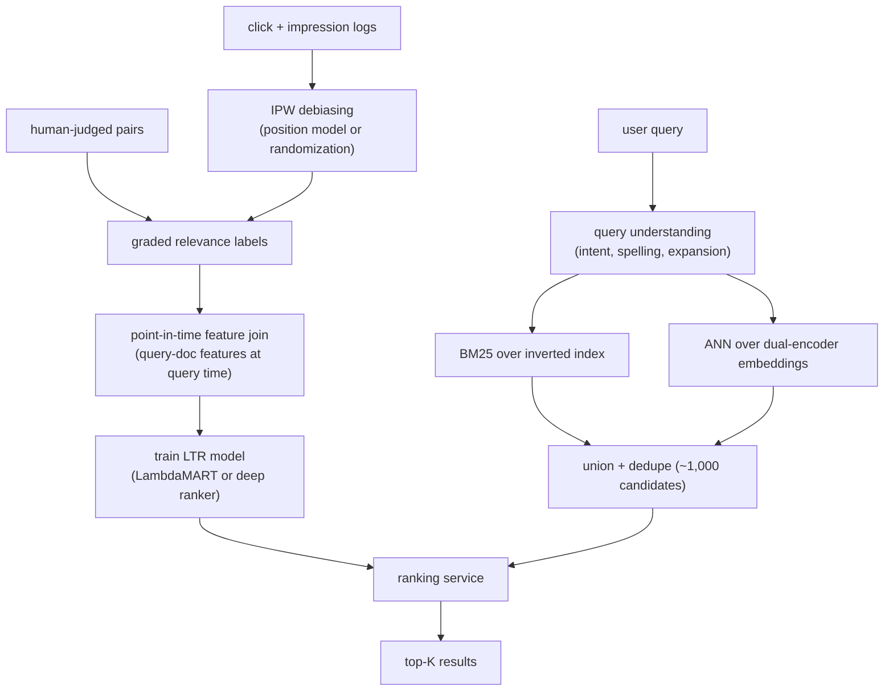

# 9. Summary

## One-page recap

- **Two stages are forced by scale.** A ranker that scores every document per
  query cannot meet the latency budget. Retrieval narrows hundreds of millions of
  candidates to roughly a thousand cheaply; ranking scores the survivors with a
  richer model.

- **Retrieval needs two arms, not one.** BM25 over an inverted index covers
  exact-term and rare-term queries; a dual-encoder with ANN search covers
  synonyms and paraphrase queries. Their failure modes are complementary.
  Union them. Neither is optional.

- **The dominant label problem is position bias.** Users click higher positions
  regardless of relevance. Training on raw clicks teaches the model to predict
  rank, not relevance. Fix with IPW (weight each click by the inverse propensity
  of its position) or position-as-a-train-time-feature (feed displayed position
  during training, fix it to a neutral constant at serving). Without this, the
  system locks in whatever order you already shipped.

- **Match the loss to the metric.** NDCG is graded and position-weighted, so the
  top slots dominate. Pairwise (RankNet) and listwise (LambdaMART) losses optimize
  order directly; pointwise regression wastes capacity on absolute scores deep in
  the list where they do not matter.

- **Offline NDCG is a pre-gate, not the ship decision.** It is computed against
  biased click labels plus a thin layer of human judgments. A model that predicts
  position better can lift offline NDCG while degrading user experience. The ship
  gate is an interleaving experiment or A/B test on engagement and reformulation
  rate.

- **Point-in-time correctness is load-bearing.** Clicks and conversions happen
  after the ranking event; joining them naively leaks future labels into features
  and inflates offline NDCG. Build the training set with point-in-time joins.

## The system on one page

```mermaid
flowchart TD
  LOG["click + impression logs"] --> DEBIAS["IPW debiasing<br/>(position model or randomization)"]
  HJ["human-judged pairs"] --> LBL["graded relevance labels"]
  DEBIAS --> LBL
  LBL --> FEAT["point-in-time feature join<br/>(query-doc features at query time)"]
  FEAT --> TRAIN["train LTR model<br/>(LambdaMART or deep ranker)"]
  TRAIN --> RANK["ranking service"]

  QUERY["user query"] --> QU["query understanding<br/>(intent, spelling, expansion)"]
  QU --> LEX["BM25 over inverted index"]
  QU --> SEM["ANN over dual-encoder embeddings"]
  LEX --> U["union + dedupe (~1,000 candidates)"]
  SEM --> U
  U --> RANK
  RANK --> OUT["top-K results"]
```

**How it works.** The diagram has two halves that meet at the ranking service. The
training half starts from click and impression logs, which are IPW-debiased to
undo position bias, merged with human-judged pairs into graded relevance labels,
joined to point-in-time query-document features, and used to train the LTR model
that is loaded into the ranking service. The serving half starts from a user query
that goes through query understanding (intent, spelling, expansion), then fans out
to two retrieval arms in parallel: BM25 over an inverted index and ANN over
dual-encoder embeddings. Their results are unioned and deduplicated into roughly a
thousand candidates, which the ranking service scores with the trained model to
produce the top-K results. The offline training loop and the online query loop
share exactly one component, the ranking service, which is why the model contract
is the seam that has to stay stable.

## Test yourself

Answers are collapsed. Attempt each question before opening one.

1. Why does running the two retrieval arms in parallel matter, and what happens
   to the latency budget if you run them in series?

   

Answer

   The two arms have **no data dependency on each other**: both consume the same
   cleaned query that query understanding produced, and neither reads the other's
   output, so the only thing serial execution buys is a longer wall clock. Run in
   parallel, the retrieval stage costs whatever the slower arm costs, roughly 10 to
   20 ms; run in series it costs their sum, which section
   [6](06-serving-and-scaling.md) puts at an unnecessary extra 10 to 20 ms. That
   matters because the budget is tight end to end: about 5 to 10 ms for query
   understanding, 10 to 20 ms for parallel retrieval, 20 to 30 ms for the batched
   LTR forward pass, and about 5 ms for the diversity re-rank, landing at roughly
   40 to 65 ms ([10](10-putting-it-together.md)). Adding a serialized second arm
   pushes the ranking path toward 85 ms and out of the tens-of-milliseconds budget
   set in section [1](01-clarifying-requirements.md). The tempting shortcut, dropping
   an arm to buy the time back, is worse: the failure modes are complementary and
   neither arm is optional.

   

2. What exactly does IPW weighting change about the training loss, and why does
   the quality of the propensity estimate matter so much?

   

Answer

   IPW changes **the weight on each logged example, not the model, the features, or
   the loss function itself**:
   $L_{\text{IPW}} = \sum_{i} \frac{y_i}{p(\text{pos}_i)} \cdot \ell\!\left(f(x_i),\, y_i\right)$,
   where $p(\text{pos}_i)$ is the probability that a result shown at that position was
   examined at all. A click at position 10 is divided by a small propensity and
   therefore counts for far more than a click at position 1, which is the correction
   for the fact that top slots earn clicks for being on top. Section
   [8](08-interview-qa.md) states the intuition concretely: if position 1 is examined
   five times more often than position 5, a position-5 click is worth five position-1
   clicks, so the reweighted signal looks in expectation like every document had been
   shown in the same slot. The estimate quality dominates because it sits in a
   denominator: a small propensity that is slightly wrong is amplified into a large
   weight error, so a bad propensity model produces a badly debiased ranker while
   still looking like a debiased one. Section [3](03-data-preparation.md) gives the
   two ways to earn a trustworthy estimate, a small randomization experiment that
   swaps results into random positions, or a dedicated position model on logged data.
   If neither is affordable, use the complementary trick instead: feed displayed
   position as a train-time feature and pin it to a neutral constant at serving, which
   sidesteps propensity estimation entirely.

   

3. You have a model with higher NDCG@10 offline but flat online engagement. Name
   three root causes and how you would diagnose each.

   

Answer

   **One, undebiased click labels.** Clicks concentrate on whatever was already ranked
   first, so raw click labels are partly a recording of the shipped order, and a model
   that learned to imitate that order scores well while adding nothing users feel.
   Diagnose by auditing the IPW weights and the debiasing pipeline, and by re-scoring
   on the human-judged set, which has no position to imitate
   ([3](03-data-preparation.md)). **Two, a point-in-time join leak.** Behavioral
   features such as CTR and conversion rate must reflect what was known at the moment
   the query was issued; a naive join by key pulls in post-query clicks and inflates
   offline NDCG. Diagnose by checking that the eval uses a time-based split and that
   every behavioral feature is joined as of query time, the mistake GetYourGuide and
   LinkedIn both flag as the most common data-pipeline error
   ([5](05-evaluation.md)). **Three, the gain is real but too deep in the list to
   see.** Diagnose by recomputing NDCG@3 and NDCG@5: if the lift lives only at
   NDCG@10, it is happening below where users scroll ([8](08-interview-qa.md)). All
   three are the same lesson stated in section [5](05-evaluation.md): offline NDCG is
   a pre-gate that decides whether to spend live traffic on a model, and the ship gate
   is an interleaving experiment or an A/B test on engagement and reformulation rate.

   

4. When would you use LambdaMART over a deep neural ranker, and when would you
   flip that choice?

   

Answer

   Use **LambdaMART when the metric is position-weighted NDCG, the features are
   hand-crafted, and the latency budget is tight**, which is exactly the scenario in
   this chapter and why it is the default stack's ranker in section
   [10](10-putting-it-together.md). Its listwise gradient
   $\lambda_{ij} = \frac{\partial L_{\text{pair}}}{\partial s_i} \cdot |\Delta \text{NDCG}_{ij}|$
   weights each pairwise move by how much swapping the pair changes NDCG, so the loss
   is aligned with the number you report ([4](04-model-development.md)), and a tree
   ensemble serves on CPU through LightGBM or ONNX inside the tens-of-milliseconds
   ranking budget ([6](06-serving-and-scaling.md)). Flip to a deep ranker (DLRM, DCN
   V2, Wide and Deep) when you have **many sparse categorical features and the data
   and serving complexity to burn**: learned embedding tables absorb high-cardinality
   features that hand-crafted features cannot, and DCN V2's explicit low-rank feature
   crosses capture interactions an MLP will not learn implicitly, which is why Google
   runs it at web scale ([7](07-how-teams-do-it-in-production.md)). The cost is real:
   deep rankers need more data, are harder to debug, and typically want GPU serving.
   The honest tiebreak from section [10](10-putting-it-together.md) is label budget
   and feature shape, not model fashion: graded labels at volume plus affordable
   feature engineering keeps you on the tree ensemble.

   

5. A new product is listed but never appears in search. Trace through every stage
   of the system to find where it might be stuck.

   

Answer

   Walk the funnel in order and split retrieval from ranking first, as the diagnostic
   flowchart in section [4](04-model-development.md) does. **Index write:** the lexical
   arm sees a document on the next index write, exactly, so if BM25 cannot find it by
   its own title terms it never reached the inverted index at all. **Dense arm
   freshness:** the embedding must be computed and upserted by the streaming pipeline
   within minutes of listing; if the product shows up in lexical results but vanishes
   from semantic ones, that is dense-arm staleness, the month-one failure section
   [10](10-putting-it-together.md) says sellers notice first
   ([6](06-serving-and-scaling.md)). **Query understanding:** over-aggressive expansion
   or a spelling correction can rewrite the query away from the terms the new listing
   actually carries, so check the corrected and expanded query, not the raw one.
   **ANN recall:** an `efSearch` or `nprobe` set too low narrows the beam and drops
   reachable neighbors, so measure retrieval recall@k separately from ranking rather
   than blaming the ranker ([4](04-model-development.md)). **Ranking cold start:** if
   the product is in the candidate set but buried, it has no click history, so
   position-normalized CTR and other quality features sit at their floor and the model
   must fall back to content signals such as title embedding, category, and brand
   ([3](03-data-preparation.md)). The order of the trace is the answer section
   [8](08-interview-qa.md) gives: cold start is a retrieval freshness problem first and
   a ranking-features problem second.

   

6. How does RRF let you fuse lexical and dense retrieval scores without worrying
   about their different score scales?

   

Answer

   RRF **throws the raw scores away and combines rank positions instead**:
   $\text{RRF}(d) = \sum_{a \in \{\text{lex},\, \text{sem}\}} \frac{1}{k + r_a(d)}$,
   with the damping constant $k$ commonly set to 60. That sidesteps the scale problem
   at its root, because BM25 returns an unbounded sum of IDF-weighted, length-normalized
   term saturations while a dual-encoder returns a bounded similarity such as cosine in
   [-1, 1]. Add or linearly weight those two numbers and one arm silently dominates the
   merged list, and the weight has to be retuned every time either scorer changes
   ([4](04-model-development.md)). The constant $k$ does the second job: it damps the
   very top ranks so a single arm's number-one result cannot steamroll the fusion, which
   keeps a document that ranked well in both arms above one that ranked first in only
   one ([8](08-interview-qa.md)). Being scale-free and needing no per-arm calibration is
   why RRF (Cormack et al., 2009) is the production default rather than a weighted score
   sum. The alternative in section [4](04-model-development.md), union with re-scoring,
   is also scale-safe but strictly weaker: it strips the retrieval signal entirely and
   makes the downstream ranker rebuild it from features.

   

## Further reading

- The capstone: [the complete build](10-putting-it-together.md), where every
  choice in this chapter is committed once for the scenario, sized, rebuilt
  under two other constraint sets, and compressed into a runnable one-file BM25-plus-rerank funnel.
- Dense reference (comparison, math, all case studies): [topics/09-search-ranking.md](../../topics/09-search-ranking.md).
- Side-by-side comparison of named systems: [tools/comparisons/09.md](../../tools/comparisons/09.md).
- Per-company teardowns: [tools/teardowns/09.md](../../tools/teardowns/09.md).
- Trace a dual-encoder retrieval model live: [Model Zoo two-tower](https://www.neurarch.com/?import=https://raw.githubusercontent.com/neurarch-ai/awesome-llm-model-zoo/main/architectures/two-tower/model.json).
- Trace a DLRM ranker live: [Model Zoo DLRM](https://www.neurarch.com/?import=https://raw.githubusercontent.com/neurarch-ai/awesome-llm-model-zoo/main/architectures/dlrm/model.json).
