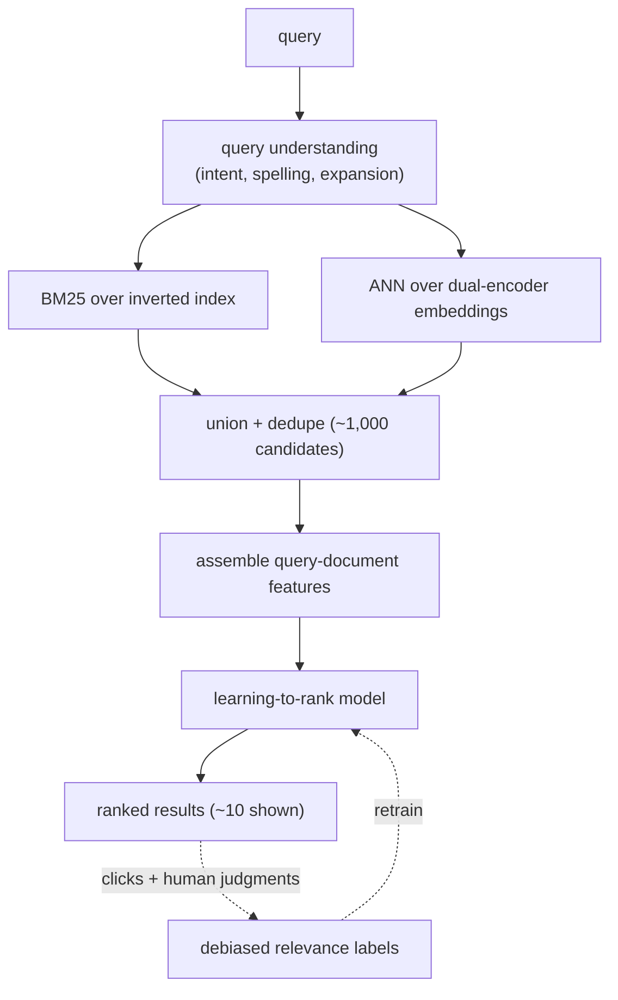

# Search Ranking

> **Style note.** This chapter follows the same book-style arc as the rest of
> this repo: a Candidate/Interviewer dialogue to pin requirements, then a
> consistent frame-data-model-evaluate-serve arc, one focused figure per idea, and
> a "when to use which" table for every method group. It borrows the *thinking* of
> Aminian and Xu's *Machine Learning System Design Interview* without copying its
> format, and it adds what this repo contributes on top: real production case
> studies, worked math (KaTeX), and an interview Q&A. Each section is one file so
> nothing gets long.

An interviewer rarely says "design a search ranking system." They say **"a user
typed a query; we have a hundred million documents; put the best one on top."**
That sentence hides three separate problems: understanding what the user meant,
getting from a hundred million documents to a few hundred candidates fast enough,
and ordering those candidates so the most relevant one wins. This chapter builds
all three end to end, and shows how Amazon, LinkedIn, Pinterest, Instacart, Yelp,
Spotify, and GetYourGuide actually ship them.

Search looks like recommendation with a query bolted on, but the query changes
everything. The labels are mostly biased clicks, the metric is position-weighted,
and the retrieval funnel needs two arms instead of one. Those three differences
shape every design decision in this chapter.

## Sections

1. [Clarifying the requirements](01-clarifying-requirements.md) - the dialogue that scopes the problem.
2. [Framing it as an ML task](02-frame-as-ml-task.md) - learning to rank; query plus doc input, ranked list out.
3. [Data preparation](03-data-preparation.md) - clicks as labels, position bias, lexical and semantic features.
4. [Model development](04-model-development.md) - multi-stage funnel: BM25, dense retrieval, LTR reranker, the loss.
5. [Evaluation](05-evaluation.md) - NDCG@k, MRR, offline vs online, and when to use which.
6. [Serving and scaling](06-serving-and-scaling.md) - funnel latency, caching, and the bottlenecks table.
7. [How teams do it in production](07-how-teams-do-it-in-production.md) - Amazon, LinkedIn, Pinterest, Instacart, Yelp, Spotify, Booking, GetYourGuide, and why they diverge.
8. [Interview Q&A](08-interview-qa.md) - commonly asked, tricky, and commonly-answered-wrong, with clear answers.
9. [Summary](09-summary.md) - the one-page recap, mermaid, and self-test.

## The whole system on one page

Read the sections in order the first time; they build on each other. Each opens
with the question an interviewer actually asks, then answers it.
