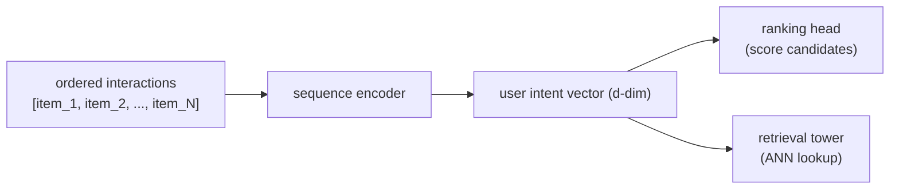

# 2. Framing it as an ML task

## Defining the ML objective

Users want a feed that responds to what they just did. We translate that into an
ML objective we can optimize: **given the user's ordered sequence of recent
interactions, predict the next item they will engage with.** A model trained on
this self-supervised objective learns which past actions predict future intent,
and the representation it builds can feed either the ranker or the retrieval tower.

## Specifying the input and output

The model takes a **sequence of item interactions ordered by time** and returns
a **user-intent vector** (for a ranking feature or retrieval tower) or a
**ranked list of next-item predictions** (for direct next-item retrieval).

Two clarifications that always come up:

- **Why not score all items from this vector at serving time?** For retrieval you
  can: precompute item embeddings offline and do an ANN lookup, exactly as in the
  two-tower chapter. For ranking over a few hundred pre-retrieved candidates,
  scoring each against the user vector directly is fine; the candidate set is
  small enough.
- **Does the encoder run online?** Yes. Unlike the item tower in candidate
  retrieval (which is user-independent and can be precomputed), the sequence
  changes every time the user does something, so the encoder must run per request
  or at minimum per new action.

## Choosing the right ML category

This is a **self-supervised sequence modeling** problem. We do not need
explicit negative labels; the next item in the sequence is the positive
signal, and the rest of the catalog serves as implicit negatives via a
sampled-softmax or in-batch negative strategy. The backbone choice (recurrent
network vs self-attention transformer vs bidirectional masked model) is about how
the encoder weighs past items, not about whether the problem is supervised.

**When to use which framing.**

| Reach for | When | Instead of |
|---|---|---|
| Next-item prediction (this chapter) | order and recency carry intent, and same-session freshness is required | a static bag-of-interactions that loses sequence order |
| Sequence-aware retrieval user tower | the system must narrow 100M items per request | a ranking feature, which assumes candidates are already retrieved |
| Ranking feature from a sequence encoder | candidates are already retrieved and you have a few hundred to score | building retrieval infrastructure when the funnel already exists |
| Lifetime interest aggregates | cold-start users with no sequence, or latency forbids an encoder | sequence models, when there is no history to model |

The next section builds the training data that teaches the encoder what "recent
intent" looks like.
