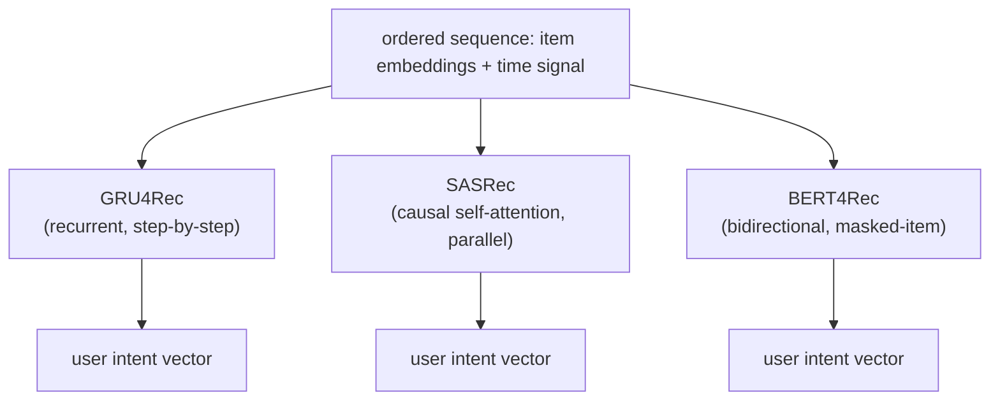
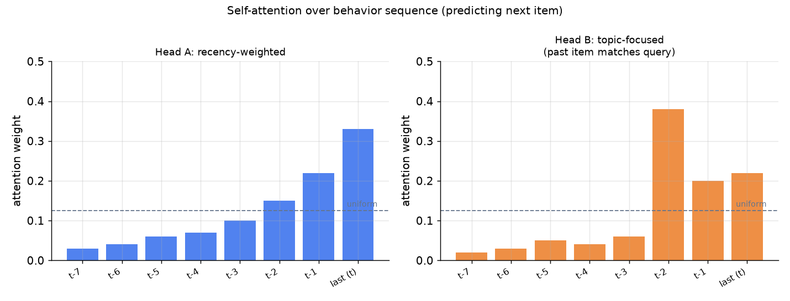
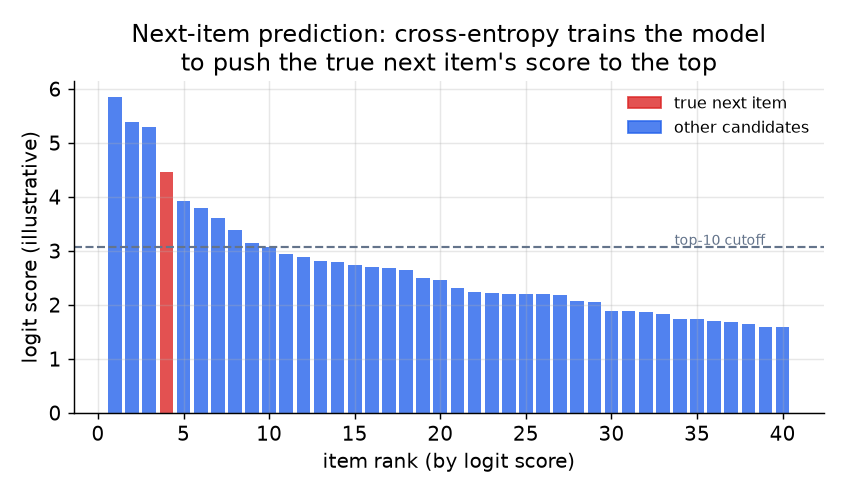

# 4. Model development

## The three model families

Sequential recommendation has converged on three well-studied encoders. They
differ in how they read the sequence, and the difference matters for latency,
parallelism, and what kind of signal they capture.

### GRU4Rec (Hidasi et al., 2016)

GRU4Rec processes the sequence one step at a time with a gated recurrent unit.
The hidden state at each step summarizes everything seen so far. It was the first
neural model to beat matrix factorization on session-based recommendation, and
it is still a sensible baseline for short sessions: simple, fast to train, and
cheap to serve (the final hidden state is the user vector).

The weakness is architectural: all of the past is compressed into one fixed-size
hidden state. Long-range dependencies that require remembering an action from 50
steps ago are hard for a GRU because the gradient path is long. It also cannot
parallelize across sequence positions at training time, which makes training slow
on long histories.

### SASRec (Kang and McAuley, 2018)

SASRec applies **causal (unidirectional) self-attention** to the sequence. Every
position can attend directly to any earlier position; there is no bottleneck of
passing state through a recurrent cell. The causal mask ensures that position t
only sees positions 1 through t, preserving the autoregressive structure.

The user intent vector is the representation at the last position, which has
attended over the entire history. This is the most commonly deployed
sequence model in production today: it parallelizes across positions at training
time (like BERT), is causal so it applies directly at serving (unlike BERT), and
captures long-range dependencies (unlike GRU4Rec).

> **Open the validated graph.** Trace SASRec and BST at real dimensions
> (item embedding tables, self-attention block, positional encoding) in the live
> [Model Zoo](https://github.com/neurarch-ai/awesome-llm-model-zoo). Seeing where
> the causal mask enters the attention block makes the serving argument concrete.

The attention mechanism at a single layer, for position t attending over positions
1 to N:

$$z_t = \sum_{t'=1}^{N} \text{softmax}_{t'}\!\left(\frac{Q_t K_{t'}^\top}{\sqrt{d}}\right) V_{t'}$$

The causal mask zeroes out any $t' \gt t$ before the softmax, so future positions
never contribute.

*Illustrative attention weights for two hypothetical attention heads predicting
the next item. Head A weights recent events most heavily; Head B focuses on a
specific past event that shares the query's topic. The dashed line is the uniform
(no-preference) baseline. Different heads specialize in different aspects of the
history.*

### BERT4Rec (Sun et al., 2019)

BERT4Rec uses a **bidirectional Transformer** trained with a masked-item
prediction objective: randomly mask some items in the sequence and train the
model to reconstruct them. Because it is bidirectional, every position can attend
to both past and future positions during training. At inference, the target
position (the one whose next item we want to predict) is replaced with a mask
token and the model predicts over the catalog.

The tradeoff: bidirectional attention captures richer context than causal
attention, which can help on datasets large enough to train the model. But it is
slightly more complex to serve correctly (you must always construct the right mask
for inference), and it needs more data to outperform SASRec. It is also the
natural choice when one model must serve many surfaces (Instacart uses this
pattern), since the masked objective is flexible.

## The loss

All three families are trained with a variant of **cross-entropy over next-item
prediction**: make the true next item score higher than all other items.

At catalog scale (millions of items), computing a full softmax over every item
per training step is too expensive. Production systems use sampled softmax: score
the true next item against a small sample of negatives drawn from the catalog
(uniform or popularity-weighted), not against the full catalog.

$$\mathcal{L} = -\log \frac{\exp(s_+)}{\exp(s_+) + \sum_{j \in \mathcal{N}} \exp(s_j)}$$

where $s_+ = u^\top v_+$ is the dot product of the user intent vector with the
true next item embedding, and $\mathcal{N}$ is the sampled negative set.

*Cross-entropy trains the model to push the true next item (red bar) toward the
top of the scored candidates. The goal is not a calibrated probability; it is a
ranking that puts the next item at or near rank 1. Illustrative.*

Two production refinements to the loss are worth naming:

- **In-batch negatives.** For a batch of B (sequence, next-item) pairs, treat
  the other B-1 next items in the batch as negatives for each sequence, identical
  in spirit to the two-tower training described in the retrieval chapter. Cheap
  and scales with batch size; carries the same false-negative and popularity-bias
  risks.
- **All-action loss (Pinterest PinnerFormer).** Instead of predicting only the
  immediate next item, train the model to predict a window of future actions. This
  makes a batch-computed embedding hold up much longer before going stale, nearly
  closing the gap with a streaming-updated embedding at a fraction of the
  infrastructure cost.

$$\mathcal{L}_{\text{all-action}} = \frac{1}{|W|}\sum_{f \in W} \ell(u, v_f)$$

where $W$ is a window of future interactions, not just t+1.

## When to use which model

| Reach for | When | Instead of |
|---|---|---|
| GRU4Rec | short sessions (under 20 events), simple serving path, no need for long-range dependencies | SASRec, when the history is long and cross-position dependencies matter |
| SASRec (causal self-attention) | order carries intent, parallelism at training time matters, serving must be causal | GRU4Rec once sequences are longer than a few dozen events |
| BERT4Rec (bidirectional masked) | large enough data to train bidirectional context, or one model must serve many surfaces | SASRec when serving consistency and causal simplicity matter more than bidirectional context |
| All-action loss (PinnerFormer style) | you want a daily batch embedding to stay fresh without streaming infrastructure | a next-action-only loss that makes the embedding go stale quickly |
| In-batch negatives | fast training with no extra data labeling | full-catalog softmax (computationally infeasible at scale) |
