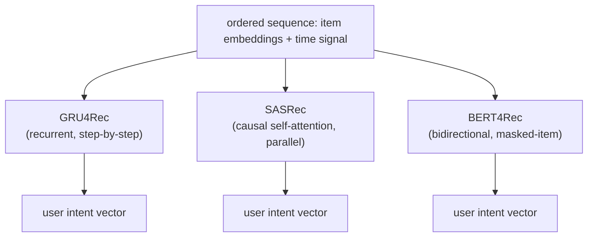

# 4. Model development

## The three model families

Sequential recommendation has converged on three well-studied encoders. They
differ in how they read the sequence, and the difference matters for latency,
parallelism, and what kind of signal they capture.



### GRU4Rec (Hidasi et al., 2016)

GRU4Rec processes the sequence one step at a time with a gated recurrent unit.
The hidden state at each step summarizes everything seen so far. It was the first
neural model to beat matrix factorization on session-based recommendation, and
it is still a sensible baseline for short sessions: simple, fast to train, and
cheap to serve (the final hidden state is the user vector).

Concretely, the hidden state $h_t$ is updated one item at a time and the final
one becomes the user vector:

$$h_t = \text{GRU}(h_{t-1}, x_t), \qquad u = h_L$$

where $x_t$ is the embedding of the item at step $t$ and $h_{t-1}$ carries a
summary of everything before it. Every earlier item reaches the output only
through this one fixed-size $h$, which is exactly the bottleneck described next.

The weakness is architectural: all of the past is compressed into one fixed-size
hidden state. Long-range dependencies that require remembering an action from 50
steps ago are hard for a GRU because the gradient path is long. It also cannot
parallelize across sequence positions at training time, which makes training slow
on long histories.

### SASRec (Kang and McAuley, 2018)

SASRec applies **causal (unidirectional) self-attention** to the sequence. Every
position can attend directly to any earlier position; there is no bottleneck of
passing state through a recurrent cell. The causal mask (a rule that blocks each position from attending
to any later position) ensures that position t
only sees positions 1 through t, preserving the autoregressive structure (predict
the next step from earlier steps only, one step at a time).

The user intent vector is the representation at the last position, which has
attended over the entire history. This is the most commonly deployed
sequence model in production today: it parallelizes across positions at training
time (like BERT), is causal so it applies directly at serving (unlike BERT), and
captures long-range dependencies (unlike GRU4Rec).

> **Open the validated graph.** Trace SASRec and BST at real dimensions
> (item embedding tables, self-attention block, positional encoding) in the live
> [Model Zoo](https://github.com/neurarch-ai/awesome-llm-model-zoo). Seeing where
> the causal mask enters the attention block makes the serving argument concrete.

The attention mechanism at a single layer, for position t attending over positions
1 to N:

$$z_t = \sum_{t'=1}^{N} \text{softmax}_{t'}\!\left(\frac{Q_t K_{t'}^\top}{\sqrt{d}}\right) V_{t'}$$

The causal mask zeroes out any $t' \gt t$ before the softmax, so future positions
never contribute.


*Illustrative attention weights for two hypothetical attention heads predicting
the next item. Head A weights recent events most heavily; Head B focuses on a
specific past event that shares the query's topic. The dashed line is the uniform
(no-preference) baseline. Different heads specialize in different aspects of the
history.*

### BERT4Rec (Sun et al., 2019)

BERT4Rec uses a **bidirectional Transformer** (each position may look both
backward and forward, not just at the past) trained with a masked-item
prediction objective: randomly mask some items in the sequence and train the
model to reconstruct them. Because it is bidirectional, every position can attend
to both past and future positions during training. At inference, the target
position (the one whose next item we want to predict) is replaced with a mask
token and the model predicts over the catalog.

The tradeoff: bidirectional attention captures richer context than causal
attention, which can help on datasets large enough to train the model. But it is
slightly more complex to serve correctly (you must always construct the right mask
for inference), and it needs more data to outperform SASRec. It is also the
natural choice when one model must serve many surfaces (Instacart uses this
pattern), since the masked objective is flexible.

### Compare and contrast: SASRec vs BERT4Rec

The two are easy to conflate because the architecture diagram is nearly the
same: item embedding table, positional encoding, a stack of self-attention
blocks, a softmax over the catalog. The real fork is one line of code, the
attention mask, and everything that separates them in practice flows from that
line.

| Aspect | SASRec | BERT4Rec |
|---|---|---|
| Backbone | Transformer self-attention over the item sequence | Same |
| Input representation | Item embeddings plus positional encoding | Same |
| Attention mask | Causal: position t sees only 1..t | None during training: every position sees both sides |
| Training objective | Next-item prediction at every position | Cloze: reconstruct randomly masked interior items |
| Supervision per sequence | Every position is a training target in one pass | Only the masked positions (a fraction of the sequence) |
| Serving readout | Last position's vector, exactly as trained | Append a `[mask]` token and read the prediction there |
| Train-serve consistency | Identical computation both times | Different: trained on interior masks, served on an end mask |

The difference changes the design at serving: SASRec's causal training means
the deployed computation is the one it practiced, while BERT4Rec buys richer
bidirectional context at the cost of a masking protocol you must reproduce
exactly at inference (and more data to make the trade pay), which is why teams
default to SASRec and reach for BERT4Rec only when the data and the masking
discipline are both in place.

## The loss

All three families are trained with a variant of **cross-entropy over next-item
prediction** (a loss that pushes up the predicted probability of the correct item
and pushes down the rest): make the true next item score higher than all other items.

At catalog scale (millions of items), computing a full softmax over every item
per training step is too expensive. Production systems use sampled softmax: score
the true next item against a small sample of negatives drawn from the catalog
(uniform or popularity-weighted), not against the full catalog.

$$\mathcal{L} = -\log \frac{\exp(s_+)}{\exp(s_+) + \sum_{j \in \mathcal{N}} \exp(s_j)}$$

where $s_+ = u^\top v_+$ is the dot product of the user intent vector with the
true next item embedding, and $\mathcal{N}$ is the sampled negative set.


*Cross-entropy trains the model to push the true next item (red bar) toward the
top of the scored candidates. The goal is not a calibrated probability; it is a
ranking that puts the next item at or near rank 1. Illustrative.*

Two production refinements to the loss are worth naming:

- **In-batch negatives.** For a batch of B (sequence, next-item) pairs, treat
  the other B-1 next items in the batch as negatives for each sequence, identical
  in spirit to the two-tower training described in the retrieval chapter. Cheap
  and scales with batch size; carries the same false-negative and popularity-bias
  risks.

```python
import numpy as np
def in_batch_logits(U, V):   # U, V: (B, d) user vectors and their true-next-item vectors
    # row i scores user i against every next-item in the batch; the diagonal is the positive pair
    return U @ V.T           # (B, B); columns j != i are the B-1 free negatives for user i
U = np.array([[1.0, 0.0], [0.0, 1.0]])
V = np.array([[1.0, 0.0], [0.0, 1.0]])
# in_batch_logits(U, V) -> [[1., 0.], [0., 1.]]   # diagonal (positives) high, off-diagonal (negatives) low
```
- **All-action loss (Pinterest PinnerFormer).** Instead of predicting only the
  immediate next item, train the model to predict a window of future actions. This
  makes a batch-computed embedding hold up much longer before going stale, nearly
  closing the gap with a streaming-updated embedding at a fraction of the
  infrastructure cost.

$$\mathcal{L}_{\text{all-action}} = \frac{1}{|W|}\sum_{f \in W} \ell(u, v_f)$$

where $W$ is a window of future interactions, not just t+1.

## When to use which model

| Reach for | When | Instead of |
|---|---|---|
| GRU4Rec | short sessions (under 20 events), simple serving path, no need for long-range dependencies | SASRec, when the history is long and cross-position dependencies matter |
| SASRec (causal self-attention) | order carries intent, parallelism at training time matters, serving must be causal | GRU4Rec once sequences are longer than a few dozen events |
| BERT4Rec (bidirectional masked) | large enough data to train bidirectional context, or one model must serve many surfaces | SASRec when serving consistency and causal simplicity matter more than bidirectional context |
| All-action loss (PinnerFormer style) | you want a daily batch embedding to stay fresh without streaming infrastructure | a next-action-only loss that makes the embedding go stale quickly |
| In-batch negatives | fast training with no extra data labeling | full-catalog softmax (computationally infeasible at scale) |

**Provenance.** The three encoders trace a clear lineage: GRU4Rec (2016) brought RNN session modeling to recommendation, SASRec (2018) replaced the recurrence with causal self-attention from the Transformer (Google, 2017), and BERT4Rec (Alibaba, 2019) swapped the causal mask for a bidirectional masked-item objective borrowed from BERT. The pairwise-ranking view of the loss (score the true next item above sampled negatives) is Bayesian Personalized Ranking, BPR (Rendle et al., 2009), which predates all three and is still the reference negative-sampling objective.

**Tools.** All three encoders (GRU4Rec, SASRec, BERT4Rec) ship as tuned, comparable implementations in RecBole, and Transformers4Rec (NVIDIA) provides production-oriented SASRec and BERT4Rec on top of Hugging Face Transformers. Rolling your own is a short PyTorch (Meta) or TensorFlow (Google) model: an embedding table plus a GRU or a causal self-attention block. Sampled softmax and in-batch negatives are standard loss utilities in both frameworks, and the all-action window loss is a small change to the target construction rather than a new library.

**Worked example.** A streaming service modeling next-item intent starts with GRU4Rec from RecBole as a cheap baseline for short viewing sessions under twenty events. As histories lengthen and cross-position dependencies start to matter, it moves to SASRec, whose causal self-attention parallelizes at training time yet applies directly at serving because the last-position vector only attended over the past. It considers BERT4Rec only once it has enough data and needs one model to serve several surfaces, accepting the extra masking complexity for bidirectional context. To keep a once-daily batch embedding from going stale, it swaps the next-item target for an all-action window loss (PinnerFormer style), and trains throughout with in-batch negatives rather than an infeasible full-catalog softmax.

## Generative recommendation: the foundation-model paradigm

The multi-stage cascade (retrieval, pre-ranking, ranking, re-ranking) is the dominant
architecture, but a newer paradigm reformulates recommendation as a **generative
sequence** problem that follows scaling laws like a language model. It shows up in two
places.

**Generative retrieval.** Instead of embedding every item and running approximate
nearest-neighbor search, quantize each item's content embedding into a short sequence
of discrete codes (a **semantic ID**), then train a sequence-to-sequence model to
*generate* the next item's semantic ID token by token. Retrieval becomes decoding, so
there is no separate ANN index, and items that share codes (including cold-start items)
generalize for free. This is the TIGER approach (Rajput et al., Google, 2023).

**Generative sequential recommenders.** Push the same idea to ranking: treat the whole
problem as sequential transduction over the user's action history and scale the model
like an LLM, so quality tracks a scaling law rather than hand-built features. HSTU
(Zhai et al., 2024, "Actions Speak Louder than Words") is the reference point, with the
ambition of collapsing the multi-stage cascade into a single large model that both
retrieves and ranks.

| | Multi-stage cascade | Generative foundation model |
|---|---|---|
| Structure | separate retrieval, pre-rank, rank, rerank | one large sequence model |
| Improves via | better features and models per stage | scale (data, parameters, compute) |
| Cost | cheap per request, modular to iterate on | expensive to serve, newer, less battle-tested |
| Reach for it when | most systems today | very large scale where a scaling-law model pays off, or to unify many hand-built sources |

The honest framing for an interview: the cascade is what almost everyone runs in
production today, and the generative foundation model is the direction the frontier is
moving, not yet a drop-in replacement. Naming both, and the tradeoff, is the senior
signal.

## Implementation and training pitfalls

Sequence models are unusually easy to leak: a single off-by-one in the mask or a
random train/test split lets the model peek at the future, and offline metrics
soar while online performance does not move. Audit the temporal boundary first.

| Problem | Symptom | Fix |
|---|---|---|
| Sequence leakage / lookahead | offline hit-rate is suspiciously high; the input window includes items at or after the target | keep only items strictly before the target, split by time, verify the causal boundary |
| Padding / masking bug | pad positions are attended over, or the causal mask lets position t see t+1 | zero pads and future positions in the attention mask and unit-test it on a toy sequence |
| BERT4Rec train/inference mask mismatch | trained with random masks but served without a mask token at the predict position | insert the mask token at the target position at inference, matching how training built it |
| Random split instead of temporal | shuffling breaks chronology and leaks later behavior into training | split by time, evaluate next-item on the chronologically last event per user |
| In-batch false negatives / popularity bias | another user's true next item is punished as a negative; head items over-penalized | popularity-corrected (logQ) sampling, dedupe, mix in uniform negatives |
| Embedding staleness at serving | a batch-computed user vector drifts between refreshes | shorten refresh, use an all-action window loss, or stream-update fast-moving users |
| Position table length mismatch | histories longer than the trained max position error or wrap | truncate to the max length keeping the most recent items, or extend the positional table |
| Trivial repeat prediction | model just re-predicts the item the user most recently touched | mask the just-seen item or evaluate on genuinely novel next-items |
