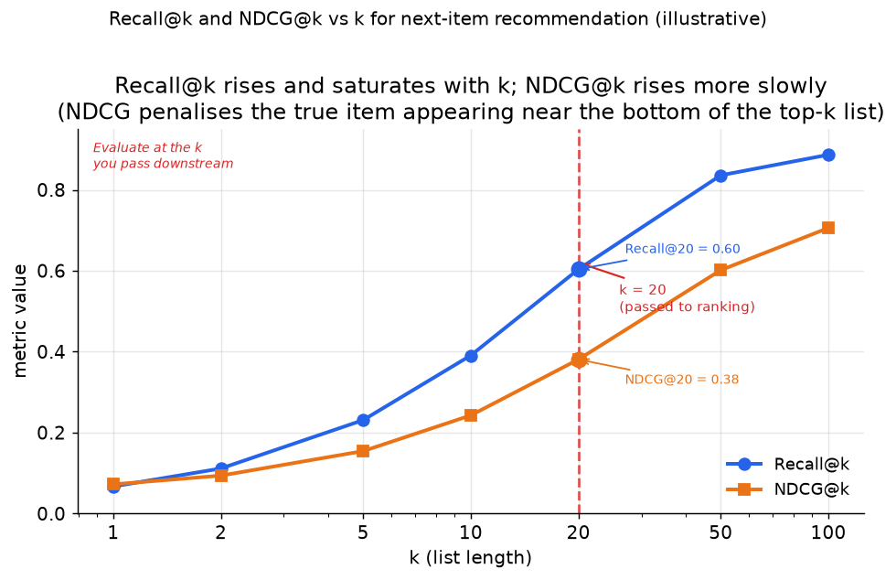

# 5. Evaluation

Sequential recommendation is evaluated on how well the model predicts the actual
next interaction. Three offline metrics dominate, and each measures something
slightly different about that prediction quality.

## Offline metrics

### Recall@k

**Input / output.** The model takes a user's interaction history (a sequence of
past item ids) and outputs a ranked list of candidate next items; Recall@k
outputs a scalar in $[0, 1]$ measuring what fraction of users had their true
next item appear somewhere in that top-k list.

Of the users in the test set, what fraction had their actual next item appear in
the model's top k predictions? This is the primary metric because it directly
answers the product question: does the ranked list contain what the user actually
wanted?

$$\text{Recall@k} = \frac{1}{|U|}\sum_{u \in U} \frac{|\text{predicted}_k(u) \cap \text{relevant}(u)|}{|\text{relevant}(u)|}$$

In the next-item setup, each user has exactly one relevant item (the held-out
next interaction), so this simplifies to the fraction of users for whom the true
next item appeared in the top k.

```python
def recall_at_k(recommended, relevant, k):   # recommended: ranked ids; relevant: set of ids
    return len(set(recommended[:k]) & set(relevant)) / len(relevant)
# next-item case: relevant = {true_next}, so this is 1.0 if true_next in top-k else 0.0
```

The right k is the k you actually use downstream, typically 10 to 50 for a
ranking feature, or a few hundred if the sequence model is used as a retrieval
tower. Optimizing for k=10 when you pass 200 candidates to ranking produces
misleading results.



*Recall@k (blue) rises quickly and saturates: once the list is long enough to contain the true next item most of the time, adding more candidates gives diminishing returns. NDCG@k (orange) rises more slowly because it penalises the true item appearing near the bottom of the top-k list. The dashed red line marks the k passed to the downstream ranker; evaluate there, not at a larger k that the ranker never sees. Illustrative.*

### NDCG@k (Normalized Discounted Cumulative Gain)

NDCG rewards ranking the true next item higher within the top k, not just
including it:

$$\text{NDCG@k} = \frac{1}{Z}\sum_{i=1}^{k} \frac{2^{rel_i}-1}{\log_2(i+1)}$$

where $Z = \text{IDCG@k} = \sum_{i=1}^{\min(|\text{relevant}|,\, k)} \frac{1}{\log_2(i+1)}$
is the ideal DCG (the maximum achievable when all relevant items are ranked
first). For the standard next-item task with exactly one relevant item,
$Z = 1/\log_2(2) = 1$, so NDCG@k reduces to $1/\log_2(\text{rank}+1)$ when
the true item appears in the top k, and 0 otherwise. A model that puts the true next item
at rank 1 scores higher on NDCG than one that puts it at rank k. NDCG@k
complements Recall@k: a model can have high recall (the item is in the top k)
but low NDCG (it is near the bottom of that set).

```python
import math
def ndcg_at_k(recommended, relevant, k):   # recommended: ranked ids; relevant: set of relevant ids
    # each relevant item found in the top-k earns 1/log2(rank+1); rank is 1-based
    dcg = sum(1.0 / math.log2(i + 2) for i, item in enumerate(recommended[:k]) if item in relevant)
    ideal = sum(1.0 / math.log2(i + 2) for i in range(min(len(relevant), k)))  # best case: relevant on top
    return dcg / ideal if ideal > 0 else 0.0
# ndcg_at_k(['a', 'b', 'c'], {'c'}, k=3) -> 0.5   # true item at rank 3: 1/log2(4) = 0.5
```

### MRR (Mean Reciprocal Rank)

MRR is the average of the reciprocal rank of the true next item across users:

$$\text{MRR} = \frac{1}{|U|}\sum_{u \in U} \frac{1}{\text{rank}_u}$$

where $1/\text{rank}_u = 0$ when the true next item does not appear among the
returned results. MRR is sensitive to whether the true item is rank 1 vs rank 10 vs rank 100. It
is a natural fit when the goal is to surface the single best next recommendation
as early as possible (for a "top pick" placement), rather than filling a list.

```python
def mrr(ranks):   # ranks: 1-based rank of the true next item per user, None if it never appears
    return sum((1.0 / r if r else 0.0) for r in ranks) / len(ranks)
# mrr([1, 3, None]) -> 0.4444444444444444   # (1 + 1/3 + 0) / 3
```

## A caution on sampled evaluation

The metrics above assume the true next item is ranked against the **full**
catalog. Many papers and internal harnesses instead rank it against a small fixed
sample of negatives, because scoring the whole catalog per user is expensive.
Krichene and Rendle (2020) showed this sampled protocol is treacherous: the
sampled versions of Recall@k, NDCG@k, and MRR are not consistent estimators of
their full-catalog counterparts, and worse, they can **reorder** models, so
system A beats system B on sampled metrics while B is genuinely better against
the full catalog. The distortion is sharpest at small k, which is exactly where
these metrics are read. The senior rule: evaluate against the full catalog when
you can afford it; if you must sample for scale, keep the negative sample fixed
and large, use a bias-corrected estimator, and never compare two models across
different sampled sets.

## Time-based split is mandatory

For the same reason as in the requirements: random splits leak the future. The
correct evaluation protocol holds out each user's **last interaction as the test
target** and uses everything earlier as the context. A model trained with this
protocol can only see past events when predicting, which matches how it will serve.

Concretely: for user U with events at times $t_1 \lt t_2 \lt \ldots \lt t_L$,
train on the pairs built from events 1 through L-2, validate on the pair ending
at $t_{L-1}$, and test on the pair ending at $t_L$.

## Online eval

Offline metrics are necessary but not sufficient. Two things offline evaluation
misses:

- **Feedback loops.** A model that tightens a filter bubble can improve offline
  NDCG (it accurately predicts the next item in a narrowing loop) while degrading
  long-term user satisfaction.
- **Freshness.** Offline test sets are built from historical data, not from
  real-time streaming sequences. A model that gains 2% offline NDCG by using a
  slightly stale sequence may perform differently once real-time latency is
  factored in.

Gate the launch on an **online A/B test** measuring session-level engagement
(click-through, dwell time, session length) and a **diversity guardrail** to
confirm the model is not collapsing recommendations into a narrow set.

## When to use which metric

| Reach for | When | Instead of |
|---|---|---|
| Recall@k (at the k you pass downstream) | judging whether the true next item is reachable | precision@k, which penalizes other good items that happen to appear |
| NDCG@k | the position of the true item in the list matters, not just its presence | Recall@k alone, when rank quality within the top k is the product objective |
| MRR | the single top slot is what matters (one featured recommendation) | NDCG, when filling a list of k items is the goal |
| Time-based split | all offline sequential eval | a random split, which leaks future events into the training context |
| Online A/B with diversity guardrail | the launch decision | offline metrics alone, which miss feedback-loop effects and freshness |

**Tools.** Recall@k, NDCG@k, and MRR are all provided by TorchMetrics (RetrievalRecall, RetrievalNormalizedDCG, RetrievalMRR), and RecBole ships the same metrics with a built-in leave-one-out time split so the offline protocol matches training. The mandatory time-based split (last interaction as the test target) is a short pandas sort-and-slice on timestamps per user. The launch A/B on session engagement and the diversity guardrail run on the platform's experiment stack.

**Worked example.** A social app evaluating a next-item model reports Recall@k at the k it actually forwards downstream (10 to 50 for a ranking feature, a few hundred for a retrieval tower), computed with TorchMetrics, because optimizing Recall@10 when 200 candidates are passed measures the wrong operating point. It adds NDCG@k when the true item's rank within the top-k matters, and switches to MRR for a single "top pick" placement where only the first slot counts. It holds out each user's last interaction as the test target with everything earlier as context, avoiding the future leakage a random split causes. The final launch is gated on an online A/B measuring session engagement plus a diversity guardrail, since offline NDCG can rise while a filter bubble tightens.
