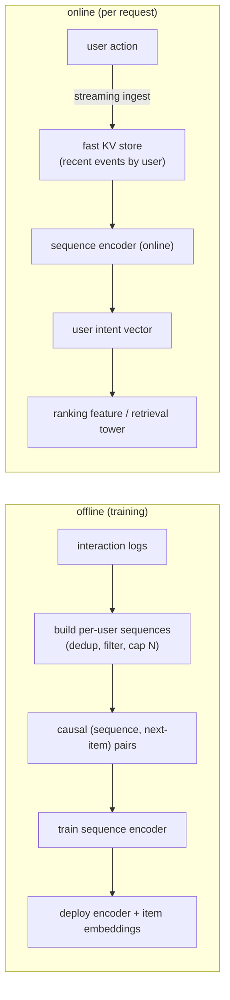
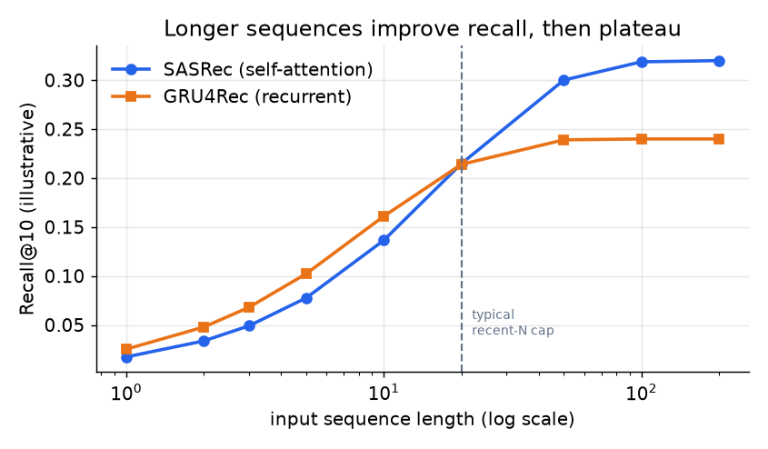
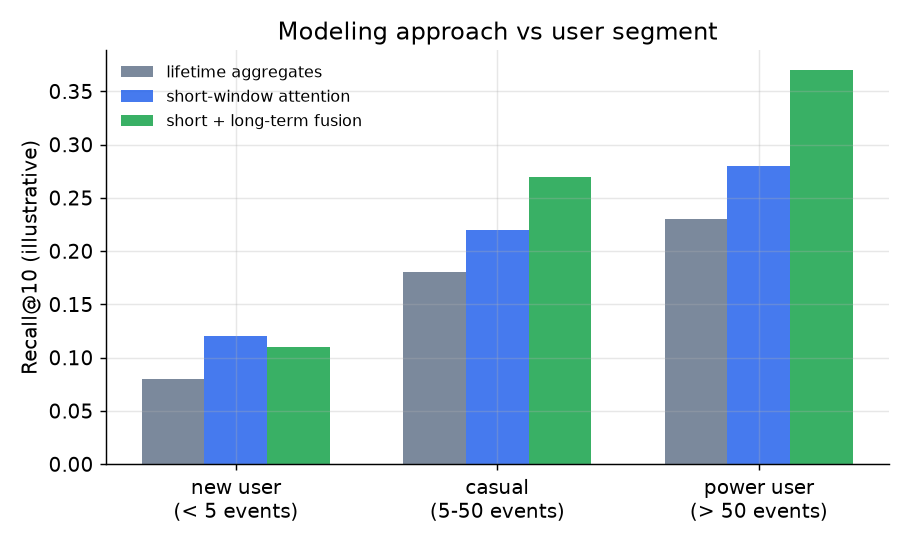

# 6. Serving and scaling

## The two paths: offline training and online inference

Like the two-tower retrieval system, sequential recommendation has a batch
training path and a real-time serving path. Unlike retrieval, the user side
cannot be precomputed once: the sequence changes during the session, so the
online path must read a fresh sequence and encode it per request (or maintain
an incrementally updated state).

**How it works.** The offline branch turns raw interaction logs into per-user
sequences (deduped, filtered, capped at N events), slides over each to build causal
(sequence, next-item) pairs, trains the sequence encoder on them, and deploys that
encoder alongside the item embeddings. The online branch is fed by streaming
ingest: each user action lands in a fast KV store that holds the user's recent
events. On a request the encoder reads that fresh sequence and produces a user
intent vector, which feeds the ranking feature or retrieval tower. The two branches
share the same encoder weights, but the online side re-encodes on every request
because the sequence changes mid-session and cannot be cached like a static user
embedding.

## Real-time sequence updates: the systems work

Reacting within a session requires that each new action reaches the encoder
before the next feed load. The standard pattern:

1. The user takes an action (click, watch).
2. A **streaming pipeline** (Kafka or similar) ingests the event and appends it
   to the user's recent-event list in a low-latency key-value store (Redis,
   DynamoDB, or a custom fast store).
3. On the next feed request, the serving system reads the updated sequence from
   the store and encodes it.

The critical constraint is that the sequence the encoder sees at serving time
must be built by the same logic as the sequences used during training. Dedup
rules, filtering thresholds, tie-breaking for simultaneous events: if these
differ between the batch pipeline and the streaming pipeline, the encoder serves
on a distribution it never trained on. This training-serving skew is the
headline operational risk for the whole system.

## Latency tactics

A Transformer encoder over 100 sequence positions is not free. Three tactics keep
it within the feed-ranking latency budget:

- **Cap the sequence length.** Keep only the most recent N events (50-200 is
  typical). Recall improves with sequence length but plateaus; the marginal value
  of event 201 is small, and capping it bounds both latency and memory.

  

  *Longer sequences improve recall and then plateau. A recent-N cap (dashed line)
  captures most of the gain at bounded encode cost. Self-attention (SASRec) reaches
  a higher ceiling than a recurrent model (GRU4Rec) at longer histories. Illustrative.*

- **Cache the encoded state.** After encoding, cache the user intent vector keyed
  by (user, sequence-hash). If no new action has arrived between two requests, the
  same encoding is returned directly. When a new event arrives, invalidate the
  cache and re-encode.
- **Serve on GPU for heavy encoders.** A multi-layer Transformer can add
  substantial CPU latency; Pinterest TransAct migrated the sequence encode to
  GPU to absorb that cost. For shallow encoders (one or two attention layers),
  CPU can work.

## Short-term and long-term interest

The figures above are for one window of recent history. But a user's preferences
have two timescales: the session-level interest (cooking, right now) and the
longer-term taste (this user reliably engages with travel and home improvement
across weeks). Fusing both captures what neither alone covers.

*New users gain most from short-window attention (their history is short anyway).
Power users gain from fusing short and long-term signals: their long history
carries durable preference that a short window would discard. Lifetime aggregates
underperform for all segments when recency matters. Illustrative.*

Pinterest's architecture makes this split explicit: TransAct handles the
real-time last-100 actions, and PinnerFormer handles the long-term user embedding.
They are fused inside the ranker via DCN feature crossing.

## Bottlenecks

| Bottleneck | First sign | Fix | Tradeoff |
|---|---|---|---|
| Encode latency blows budget | per-request time over target | cap sequence length, cache state, move to GPU | shorter history or added infra |
| Long sequences on power users | tail latency spike | truncate to recent N; optionally summarize older history into a compact long-term feature | lose some deep-history signal |
| Real-time update lag | same-session reactions feel stale | streaming ingest into a fast per-user store | pipeline complexity and maintenance |
| Online/offline sequence mismatch | online metrics consistently below offline | share sequence-build code between batch and streaming pipelines | engineering discipline across teams |
| Item embedding churn after retrains | sequence items map to stale embeddings | version and refresh item embeddings; share the same table with retrieval | coordinated redeployment |
| Cold-start users fall through | new users see a generic feed | session-based fallback: encode whatever events exist, fall back to content + popularity | tuning the degradation ladder |

**Details worth naming.** The encode-latency and long-sequence rows are the same self-attention cost surfacing twice. SASRec (2018) attention is O(L^2) in sequence length L, so a power user with thousands of events is quadratically more expensive than a median user, which is why the fix is to cap or truncate to a recent window rather than scale hardware. At serving, the causal mask is what lets you avoid recomputing the whole sequence: because the last-position vector only ever attended over the past, a per-user cached key/value state can be extended by one new event instead of re-encoding from scratch, turning the "cache state" fix into an incremental update. The item-embedding-churn row is a versioning hazard specific to sequence models: the encoder consumes item embeddings as input, so a retrain that renumbers or reinitializes the item table silently feeds the encoder vectors from a different space unless the sequence table and the retrieval table are versioned and rolled together.
