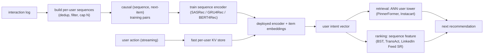

# 9. Summary

## One-page recap

- **The whole value is freshness and order.** Aggregating a user's history into
  lifetime counts loses both recency and sequence order, which are what carry
  current intent. A sequence model only earns its complexity if the sequence is
  kept fresh within the session; a daily-batch sequence model is barely better
  than aggregates.
- **Training-serving skew is the headline risk.** The batch pipeline builds
  training sequences; the streaming pipeline builds serving sequences. If their
  dedup rules, filtering thresholds, or tie-breaking differ, the encoder serves on
  a distribution it never trained on. Share the construction code, not just the
  algorithm.
- **SASRec is the modern default; choose the encoder by what the signal is.**
  Causal self-attention (SASRec) handles long sequences, parallelizes at training
  time, and is straightforward to serve. GRU4Rec works for short sessions. BERT4Rec
  adds bidirectional context at the cost of serving complexity. DIN is not a
  sequence model; it is a candidate-conditioned attention pool that ignores order.
- **Freshness and scope are independent decisions.** You can have a real-time
  short-window model (TransAct) fused with a daily batch long-term embedding
  (PinnerFormer). You can have a shared foundation model serving many surfaces
  (Netflix, Instacart). The right combination depends on what the session reaction
  is worth and how much streaming infrastructure you can staff.
- **Cold start is degradation, not a second model.** Empty sequence: popularity
  and context. Short sequence: the session model already works on a handful of
  events. Content features carry cold items until ID embeddings are trained.
- **Evaluate with Recall@k and NDCG@k on a time-based split**, then gate the
  launch on an online A/B measuring session engagement and a diversity guardrail
  to confirm you are not collapsing recommendations into a narrow loop.

## The system on one page

## Test yourself

1. Why does shuffling the sequence order drop recall significantly, and what does
   that tell you about which feature type carries the most intent signal?
2. What is the difference between a positional index and a time-gap encoding, and
   when does the difference matter?
3. What exactly is training-serving skew in the sequence construction context,
   and what is the only reliable fix?
4. Pinterest uses both TransAct and PinnerFormer in the same ranker. What does
   each one cover that the other does not?
5. DIN uses attention over the user's history. Why is it still not a sequence
   model, and what property of its attention design reveals that?
6. A new user has zero interactions. Walk through the degradation ladder the
   system should take rather than routing the user to a separate cold-start model.

## Further reading

- Dense reference (comparison, math, all 12 case studies, quadrant chart):
  [topics/03-sequential-recommendation.md](../../topics/03-sequential-recommendation.md).
- Per-company teardowns (BST, DIN, TransAct, PinnerFormer, TWIN V2, Netflix,
  CoSeRNN, Instacart, adSformers, MARS, Feed SR, Airbnb):
  [tools/teardowns/03.md](../../tools/teardowns/03.md).
- Trace a behavior sequence transformer at real dimensions (item embedding table,
  self-attention block, positional encoding):
  [Model Zoo](https://github.com/neurarch-ai/awesome-llm-model-zoo).
