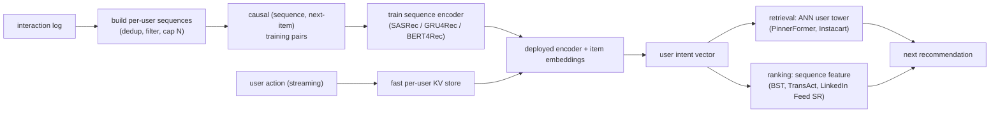

# 9. Summary

## One-page recap

- **The whole value is freshness and order.** Aggregating a user's history into
  lifetime counts loses both recency and sequence order, which are what carry
  current intent. A sequence model only earns its complexity if the sequence is
  kept fresh within the session; a daily-batch sequence model is barely better
  than aggregates.
- **Training-serving skew is the headline risk.** The batch pipeline builds
  training sequences; the streaming pipeline builds serving sequences. If their
  dedup rules, filtering thresholds, or tie-breaking differ, the encoder serves on
  a distribution it never trained on. Share the construction code, not just the
  algorithm.
- **SASRec is the modern default; choose the encoder by what the signal is.**
  Causal self-attention (SASRec) handles long sequences, parallelizes at training
  time, and is straightforward to serve. GRU4Rec works for short sessions. BERT4Rec
  adds bidirectional context at the cost of serving complexity. DIN is not a
  sequence model; it is a candidate-conditioned attention pool that ignores order.
- **Freshness and scope are independent decisions.** You can have a real-time
  short-window model (TransAct) fused with a daily batch long-term embedding
  (PinnerFormer). You can have a shared foundation model serving many surfaces
  (Netflix, Instacart). The right combination depends on what the session reaction
  is worth and how much streaming infrastructure you can staff.
- **Cold start is degradation, not a second model.** Empty sequence: popularity
  and context. Short sequence: the session model already works on a handful of
  events. Content features carry cold items until ID embeddings are trained.
- **Evaluate with Recall@k and NDCG@k on a time-based split**, then gate the
  launch on an online A/B measuring session engagement and a diversity guardrail
  to confirm you are not collapsing recommendations into a narrow loop.

## The system on one page

```mermaid
flowchart LR
  LOG["interaction log"] --> SEQB["build per-user sequences<br/>(dedup, filter, cap N)"]
  SEQB --> PAIRS["causal (sequence, next-item)<br/>training pairs"]
  PAIRS --> TRAIN["train sequence encoder<br/>(SASRec / GRU4Rec / BERT4Rec)"]
  TRAIN --> ENC["deployed encoder + item embeddings"]
  ACT["user action (streaming)"] --> KV["fast per-user KV store"]
  KV --> ENC
  ENC --> UV["user intent vector"]
  UV --> RT["retrieval: ANN user tower<br/>(PinnerFormer, Instacart)"]
  UV --> RK["ranking: sequence feature<br/>(BST, TransAct, LinkedIn Feed SR)"]
  RT --> NEXT["next recommendation"]
  RK --> NEXT
```

**How it works.** The left-to-right flow shows training feeding serving. Offline,
interaction logs become per-user sequences, then causal (sequence, next-item)
pairs, which train a sequence encoder such as SASRec, GRU4Rec, or BERT4Rec; the
trained encoder and item embeddings are then deployed. At request time a streaming
user action updates a fast per-user KV store, and the deployed encoder reads that
sequence to emit a user intent vector. That single vector fans out to two
consumers: a retrieval path (an ANN user tower) and a ranking path (a sequence
feature inside a larger ranker), each contributing to the next recommendation.
Reusing one intent vector for both retrieval and ranking is what lets a single
encoder power the whole stack.

## Test yourself

Answers are collapsed. Attempt each question before opening one.

1. Why does shuffling the sequence order drop recall significantly, and what does
   that tell you about which feature type carries the most intent signal?

   

Answer

   Shuffling removes **order** while keeping every item, so whatever quality is
   lost was carried by order alone. Instacart measured that drop at 10-45% of
   recall across surfaces, which is the chapter's headline evidence that order is
   signal rather than decoration. The mechanism: two users with the identical item
   set but opposite orderings are moving in opposite directions, one drifting from
   cooking toward travel and the other the reverse, and their next items differ
   accordingly. A bag-of-interactions feature is identical for both by
   construction, so an order-blind model is forced to give them the same
   prediction. The practical conclusion is that the **ordered interaction sequence
   itself**, not any hand-built aggregate over it, is the feature carrying the most
   intent, which is why the whole system is built to keep that sequence alive at
   request time (sections [1](01-clarifying-requirements.md) and
   [8](08-interview-qa.md)).

   

2. What is the difference between a positional index and a time-gap encoding, and
   when does the difference matter?

   

Answer

   A **positional index** encodes rank only: the 1st, 2nd, 3rd action get offsets
   1, 2, 3 regardless of when they happened. A **time-gap encoding** encodes the
   actual elapsed time between consecutive events, so a one-second gap and a
   one-month gap produce different features. The difference matters whenever
   session gaps vary widely, which is the normal case for a feed: under a bare
   1..N index an action from one second ago and an action from one month ago at the
   same position are indistinguishable, so attention has no feature it could use to
   weight them differently even when the signal is strong. It stops mattering only
   when events are roughly equally spaced, for example inside a single tight
   session. Section [3](03-data-preparation.md) lists time-gap encoding as the
   refinement most candidates skip, and section [8](08-interview-qa.md) makes the
   attention argument explicitly; the default stack in
   [10](10-putting-it-together.md) commits to time-gap encoding rather than a plain
   index.

   

3. What exactly is training-serving skew in the sequence construction context,
   and what is the only reliable fix?

   

Answer

   It is the case where the batch pipeline that builds training sequences from
   logs and the streaming pipeline that builds serving sequences from a live event
   feed apply different rules, so the encoder serves on a sequence distribution it
   never trained on. The specific rules that drift are the ones nobody writes down:
   the adjacent-duplicate dedup window, the rare-item filter threshold, the recent-N
   cap, and the tie-breaking for simultaneous events. A small difference is enough
   to hurt because the encoder's attention patterns are fit to the exact statistics
   of the training sequences (typical lengths, adjacency structure, duplicate
   patterns), so a changed dedup window puts every serving request slightly
   out of distribution, where the model degrades silently instead of erroring. The
   first sign is the online-below-offline gap: online engagement consistently under
   what offline Recall@k predicted. The only reliable fix is **shared sequence
   construction code called by both pipelines**, not a shared written algorithm, not
   standardized feature transforms, and not a monitoring dashboard (sections
   [3](03-data-preparation.md), [6](06-serving-and-scaling.md), and
   [8](08-interview-qa.md)).

   

4. Pinterest uses both TransAct and PinnerFormer in the same ranker. What does
   each one cover that the other does not?

   

Answer

   They cover two different **timescales**, and neither one covers both.
   **TransAct** is a multi-layer Transformer over the last 100 real-time actions,
   updated by streaming ingest and served on GPU to absorb the cost; it captures
   what the user is doing right now in the current session, which a daily batch
   embedding cannot see. **PinnerFormer** is a Transformer over a longer horizon
   refreshed in a daily batch; it captures durable taste across weeks, which a
   100-action window throws away. The two are fused inside the Homefeed ranker via
   DCN feature crossing, so a casual user's current-session intent rides on top of
   their long-term preferences. What makes the batch half viable is the
   **all-action loss**: training PinnerFormer to predict a window of future actions
   rather than only the next one keeps its embedding useful much longer before
   going stale, closing most of the freshness gap at a fraction of the streaming
   infrastructure cost. Section [6](06-serving-and-scaling.md) shows the segment
   split behind this (new users gain most from the short window, power users from
   fusing both), and sections [7](07-how-teams-do-it-in-production.md) and
   [8](08-interview-qa.md) give the production detail.

   

5. DIN uses attention over the user's history. Why is it still not a sequence
   model, and what property of its attention design reveals that?

   

Answer

   DIN is a **candidate-conditioned attention pool**, not a sequence encoder: its
   local activation unit scores each historical behavior against the current
   candidate ad and combines the results with a weighted sum. The revealing property
   is that a weighted sum is **permutation-invariant**, so with no positional signal
   feeding the weights you can shuffle the history into any order and every term in
   the sum is unchanged, making the output bit for bit identical. The design
   confirms this from three directions: no positional encoding, no causal mask, and
   deliberately no softmax normalization over behaviors, the last one omitted on
   purpose so interest intensity survives. What DIN does add is real, just not
   sequential: the user representation adapts per candidate instead of being one
   fixed vector. Order sensitivity has to be injected explicitly, which is exactly
   what BST adds on top of the same idea (sections
   [7](07-how-teams-do-it-in-production.md) and [8](08-interview-qa.md)).

   

6. A new user has zero interactions. Walk through the degradation ladder the
   system should take rather than routing the user to a separate cold-start model.

   

Answer

   The ladder has three rungs and the same model serves all of them. **One, empty
   sequence: fall back to popularity plus available context** such as location,
   device, and time of day, because there is nothing to encode yet. **Two, short
   sequence of roughly 2 to 5 events: run the session model as-is**, since even two
   actions carry intent signal and the encoder handles a handful of events without
   modification. **Three, as the sequence fills, content features** (category, price
   tier, popularity bucket) keep carrying items whose ID embeddings are still
   randomly initialized, until those embeddings accumulate enough interactions to be
   stable. The reason to degrade rather than switch is that a separate cold-start
   model means twice the infrastructure and twice the maintenance, and it creates a
   discontinuous experience at the cold-warm boundary: two models trained on
   different data with different objectives produce scores in different spaces, so
   the day a user crosses the history threshold their recommendations jump to a
   different model's opinion all at once. One model with shared parameters shifts
   smoothly because each new event only incrementally updates the representation
   already serving that user. Sections [3](03-data-preparation.md),
   [6](06-serving-and-scaling.md), and [8](08-interview-qa.md) cover the rungs; the
   default stack in [10](10-putting-it-together.md) records the rule as "never a
   separate cold-start model".

   

## Further reading

- The capstone: [the complete build](10-putting-it-together.md), where every
  choice in this chapter is committed once for the scenario, sized, rebuilt
  under two other constraint sets, and compressed into a runnable one-file sequence recommender.
- Dense reference (comparison, math, all 12 case studies, quadrant chart):
  [topics/03-sequential-recommendation.md](../../topics/03-sequential-recommendation.md).
- Per-company teardowns (BST, DIN, TransAct, PinnerFormer, TWIN V2, Netflix,
  CoSeRNN, Instacart, adSformers, MARS, Feed SR, Airbnb):
  [tools/teardowns/03.md](../../tools/teardowns/03.md).
- Trace a behavior sequence transformer at real dimensions (item embedding table,
  self-attention block, positional encoding):
  [Model Zoo](https://github.com/neurarch-ai/awesome-llm-model-zoo).
