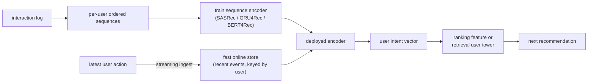

# Sequential and Personalized Recommendation

> **Style note (proof of concept).** This chapter is a sample of a teach-first,
> book-like rewrite. It borrows the *thinking* of Aminian and Xu's *Machine
> Learning System Design Interview* (a Candidate/Interviewer dialogue to gather
> requirements, then a consistent frame-data-model-evaluate-serve arc, one small
> figure per idea) without copying its format. On top of that it keeps what this
> repo adds: real production case studies, a "when to use which" table per method
> group, live editable architecture graphs, worked figures (mermaid and
> matplotlib), and an interview Q&A. Split into one file per section so no single
> file gets long.

An interviewer rarely says "design a sequential recommendation model." They say
**"our recommendations ignore what the user just did. Someone watches three
cooking videos in a row and we still show them the same generic feed. Fix that."**
That is sequential recommendation: a system that encodes a user's recent ordered
behavior so the next recommendation reflects their evolving intent. The key word
is *ordered*: the signal is in the sequence, not in a bag of lifetime counts, and
every design choice flows from keeping that signal alive at request time.

This chapter builds the system end to end: from clarifying whether you need
session freshness or batch personalization, through GRU4Rec, SASRec, and
BERT4Rec, to the streaming pipeline that keeps user state alive between actions.
It shows how Alibaba, Pinterest, Netflix, Spotify, Kuaishou, LinkedIn, and
Instacart actually ship it.

## Sections

1. [Clarifying the requirements](01-clarifying-requirements.md) - the dialogue that scopes the problem.
2. [Framing it as an ML task](02-frame-as-ml-task.md) - next-item prediction, sequence input, ranked items out.
3. [Data preparation](03-data-preparation.md) - building sequences without leakage and engineering features.
4. [Model development](04-model-development.md) - GRU4Rec, SASRec, BERT4Rec, the loss, and when to use which.
5. [Evaluation](05-evaluation.md) - recall@k, NDCG, MRR, time-based splits, and the online gates.
6. [Serving and scaling](06-serving-and-scaling.md) - real-time sequence updates, latency, and bottlenecks.
7. [How teams do it in production](07-how-teams-do-it-in-production.md) - Alibaba, Pinterest, Netflix, Spotify, Kuaishou, LinkedIn, Instacart, and why they diverge.
8. [Interview Q&A](08-interview-qa.md) - commonly asked, tricky, and commonly-answered-wrong, with clear answers.
9. [Summary](09-summary.md) - the one-page recap and self-test.

## The whole system on one page

Read the sections in order the first time; they build on each other. Each opens
with the question an interviewer actually asks, then answers it.
