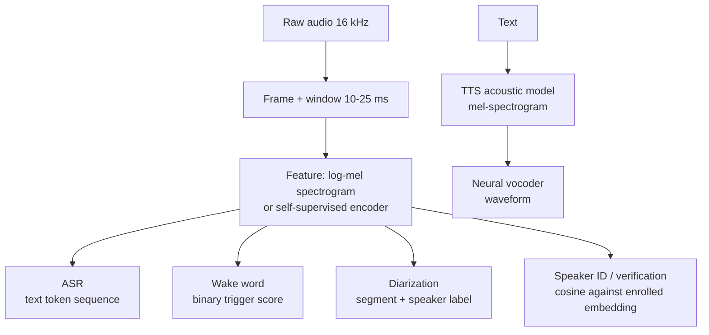

# 2. Frame as an ML task

Speech is not one ML task. It is a family of tasks that share a frontend (audio
framing and feature extraction) and then diverge sharply in model family, head,
latency budget, and evaluation metric. An interviewer rewards candidates who refuse
to blur them.

## The four tasks in scope

**ASR (automatic speech recognition).** Input is a sequence of audio frames.
Output is a sequence of text tokens. The core tension is causality: a streaming
model can only use frames up to now and must commit left-to-right; a batch model
can attend over the whole utterance and self-correct.

**Wake word / keyword spotting.** Input is a short window of audio. Output is a
binary bit: "did the trigger phrase occur?" It is a detection problem, not
transcription. The model is tiny (tens of kilobytes to a few megabytes), always
on, and runs on a dedicated low-power core. The output is not text; it is a score
that is thresholded.

**Speaker diarization.** Input is a multi-speaker recording. Output is a
segmentation: "Speaker 1 spoke from 0:00 to 0:35, Speaker 2 from 0:30 to 1:10"
and so on, with overlaps. It does not necessarily identify who the speakers are,
only that turns changed.

**TTS (text-to-speech).** Input is text. Output is a waveform. It goes in the
opposite direction from ASR. Quality is subjective, judged by human ratings (MOS),
not edit-distance metrics.

## What they share and where they diverge

The front end (framing, windowing, log-mel features) is the same for ASR,
wake word, diarization, and speaker ID. They diverge in the model head, the
latency envelope, and the metric that gates release.

## When to use which task framing

| Reach for | When the product needs | Key metric |
|---|---|---|
| Streaming ASR (RNN-T / CTC) | live dictation with partials under 300 ms | WER + endpoint latency |
| Batch ASR (Conformer seq2seq) | uploaded recordings where accuracy beats latency | WER sliced by accent / domain |
| Wake word detector | always-on trigger with battery budget | False accepts per hour, false-reject rate (DET curve) |
| Speaker diarization | "who spoke when" without identity | Diarization error rate (DER) |
| Speaker verification / ID | "is this the enrolled user" or "who is this" | Equal error rate (EER), cosine threshold |
| TTS | generating speech from text | MOS (human 1 to 5 ratings) |

Proposing one model for all of them is the classic red flag. Each has a different
causality requirement, a different latency budget, and a different metric that
determines whether it ships.
