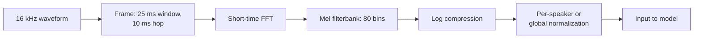
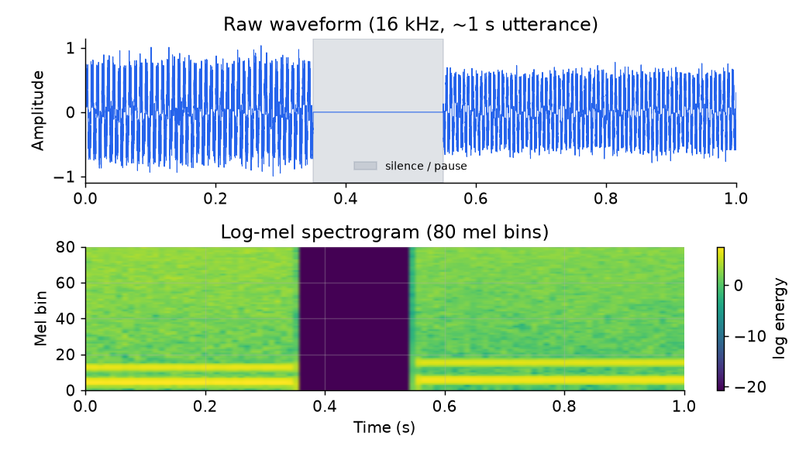

# 3. Data preparation

## From raw waveform to model input

Raw audio is a one-dimensional signal sampled at 16,000 Hz. A model cannot train
directly on 16,000 samples per second of continuous values. The standard pipeline
converts it to a compact, acoustic-relevant representation before any learning.

**Why log-mel, not raw samples?** The mel scale compresses high frequencies
(where human speech is less information-dense) and expands low ones, matching the
human auditory system. Log compression brings the dynamic range of the energy into
a range a neural network can process without exploding gradients. The result is
roughly 80 values per 10 ms frame: compact, expressive, and standardized across
all major ASR systems.

The waveform and its derived spectrogram look like this on a short utterance:

*Top: raw 16 kHz waveform showing two voiced regions separated by a brief pause.
Bottom: the corresponding 80-bin log-mel spectrogram; voiced regions show
harmonic structure (bright horizontal bands) that the model learns to decode.
The silence gap is faint. Illustrative.*

## Labeling: transcribed audio is expensive

Manually transcribed audio costs roughly $10 to $30 per hour of audio depending on
quality tier, and hundreds of hours are needed per language for a decent baseline.
Two strategies dominate when labeled data is scarce.

**Weak supervision.** Use audio that comes naturally paired with noisy text: video
subtitles, podcast transcripts, broadcast captions. Labels are not curated but are
plentiful. OpenAI's Whisper trained on 680K hours this way. The cost is
hallucination risk on silence and occasional mismatch, which is gated by VAD and
confidence thresholds at serving time.

**Self-supervised pretraining.** Train on raw unlabeled audio to learn a general
speech representation, then fine-tune with a small CTC head on a little labeled
data.

- **wav2vec 2.0**: encodes the waveform with a CNN, masks spans of the latent
  representation, and solves a contrastive task (pick the true quantized latent
  for a masked step against distractors). A small CTC head fine-tuned on 10
  minutes of labeled data reaches competitive WER.
- **HuBERT**: replaces the contrastive objective with masked prediction of
  k-means cluster targets. Train offline k-means on features, then predict
  cluster IDs for masked frames. The stable pseudo-label targets make training
  more robust than the contrastive approach.

Both let a single multilingual pretraining run serve dozens of low-resource
languages, because the model shares representations across them.

## Augmentation

Augmentation is not optional for a robust speech model; it is how the training
distribution is made to match real acoustic conditions.

**SpecAugment** operates on the spectrogram (not the raw waveform). It applies
two types of masking: time masking (zeroing out contiguous frames) and frequency
masking (zeroing out contiguous mel bins). This forces the model to complete the
signal from partial evidence, strongly reducing WER on clean and noisy audio.
It is cheap, requires no additional data, and is now standard in every serious
ASR recipe.

**Noise and reverberation.** Mix clean speech with recorded room impulse responses
(reverberation) and background noise from environment recordings (cafes, streets,
offices). This directly addresses the far-field and overlapping-noise conditions
where WER doubles without augmentation.

**Speed and pitch perturbation.** Shift the playback speed by a small factor
(0.9x to 1.1x). This produces free acoustic variation that helps generalize across
speaking rates without distorting the phoneme identity.

## Wake word data: the enrollment problem

A wake word detector needs many examples of the trigger phrase and many
non-trigger phrases (hard negatives: phrases that sound similar). Collecting
real speaker-diverse, noise-diverse recordings is expensive. Common approaches:

- **TTS synthesis**: generate dozens of voice styles and noise conditions from
  the target phrase; cheap but potentially distribution-shifted.
- **Crowd-sourced enrollment**: users record the trigger explicitly (Apple's Hey
  Siri enrollment captures five utterances from the owner). This doubles as
  training data for personalized models.
- **Hard negatives**: phrases acoustically close to the trigger but lexically
  different (for "Hey Product," negatives like "Hay Product" or "Hey Conduct").
  Without them, the model learns superficial features that fail on near-misses.

## When to use which data strategy

| Reach for | When | Instead of |
|---|---|---|
| SpecAugment | any ASR model as the first augmentation step | no augmentation |
| Noise and reverb mixing | far-field, multi-condition, or phone-quality audio | clean-only training that collapses under real noise |
| Weak supervision at scale | hundreds of thousands of hours of audio without human labels | expensive per-hour transcription alone |
| Self-supervised pretraining (wav2vec2 / HuBERT) | labeled data is scarce or the language is low-resource | full supervised training on a tiny labeled set |
| Multilingual joint pretraining | low-resource language that can borrow from high-resource ones | language-isolated supervised training |
| TTS-synthesized wake word data | bootstrapping a trigger detector before any real recordings | waiting for a live data collection campaign |
