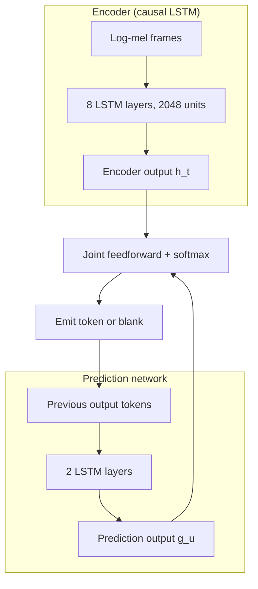
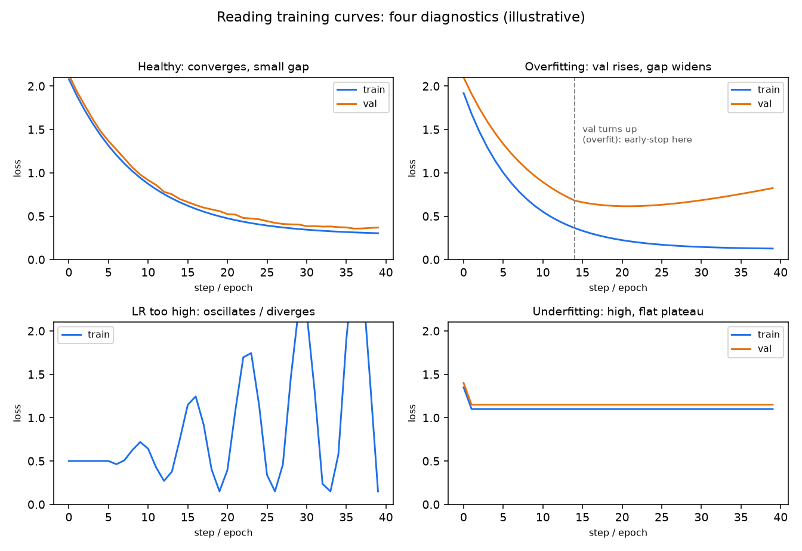

# 4. Model development

## The first fork: causal vs full-context

The single most important architectural decision is not which network to use but
whether the model is **causal**. A causal model can only see audio up to the
current frame; it must commit left-to-right and can never revise an early
hypothesis. A full-context model can attend over the entire utterance and
self-correct.

Causality is not a choice the team makes freely; it is forced by the product
requirement. Live dictation must return a first partial under 300 ms, which means
the model cannot wait for the utterance to end. Uploaded recordings have no such
constraint, so accuracy wins.

## Streaming architectures (causal)

### CTC: Connectionist Temporal Classification

CTC adds a special blank symbol to the output alphabet and predicts one label per
input frame. The loss marginalizes over all valid label-blank alignments:

$$\mathcal{L}_{\text{CTC}} = -\log \sum_{\pi \in \mathcal{B}^{-1}(y)} \prod_{t=1}^{T} p(\pi_t \mid x_{1:t})$$

where $\mathcal{B}^{-1}(y)$ is the set of all frame-level label sequences that
collapse (by removing blanks and repeated labels) to the target transcript $y$.

The assumption of conditional independence between output tokens given the audio
means CTC has no internal language model. It is fast, naturally streaming, and
works well with an external language model fused at decoding time. Forced
alignment (finding per-word timestamps given the correct transcript) is a natural
byproduct: build a CTC trellis constrained to the known transcript and run Viterbi
backtracking.

Greedy decoding just takes the per-frame argmax and applies the same collapse
$\mathcal{B}$: merge runs of the same label, then drop the blank.

```python
def ctc_collapse(ids, blank=0):         # ids: per-frame argmax token ids from the acoustic model
    out, prev = [], None
    for i in ids:
        if i != prev and i != blank:    # merge repeated labels, then remove the blank symbol
            out.append(i)
        prev = i                        # a blank between two equal labels resets prev, keeping both
    return out
# ctc_collapse([1, 1, 0, 1, 2, 2]) -> [1, 1, 2]  (run of 1s merged; blank 0 keeps the second 1; 2s merged)
```

### RNN-T: the RNN Transducer

RNN-T adds a **prediction network** (an RNN over previously emitted tokens) and a
**joint network** that fuses encoder and prediction outputs, then emits one token
or blank at each step:

$$P(y \mid x) = \sum_{\pi \in \mathcal{B}^{-1}(y)} \prod_{(t,u)} P(\pi_{t,u} \mid \text{enc}(x_{1:t}),\; \text{pred}(y_{1:u}))$$

The joint network lets the model condition on output history, giving it an
internal language model without an external one. It emits incrementally, frame by
frame, left to right, and never looks ahead. This is the workhorse for on-device
streaming dictation: Google's Gboard RNN-T quantized to 80 MB runs entirely
offline on a Pixel phone.



The feedback loop through previous output tokens is what separates RNN-T from CTC
and is what makes the transducer approach more robust on context-sensitive
transcription.

### The transducer emission-delay trap

A subtlety senior engineers watch for: a transducer is free to emit the blank
symbol and keep consuming audio before it commits a token, and nothing in the
standard RNN-T loss discourages waiting. Left alone the model learns to **delay**
emission, hoarding future frames because more right context lowers token error,
which inflates the user-perceived latency that streaming was supposed to protect.
The gap between when enough audio has arrived to decide a word and when the model
actually emits it is the emission delay, and it does not show up in WER at all.
FastEmit (Yu et al., Google, 2021) is the standard fix: it adds a term to the
transducer loss that rewards emitting a non-blank token sooner, trading a small
accuracy cost for a large reduction in emission delay. This is why two RNN-T
models with identical WER can feel very different live.

## Full-context architecture (batch): the Conformer

The **Conformer** is the dominant batch encoder. It interleaves self-attention
blocks with convolution blocks, and this is not incidental: each captures
something the other cannot.

- **Self-attention** captures global, long-range dependencies. For speech this
  means co-reference across the whole utterance ("bank" in "river bank" vs "bank
  account") and long prosodic structure.
- **Convolution** captures local, fine-grained temporal and spectral patterns.
  Phonemes, formants, and pitch transitions are all local: the consonant at
  frame 40 interacts most strongly with frames 38 through 42, not with frame 400.

Speech is both locally and globally structured, so mixing the two beats either
alone. A Conformer encoder can plug into a CTC head, a transducer head, or an
attention decoder.

The attention seq2seq family (LAS, Whisper) extends this with a full
encoder-decoder: the encoder embeds the full utterance and the decoder
autoregressively attends over it to emit text. This is accurate but susceptible
to attention pathologies (looping, early stopping, hallucination on silence).
Large-scale weak supervision (Whisper at 680K hours) gives zero-shot robustness
across languages and domains.

**Recent direction: full-duplex spoken dialogue.** The newest conversational systems
drop the turn-based listen-then-speak pipeline entirely and model speech in and
speech out at once, so the model can listen and talk simultaneously (handling
interruptions and backchannels like a real conversation). Moshi (Kyutai, 2024,
[arXiv:2410.00037](https://arxiv.org/abs/2410.00037)) is the reference full-duplex
speech-text model, and Meta's SeamlessM4T remains the reference for unified
multilingual ASR and speech translation. These matter when the product is a live
voice agent rather than batch transcription.

## When to use which architecture

| Reach for | When | Instead of |
|---|---|---|
| RNN-T (streaming, on-device) | live dictation needs first partial under 300 ms, on a memory/power budget | a Conformer seq2seq that must see the full utterance |
| CTC with external LM (streaming) | forced alignment or cheap streaming where an external LM is acceptable | RNN-T, when model-internal context is needed |
| Conformer encoder-decoder (batch) | uploaded recordings where accuracy beats latency | a causal model that cannot self-correct |
| Whisper-style weak supervision | zero-shot multilingual ASR without per-domain fine-tuning | fully supervised small-corpus training on a low-resource language |
| On-device int8-quantized RNN-T | always-on or privacy paths inside a memory/power envelope | a heavy cloud model running on a low-power core |
| Attention seq2seq | when zero-shot breadth and multitask (ASR plus translation) matter | latency-sensitive streaming, where it fails |

**Provenance.** Dated origins for the named architectures: CTC (Graves et al., 2006) and the RNN-Transducer (Graves, 2012) are the streaming losses; the Conformer encoder that carries most modern accuracy is Google (2020); the attention seq2seq head descends from the Transformer (Google, 2017); and the weak-supervision multilingual model is Whisper (OpenAI, 2022). When the on-device or low-resource path starts from a self-supervised encoder, that is wav2vec 2.0 (Meta FAIR, 2020) or HuBERT (Meta, 2021) with a small CTC or transducer head fine-tuned on top.

**Tools.** Streaming transducers and CTC: NeMo (NVIDIA), k2 and icefall for RNN-T,
and Kaldi for classic CTC decoding and forced alignment with an external language
model. Full-context Conformer and attention seq2seq: ESPnet, SpeechBrain, and
torchaudio all ship Conformer encoders with CTC, transducer, or attention heads.
Weak-supervision zero-shot ASR: whisper (OpenAI). On-device int8 deployment: export
via ONNX Runtime or TensorFlow Lite to fit the memory and power envelope.

**Worked example.** A voice-assistant maker needs live dictation that returns a first
partial well under a third of a second on a phone, so it reaches for an int8-quantized
RNN-T (NeMo or icefall) that commits left to right rather than a Conformer seq2seq
that must see the whole utterance. For its separate feature that transcribes uploaded
voice memos, latency does not bind, so it uses a full-context Conformer
encoder-decoder that can self-correct and wins on accuracy. When the product expands
to many languages without per-language labeled corpora, it drops in a whisper-style
weakly supervised model for zero-shot breadth. CTC with an external LM stays in the
toolbox specifically for cheap forced alignment when it needs per-word timestamps.

## TTS: two-stage pipeline

TTS is the reverse problem: text to waveform. Modern systems split it into two
learnable stages so each can be trained and swapped independently.

1. **Acoustic model** maps text (or phonemes) to a mel-spectrogram intermediate.
   The mel-spectrogram encodes what to say and how (prosody, rhythm, intonation)
   in a compact, differentiable form. Tacotron 2 uses a seq2seq with location-
   sensitive attention; non-autoregressive variants (FastSpeech 2) are more
   stable and faster but require duration labels.

2. **Neural vocoder** renders the mel-spectrogram into a raw waveform. WaveNet
   was the original high-fidelity vocoder; HiFi-GAN is the current standard: it
   produces near-human quality at GPU real-time speeds using adversarial training.

Why split the pipeline? The mel-spectrogram decouples prosody modeling from
sample rendering. A spectrogram-domain loss (mean-squared error on the
mel-spectrogram) is tractable to optimize; direct waveform generation requires
modeling samples at 24,000 per second, which adversarial or flow-based methods
handle in the vocoder stage.

## Wake word: the false-accept / false-reject tradeoff

A wake word is a tiny binary classifier. Its entire design is a tradeoff between:

- **False accepts (FA)**: the device wakes when it should not (nearby speech,
  TV, similar-sounding phrases). These feel creepy and waste compute.
- **False rejects (FR)**: the device ignores a real trigger. These make the
  product feel broken.

You cannot win both simultaneously. You pick an operating point on the DET
(Detection Error Tradeoff) curve. Production practice is a **two-stage pipeline**:

- **Stage 1 (on-device, always-on)**: a deliberately loose model to minimize
  false rejects. If it is uncertain, it fires rather than misses.
- **Stage 2 (cloud or larger on-device)**: a heavier model that verifies the
  trigger and kills the false accepts generated by stage 1.

This lets stage 1 be tiny (a few megabytes or less), while the expensive
verification fires only rarely. Amazon Alexa and Apple Hey Siri both use this
two-stage shape.

## Implementation and training pitfalls

Speech models break most often at the seams: the feature front-end, the
alignment, and the mismatch between how much future audio the model saw in
training versus how much it gets at serving. A model trained full-context and
served causally can look perfect offline and fall apart live.



*Four shapes a training run takes: healthy convergence (train and val fall together), overfitting (val turns up, early-stop there), learning rate too high (loss oscillates or diverges), and underfitting (loss stays high and flat). Illustrative.*

| Problem | Symptom | Fix |
|---|---|---|
| Streaming vs full-context mismatch | trained with the whole utterance but served frame-by-frame, or evaluated full-context and deployed streaming | train with the same lookahead and chunked/causal masking the serving path uses |
| CTC blank collapse | model emits mostly blanks, or repeated labels merge incorrectly | balance the blank prior, tune the blank penalty, keep a blank between equal labels in the collapse |
| RNN-T lookahead skew | encoder trained with future frames it will not have at inference | match the limited right context between training and streaming inference |
| Feature front-end mismatch | log-mel stats, mel-bin count, or sample rate differ between train and serve | freeze the front-end (sample rate, mel bins, CMVN stats) and apply it identically at serve |
| Seq2seq hallucination on silence | decoder emits text during non-speech or loops on itself | gate with VAD before decode, add a repetition penalty and a no-speech threshold |
| Partial-hypothesis instability | streaming partials flip as more audio arrives, flickering on screen | commit with a confidence gate or short delay, and measure partial finality |
| WER inflated by text normalization | numbers, casing, and punctuation counted as errors | apply consistent inverse text normalization to hypothesis and reference before scoring |
| Wake-word operating-point drift | false-accept and false-reject rates shift across devices and noise | pick the DET operating point per environment, keep the two-stage verifier, retrain on hard negatives |
