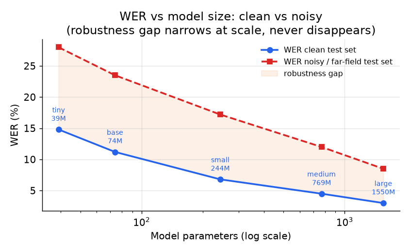

# 5. Evaluation

Each speech task has a different metric that gates release, and using the wrong
one is how teams ship a model that passes evaluation and fails in production.

## ASR: WER and its pitfalls

**WER** measures transcription accuracy at the word level: the model produces a
word sequence from audio, and WER counts how many word-level edit operations
separate that sequence from the reference, outputting an error rate (0 = perfect;
values above 1 are possible when insertions are numerous):

$$\text{WER} = \frac{S + I + D}{N}$$

where $S$, $I$, $D$ count substituted, inserted, and deleted words against the
reference, and $N$ is the reference word count. **CER (character error rate)**
applies the same edit-distance computation at the character level and outputs an
error rate in the same form:

$$\text{CER} = \frac{S_c + I_c + D_c}{N_c}$$

where $S_c$, $I_c$, $D_c$ are character-level substitutions, insertions, and
deletions and $N_c$ is the reference character count. CER is the fairer
cross-language signal, since morphologically rich languages produce long words
that WER penalizes as multiple substitutions.

WER is the standard metric and it lies in specific ways. Knowing the failure modes
is a strong signal in an interview.

**All errors weigh equally.** Dropping "the" costs as much as mangling a customer
name or a dosage number, though only one ruins the product. Always report entity
WER (proper nouns, addresses) and numeric WER alongside the aggregate.

**Normalization dominates comparisons.** Casing, punctuation, contractions, and
number form ("twenty" vs "20") can swing WER by several points depending on the
text normalizer applied before scoring. Two systems are not comparable unless
normalized identically. This is a frequent source of misleading benchmark claims.

**Aggregate hides subgroups.** A 5% aggregate WER can coexist with 12% WER for a
specific accent group, 15% for children, or 20% for far-field recordings. Slice by
accent, noise level, domain, and entity density before a release decision.

**Endpointing latency is invisible to WER.** A model that cuts users off mid-sentence
or hangs for two seconds waiting for trailing silence has perfect WER and a broken
product. Track endpoint latency and false cutoff rate as separate primary metrics.

*Larger models reduce WER on both clean and noisy audio, but the robustness gap
(noisy minus clean WER) narrows slowly and never disappears. Scaling is not a
substitute for noise-aware training and per-condition evaluation. Illustrative.*

## ASR: latency metrics for streaming

For streaming dictation, latency is as important as WER.

- **First partial latency**: time from last spoken phoneme to first word appearing
  on screen. Target is under 300 ms for a "feels instant" experience.
- **Endpoint latency**: time from when the user stops talking to when the final
  transcript is returned. Too long and the product feels sluggish; too short and
  it cuts the user off mid-breath.
- **Real-time factor (RTF)**: the ratio of processing time to audio duration; the
  system takes an audio segment as input and outputs a scalar, where
  $\text{RTF} \lt 1$ is required for real-time streaming:
  $\text{RTF} = T_{\text{compute}} / T_{\text{audio}}$.
  RTF below 0.1 is needed for headroom on a mobile device.

## Wake word: the DET curve

For wake word, the relevant metrics are:

- **False accepts per hour** of ambient audio (not recall, which ignores the
  temporal rate). A good on-device model targets less than one false accept per
  day of ambient listening.
- **False reject rate (FRR)**: the fraction of real trigger events that the model
  misses; the model produces a detection decision from audio and FRR scores it as
  an error rate in [0, 1]:
  $\text{FRR} = \text{missed triggers} / \text{total real triggers}$.
- **Equal error rate (EER)**: the confidence threshold $\tau$ at which the false
  accept rate $\text{FAR}(\tau)$ equals $\text{FRR}(\tau)$, where FAR is the
  fraction of non-trigger audio segments falsely accepted; lower EER means a
  better DET curve. Apple reports a 4.3% EER for personalized Hey Siri. EER
  summarizes the DET curve in a single number.

Report false accepts per unit time rather than per trial; the product runs
continuously, so a 1% false-accept rate per trial translates to dozens of
accidental activations per day of ambient audio.

## TTS: MOS and alignment monitoring

TTS quality cannot be measured with an automatic metric. The gold standard is the
**mean opinion score (MOS)**: the model produces audio from a text prompt; $K$
human raters each score naturalness on a 1-to-5 integer scale, and MOS is their
mean, a number in [1, 5]:

$$\text{MOS} = \frac{1}{K}\sum_{k=1}^{K} s_k, \quad s_k \in \{1, 2, 3, 4, 5\}$$

Near-human TTS reaches MOS around 4.5.

Automatic metrics (mel-cepstral distortion, which scores spectral envelope
distance between synthesized and reference audio, and PESQ, which scores
perceptual speech quality on a narrowband telephony scale) correlate poorly with
perceived naturalness and should not be the primary signal. Use them as fast regression
checks, not as the release gate.

For autoregressive acoustic models, also monitor for **alignment pathologies**:
the attention map between input phonemes and output frames should be monotonically
diagonal. A loop (the model repeats a word), an early stop (the sentence is
truncated), or a skip are all failures that may not show in the loss but are
immediately audible.

## Diarization: DER

Diarization is scored by **diarization error rate (DER)**: the model produces a
speaker-labeled timeline from audio; DER scores it against the ground-truth
diarization, outputting an error rate (0 = perfect; values above 1 are possible):

$$\text{DER} = \frac{T_{\text{missed}} + T_{\text{false}} + T_{\text{confusion}}}{T_{\text{total}}}$$

where $T_{\text{missed}}$ is time where a real speaker is not detected,
$T_{\text{false}}$ is time where a non-speaker is labeled,
$T_{\text{confusion}}$ is time where a speaker is labeled as the wrong person,
and $T_{\text{total}}$ is the total reference speech duration. Report **purity**
and **coverage** alongside DER to diagnose the error composition. Let $T_{k,s}$
be the time in predicted cluster $k$ spoken by reference speaker $s$:

$$\text{Purity} = \frac{1}{T_{\text{total}}}\sum_{k} \max_{s}\, T_{k,s}, \qquad \text{Coverage} = \frac{1}{T_{\text{total}}}\sum_{s} \max_{k}\, T_{k,s}$$

Purity is high when each cluster is dominated by a single speaker; coverage is
high when each speaker's turns are captured in one dominant cluster.

## When to use which metric

| Reach for | When | Instead of |
|---|---|---|
| WER sliced by accent, noise, entity | evaluating ASR transcription quality | a single aggregate WER that hides subgroup failures |
| CER | comparing across languages or morphologically rich scripts | WER, which penalizes long words unfairly |
| Endpoint latency and RTF | evaluating streaming ASR for live dictation | WER alone, which is blind to latency |
| False accepts per hour, FRR, EER | evaluating wake word on a DET curve | recall only, which ignores the temporal false-accept rate |
| MOS from humans | evaluating TTS naturalness | spectrogram reconstruction loss, which correlates poorly with perceived quality |
| DER plus purity and coverage | evaluating diarization | WER, which says nothing about speaker-turn accuracy |
