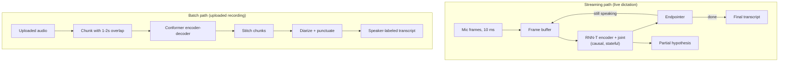
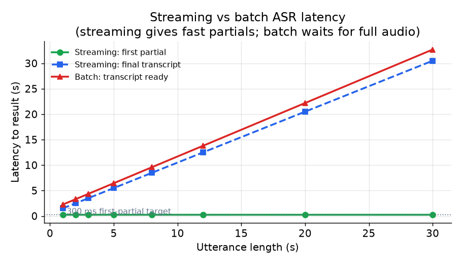
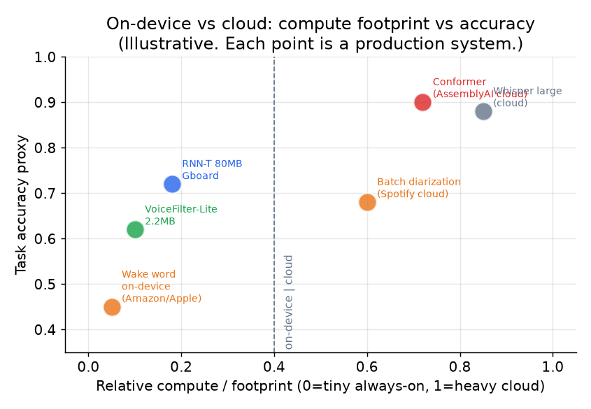

# 6. Serving and scaling

## Two workloads, two serving paths

The two ASR paths have opposite bottlenecks.

**Streaming ASR** serves many concurrent live sessions per GPU (or CPU core for
on-device). Each session is a stateful RNN-T decoder that must return a frame
update within a few milliseconds. The bottleneck is concurrent-session count, not
per-session accuracy.

**Batch ASR** processes uploaded recordings. The bottleneck is total throughput
(audio hours per GPU-hour). Recordings are chunked with overlap, run in parallel,
then stitched, diarized, and punctuated.

*Streaming returns a first partial nearly instantly (green dots, roughly constant
regardless of utterance length) while the final transcript only arrives after the
utterance ends. Batch must wait for the whole recording before producing any
output, and latency grows with audio length. For a 30-second meeting clip, batch
latency is 30 to 35 seconds; streaming has already been returning words for 30
seconds. Illustrative.*

## Streaming serving: what controls throughput

**Per-frame latency** is bounded by the RNN-T joint network's forward pass. Keep
the joint network shallow. Google's Gboard model uses a small feedforward joint;
larger joints improve WER but at the cost of per-session latency.

**Decoder state** must be kept per-session. Each beam in the beam search holds an
RNN state for the prediction network. Limit beam width to 4 to 8 for streaming;
beam search over many hypotheses multiplies memory per session and kills
concurrency.

**Endpointing** runs on every frame and must be extremely cheap (a simple
energy-based or trained silence detector). It trades directly against false
cutoffs: a tighter silence threshold causes more false cutoffs; a looser one
makes the product feel sluggish.

**Batching across sessions.** At high concurrency, batch the frame-step forward
passes across multiple live sessions. The encoder processes a batch of frames from
N different users simultaneously, which improves GPU utilization without affecting
latency (each frame update still returns within the per-frame budget).

## On-device constraints

Putting ASR on a phone is a discipline, not just a smaller model.

**Quantization.** Convert float32 weights to int8. This shrinks the model roughly
4x and speeds inference on mobile NPUs. Google's Gboard RNN-T went from 450 MB
to 80 MB at 4x runtime speedup. The WER cost must be validated per-model; never
assume it is negligible.

**Memory and power envelope.** The full model, plus decoder state for the current
session, must fit in memory and run faster than real time (RTF below 1.0) on the
target SoC. This bounds architecture choices: RNN-T over large Conformers, short
context windows, narrow beam.

**No audio logging.** On-device means no audio flows back for retraining. You
lose the main retraining signal and must substitute on-device metrics (did the
user correct the transcript?), federated learning signals, or explicitly consented
opt-in data collection.

*Systems at the left run on-device within tight memory and power budgets; systems
at the right run in the cloud where compute is abundant. The tradeoff is not just
accuracy but also privacy, battery, and the ability to retrain from audio. Each
point is a named production system. Illustrative.*

## Batch serving bottlenecks

| Bottleneck | First sign | Fix | Tradeoff |
|---|---|---|---|
| Attention on long audio | OOM or very slow on 1-hour recordings | chunk with overlap, run chunks in parallel | chunk-boundary stitching artifacts |
| Diarization at scale | pipeline latency dominated by clustering | parallelize VAD and embedding, use approximate clustering | slightly higher DER |
| Punctuation / casing restoration | transcript hard to read | cascade a lightweight LM or seq2seq punctuation model | added latency, extra infrastructure |
| GPU underutilization | batches too small at off-peak | dynamic batching by audio length | slight latency variability |
| Hallucinated text on silence | transcript has fluent garbage for non-speech sections | gate with VAD before the encoder | missed speech if VAD is too aggressive |

## On-device vs cloud: where each workload lives

| Workload | Runs where | Why |
|---|---|---|
| Always-on wake word stage 1 | on-device, always | battery budget, privacy, no network dependency |
| Wake word stage 2 verification | cloud (or larger on-device model) | fires rarely, can afford heavier compute |
| Live streaming dictation | on-device or cloud (user choice) | on-device for privacy; cloud for accuracy on weak hardware |
| Batch meeting transcription | cloud | long audio, heavy compute, latency not critical |
| Speaker enrollment embeddings | on-device | personal biometric data, must not leave the device |
