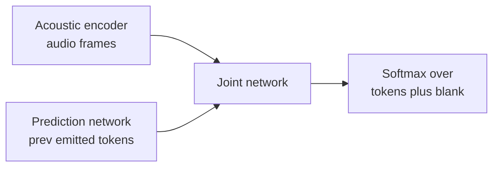

# 8. Interview Q&A

The questions an interviewer actually asks about speech systems, grouped by how
they are used. The commonly-answered-wrong section is where interviews are won
or lost.

## Commonly asked

**Q: Why are streaming and batch ASR two different models rather than one model
with a "streaming mode"?**

A: Causality. A streaming model can only see audio up to the current frame; it
must commit left-to-right and emit a hypothesis before the utterance ends. A
batch model attends over the entire utterance and self-corrects. These require
different architectures (RNN-T or causal CTC for streaming; Conformer encoder-
decoder for batch), different decoding regimes, and different serving paths. A
"streaming mode flag" on a bidirectional Conformer would require either blocking
until the utterance ends (negating streaming) or masking future frames (turning
it into a degraded causal model). Neither is a clean solution. The right answer
is two separate models.

**Q: Your WER looks good in aggregate but users are complaining. What do you check?**

A: Four things aggregate WER hides. First, entity and numeric WER: proper nouns,
product names, addresses, and numbers are where users notice failures, and they
are exactly the low-frequency tail that aggregate WER underweights. Second, per-
accent or per-condition slices: a 5% aggregate can hide 15% WER for a specific
accent group. Third, endpointing errors: WER is silent on whether the model cut
the user off or hung waiting for trailing silence. Fourth, normalization artifacts:
capitalization, punctuation, and number forms can look wrong to users even with
good token-level WER.

**Q: Design the wake word system for a smart speaker.**

A: Two stages. Stage 1 is a tiny always-on on-device model (a few megabytes, deeply
quantized), running on a low-power core. Its threshold is deliberately loose: it
fires when uncertain rather than misses a real trigger, because false rejects are
fatal to the product. Stage 2 is a heavier cloud model (or a larger on-device
model) that receives the triggered audio snippet and confirms or rejects it.
This second stage handles the false accepts generated by the loose first stage.
Report operating points as false accepts per hour of ambient audio and false-reject
rate on a DET curve, not as classification precision or recall.

**Q: How do you get a good ASR model when you only have 10 hours of labeled audio
for a new language?**

A: Self-supervised pretraining. Pre-train a wav2vec 2.0 or HuBERT backbone on
unlabeled audio in the target language (or on a large multilingual corpus that
includes it). Then fine-tune a small CTC head on the 10 hours of labeled data.
The pretrained encoder already knows how to map audio into a useful latent
representation; the CTC head only needs to learn the language-specific token
mapping. Alternatively, start from a multilingual model like SeamlessM4T that
already covers the language and fine-tune minimally.

**Q: Two users are talking at the same time over your streaming dictation. What
breaks, and how do you fix it?**

A: The recognizer blends both voices and produces a garbled transcript. The right
tool is target-speaker separation: condition a small mask network on the enrolled
user's speaker embedding (a d-vector) and have it predict a filterbank-domain
mask that enhances the target voice and suppresses everything else. Google's
VoiceFilter-Lite does this at 2.2 MB on-device. It improves overlapped-speech WER
by roughly 25% without touching the ASR model. Blind source separation is the
wrong approach here because you already know whose voice you want.

## Tricky (the follow-ups that separate people)

**Q: The Conformer mixes convolution and self-attention. Why not use attention
alone?**

A: Speech is both locally and globally structured. Phonemes, formants, and pitch
transitions depend on nearby frames (a span of 10 to 50 ms); grammar, co-reference,
and prosodic structure span the whole utterance. Self-attention alone models global
dependencies well but is weak at capturing the fine-grained local spectral patterns
that define phones. Convolution is strong at local patterns but cannot model
long-range context. Interleaving both lets each layer operate at its natural scale.
This is not an ablation argument; the Conformer outperforms either alone on standard
speech benchmarks precisely because both scales matter.

**Q: You measured WER improved after retraining. How do you make sure it is safe to
push?**

A: WER alone is not enough. Also check: (1) per-condition slices (accent, noise,
entity, numeric) to catch regression in any subgroup; (2) endpoint latency and false
cutoff rate, which can worsen even when WER improves; (3) on noisy and far-field
test sets explicitly, not just a clean benchmark; (4) real-time factor on the
target device. A model can improve aggregate WER and regress on all the conditions
users care about.

**Q: When would you use CTC instead of RNN-T for streaming?**

A: CTC is the right choice when an external language model (LM) is acceptable and
you want simpler code and faster decoding. CTC's conditional-independence assumption
means it has no internal LM, so it leans more on an external one. For on-device
streaming dictation, RNN-T is usually preferred because it models output history
internally and does not need a separate LM, which would be expensive on-device.
CTC's main strong suit in production is forced alignment: given audio and a known
transcript, build a CTC trellis constrained to that transcript and backtrack the
Viterbi path to get per-word timestamps.

**Q: What exactly gives RNN-T an internal language model that CTC lacks?**

A: The factorization. CTC (Graves et al., 2006) models the output as a product of
per-frame token posteriors that are conditionally independent given the acoustics,
roughly P(y|x) = product over frames of P(token | x). Nothing in that product lets
token t depend on token t-1, so CTC cannot prefer a spelling from label context
alone and leans on an external LM to supply it. RNN-T (Graves, 2012) adds a
prediction network, a small autoregressive net over the previously emitted
non-blank tokens, whose state is fused with the acoustic encoder in a joint network
before the softmax. That conditions each emission on the emitted-token history,
which is a learned internal LM. The price is decoding: RNN-T searches a 2D lattice
over time steps and label steps (at each cell it either emits a token or advances
in time via a blank), heavier than CTC's per-frame argmax, and that is the tradeoff
you accept to drop the external LM on-device.

*RNN-T fuses an acoustic encoder with an autoregressive prediction network in a joint network, which is the internal language model that conditionally-independent CTC does not have.*

## Commonly answered wrong (the traps)

**Q: For wake word detection, should I optimize recall so users never miss the
trigger?**

A: Not recall in isolation. Recall only measures the fraction of real triggers
caught; it ignores false accepts entirely. A model with 100% recall that wakes on
every ambient sound has perfect recall and is unusable. The right frame is the DET
curve: plot false-accept rate against false-reject rate at every threshold, pick an
operating point that matches product tolerance, and report false accepts per hour of
ambient audio, not per trial. The two-stage design exists precisely to drive the
operating point: a loose first stage minimizes false rejects; a cloud second stage
minimizes false accepts.

**Q: TTS sounds robotic. Should I improve the spectrogram reconstruction loss?**

A: No. Spectrogram reconstruction loss (mean-squared error on the mel-spectrogram)
correlates poorly with perceived naturalness. A model can minimize MSE and still
produce robotic or artifact-heavy speech. The correct signal is human MOS (mean
opinion score): have raters listen to samples and score naturalness from 1 to 5.
Also check the vocoder separately, since the vocoder carries most of the compute
and most of the naturalness; swapping WaveNet for HiFi-GAN is often the higher-
leverage intervention than tuning the acoustic model loss.

**Q: Can I just use Whisper for live dictation?**

A: No. Whisper is an attention encoder-decoder that processes 30-second windows.
It cannot return a first partial until the window is full or the utterance ends, so
latency is in seconds, not hundreds of milliseconds. It also tends to hallucinate
fluent text on silence or noise (the attention decoder generates plausible tokens
even when the input is uninformative). For live dictation, use a causal RNN-T or
CTC model with endpointing. Use Whisper for batch transcription of uploaded
recordings where accuracy and zero-shot multilingual coverage beat latency.

**Q: On-device ASR is just a smaller version of the cloud model, right?**

A: It is a different engineering discipline. On-device is bounded by memory,
battery, and power, not just accuracy. Quantization from float32 to int8 shrinks the
model roughly 4x and speeds inference on NPUs, but the WER cost must be validated
per-model. On-device also means no audio logs for retraining, so you lose the
main retraining signal and must design federated or on-device feedback channels from
the start. Architecture choices are also constrained: RNN-T fits on a phone;
a full bidirectional Conformer typically does not at competitive WER.
