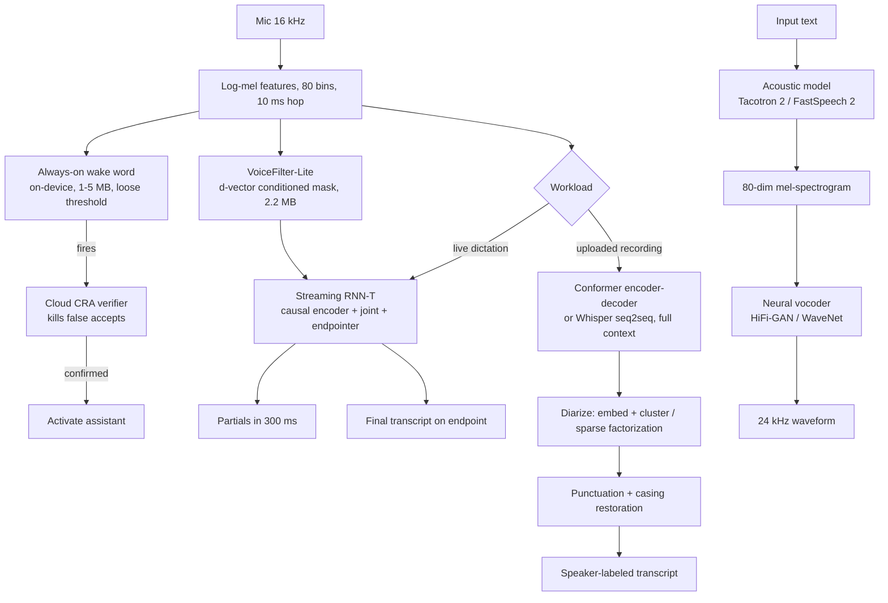

# 9. Summary

## One-page recap

- **Speech is not one task.** Streaming ASR, batch ASR, wake word, diarization,
  speaker verification, and TTS share a front end (log-mel features) and diverge
  completely in architecture, latency budget, and evaluation metric. Proposing one
  model for all of them is the clearest red flag.

- **Causality is the first fork, not a flag.** Streaming models (RNN-T, CTC)
  can only see audio up to the current frame and commit left-to-right. Batch
  models (Conformer, Whisper) attend over the whole utterance and self-correct.
  This distinction forces separate architectures and separate serving paths, not
  a mode toggle.

- **WER is the standard metric and it lies in specific ways.** It weights all
  errors equally (dropped "the" costs as much as a mangled name), it depends
  heavily on text normalization, and it hides subgroup failure (accent, noise,
  entities). Always slice by accent and noise condition, and report entity WER and
  numeric WER alongside the aggregate. Endpointing latency is invisible to WER
  and must be tracked separately.

- **The wake word is a false-accept / false-reject tradeoff, measured per hour.**
  The two-stage design resolves it: a loose, tiny on-device stage avoids false
  rejects; a heavier cloud stage kills the resulting false accepts. Report false
  accepts per hour of ambient audio, not recall or precision.

- **On-device is a discipline, not just a smaller model.** Int8 quantization buys
  roughly 4x compression with a WER cost you validate, not assume. On-device also
  eliminates audio logs for retraining; federated or on-device feedback must be
  designed from the start.

- **TTS is judged by humans, not by loss.** Spectrogram reconstruction loss
  correlates poorly with perceived naturalness. MOS (human 1 to 5 ratings) is the
  release gate. The vocoder carries most of the compute and most of the
  naturalness.

## The full system on one page

**How it works.** Everything on the recognition side starts from one shared front
end: 16 kHz mic audio becomes 80-bin log-mel features at a 10 ms hop, and those
features feed several branches. The wake-word branch runs an always-on, loose
on-device detector whose firings are re-checked by a stricter cloud verifier before
the assistant activates, trading a few false accepts on-device for cheap
verification. A workload switch then routes the same features either to a streaming
RNN-T that emits partials within a few hundred milliseconds and a final transcript
at the endpoint, or to a full-context Conformer or seq2seq model whose output is
diarized, punctuated, and cased into a speaker-labeled transcript; an optional
VoiceFilter-Lite mask can clean the features before the streaming path. The
text-to-speech side is a separate chain: input text goes to an acoustic model that
predicts a mel-spectrogram, which a neural vocoder turns into a waveform. Sharing
the log-mel front end across wake word, streaming, batch, and separation is what
keeps the recognition stack coherent even though each branch has its own latency
and accuracy trade-off.

## Test yourself

1. Why must streaming ASR be causal, and what does that concretely forbid the
   model from doing?
2. The Conformer interleaves convolution and self-attention. What specific property
   of speech does each capture, and why does neither alone suffice?
3. Your streaming ASR has improved WER but users say it feels broken. What three
   non-WER metrics do you check first?
4. A product manager asks for a single WER number to compare two models. What four
   reasons would you give for why that single number is insufficient?
5. Design the data pipeline for a wake word detector with no existing training
   audio for the trigger phrase.
6. TTS sounds robotic. You have minimized the mel-spectrogram reconstruction loss
   to a new low. Why might that be the wrong intervention, and what do you check
   instead?

## Further reading

- Dense reference (comparison tables, all math, full case-study links):
  [topics/17-speech-and-audio.md](../../topics/17-speech-and-audio.md)
- Trace the architecture graphs live:
  [whisper-small](https://www.neurarch.com/?import=https://raw.githubusercontent.com/neurarch-ai/awesome-llm-model-zoo/main/architectures/whisper-small/model.json),
  [wav2vec2-base](https://www.neurarch.com/?import=https://raw.githubusercontent.com/neurarch-ai/awesome-llm-model-zoo/main/architectures/wav2vec2-base/model.json),
  [hubert-base](https://www.neurarch.com/?import=https://raw.githubusercontent.com/neurarch-ai/awesome-llm-model-zoo/main/architectures/hubert-base/model.json),
  [encodec](https://www.neurarch.com/?import=https://raw.githubusercontent.com/neurarch-ai/awesome-llm-model-zoo/main/architectures/encodec/model.json)
- All production case studies: [Model Zoo](https://github.com/neurarch-ai/awesome-llm-model-zoo) and the [gallery](https://neurarch-ai.github.io/awesome-llm-model-zoo).
