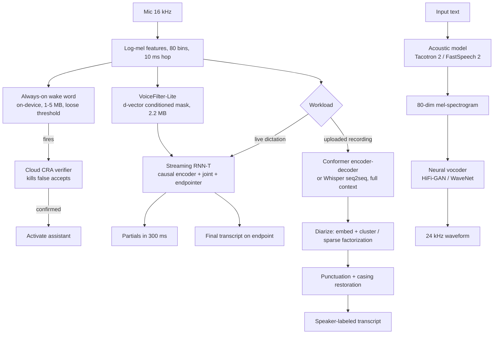

# 9. Summary

## One-page recap

- **Speech is not one task.** Streaming ASR, batch ASR, wake word, diarization,
  speaker verification, and TTS share a front end (log-mel features) and diverge
  completely in architecture, latency budget, and evaluation metric. Proposing one
  model for all of them is the clearest red flag.

- **Causality is the first fork, not a flag.** Streaming models (RNN-T, CTC)
  can only see audio up to the current frame and commit left-to-right. Batch
  models (Conformer, Whisper) attend over the whole utterance and self-correct.
  This distinction forces separate architectures and separate serving paths, not
  a mode toggle.

- **WER is the standard metric and it lies in specific ways.** It weights all
  errors equally (dropped "the" costs as much as a mangled name), it depends
  heavily on text normalization, and it hides subgroup failure (accent, noise,
  entities). Always slice by accent and noise condition, and report entity WER and
  numeric WER alongside the aggregate. Endpointing latency is invisible to WER
  and must be tracked separately.

- **The wake word is a false-accept / false-reject tradeoff, measured per hour.**
  The two-stage design resolves it: a loose, tiny on-device stage avoids false
  rejects; a heavier cloud stage kills the resulting false accepts. Report false
  accepts per hour of ambient audio, not recall or precision.

- **On-device is a discipline, not just a smaller model.** Int8 quantization buys
  roughly 4x compression with a WER cost you validate, not assume. On-device also
  eliminates audio logs for retraining; federated or on-device feedback must be
  designed from the start.

- **TTS is judged by humans, not by loss.** Spectrogram reconstruction loss
  correlates poorly with perceived naturalness. MOS (human 1 to 5 ratings) is the
  release gate. The vocoder carries most of the compute and most of the
  naturalness.

## The full system on one page

```mermaid
flowchart TD
  RAW["Mic 16 kHz"] --> FEAT["Log-mel features, 80 bins, 10 ms hop"]

  FEAT --> WW["Always-on wake word<br/>on-device, 1-5 MB, loose threshold"]
  WW -- fires --> VER["Cloud CRA verifier<br/>kills false accepts"]
  VER -- confirmed --> ACT["Activate assistant"]

  FEAT --> CASUAL{Workload}

  CASUAL -- live dictation --> RNNT["Streaming RNN-T<br/>causal encoder + joint + endpointer"]
  RNNT --> PART["Partials in 300 ms"]
  RNNT --> FIN["Final transcript on endpoint"]

  CASUAL -- uploaded recording --> CONF["Conformer encoder-decoder<br/>or Whisper seq2seq, full context"]
  CONF --> DIAR["Diarize: embed + cluster / sparse factorization"]
  DIAR --> PUNC["Punctuation + casing restoration"]
  PUNC --> LABELED["Speaker-labeled transcript"]

  FEAT --> SEP["VoiceFilter-Lite<br/>d-vector conditioned mask, 2.2 MB"]
  SEP --> RNNT

  TEXT["Input text"] --> ACOUS["Acoustic model<br/>Tacotron 2 / FastSpeech 2"]
  ACOUS --> MEL["80-dim mel-spectrogram"]
  MEL --> VOC["Neural vocoder<br/>HiFi-GAN / WaveNet"]
  VOC --> WAV["24 kHz waveform"]
```

**How it works.** Everything on the recognition side starts from one shared front
end: 16 kHz mic audio becomes 80-bin log-mel features at a 10 ms hop, and those
features feed several branches. The wake-word branch runs an always-on, loose
on-device detector whose firings are re-checked by a stricter cloud verifier before
the assistant activates, trading a few false accepts on-device for cheap
verification. A workload switch then routes the same features either to a streaming
RNN-T that emits partials within a few hundred milliseconds and a final transcript
at the endpoint, or to a full-context Conformer or seq2seq model whose output is
diarized, punctuated, and cased into a speaker-labeled transcript; an optional
VoiceFilter-Lite mask can clean the features before the streaming path. The
text-to-speech side is a separate chain: input text goes to an acoustic model that
predicts a mel-spectrogram, which a neural vocoder turns into a waveform. Sharing
the log-mel front end across wake word, streaming, batch, and separation is what
keeps the recognition stack coherent even though each branch has its own latency
and accuracy trade-off.

## Test yourself

Answers are collapsed. Attempt each question before opening one.

1. Why must streaming ASR be causal, and what does that concretely forbid the
   model from doing?

   

Answer

   Because the live path must return a first partial under 300 ms, the model cannot
   wait for the utterance to end, so **causality is forced by the product
   requirement**, not chosen as a preference. Concretely it forbids three things:
   attending over future frames (no bidirectional encoder, no full-utterance
   self-attention), revising a token once emitted (hypotheses are committed left to
   right), and any decode that needs the endpoint before it can produce output. That
   is what rules an attention encoder-decoder out of the live path: Whisper processes
   30-second windows, so its latency lands in seconds rather than hundreds of
   milliseconds. It also means a "streaming mode" flag on a bidirectional Conformer
   is not a fix, since it would either block until the utterance ends (negating
   streaming) or mask future frames and become a degraded causal model. The subtler
   consequence is the emission-delay trap: nothing in the standard RNN-T loss
   discourages emitting blanks and hoarding right context, so two models with
   identical WER can feel very different live, which is what a FastEmit-style delay
   penalty corrects. Sections [1](01-clarifying-requirements.md) and
   [4](04-model-development.md).

   

2. The Conformer interleaves convolution and self-attention. What specific property
   of speech does each capture, and why does neither alone suffice?

   

Answer

   **Self-attention captures global, long-range structure; convolution captures
   local, fine-grained structure**, and speech is organized at both scales at once.
   Attention carries co-reference across the whole utterance ("bank" in "river bank"
   versus "bank account") and long prosodic contour. Convolution carries phonemes,
   formants, and pitch transitions, which are local: the consonant at frame 40
   interacts most strongly with frames 38 through 42, not with frame 400. Attention
   alone models the global dependencies well but is weak at the fine-grained local
   spectral patterns that define phones; convolution alone captures those patterns
   but cannot reach across the utterance for grammar, co-reference, or prosody.
   Interleaving them lets each layer operate at its natural scale, which is why the
   Conformer beats either alone on standard speech benchmarks rather than winning on
   an ablation technicality. The practical payoff is modularity: one Conformer
   encoder plugs into a CTC head, a transducer head, or an attention decoder.
   Sections [4](04-model-development.md) and [8](08-interview-qa.md).

   

3. Your streaming ASR has improved WER but users say it feels broken. What three
   non-WER metrics do you check first?

   

Answer

   Check **endpoint latency plus false cutoff rate**, **first-partial latency (and
   the emission delay behind it)**, and **partial-hypothesis stability**, in that
   order, because WER is blind to all three. Endpointing is the usual culprit: a
   model that finalizes on a mid-utterance pause cuts the user off while WER stays
   flat, and one that waits too long for trailing silence feels sluggish, so false
   cutoff rate belongs on the dashboard as its own primary metric. First-partial
   latency should stay under 300 ms for a "feels instant" experience, and the
   transducer emission-delay trap explains how it degrades invisibly: the standard
   RNN-T loss happily lets the model emit blanks to hoard right context, so accuracy
   work can quietly buy latency. Partial instability is the third: partials that flip
   as more audio arrives flicker on screen, and the fix is a confidence gate or a
   short commit delay, measured as partial finality. If the device rather than the
   model is the suspect, add real-time factor, which must stay under 1.0 to keep up
   and under roughly 0.1 on mobile for headroom. Sections [5](05-evaluation.md),
   [4](04-model-development.md), and [6](06-serving-and-scaling.md).

   

4. A product manager asks for a single WER number to compare two models. What four
   reasons would you give for why that single number is insufficient?

   

Answer

   Four independent reasons. **One, all errors weigh equally**: in
   $\text{WER} = (S + I + D) / N$ a dropped "the" costs exactly what a mangled
   customer name or dosage number costs, so entity WER and numeric WER have to be
   reported alongside the aggregate. **Two, normalization dominates comparisons**:
   casing, punctuation, contractions, and number form ("twenty" versus "20") swing
   WER by several points, so two systems are not comparable unless the identical text
   normalizer ran on both. **Three, the aggregate hides subgroups**: a 5% aggregate
   WER can coexist with 12% for an accent group, 15% for children, and 20% for
   far-field audio, because pooling weights every condition by its token count and
   mathematically dilutes the minority cohort. **Four, latency is invisible to WER**:
   endpoint latency, false cutoffs, and real-time factor never enter an edit distance,
   so a model can post a perfect number and still cut users off mid-sentence. The
   honest deliverable is a family of numbers, aggregate plus per-cohort slices plus
   entity and numeric WER plus the latency gates, and CER when the comparison crosses
   languages. Sections [5](05-evaluation.md) and [8](08-interview-qa.md).

   

5. Design the data pipeline for a wake word detector with no existing training
   audio for the trigger phrase.

   

Answer

   Bootstrap synthetically, then harden with hard negatives and real ambient audio.
   **One, TTS synthesis**: generate the trigger phrase in dozens of voice styles and
   noise conditions from a neural voice model, which is cheap and available before any
   field recording exists, at the cost of distribution shift from live far-field
   audio. **Two, hard negatives**: synthesize and mine phrases that are acoustically
   close but lexically different (for "Hey Product," negatives like "Hay Product" and
   "Hey Conduct"), because without them the model learns superficial features and
   fails on near-misses. **Three, acoustic augmentation**: mix in recorded room
   impulse responses and background noise (cafes, streets, offices) and apply
   SpecAugment, since the detector lives in noisy far-field rooms. **Four,
   crowd-sourced enrollment**: have users record the trigger explicitly, the way
   Apple's Hey Siri enrollment captures five utterances from the owner, which doubles
   as training data for a personalized model. **Five, a real negative corpus**: hours
   of ambient audio containing no trigger, because the release gate is false accepts
   per hour of ambient audio rather than per trial, and that rate cannot be measured
   on synthetic data. Split train and test by speaker and by time, never by random
   shuffle, and validate the synthetic pipeline against real field recordings before
   trusting it. Sections [3](03-data-preparation.md) and [5](05-evaluation.md).

   

6. TTS sounds robotic. You have minimized the mel-spectrogram reconstruction loss
   to a new low. Why might that be the wrong intervention, and what do you check
   instead?

   

Answer

   Because **spectrogram reconstruction loss correlates poorly with perceived
   naturalness**, so driving it lower can make the complaint worse rather than
   better. The same sentence has many valid prosodic renditions (different pitch
   contours, timing, emphasis), and mean-squared error is minimized by predicting
   their average: an over-smoothed spectrogram that corresponds to no natural
   utterance. Human ears read that smoothing as muffled, flat, and robotic while the
   loss barely registers it, which is exactly the artifact users are reporting. Check
   three things instead. First, **MOS**: have raters score naturalness on a 1-to-5
   scale, since near-human TTS reaches roughly 4.5 and MOS is the release gate, with
   mel-cepstral distortion and PESQ kept only as fast regression proxies. Second,
   **the vocoder**, which carries most of the compute and most of the naturalness, so
   swapping WaveNet for HiFi-GAN is often higher leverage than any acoustic-model loss
   tuning. Third, **alignment pathologies** in an autoregressive acoustic model: the
   attention map between input phonemes and output frames should be monotonically
   diagonal, and a loop, an early stop, or a skip is immediately audible while barely
   moving the loss. Sections [5](05-evaluation.md), [4](04-model-development.md), and
   [8](08-interview-qa.md).

   

## Further reading

- The capstone: [the complete build](10-putting-it-together.md), where every
  choice in this chapter is committed once for the scenario, sized, rebuilt
  under two other constraint sets, and compressed into a runnable one-file WER and DTW demo.
- Dense reference (comparison tables, all math, full case-study links):
  [topics/17-speech-and-audio.md](../../topics/17-speech-and-audio.md)
- Trace the architecture graphs live:
  [whisper-small](https://www.neurarch.com/?import=https://raw.githubusercontent.com/neurarch-ai/awesome-llm-model-zoo/main/architectures/whisper-small/model.json),
  [wav2vec2-base](https://www.neurarch.com/?import=https://raw.githubusercontent.com/neurarch-ai/awesome-llm-model-zoo/main/architectures/wav2vec2-base/model.json),
  [hubert-base](https://www.neurarch.com/?import=https://raw.githubusercontent.com/neurarch-ai/awesome-llm-model-zoo/main/architectures/hubert-base/model.json),
  [encodec](https://www.neurarch.com/?import=https://raw.githubusercontent.com/neurarch-ai/awesome-llm-model-zoo/main/architectures/encodec/model.json)
- All production case studies: [Model Zoo](https://github.com/neurarch-ai/awesome-llm-model-zoo) and the [gallery](https://neurarch-ai.github.io/awesome-llm-model-zoo).
