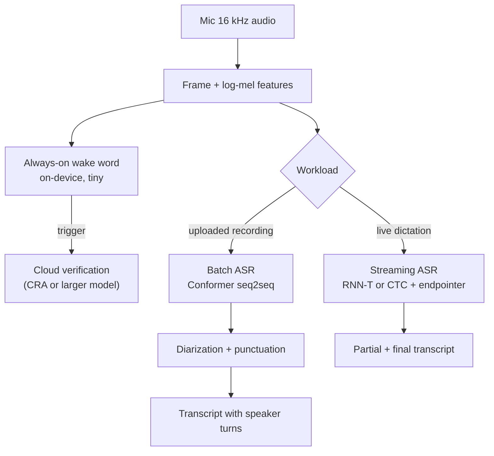

# Speech and Audio Systems

> **Style note.** This chapter follows the teach-first, book-like arc of the
> candidate-retrieval sample: a candidate/interviewer dialogue to lock down scope,
> then a frame-data-model-evaluate-serve arc, one small figure per idea. It adds
> what this repo contributes on top: real production case studies (Google, Apple,
> Amazon, AssemblyAI, OpenAI, Spotify, Meta, NVIDIA), a "when to use which" table
> per method group, live architecture graphs, worked figures (mermaid and
> matplotlib), and an interview Q&A.

An interviewer rarely says "design a speech system." They say **"users tap a mic
and dictate; we also transcribe uploaded meeting recordings; some of it runs on a
phone with no network; there is a wake word that must never drain the battery.
Where do you start?"** This chapter builds the full system end to end, and shows
how production teams at Google, Amazon, Apple, AssemblyAI, OpenAI, Spotify, and
Meta actually ship it.

## Sections

1. [Clarifying the requirements](01-clarifying-requirements.md) - the dialogue that scopes streaming vs batch, on-device, privacy.
2. [Frame as an ML task](02-frame-as-ml-task.md) - ASR, TTS, wake word, diarization: four tasks, four model families.
3. [Data preparation](03-data-preparation.md) - audio features, augmentation, labeling, self-supervised data.
4. [Model development](04-model-development.md) - RNN-T, Conformer, the transducer loss, and "when to use which."
5. [Evaluation](05-evaluation.md) - WER pitfalls, latency, MOS for TTS, DET for wake word.
6. [Serving and scaling](06-serving-and-scaling.md) - streaming ASR, on-device constraints, bottlenecks.
7. [How teams do it in production](07-how-teams-do-it-in-production.md) - divergence table plus first-party write-ups.
8. [Interview Q&A](08-interview-qa.md) - commonly asked, tricky, and commonly answered wrong.
9. [Summary](09-summary.md) - one-page recap, mermaid, test-yourself, further reading.

## The whole system on one page

Read the sections in order the first time; each one opens with the question an
interviewer actually asks, then answers it.
