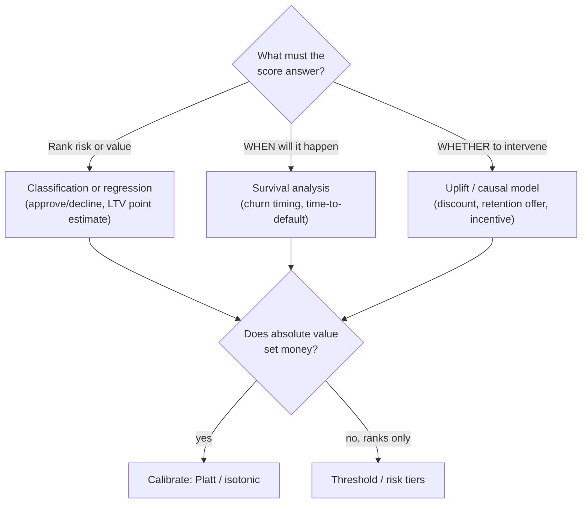

# 2. Framing it as an ML task

## The four modeling families

Before touching a dataset, pick the modeling family from the decision the score
must answer. Getting this wrong is the single most common design error, and it is
invisible in an offline AUC.

**Classification** answers "will this customer default / churn / convert in a
fixed window?" The output is a probability. Use this when the horizon is fixed, the
label is clean, and ranking is all you need (Pinterest 14-day churn, Gousto 4-week
subscription churn, PayPal pipeline propensity).

**Regression** answers "what is the expected value of this customer or listing?"
The output is a point estimate. Use this for LTV, home value, or demand forecasting
when the target is a continuous number (Airbnb home value, Expedia CLV, Asos
markdown).

**Survival analysis** answers "when will this event happen, for customers who
have not yet experienced it?" The output is a survival curve, one per customer,
giving the probability they are still active (or still-paying) at every horizon.
Use this when the timing matters and some rows are censored: still-active
subscription customers, applicants whose default window has not yet resolved
(Nubank, Block Square).

**Uplift / causal models** answer "whose behavior changes if I act?" The output is
a conditional average treatment effect (CATE): the difference in outcome if the
customer receives an intervention versus not. Use this for any pricing, discount,
or retention offer decision, where spending budget on people who would have acted
anyway (sure things) or people who never will (lost causes) is pure waste (Wayfair,
Uber, Gojek).

## Specifying the input and output

| Surface | Input | Output |
|---|---|---|
| Credit risk scoring | applicant features at decision time (income, bureau tradelines, application attributes) | calibrated default probability; adverse-action reason codes |
| Subscription churn | customer behavior at snapshot date (usage, spend, pauses, trends) | churn probability within a horizon, or a survival curve |
| Customer LTV | booking or purchase history, demographics, product mix | expected discounted revenue over a horizon |
| Incentive / discount targeting | customer features plus treatment indicator | CATE (uplift per customer); optimizer allocates budget |

## When to use which framing

| Reach for | When | Instead of |
|---|---|---|
| Classification (fixed-window binary) | clean horizon, label resolves completely, ranking is enough | survival machinery you do not need |
| Regression (point estimate) | target is continuous, no censoring, point value is consumed directly | a binary label that throws away the magnitude |
| Survival analysis | WHEN the event happens matters and some rows are censored (still-active accounts) | a fixed-window binary that discards censored rows and loses timing |
| Uplift / CATE | the question is WHETHER an intervention changes behavior (pricing, discount, retention) | a churn or propensity model that targets sure things and lost causes too |
| Calibrated probability | the absolute number feeds a threshold, a limit formula, or a price | a raw ranking score that only needs to sort correctly |

The choice is driven by the decision downstream, not by what is easiest to label.
Framing churn as classification when you need survival, or framing an intervention
question as propensity when you need uplift, is the most expensive early mistake
in a tabular design. Pin the decision first, then pick the row.
