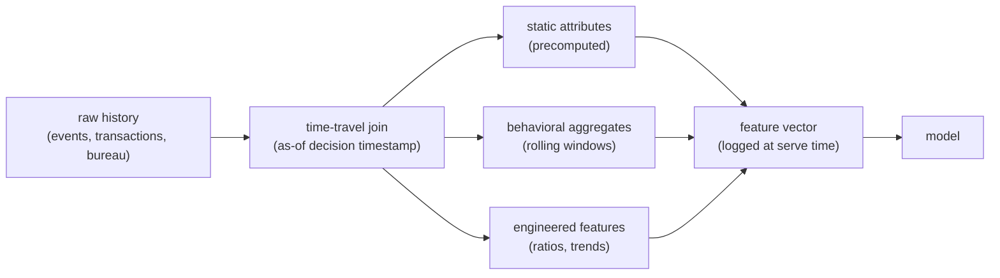

# 3. Data preparation

Data quality on tabular problems is where most projects live or die. Three issues
dominate: target leakage, delayed and biased labels, and categorical encoding at
scale. Each is invisible in a naive offline split and each can silently destroy a
model in production.

## Point-in-time correctness and target leakage

The most common failure signature is a suspiciously high offline AUC, say 0.95 on
a credit dataset with few features. The diagnosis is almost always target leakage:
a feature encodes the outcome or is only knowable after the fact.

Classic offenders:
- An account-status column updated to "delinquent" after the default event.
- A rolling aggregate whose window extends into the label period.
- A "collections calls" count that only appears because the customer already
  defaulted.
- A bureau tradeline updated in response to the decision being predicted.

The discipline is **point-in-time correctness**: every feature must be computed
as of the decision timestamp, using only data that was observable at that moment.
This is why a [feature store with time-travel joins](../../topics/04-feature-store-and-training-serving-skew.md)
is load-bearing, not optional. Log the features you actually served at scoring
time; recomputing them later from a different data snapshot is the origin of
training-serving skew.

If a feature looks too good, suspect leakage before you celebrate the AUC.

## Delayed labels and maturation lag

A 12-month default label means the most recent 12 months of applications have no
resolved outcome. You face a hard choice.

- **Restrict to matured vintages.** Train only on applications old enough for their
  label to have resolved. The model is valid but may be stale on recent
  population shifts.
- **Use a faster-maturing proxy.** Early delinquency (30 or 60 days past due)
  correlates with the 12-month default and resolves in weeks. The proxy is noisier
  but timelier.
- **Use survival analysis.** Treat the unresolved accounts as censored rather than
  as "good." Survival models let them contribute to the fit even without a final
  label, which is the cleanest solution when timing matters.
- **Count immature accounts as "good."** Never do this. It biases risk downward
  on exactly the most recent, distribution-shifted applicants.

The same shape appears in chargebacks (lag days to weeks), subscription churn (the
4-week resolution window at Gousto), and LTV (a 365-day horizon at Airbnb).

## Selection bias and reject inference

In credit you only observe repayment for applicants you approved. Rejected
applicants vanish from the label. A model trained purely on approvals is calibrated
only on the approved region of feature space, which is a self-selected slice.
Tomorrow you must score new applicants who look like the rejects, and the model has
never seen their outcomes.

Three approaches, in increasing cost and cleanliness:

1. **Reject inference by reweighting or parceling.** Assign imputed outcomes to
   rejected applicants based on external bureau performance data or behavioral
   priors. Reduces the bias but cannot eliminate it, because the imputed outcomes
   are not ground truth.
2. **External bureau performance data.** If rejects later appear in a shared
   credit bureau when another lender extends them credit, their repayment is
   observable. Not always available.
3. **Randomized approval slice.** Approve a small fraction of applicants below the
   cutoff at random, with the explicit goal of observing their outcomes. The only
   method that produces unbiased ground truth. The cost is real losses on a
   deliberately bad credit population, and the budget for that exploration is a
   business decision. But it is the only way to break the selection-bias feedback
   loop cleanly.

## Categorical encoding

| Reach for | When | Instead of |
|---|---|---|
| One-hot encoding | low-cardinality categoricals (product type, region, 5-50 values) | target encoding, which carries leakage risk |
| Target encoding with cross-fitting | moderate cardinality (hundreds of values) and a clean train / holdout split to prevent leakage | one-hot, which blows up dimensionality at high cardinality |
| Learned embeddings | very high-cardinality IDs (millions of user, merchant, or item ids) | one-hot or target encoding, which cannot represent them compactly |
| CatBoost native handling | mixed cardinality with missing values and a tree model | hand-crafted encoding, which the native handler avoids leaking |
| Hashing | unbounded or rarely-seen IDs (raw text tokens, device identifiers) | a lookup table that grows without bound |

Target encoding is the trap: encoding a category by its mean label leaks the label
into the feature when done naively on the full dataset. Always fit the encoding on
a separate fold (cross-fitting) or on a strict time-based split.

## Feature pipeline: what to build

A clean tabular feature pipeline has three layers.

**Static features.** Attributes fixed at creation time: application demographic
data, product type, channel. These do not change, so they can be precomputed once.

**Aggregated behavioral features.** Rolling windows over historical events: spend
in last 30 days, number of missed payments in last 6 months, login frequency.
These must be recomputed at the decision timestamp, not at batch time; the feature
store's time-travel query is the mechanism.

**Engineered features.** Ratios, trends, interaction terms. Credit risk uses
utilization (balance / limit), payment ratio (payment / minimum due), and
week-over-week spend change. These are cheap to compute but require care at
point-in-time boundaries.

The `time-travel join` is the load-bearing step. Skip it and every aggregate
becomes a leakage vector.
