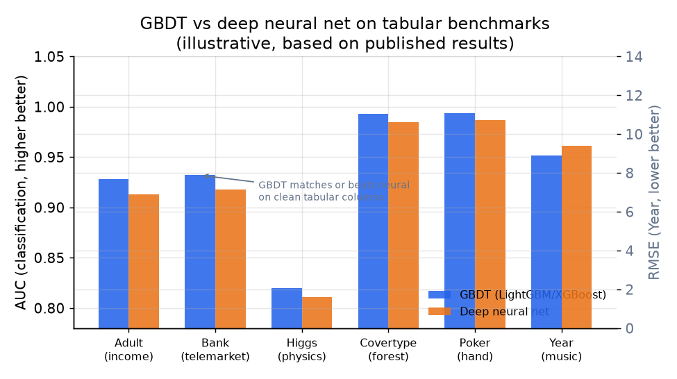
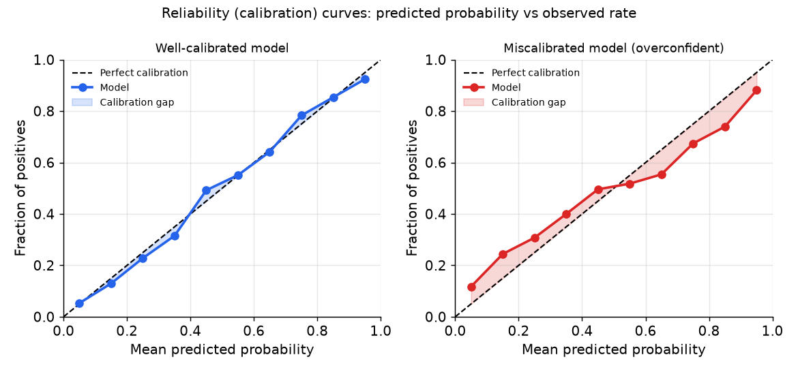
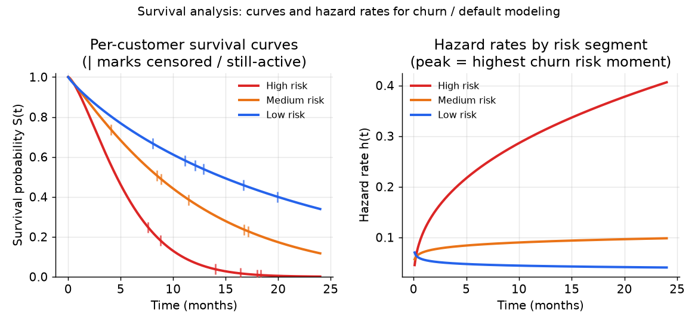

# 4. Model development

## Why gradient-boosted trees still win on tabular data

*GBDT (LightGBM / XGBoost) matches or exceeds deep neural nets on standard tabular
benchmarks across classification (AUC, higher is better) and regression (RMSE,
lower is better) tasks. The gap is small on easy datasets but persistent on
heterogeneous columns with missing values and non-smooth interactions. Illustrative
values based on published benchmark results.*

On heterogeneous tabular data, gradient-boosted decision trees (XGBoost, LightGBM,
CatBoost) are the default choice and usually the winner. The reasons are structural:

- **Invariance to monotone transforms.** A tree does not care whether income is
  raw dollars or log-dollars; the split threshold moves, the tree is the same.
  Neural nets are sensitive to feature scale.
- **Native missing-value handling.** Trees learn a default direction for each split;
  you do not need to impute. Neural nets require explicit imputation strategies.
- **Non-smooth thresholds and interactions without feature engineering.** A tree
  naturally represents "income below 30k AND utilization above 80% implies high
  risk." A neural net needs to learn this interaction from data with enough capacity.
- **Fast training and interpretability.** A LightGBM model on millions of rows
  trains in minutes. SHAP attributions are exact for trees, fast to compute, and
  produce defensible reason codes.

Deep learning's structural advantage is learning representations from raw signal.
On tabular data, the features are already meaningful columns, so that advantage
largely disappears.

### When neural earns its place

Neural nets earn their place in exactly two situations on tabular data.

**Very high-cardinality categoricals.** When user, merchant, or item IDs run into
millions of values, learned embeddings beat one-hot encoding (which blows up
dimensionality) and target encoding (which leaks and loses density). This is why
recommender-style architectures (Wide-and-Deep, DeepFM, DLRM) appear in ads CTR
and recommendation, where the ID tables dominate the parameter count.

**Fusion with unstructured signal.** When tabular columns must be combined with
text (product descriptions), images (listing photos), or event sequences (browsing
paths), a neural architecture handles all modalities jointly. A tree cannot natively
ingest raw text or image tensors.

### When to use which model family

| Reach for | When | Instead of |
|---|---|---|
| Gradient-boosted trees (XGBoost, LightGBM, CatBoost) | heterogeneous columns, missing values, non-smooth thresholds; the default winner | a neural net that adds no lift on already-meaningful columns |
| Monotone-constrained GBDT | regulated decisions needing defensible constraints and adverse-action reasons (credit, insurance) | unconstrained trees that fit slightly better but cannot explain a decline |
| Neural net with learned embeddings (Wide-and-Deep, DeepFM, DLRM) | millions of user, item, or merchant IDs where learned embeddings beat one-hot or target encoding | trees on huge ID spaces where one-hot explodes memory |
| Survival models (Cox proportional hazards, survival forest) | time-to-event targets (churn timing, time-to-default) with censored still-active rows | a fixed-window binary that discards censored rows and loses timing |
| Uplift / CATE models (two-model, S-learner, T-learner, causal forest) | interventions (pricing, discount, retention offer) where the question is WHETHER behavior changes, not who will act | a churn or propensity score that targets sure things and lost causes too |
| Logistic regression | an interpretable final layer or a low-complexity baseline; also the second layer in PayPal's two-stage design | the first model you try on a rich feature set, where a tree will beat it |

**Provenance.** The three boosting libraries are XGBoost (Chen and Guestrin, 2016), LightGBM (Microsoft, 2017), and CatBoost (Yandex, 2017); they differ less in the boosting math than in their categorical and split handling (CatBoost's ordered target encoding, LightGBM's histogram/leaf-wise growth). The named neural families are Wide-and-Deep (Google, 2016), DeepFM (Huawei, 2017), and DLRM (Meta, 2019). The calibration layer that turns any of these scores into probabilities is Platt scaling (Platt, 1999) or isotonic regression.

**Tools.** Gradient-boosted trees: XGBoost, LightGBM (Microsoft), CatBoost
(Yandex); all three expose monotone-constraint options for regulated decisions.
Neural nets with learned embeddings: PyTorch (Meta) or TensorFlow (Google), with
DLRM (Meta) and DeepCTR implementations for the recommender-style Wide-and-Deep and
DeepFM families. Survival: lifelines for Cox proportional hazards, scikit-survival
for survival forests, and XGBoost's survival objective for gradient-boosted hazards.
Uplift and CATE: CausalML and EconML (causal forest, S-learner, T-learner). Logistic
regression and Platt-style baselines: scikit-learn.

**Worked example.** A lending marketplace scores applicants where columns are
heterogeneous (income, utilization, tenure) with missing values, so the default
first model is a gradient-boosted tree (LightGBM) rather than a neural net that adds
no lift on already-meaningful columns. Because declines must carry defensible
adverse-action reasons, the production model switches to a monotone-constrained GBDT
(CatBoost or XGBoost with per-feature constraints) so risk moves in the legally
required direction. Learned embeddings only earn their place if the feature set grows
to millions of merchant or device IDs where one-hot would explode memory. For the
separate question of when to time a retention offer, the team reaches for an uplift
model (CausalML) to target persuadables rather than a churn score that also chases
sure things, and keeps a logistic regression as the interpretable baseline everything
else must beat.

## Calibration: the probability is the product

The section that separates a senior answer from a mid-level one.

A gradient-boosted model trained with log loss is often not calibrated out of the
box, especially when class weights, sampling for imbalance, or regularization
distort the score distribution. If the model is used for ranking only, this does
not matter. If the score feeds a limit formula, a pricing rule, or an optimizer,
a score of 0.05 must genuinely mean a 5 percent default rate in the population,
or the formula is wrong.

*Left: a well-calibrated model whose predicted probabilities track the observed rate
closely. Right: an overconfident model that assigns predictions too far from 0.5,
so 0.8 predicts only 0.65 true positive rate. The gap is the calibration error.
Every money-setting model must be monitored with reliability curves like this,
sliced by segment and vintage.*

### How to calibrate

**Platt scaling.** Fit a logistic regression on the model's raw output score
against the label on a held-out calibration set. Works well with a small
calibration set; the mapping is a smooth, monotone sigmoid. The formula is
$\hat{p} = \sigma(a \cdot f(x) + b)$ where $a, b$ are fitted on the holdout.

**Isotonic regression.** A non-parametric step function fit on the holdout. More
flexible: it can model non-linear miscalibration. Requires more calibration data
to avoid overfitting the steps.

**Prior correction for sampling.** If you subsampled negatives to address class
imbalance, the model's learned probability is in the sampled distribution, not the
true one. Apply the King-Zeng analytic correction:

$$\hat{p}_{\text{true}} = \frac{\hat{p}_{\text{sampled}}}{\hat{p}_{\text{sampled}} + \frac{1 - \hat{p}_{\text{sampled}}}{\rho}}$$

where $\rho = \dfrac{q\,(1 - q')}{q'\,(1 - q)}$, with $q$ the true population positive rate and $q'$ the positive rate in the sampled training set.

Apply this **before** fitting Platt or isotonic, or you calibrate on the wrong
base rate.

**Monitor calibration continuously**, sliced by segment, product, and vintage.
A model calibrated on average can be badly off for new products or after a macro
shift. Calibration drift is as dangerous as ranking drift and harder to detect
without explicit monitoring.

## The decision layer: prediction is not the decision

**Expected-value thresholds for approve/decline.** Do not threshold the probability
directly. Threshold the expected value:

$$\text{approve} \iff \hat{p}_{\text{good}} \cdot V_{\text{good}} \;\gt\; (1 - \hat{p}_{\text{good}}) \cdot \text{EAD} \cdot \text{LGD}$$

where $\text{EAD}$ is exposure at default and $\text{LGD}$ is loss given default.
The optimal cutoff comes from the cost matrix, not from the F1 score. Different
products (secured vs unsecured, micro-loan vs premium) have different cost matrices
and different optimal cutoffs from the same model.

**Uplift models for interventions.** A pricing, discount, or retention offer
targets a behavior change, not a behavior prediction. The CATE (conditional average
treatment effect) is:

$$\tau(x) = \mathbb{E}\!\left[Y \,\middle|\, X{=}x,\, W{=}1\right] - \mathbb{E}\!\left[Y \,\middle|\, X{=}x,\, W{=}0\right]$$

where $W{=}1$ is treatment (offer sent) and $W{=}0$ is control. Target the
persuadables: people with $\tau(x) \gt 0$. A churn model scores everyone who might
churn; an uplift model scores everyone whose churn probability is actually reduced
by the intervention. These are not the same people.

**Budget-constrained allocation.** When incentives share a fixed budget $B$:

$$\max_{a} \sum_i \tau(x_i)\, a_i \quad \text{s.t.} \quad \sum_i c_i\, a_i \le B$$

Rank by $\tau(x_i) / c_i$ (uplift-per-dollar) and fill the knapsack. The ML
produces the $\tau$ estimates; an optimizer makes the allocation call. Draw them as
two separate boxes.

## Survival analysis and LTV

When the target is time-to-event, a fixed-window binary label discards two things:
*when* the event happens, and the *censored* customers who have not yet experienced
it. Survival models keep both.

*Left: per-customer survival curves for three risk segments. The vertical bars are
censored (still-active) observations that contribute to the fit without a final
label. Right: the corresponding hazard rates, peaking at the highest-risk moment
for each segment, which drives intervention timing. Illustrative Weibull curves.*

The survival function $S(t) = \Pr(T \gt t)$ gives the probability a customer is
still active (not churned, not defaulted) at time $t$. It satisfies:

$$S(t) = \exp\!\left(-\int_0^{t} \lambda(u)\, du\right), \qquad \lambda(t) = -\frac{d}{dt}\log S(t)$$

where $\lambda(t)$ is the hazard rate. Read the survival curve at any horizon for
the current risk estimate; drive retention timing from the hazard peak.

**Cox proportional hazards** models $\lambda(t | x) = \lambda_0(t) \exp(\beta^\top x)$.
Interpretable: $\exp(\beta_j)$ is the hazard ratio for a unit change in feature
$j$. Assumes proportional hazards (covariate effects do not change over time).

**Survival forests / gradient-boosted survival** relax the proportional-hazards
assumption and capture non-linear interactions, at the cost of interpretability.
Block Square's conditional survival forest with 200 trees reached C-index 0.83.

**LTV as expected discounted future margin:**

$$\text{LTV} = \sum_{t=1}^{H} \frac{S(t)\, m(t)}{(1+d)^t}$$

where $m(t)$ is expected margin per active period and $d$ is the discount rate.
Two traps: do not regress raw historical revenue and call it LTV (survivorship bias,
no horizon), and be explicit about baseline versus incremental LTV when the number
justifies a marketing spend (again a causal question, not a predictive one).
