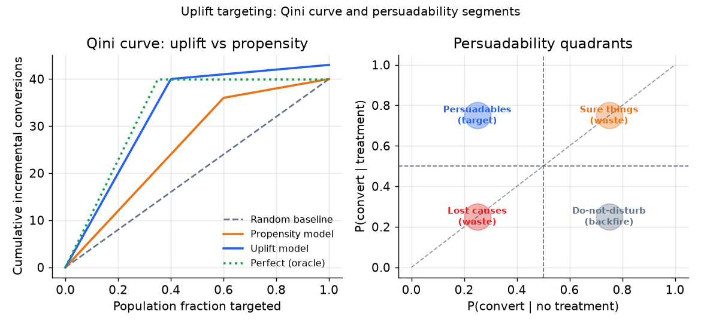

# 5. Evaluation

Evaluating a tabular model is not the same as evaluating a recommender. The
deliverable is a calibrated probability, not a ranked list. That changes which
metrics carry signal.

## The three layers of evaluation

Report all three, in order of business proximity. An impressive AUC with poor
calibration is a model that ranks correctly but prices incorrectly. An impressive
calibration with poor business value means you optimized the wrong objective.

### Layer 1: ranking metrics

**AUC-ROC (Area Under the Receiver Operating Characteristic Curve).** Measures
whether the model separates positives from negatives across all thresholds. AUC of
0.5 is random; 1.0 is perfect. For a credit model, AUC tells you whether higher
scores predict higher default rates, not whether the absolute probability is right.

$$\text{AUC} = \Pr(\hat{p}(x^+) \gt \hat{p}(x^-))$$

where $x^+$ is a random positive example and $x^-$ a random negative.

**AUC-PR (Precision-Recall curve).** Preferable when positives are rare (default
rates of 1 to 5%) and false negatives carry high cost. The area under the PR curve
(Average Precision) is more sensitive to improvements at the operating point than
AUC-ROC on imbalanced datasets.

**C-index (concordance index, for survival models).** The probability that, for a
randomly chosen pair of customers, the one who experienced the event sooner had a
higher predicted hazard. Analogous to AUC-ROC for survival; ranges from 0.5
(random) to 1.0 (perfect). Block Square's survival forest achieved C-index 0.83.

$$\text{C-index} = \Pr\!\left(\hat{S}(t|x_i) \lt \hat{S}(t|x_j) \;\middle|\; T_i \lt T_j,\, T_i \text{ not censored}\right)$$

### Layer 2: calibration metrics

Calibration is the most important layer when the absolute probability sets money.
A model calibrated on average can be badly miscalibrated on the segments the
decision cares about.

**Reliability curves (calibration plots).** Bin predicted probabilities into
deciles; for each bin, plot mean prediction against observed positive rate. A
perfectly calibrated model falls on the diagonal. Deviations show overconfidence
(predictions too extreme) or underconfidence (predictions compressed toward 0.5).

**Expected Calibration Error (ECE).** A scalar summary of the reliability curve:

$$\text{ECE} = \sum_{m=1}^{M} \frac{|B_m|}{n} \left| \text{acc}(B_m) - \text{conf}(B_m) \right|$$

where bins $B_m$ are over predicted probability, $\text{acc}(B_m)$ is the observed
rate in the bin, and $\text{conf}(B_m)$ is the mean prediction.

**Brier Score.** Mean squared error between predicted probability and binary label.
Rewards both discrimination and calibration simultaneously:

$$\text{Brier} = \frac{1}{n}\sum_i (\hat{p}_i - y_i)^2$$

Block Square reports both C-index 0.83 (ranking) and Integrated Brier Score (calibration) for exactly this reason: C-index alone hides calibration failures.

**Sliced calibration.** Always report calibration by segment (product type, vintage,
region, protected group). A global ECE of 0.02 can mask a 0.10 ECE on a new
product or a demographic slice that drives most of the risk exposure.

### Layer 3: business-value metrics

Calibration is necessary but not sufficient. A well-calibrated model with the wrong
objective still fails the business.

**Expected value under the cost matrix.** For approve/decline decisions, compute
the expected profit and expected loss at the operating threshold. This is the number
the business decision maker cares about.

**Uplift metrics.** For intervention models, use the **area under the uplift curve** (AUUC) or the **Qini coefficient**. These are related but distinct: the AUUC is the raw area under the uplift curve (cumulative incremental conversions vs population fraction targeted), while the Qini coefficient is the area between the Qini curve and the random-targeting diagonal baseline. Both measure how much better than random the model concentrates incremental conversions in the top fraction. A churn model evaluated on either will look worse than an uplift model because it wastes budget on sure things.

*Left: Qini curve comparing a propensity model against an uplift model and a random
baseline. The uplift model concentrates incremental conversions in the top fraction
of the population (steeper early slope), making it more budget-efficient. Right:
the four persuadability segments: persuadables (high uplift), sure things (convert
regardless), lost causes (never convert), and do-not-disturbs (backfire under
treatment). Budget should flow only to persuadables.*

## When to use which metric

| Reach for | When | Instead of |
|---|---|---|
| AUC-ROC | comparing models when the threshold is not yet set; overall discrimination quality | raw accuracy, which is misleading on imbalanced datasets |
| AUC-PR / Average Precision | rare positive class (default rate below 5%) and false negatives are costly | AUC-ROC, which is insensitive to minority class recall on heavily imbalanced data |
| C-index | survival models; you want to know if predicted hazards rank correctly | AUC-ROC applied to the event indicator, which ignores censoring |
| Reliability curve + ECE | any model whose probability feeds a threshold, limit, or price | AUC alone, which says nothing about calibration |
| Brier Score | combined discrimination and calibration in one number | two separate metrics when a scalar summary is enough |
| AUUC / Qini coefficient | uplift and intervention models where budget efficiency matters (AUUC = raw area; Qini = area above random baseline) | accuracy or AUC on the treatment-response label, which does not measure incremental value |
| Sliced metrics (by segment, vintage, protected group) | always, especially for regulated decisions | global aggregates that mask slice-level failures |

## The evaluation discipline

**Use a time-based split, not a random split.** Hold out future events and evaluate
whether today's model predicts them. A random split allows the model to "memorize"
future information through shared behavioral windows and inflates all metrics.

**Report business value under the actual cost matrix.** AUC is not what a credit
risk officer cares about. They care about approval rates, expected losses, and
expected margin at the operating threshold. Report those.

**The online gate is the real launch gate.** Offline metrics are necessary for
screening. The final launch decision on a money-setting model is always a
champion-challenger (A/B) test against the business outcome: actual defaults,
actual retention rates, actual incremental revenue. Offline evaluation optimizes
a proxy; the online test evaluates the real thing.
