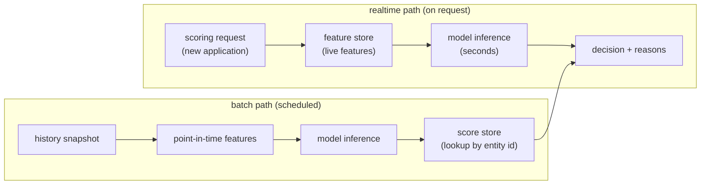

# 6. Serving and scaling

## Batch vs realtime scoring

The first serving question for a tabular model is almost never latency at high QPS.
It is cadence: how often does the score need to refresh, and when the score changes,
does the decision change before the next batch?

**Batch scoring** runs on a schedule (daily, hourly) and writes scores into a
lookup table or feature store. At decision time, the system reads the precomputed
score. This is the right choice for decisions that do not need sub-second freshness:
credit limit reviews, monthly retention campaigns, weekly advertiser-churn checks
(Pinterest), daily CLV scoring (Expedia). Most tabular ML in production is batch.

**Near-realtime scoring** runs the model on the fly at request time, pulling live
features from a feature store. Appropriate when the decision follows immediately
from fresh user action: a mortgage application just submitted, a cart about to
be abandoned. Requires the feature pipeline to serve features with low latency.

**The latency budget for tabular is usually seconds, not milliseconds.** Credit
applications, sales-pipeline scores, subscription risk: the hard part is label
quality and calibration, not the inference call. Do not over-engineer latency until
you have evidence the bottleneck is there.

**How it works.** The diagram shows two ways the same model reaches a decision. The
batch path runs on a schedule: it takes a history snapshot, builds point-in-time
features, runs inference, and writes scores into a store keyed by entity id, so a
later lookup is instant. The realtime path runs on request: a new application pulls
live features from the feature store, runs inference within a seconds-scale budget,
and returns a decision with reasons. The two paths converge at the decision node,
where a precomputed batch score can be joined in alongside the fresh realtime score.
Splitting this way lets slow-moving entities be scored in bulk offline while genuinely
new requests still get a fresh, on-demand score.

## Monotonic constraints and adverse-action reasons

For regulated decisions, the model must be explainable per decision. Two tools.

**Monotone constraints.** In XGBoost and LightGBM, constraints of the form
"more income never increases default probability" or "higher utilization never
decreases default probability" can be enforced at training time. The tree still
learns a non-linear function, but the function is constrained to respect intuitive
directionality. This is defensible to a regulator, interpretable to an auditor,
and testable in CI.

**SHAP reason codes.** For a tree model, SHAP values decompose each prediction
into signed contributions from each feature. The top adverse-action reasons for
a decline are the features with the largest positive SHAP contributions (factors
that increased the probability of default). Nubank and Pinterest both use
tree-based SHAP for this. The SHAP identity for tree models is exact and fast,
unlike the model-agnostic SHAP estimator.

## Bottlenecks and scaling table

| Bottleneck | First sign | Fix | Tradeoff |
|---|---|---|---|
| Label maturation lag | recent data has no target; training is stale | matured vintages, faster-maturing proxy, or survival censoring | staleness vs bias |
| Selection bias | model only valid on approvals; poor performance on new applicants | reject inference, randomized approval slice | real losses from exploration |
| Target leakage | suspiciously high offline AUC (0.95+) that drops in production | point-in-time feature joins, feature leakage audit | slower feature pipeline |
| High-cardinality categoricals | trees choke on millions of IDs; memory blows up | learned embeddings, target encoding with cross-fitting | complexity, leakage risk |
| Explainability demand | regulator or auditor asks for adverse-action reasons per decision | monotone GBDT, SHAP reason codes | small accuracy cost for the constraint |
| Population / concept drift | feature distributions shift, calibration drifts, approval rate moves | scheduled retraining, recalibration on fresh holdout, drift monitoring on PSI | compute cost, governance overhead |
| Calibration drift | threshold or optimizer producing wrong decisions after market shift | re-fit calibrator on fresh holdout without full retrain; monitor reliability curves sliced by segment | frequent calibration updates require a governance cadence |
| Scoring latency at application time | feature store round-trip dominates the budget | pre-compute stable features, cache with TTL, push only dynamic signals to the realtime path | freshness tradeoff on cached features |

**Details worth naming.** The high-cardinality row has three fixes with different failure modes. Learned embeddings need a neural model and enough supervision per ID to be worth it; target encoding is compact but leaks the label unless it is cross-fitted (fold-out-of-fold encoding), which is the leakage risk flagged in the row; and feature hashing (Weinberger et al., 2009) bounds memory by hashing IDs into a fixed bucket count with no dictionary, at the cost of collision noise. Note that CatBoost (Yandex, 2017) folds an ordered (leakage-safe) target encoding into the library itself, so for a GBDT-native path it removes the need to hand-build the cross-fitted encoding. The calibration-drift row is distinct from the retraining row on purpose: a re-fit of the Platt (Platt, 1999) or isotonic calibrator on a fresh holdout is cheap and touches only the final monotone map, so it can run far more often than a full model retrain, which is why they are separate governance cadences.

## Monitoring ladder

Because the label matures slowly, you cannot wait for defaults to tell you the
model broke. Build a monitoring ladder.

1. **Feature drift** (immediate): population stability index (PSI) or Jensen-Shannon
   divergence on each feature. A PSI above 0.2 signals a material shift.
2. **Score drift** (immediate): mean predicted risk, approval rate, score distribution
   percentiles. A moving approval rate at a fixed threshold often reflects population
   shift before any label has matured.
3. **Proxy label drift** (weeks): if a fast-maturing proxy (early delinquency) is
   available, track its rate against the model's predictions.
4. **Calibration and label maturation** (months): once labels resolve, re-evaluate
   reliability curves sliced by vintage, segment, and protected group.

Population shift is expected in credit (macro cycles, new products, marketing
changes in applicant mix). The right response is to investigate and recalibrate,
not to automatically roll back.
