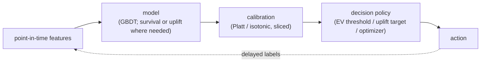

# 7. How teams do it in production

Every production tabular system builds point-in-time features, scores an entity,
and hands the number to a decision layer that turns it into money: a credit limit,
a retention action, a price, an LTV budget, or a voucher. What differs is the
model family (the question the score must answer), whether calibration is load-
bearing, and whether allocation requires a separate optimizer. The architecture
everyone shares; the leverage is in the label design and the decision layer.

## Where the real designs diverge

| System | Model type | Decision it feeds | Delayed / biased labels | Regulation / explainability | When it wins | Watch out |
|---|---|---|---|---|---|---|
| Nubank | Survival curves + ranking | Credit limit increase | Default matures 60-180 days; selection bias on approvals | Regulated credit; adverse-action and calibration requirements | Risk that must be read at any horizon; 122M-customer scale with per-country recalibration | Immature accounts counted as good biases risk downward; one global model ignores per-country base rates |
| Block (Square) | Conditional survival forest (200 trees) | Churn timing and retention | Time-to-event; censored active accounts | Low | SaaS churn where when it happens determines when to intervene | C-index rewards ranking, not calibration; needs matured event history for stable forests |
| Airbnb (listing LTV) | LightGBM incremental LTV | Marketing and LTV budget | 365-day horizon; baseline vs incremental split | Low | Separating incremental from baseline LTV so marketing spend is causally justified | Incremental LTV is a causal question; horizon truncation and survivorship bias on raw revenue |
| Airbnb (home value) | XGBoost, 150+ features | Listing value estimate | Modest | Low | Many already-meaningful engineered columns; Zipline feature repo prevents skew | Leakage risk across 150+ features; estimate drifts as the market shifts |
| Expedia | CatBoost CLV (30 segment models) | Acquisition and retention budget | Long horizon; monthly retrain, daily scoring | Low | Cross-brand categoricals unified; regional and RFM segmentation captures base rates | Long-horizon labels go stale; CLV budget reads absolute value so calibration plots matter as much as Gini |
| Wayfair (WayLift) | Propensity + channel-specific uplift | Programmatic marketing targeting | Observational for propensity; RCT for uplift | Low | Uplift targets persuadables, not sure things; delayed-reward forecaster feeds RL | Uplift requires RCT variation to identify causal effect; propensity alone over-messages |
| Uber | Causal DL S-learner + tensor B-spline + convex optimizer | Driver-incentive / rider-promotion budget allocation | Business-metric labels (supply, demand) | Low | ML estimates response curves; convex optimizer (ADMM) enforces budget constraint | Causal estimates need experimental variation; S-learner can bias treatment effect without it |
| Gojek | Deep causal uplift + knapsack optimizer | Voucher allocation | Observed past treatment effects | Low | Four-quadrant persuadability scoring; knapsack maximizes uplift-per-dollar under fixed budget | Uplift from observational treatment is fragile; predicting cost alongside uplift is required for efficient knapsack |
| Pinterest | GBDT snapshot (200+ features) | Advertiser churn prevention | 14-day forward label; A/B-tested | Low | Precision-recall tiering aligns finite account-manager capacity; SHAP identifies why each account is flagged | Snapshot discards sequence; a sharp spend drop and a slow drift look identical without trend features |
| PayPal | Two-layer ensemble: GBM then logistic regression | Sales-opportunity prioritization | Closed/lost labels; daily-updating | Low | Static GBM runs once at creation; logistic second layer updates daily with interpretable coefficients | Daily-updating dynamic features can whipsaw without smoothing; avoid re-running static GBM daily |
| Gousto | Gradient-boosted tree (300+ behavioral features) | Subscription churn prevention | 4-week label; threshold is a business lever | Low | Purely behavioral features; PR threshold is tunable by Finance and Marketing | Pause feature leaks if not strictly point-in-time; binary label hides timing (use survival if timing matters) |
| Asos | Price-elasticity model + Ithax supply optimizer + Promotheus profit optimizer | Markdown and discount pricing | Demand-forecast horizon; cold-start solved by Ithax | Low | Two-system design solves cold-start before elasticity model has data; multi-objective balances revenue and margin | Elasticity forecast errors compound into prices; the optimizer inherits every forecast miss |
| Zalando | Forecast-then-optimize markdown steering | Price steering across 1M+ products | Forecast horizon | Low | Separating demand forecasting from price optimization makes each debuggable and swappable | Forecasting error at scale amplifies into optimizer decisions; monitoring must cover both layers |

The core dividing line is what the score must answer: rank risk (GBDT), model
*when* an event lands (survival), or decide *whether to intervene* (uplift /
causal), with calibration required whenever the absolute probability, not the
ordering, sets the money.

## The shared pipeline

## The systems

- **Nubank** [How Nubank models risk for scalable credit limit increases](https://building.nubank.com/how-nubank-models-risk-for-smarter-scalable-credit-limit-increases/): survival curves plus two-phase ranking-then-calibration for default risk across 122M customers. *(product design)*
- **Block (Square)** [PySurvival Tutorial: Churn Modeling](https://developer.squareup.com/blog/pysurvival-tutorial-churn-modeling/): conditional survival forest predicting subscription churn timing, C-index 0.83. *(eval bar)*
- **Airbnb** [How Airbnb measures Listing Lifetime Value](https://medium.com/airbnb-engineering/how-airbnb-measures-listing-lifetime-value-a603bf05142c): ML framework for baseline, incremental, and marketing-induced listing LTV over 365 days. *(product design)*
- **Airbnb** [Using Machine Learning to Predict Value of Homes on Airbnb](https://medium.com/airbnb-engineering/using-machine-learning-to-predict-value-of-homes-on-airbnb-9272d3d4739d): XGBoost on 150+ tabular features for listing value, with a full productionization pipeline. *(deployment)*
- **Expedia Group** [Expedia Group's Customer Lifetime Value Prediction Model](https://medium.com/expedia-group-tech/expedia-groups-customer-lifetime-value-prediction-model-7927cdd44342): cross-brand CatBoost CLV model with 30 segment models, deployment, and monitoring. *(deployment)*
- **Wayfair** [Building Scalable Marketing ML Systems at Wayfair](https://www.aboutwayfair.com/careers/tech-blog/building-scalable-and-performant-marketing-ml-systems-at-wayfair): propensity and uplift models scoring customers for programmatic marketing decisions. *(product design)*
- **Uber** [Practical Marketplace Optimization Using Causally-Informed ML](https://arxiv.org/abs/2407.19078): causal ML plus convex optimization to allocate driver-incentive and rider-promotion budgets. *(product design)*
- **Gojek** [How Gojek Allocates Personalised Vouchers At Scale](https://medium.com/gojekengineering/how-gojek-allocates-personalised-vouchers-at-scale-41cad5d6f218): causal uplift persuadables model plus a knapsack optimizer for voucher allocation. *(product design)*
- **Pinterest** [An ML based approach to proactive advertiser churn prevention](https://medium.com/pinterest-engineering/an-ml-based-approach-to-proactive-advertiser-churn-prevention-3a7c0c335016): GBDT snapshot model flagging advertisers at risk of stopping spend within 14 days. *(who it serves)*
- **PayPal** [Sales Pipeline Management with Machine Learning](https://medium.com/paypal-tech/sales-pipeline-management-with-machine-learning-15398bab913b): two-layer ensemble scores sales opportunities by propensity to close so reps prioritize the pipeline. *(product design)*
- **Gousto** [Using Data Science to Retain Customers](https://medium.com/gousto-engineering-techbrunch/using-data-science-to-retain-customers-63f19a03a0b6): subscription churn model that predicts who is likely to cancel and why, driving targeted retention. *(who it serves)*
- **Asos** [Optimizing Markdown in Fashion E-Commerce with Machine Learning](https://medium.com/asos-techblog/optimizing-markdown-in-fashion-e-commerce-with-machine-learning-9f173be08ace): Ithax and Promotheus: two deployed pricing systems that forecast demand and set promotional markdowns. *(product design)*
- **Zalando** [How Zalando optimized large-scale inference and streamlined ML operations](https://aws.amazon.com/blogs/machine-learning/how-zalando-optimized-large-scale-inference-and-streamlined-ml-operations-on-amazon-sagemaker/): forecast-then-optimize markdown and discount-steering pricing system across 1M+ products. *(deployment)*
