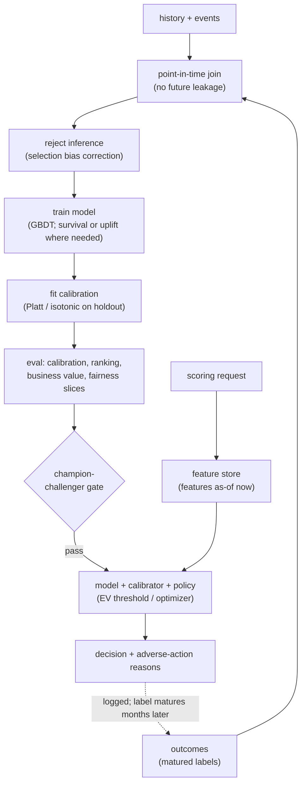

# 9. Summary

## One-page recap

- **The probability is the product.** When the score feeds a limit formula, a
  price, or an optimizer, it is the deliverable, not an intermediate step.
  Calibration is a first-class requirement; AUC is a secondary screen.

- **Point-in-time correctness is the load-bearing engineering constraint.** Every
  feature must be computed as of the decision timestamp with no future leakage.
  A suspiciously high offline AUC almost always means a feature knows the answer.
  Fix this before any model choice.

- **The label is delayed and biased.** A 12-month default label leaves the last
  year of applications unmatured; you only observe repayment for the applicants you
  approved. Address maturation with matured vintages, a proxy label, or survival
  censoring. Address selection bias with reject inference and a randomized approval
  slice.

- **Let the decision pick the model family.** Classification for a fixed-window
  binary outcome. Survival when *when* the event happens matters and rows are
  censored. Uplift when the question is *whether* an intervention changes behavior.
  Framing an intervention question as classification is the most expensive early
  mistake.

- **Gradient-boosted trees are the default winner on tabular data.** Invariance to
  monotone transforms, native missing-value handling, non-smooth threshold capture,
  and fast SHAP reason codes. Neural nets earn their place only for very high-
  cardinality IDs or fusion with text/image. Reaching for a neural net first on
  clean tabular columns is the tell of a junior answer.

- **The decision layer is a separate box.** The model produces a calibrated
  probability; the decision policy (EV threshold, uplift knapsack, convex optimizer)
  converts it into an action. Keep them separate so the policy can be updated when
  the cost matrix changes without retraining the model.

- **The online gate is the real launch gate.** Champion-challenger test on actual
  defaults, actual retention, or actual incremental revenue. Offline metrics are
  screening, not launch criteria.

## The full system on one page

## Test yourself

1. A feature's offline AUC contribution is very high, but the feature is the
   customer's "collections flag" set by the operations team. Why is this almost
   certainly leakage, and how would you catch it?
2. You only observe repayment for approved customers. Why does this make the model
   invalid for scoring new applicants, and what are the two ways to fix it?
3. A churn team wants to send a discount to the top 10% most likely to churn.
   Why might this waste most of the budget, and what model should they build
   instead?
4. The calibration ECE across the whole portfolio is 0.02, but a new product
   segment shows ECE 0.11. What does this mean for the pricing decision on that
   segment, and what do you do?
5. Nubank uses a survival curve rather than a single 12-month default probability.
   Name two concrete advantages for a credit issuer that makes incremental limit
   decisions over a customer's lifetime.
6. The model and the decision threshold live in the same inference artifact. The
   business changes the loss-given-default assumption. What breaks, and how does
   separating the model from the decision policy fix it?

## Further reading

- Dense reference with all case studies and comparison diagrams:
  [../../topics/15-predictive-modeling-tabular.md](../../topics/15-predictive-modeling-tabular.md)
- Monitoring and drift: [../../topics/11-ml-monitoring-and-drift.md](../../topics/11-ml-monitoring-and-drift.md)
- Feature store and training-serving skew: [../../topics/04-feature-store-and-training-serving-skew.md](../../topics/04-feature-store-and-training-serving-skew.md)
- Ads CTR prediction (same calibration discipline, different model family): [../../topics/10-ads-ctr-prediction.md](../../topics/10-ads-ctr-prediction.md)
