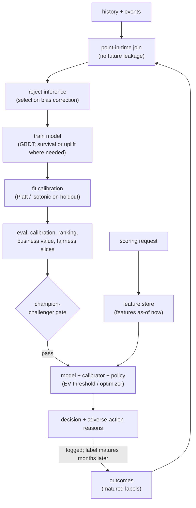

# 9. Summary

## One-page recap

- **The probability is the product.** When the score feeds a limit formula, a
  price, or an optimizer, it is the deliverable, not an intermediate step.
  Calibration is a first-class requirement; AUC is a secondary screen.

- **Point-in-time correctness is the load-bearing engineering constraint.** Every
  feature must be computed as of the decision timestamp with no future leakage.
  A suspiciously high offline AUC almost always means a feature knows the answer.
  Fix this before any model choice.

- **The label is delayed and biased.** A 12-month default label leaves the last
  year of applications unmatured; you only observe repayment for the applicants you
  approved. Address maturation with matured vintages, a proxy label, or survival
  censoring. Address selection bias with reject inference and a randomized approval
  slice.

- **Let the decision pick the model family.** Classification for a fixed-window
  binary outcome. Survival when *when* the event happens matters and rows are
  censored. Uplift when the question is *whether* an intervention changes behavior.
  Framing an intervention question as classification is the most expensive early
  mistake.

- **Gradient-boosted trees are the default winner on tabular data.** Invariance to
  monotone transforms, native missing-value handling, non-smooth threshold capture,
  and fast SHAP reason codes. Neural nets earn their place only for very high-
  cardinality IDs or fusion with text/image. Reaching for a neural net first on
  clean tabular columns is the tell of a junior answer.

- **The decision layer is a separate box.** The model produces a calibrated
  probability; the decision policy (EV threshold, uplift knapsack, convex optimizer)
  converts it into an action. Keep them separate so the policy can be updated when
  the cost matrix changes without retraining the model.

- **The online gate is the real launch gate.** Champion-challenger test on actual
  defaults, actual retention, or actual incremental revenue. Offline metrics are
  screening, not launch criteria.

## The full system on one page

```mermaid
flowchart TD
  H["history + events"] --> PIT["point-in-time join<br/>(no future leakage)"]
  LABEL["outcomes<br/>(matured labels)"] --> PIT
  PIT --> RI["reject inference<br/>(selection bias correction)"]
  RI --> TRAIN["train model<br/>(GBDT; survival or uplift where needed)"]
  TRAIN --> CAL["fit calibration<br/>(Platt / isotonic on holdout)"]
  CAL --> EVAL["eval: calibration, ranking,<br/>business value, fairness slices"]
  EVAL --> GATE{"champion-<br/>challenger gate"}
  GATE -->|"pass"| SERVE["model + calibrator + policy<br/>(EV threshold / optimizer)"]
  REQ["scoring request"] --> FS["feature store<br/>(features as-of now)"]
  FS --> SERVE
  SERVE --> ACT["decision + adverse-action reasons"]
  ACT -.->|"logged; label matures months later"| LABEL
```

**How it works.** Training data is assembled by a point-in-time join of history and
events against matured outcome labels, so no future information leaks in. That data
goes through reject inference to correct selection bias, trains a model (typically a
GBDT, with survival or uplift variants where needed), and then a calibrator is fit
on a holdout. Evaluation covers calibration, ranking, business value, and fairness
slices, and a champion-challenger gate decides whether the model, its calibrator,
and the decision policy are promoted to serving. At request time the feature store
supplies as-of-now features to the promoted bundle, which emits a decision plus
adverse-action reasons. The dotted return edge is the slow loop: each logged
decision becomes a label only months later when the outcome matures, which is why
the point-in-time join at the top is non-negotiable.

## Test yourself

Answers are collapsed. Attempt each question before opening one.

1. A feature's offline AUC contribution is very high, but the feature is the
   customer's "collections flag" set by the operations team. Why is this almost
   certainly leakage, and how would you catch it?

   

Answer

   The flag is set **after** the customer has already gone bad, so it encodes the
   outcome the model is supposed to predict at application time. Section
   [3](03-data-preparation.md) names this exact offender, a "collections calls"
   count that only appears because the customer already defaulted, alongside an
   account-status column flipped to "delinquent" post-event and a rolling aggregate
   whose window extends into the label period. The tell is the shape of the metric:
   a suspiciously high offline AUC, around 0.95 on a credit dataset with modest
   features, and section [6](06-serving-and-scaling.md)'s bottleneck table lists
   "0.95+ that drops in production" as the first sign. To catch it, apply
   **point-in-time correctness** as an audit question to every feature: was this
   value observable at the decision timestamp, produced by a time-travel join, or
   does it depend on data written after the decision? Rank features by SHAP
   contribution, interrogate the top few, re-evaluate on a time-based split, and
   retrain without the suspect column. Section [8](08-interview-qa.md) supplies the
   reframing for the conversation that follows: if AUC falls from 0.93 to 0.88 once
   the feature is removed, the model did not get worse, the 0.93 was measuring
   leakage.

   

2. You only observe repayment for approved customers. Why does this make the model
   invalid for scoring new applicants, and what are the two ways to fix it?

   

Answer

   Because the model learns P(default | approved) rather than P(default), and
   tomorrow you must score applicants who look like the people you declined. The
   approved population is a self-selected slice of feature space, so the model is
   calibrated only on that region and extrapolates poorly right at the historical
   cutoff, which is exactly where the marginal decisions get made. The two fixes the
   chapter commits to are **reject inference**, imputing outcomes for historical
   rejects from external bureau performance data or behavioral priors and training
   on the augmented set, and a **randomized approval slice**, approving a small
   fraction below the cutoff at random for the explicit purpose of observing their
   outcomes. They are not equivalent. Reject inference reduces the bias but cannot
   eliminate it, because the imputed outcomes are assumptions that cannot be tested
   with the same biased data that created the problem, while randomization is the
   only mechanism that produces labels whose distribution does not depend on the old
   approval policy. The cost is real and it is a business decision, not a modeling
   one: section [10](10-putting-it-together.md) sizes a 1% slice at roughly 6,000
   deliberately risky accounts and about \$650k a year of losses (illustrative),
   which dwarfs every infrastructure line in that build. Sections
   [3](03-data-preparation.md) and [8](08-interview-qa.md) work the full comparison.

   

3. A churn team wants to send a discount to the top 10% most likely to churn.
   Why might this waste most of the budget, and what model should they build
   instead?

   

Answer

   Because "most likely to churn" and "most changed by a discount" are different
   people, and only the second one is worth paying for. A propensity ranking's top
   decile is full of **lost causes** who leave whatever you offer, and it can even
   include **do-not-disturbs** whose behavior gets worse under treatment, while the
   **persuadables** whose minds the offer actually changes may sit well outside the
   top 10%. Section [8](08-interview-qa.md) calls this the most expensive modeling
   mistake in practice, and Wayfair's WayLift is the production evidence: propensity
   models scale easily but over-message. Build an **uplift / CATE model** instead,
   estimating $\tau(x) = \mathbb{E}[Y \mid X{=}x, W{=}1] - \mathbb{E}[Y \mid X{=}x, W{=}0]$
   and targeting only customers with $\tau(x) \gt 0$. Under a fixed budget, rank by
   uplift-per-dollar $\tau(x_i) / c_i$ and fill the knapsack, keeping the estimator
   and the optimizer as two separate boxes the way Uber and Gojek draw them. Two
   caveats from the chapter: uplift needs randomized treatment variation to identify
   the effect at all, since you never observe both outcomes for one person
   (sections [4](04-model-development.md) and [8](08-interview-qa.md)), and it must
   be scored with AUUC or the Qini coefficient rather than raw response, because a
   churn model looks fine on response and terrible on incremental value
   ([5](05-evaluation.md)).

   

4. The calibration ECE across the whole portfolio is 0.02, but a new product
   segment shows ECE 0.11. What does this mean for the pricing decision on that
   segment, and what do you do?

   

Answer

   It means the price on that segment is wrong and the portfolio number does not
   certify it. ECE 0.11 says the bin-weighted gap between predicted probability and
   observed rate is about 11 points in that segment, and because the score
   multiplies directly into a limit formula and a risk-based price, that error
   passes straight through as mis-priced risk across the new product's entire book.
   The global 0.02 is a mixture average: over-prediction on one segment cancels
   under-prediction on another, so a clean aggregate reliability curve is fully
   compatible with a broken slice, and every decision is made on an individual from
   some segment ([8](08-interview-qa.md)). The fix is at the **calibration layer,
   not a retrain**: a base-rate shift moves probabilities while leaving the ranking
   nearly intact, and that failure lives entirely in the monotone score-to-
   probability map, so re-fit Platt or isotonic for that segment on a fresh holdout
   (Platt while the segment is thin, isotonic once it has enough events per bin) and
   only retrain the base model if ranking AUC or the feature distributions have
   moved too ([4](04-model-development.md), [6](06-serving-and-scaling.md)). Until
   the segment's labels mature, price it conservatively, and add it to the sliced
   monitoring by product and vintage so the next divergence fires on its own rather
   than being found by accident ([5](05-evaluation.md)).

   

5. Nubank uses a survival curve rather than a single 12-month default probability.
   Name two concrete advantages for a credit issuer that makes incremental limit
   decisions over a customer's lifetime.

   

Answer

   **One, every horizon is readable from one score.** The survival function
   $S(t) = \Pr(T \gt t)$ gives the probability the customer is still solvent at any
   time $t$, so a limit decision taken at month 3, 6, or 12 reads the risk over the
   horizon that decision actually spans, and the hazard rate
   $\lambda(t) = -\frac{d}{dt}\log S(t)$ says when risk peaks, which drives
   collections and intervention timing. A fixed-window binary answers exactly one
   horizon and is silent everywhere else. **Two, censored accounts still
   contribute.** Applicants whose 12-month window has not resolved are treated as
   censored rather than discarded, so the most recent and most distribution-shifted
   cohort trains the model instead of being thrown away; at Nubank's 122M-customer
   scale, losing a year of recent data is a significant loss, and the tempting
   alternative of counting immature accounts as "good" biases risk downward on
   exactly the newest applicants ([3](03-data-preparation.md),
   [8](08-interview-qa.md)). The curve also feeds LTV directly through
   $\text{LTV} = \sum_{t=1}^{H} S(t)\, m(t) / (1+d)^t$. The cost is that C-index
   rewards ranking, not calibration, so Block Square pairs C-index 0.83 with an
   integrated Brier score, and Nubank keeps a separate calibration layer over the
   ranking model ([5](05-evaluation.md), [7](07-how-teams-do-it-in-production.md)).

   

6. The model and the decision threshold live in the same inference artifact. The
   business changes the loss-given-default assumption. What breaks, and how does
   separating the model from the decision policy fix it?

   

Answer

   What breaks is that a pure business-parameter change now forces a model retrain
   and a full model revalidation. The cutoff is not a property of the model, it
   falls out of the cost matrix: section [4](04-model-development.md) thresholds
   expected value, approve iff
   $\hat{p}_{\text{good}} \cdot V_{\text{good}} \gt (1 - \hat{p}_{\text{good}}) \cdot \text{EAD} \cdot \text{LGD}$,
   so moving LGD should be a recomputed number and a redeployed policy, minutes of
   work. Bundled into one artifact it becomes a rebuild, a re-test, and a fresh
   governance cycle on a model whose weights nobody wanted to change; different
   products (secured versus unsecured, micro-loan versus premium) can no longer run
   their own optimal cutoffs off the same score; and an auditor cannot inspect the
   policy without reading model internals. Separating them gives two artifacts with
   one contract: the model plus its calibrator emits a calibrated probability, and a
   decision-policy artifact holds the EV rule, the limit formula, or the optimizer
   that turns that probability into money. The LGD change is then a config change to
   the policy alone, which is why section [8](08-interview-qa.md) calls the merged
   artifact an anti-pattern and Uber, Gojek, and Asos all draw the two boxes
   explicitly. It is also why the calibrated probability, not the decision, is the
   model's real output contract ([10](10-putting-it-together.md)).

   

## Further reading

- The capstone: [the complete build](10-putting-it-together.md), where every
  choice in this chapter is committed once for the scenario, sized, rebuilt
  under two other constraint sets, and compressed into a runnable one-file gradient booster.
- Dense reference with all case studies and comparison diagrams:
  [../../topics/15-predictive-modeling-tabular.md](../../topics/15-predictive-modeling-tabular.md)
- Monitoring and drift: [../../topics/11-ml-monitoring-and-drift.md](../../topics/11-ml-monitoring-and-drift.md)
- Feature store and training-serving skew: [../../topics/04-feature-store-and-training-serving-skew.md](../../topics/04-feature-store-and-training-serving-skew.md)
- Ads CTR prediction (same calibration discipline, different model family): [../../topics/10-ads-ctr-prediction.md](../../topics/10-ads-ctr-prediction.md)
