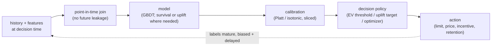

# Predictive Modeling on Tabular Data

An interviewer rarely says "train a gradient-boosted tree." They say **"we issue credit
cards and need a number that sets who we approve, what limit we give, and what price we
charge"** or **"we want to reduce churn with a targeted discount campaign"** or **"predict
customer lifetime value so we can size our acquisition budget."** That is predictive
modeling on tabular data: the workhorse of credit, insurance, subscription, and
marketplace decisions. This chapter builds the system end to end, and shows how Nubank,
Airbnb, Expedia, Wayfair, Uber, Gojek, Pinterest, and others actually ship it.

## Sections

1. [Clarifying the requirements](01-clarifying-requirements.md) - the dialogue that scopes the problem.
2. [Framing it as an ML task](02-frame-as-ml-task.md) - classification, regression, uplift, or survival; input and output.
3. [Data preparation](03-data-preparation.md) - leakage, delayed labels, categorical encoding, and the feature pipeline.
4. [Model development](04-model-development.md) - why GBDT still wins, calibration, uplift, survival, and a "when to use which" table.
5. [Evaluation](05-evaluation.md) - AUC, calibration, uplift metrics, C-index, and a "when to use which" table.
6. [Serving and scaling](06-serving-and-scaling.md) - batch vs realtime, monotonic constraints, and bottlenecks.
7. [How teams do it in production](07-how-teams-do-it-in-production.md) - Nubank, Airbnb, Expedia, Wayfair, Uber, Gojek, and why they diverge.
8. [Interview Q&A](08-interview-qa.md) - commonly asked, tricky, and commonly-answered-wrong, with clear answers.
9. [Summary](09-summary.md) - the one-page recap, mermaid, and self-test.

## The shared pipeline on one page

Read the sections in order the first time; they build on each other. The key insight this
chapter teaches: the deliverable is not an AUC number, it is a **calibrated probability
that a decision layer turns into money**, under labels that arrive months late and are
biased by the decisions you already made.
