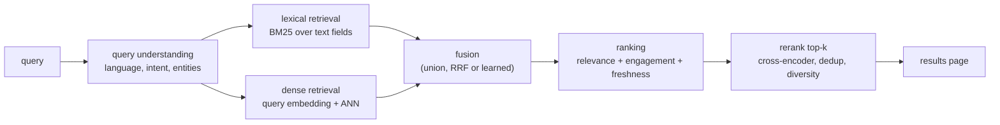

# 2. Framing it as an ML task

## What is being matched to what

The naive framing is "match a query embedding to a video embedding." The useful
framing is: **a query is matched against a document that has several fields in
several modalities, each with different coverage and reliability.**

| Field | Coverage | Reliability | What it is good for |
|---|---|---|---|
| Title | Almost always present | Written to attract clicks, often vague or clickbait | Navigational queries; strong lexical signal |
| Description, tags | Usually present | Noisy, often keyword-stuffed | Recall, with spam risk |
| Channel and uploader | Always | Reliable | Entity queries, authority priors |
| Transcript (ASR) | Language dependent | Good where ASR is good, empty for music and silent video | The strongest tail signal when it exists |
| On-screen text (OCR) | Sparse | Good when present | Tutorials, slides, sports scores |
| Frames | Always available, expensive | Objective but semantically shallow per frame | Visual queries, and languages with no transcript |
| Thumbnail | Always | Chosen for clicks, not for content | A click-bias source; useful as a ranking feature, dangerous as a label |
| Engagement | Grows over time, zero at upload | Confounded by exposure | Ranking, never retrieval |

Two design rules follow. **Engagement features belong in ranking, not retrieval**,
because a new upload has none and would be structurally unreachable. And **the
system must be able to say which field matched**, which a single fused embedding
cannot, and which you need for debugging, for spam defense, and for explaining
results.

## The funnel

Each stage has a job and a budget: retrieval maximizes recall cheaply over 100
million documents, ranking maximizes precision over a thousand, reranking maximizes
the quality of the few results a user actually looks at. Putting a cross-encoder in
retrieval is the classic mistake, and so is putting engagement features in it.

## Compare and contrast: five ways to match a query to a video

| Approach | What it matches | Strength | Where it fails |
|---|---|---|---|
| Lexical (BM25) over text fields | Query terms against title, description, transcript | Exact, fast, explainable, no training, instantly fresh | Vocabulary mismatch: the tail query whose words appear nowhere |
| Dense text retrieval (dual encoder) | Query embedding against text-field embedding | Handles paraphrase and description-style queries | Needs training data; weak on rare entities and exact strings |
| Text-to-visual dual encoder | Query embedding against frame embeddings | Works with no transcript, catches visual concepts | Shallow semantics per frame; expensive to build and refresh |
| Cross-encoder reranker | Query and document jointly | The most accurate relevance signal available | Cannot scale past a few hundred candidates |
| Engagement-based ranker | Query-document behavioral history | Captures what users actually chose | Cold for new videos; feedback loop; confounded by position and thumbnail |

The productive answer is not to choose one. It is **lexical plus dense for
retrieval, fused, then a learned ranker, then a cross-encoder on the top few**,
because they fail in different places: lexical fails on vocabulary mismatch, dense
fails on rare exact strings, and the fusion covers both.

## Where the visual tower actually pays

A common interview trap is designing the whole system around a video-text model when
most queries never need it. It earns its cost in three places:

- **Languages and content with no usable transcript** (music, silent demos, ASR gaps).
- **Visually specific queries** ("red velvet cake with a mirror glaze") where the
  words are about what things look like.
- **Moment retrieval**, where the answer is a timestamp inside a long video, which is
  a different product feature and a different index granularity.

If none of those is in scope, say so and spend the budget on transcripts and
lexical-plus-dense text retrieval instead. That is a stronger answer than reaching
for the multimodal model because it is the more interesting technology.

## Inputs and outputs

**Input to the system:** a query, a user and session context (language, location,
history), and the corpus.

**Input to training:** (query, video, graded relevance) triples, constructed from
behavior plus a human-rated anchor set, with propensity or position corrections
attached.

**Output:** a ranked list, plus per-result provenance (which field and which
retriever produced it) so failures are attributable.

## When to use which framing

| Reach for | When | Instead of |
|---|---|---|
| Lexical only | Head-heavy navigational traffic, no training data yet | A dense retriever that regresses exact-match queries |
| Lexical plus dense text | The tail is descriptive and transcripts exist | Visual retrieval, which is more expensive per unit of recall gained |
| Add a visual tower | Transcript coverage is poor, or queries are visually specific | Widening the text model, which cannot see what it has no words for |
| Cross-encoder rerank | The top 50 need reordering and latency allows a second pass | A bigger dual encoder, which buys less per millisecond |
| Moment-level index | The product promises timestamps, not videos | Whole-video retrieval plus a client-side scrub |
