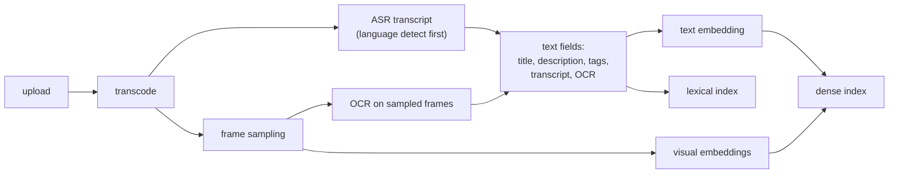

# 3. Data preparation

## Producing the fields

Ingestion is where the cost and the freshness promise live.

**Transcripts.** ASR quality varies by language, audio quality, and domain jargon,
and a transcript is empty for music and silent screen recordings. Two practical
notes: run language identification first, because transcribing with the wrong
language model produces confident nonsense that then gets indexed; and store word
timings, because they cost nothing extra and they are what makes moment-level
retrieval possible later.

**Frame sampling** is the cost knob that decides the whole index budget. One frame
per second on a ten-minute video is 600 embeddings for one video. Options, cheapest
first:

| Strategy | Frames per 10-min video | Good for | Cost |
|---|---|---|---|
| Thumbnail plus a fixed few | 3 to 5 | A first version, whole-video retrieval | Negligible |
| Uniform every N seconds | 20 to 60 at N = 10 to 30 | General coverage | Moderate |
| Scene-change detection | Varies with content | Edited content where scenes carry meaning | Moderate, plus a detector |
| Every second | 600 | Moment retrieval | Prohibitive at 100M videos without aggressive compression |

The right default is uniform sampling at a coarse interval plus scene-change frames
where a cheap detector fires, then **pool to one or a few vectors per video** for
retrieval, keeping per-frame vectors only for the subset of the corpus that needs
moment-level search.

## Constructing the label

Raw behavior is not relevance. Three biases have to be handled explicitly.

- **Position bias.** Results shown higher get clicked more regardless of quality.
  Correct with propensity weighting estimated from result-randomization or
  interleaving experiments, or at minimum evaluate within position strata.
- **Thumbnail bias.** A click is partly a vote for the thumbnail, which is why click
  alone makes a poor relevance target and a fine *ranking feature*.
- **Duration bias.** Raw watch time rewards long videos. Normalize: watched fraction,
  or watch time relative to the video's own median, or a "long watch" indicator with
  a duration-dependent threshold.

A workable graded label combines them:

| Grade | Signal |
|---|---|
| Excellent | Long normalized watch, no reformulation afterwards, and often a follow-on engagement (like, save, subscribe) |
| Good | Long normalized watch |
| Fair | Click with a short watch |
| Bad | Skip, or a reformulation of the same intent immediately after |

Anchor it with a **human-rated set**: a few thousand (query, video) pairs graded by
trained raters against a written guideline, sliced by query type and language. That
set is what tells you whether your behavioral label drifted, and it is the only
thing that can adjudicate when offline and online disagree.

## Negatives

Contrastive training is mostly a negatives problem.

- **In-batch negatives** are free and the default, but they are sampled roughly by
  popularity, so popular videos are over-penalized. The logQ correction applies here
  exactly as in [candidate retrieval](../candidate-retrieval/).
- **Hard negatives** are what actually move quality: same channel, same topic, same
  entity but wrong intent (a "trailer" when the query wants a "review"), and
  high-BM25-but-irrelevant documents mined from the lexical index.
- **False negatives** are the danger unique to a large corpus: with 100 million
  videos, an in-batch "negative" is sometimes a perfectly relevant result. Filter
  candidates that the current system already ranks highly for that query before
  treating them as negatives.

## Corpus hygiene

- **Near-duplicates** (reuploads, mirrors, clip farms) waste result slots and inflate
  offline recall. Dedup by perceptual hash on sampled frames plus transcript overlap.
- **Keyword-stuffed metadata** is an adversarial signal: cap the contribution of the
  description and tag fields, and treat a large mismatch between transcript and
  metadata as a spam feature.
- **Freshness and deletions** must propagate: an unindexed deletion is a compliance
  problem, not a quality problem (see [feature store](../feature-store/) on data
  lifecycle).

## When to use which

| Reach for | When | Instead of |
|---|---|---|
| Transcript as the primary tail signal | Language coverage is good | A visual model, which costs far more per unit of recall |
| Uniform coarse frame sampling | General whole-video retrieval | Per-second sampling, which is an index-cost disaster at scale |
| Per-frame vectors | The product promises timestamps | Whole-video pooling, which cannot answer "where in the video" |
| Constructed graded label | Any ranking model you intend to trust | Raw clicks, which encode thumbnail and position |
| Hard negatives from the lexical index | Dense retrieval underperforms on near-misses | More in-batch negatives, which are mostly easy |
| Human-rated anchor set | Always, from the first version | Behavioral labels alone, which have no ground truth to drift against |
