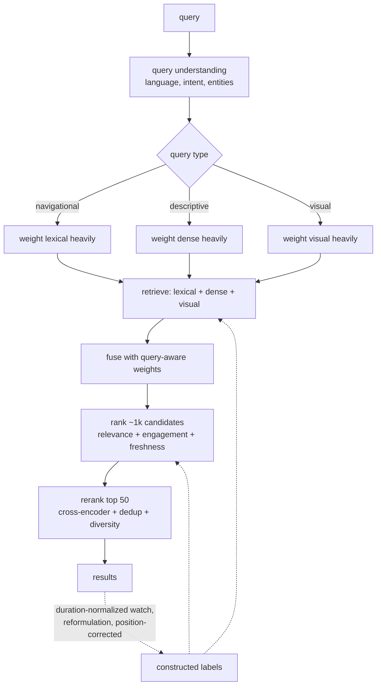

# 9. Summary

## One-page recap

- **A video is a multi-field multimodal document, not an item with an embedding.**
  Title, description, tags, channel, transcript, on-screen text, frames, and
  thumbnail differ in coverage, reliability, and cost. Collapsing them into one
  vector destroys exact matching, attribution, and graceful degradation.

- **Keep the lexical index.** It is exact, instantly fresh, explainable, and it
  answers the navigational head. Semantic retrieval is added beside it and fused,
  which is what every production system that added dense retrieval actually did.

- **Fusion has to be query-aware.** Equal-weight fusion improves the overall number
  and regresses the head, because a retriever with no signal for that query type
  contributes pure noise. The capstone reproduces exactly this.

- **The transcript is usually the strongest tail signal**, so the visual tower earns
  its cost where transcripts are missing (music, silent screen capture, languages
  with poor ASR) or where the query is genuinely about appearance.

- **Frames per video is the index multiplier.** One pooled vector is a search
  product, twenty is a moment-retrieval product, six hundred is a research demo.
  Prefer top-k pooling over mean pooling, because relevance is driven by the best
  matching moment.

- **Engagement belongs in ranking, never in retrieval**, or new uploads are
  structurally unreachable and the feedback loop closes on itself.

- **The label is constructed.** Click votes for the thumbnail, raw watch time votes
  for long videos, position votes for the old ranker. Use duration-normalized watch
  plus reformulation as negative evidence, corrected for position, anchored by a
  human-rated set.

- **Evaluate by stage and by slice.** Recall@k for retrieval against a pooled,
  human-anchored relevant set (never against the current system's clicks), NDCG@k
  over a fixed candidate set for ranking, MRR for navigational queries, and always
  sliced by query type, language, and video age.

- **The write path is the expensive one.** Ingestion (ASR plus embedding) and
  re-embedding on an encoder change dominate cost, not query serving. Propose an
  encoder with a migration plan or do not propose it.

## The system on one page

## Test yourself

1. You add a dense retriever. Tail metrics improve, navigational queries get worse,
   and the aggregate looks fine. What happened and what do you change?

   

Answer

   The dense retriever generalizes, which is the wrong behavior for a query where
   the user typed a title and wants that exact video: semantically similar candidates
   crowd out the exact match, and an equal-weight fusion lets them
   ([2](02-frame-as-ml-task.md), [4](04-model-development.md)). The aggregate hides
   it because the tail improvement is larger in points while the head is larger in
   traffic. Three changes: make the fusion **query-aware** so entity-heavy and
   exact-string queries weight the lexical side far more (the capstone shows this
   recovering the head from 0.78 to 0.99); add exact-match and field-match features
   to the ranker so it can restore the right result even when retrieval blurred it;
   and gate the rollout on the navigational slice rather than the aggregate
   ([5](05-evaluation.md)). The general principle is that a semantic layer should be
   additive by construction.

   

2. Your index is 300 GB and the budget is 50 GB. What do you cut, in what order?

   

Answer

   Vectors per video first, because it is a multiplier: drop from a frame-level index
   to one or a few pooled vectors, keeping per-frame vectors only for the subset of
   the corpus that needs moment retrieval ([6](06-serving-and-scaling.md)). Then
   precision: fp32 to fp16 is nearly free, and product quantization to 64 bytes is
   roughly a 12x cut that costs recall, so measure the recall-versus-memory curve
   instead of picking a setting. Then dimension, via a smaller encoder or a learned
   projection, which is the most quality-costly lever. What you do not cut is the
   lexical index: it is small, exact, instantly fresh, and it carries the head.

   

3. Offline recall@100 for your new retriever is *lower* than production's, but the
   sample results look better. Who is right?

   

Answer

   Probably the eyeballs, and the metric is broken ([5](05-evaluation.md)). If the
   relevant set was built from the current system's clicks, then every genuinely new
   video the new retriever surfaces is labeled "not relevant" simply because the old
   system never showed it, so a better retriever scores worse. This is the most
   common way a good retrieval change gets killed offline. The fix is a **pooled**
   relevant set: take the top candidates from both systems, have raters judge them
   against a written guideline, and evaluate both against the union. Keep that
   human-anchored set as a standing asset, because it is also what adjudicates
   offline-online disagreements later.

   

4. A user searches in a language where your ASR is poor. What carries that query?

   

Answer

   The visual tower and the metadata, which is precisely the case that justifies
   building a visual tower at all ([2](02-frame-as-ml-task.md),
   [3](03-data-preparation.md)). Two consequences worth stating. First, this slice
   will also have the thinnest training data, since query logs follow the same
   language distribution, so it needs its own evaluation slice and probably its own
   human-rated set rather than being folded into the average. Second, the honest
   alternative may be upstream: improving ASR coverage for that language often buys
   more search quality per dollar than any retrieval change, because the transcript
   is the strongest tail signal wherever it exists.

   

5. Your new encoder is 4 points better offline. What does shipping it involve?

   

Answer

   Re-embedding the corpus, which is the part that gets left out of the design
   ([6](06-serving-and-scaling.md)). At 100 million videos that is a GPU-days batch
   job, during which the index holds two incompatible vector spaces, so the plan is:
   build the new index alongside, dual-write new uploads to both, backfill by
   retrieval priority (head of the corpus first), cut over, then delete the old, with
   double storage for the duration. That cost is also the argument for freezing the
   encoder and iterating on the ranker, since most quality work does not need a new
   embedding space. And before committing, check that the 4 points are not an
   artifact of an unsliced benchmark: a gain concentrated in the tail with a head
   regression is a different decision.

   

## Further reading

- The capstone: [the complete build](10-putting-it-together.md), with the costed
  stack, three constraint sets, and a runnable fusion experiment.
- [Spotify: Introducing Natural Language Search for Podcast Episodes](https://engineering.atspotify.com/2022/03/introducing-natural-language-search-for-podcast-episodes)
- [Dense Passage Retrieval for Open-Domain Question Answering](https://arxiv.org/abs/2004.04906)
- [Learning Transferable Visual Models From Natural Language Supervision](https://arxiv.org/abs/2103.00020)
- [Visual Search at Pinterest](https://arxiv.org/abs/1505.07647)
- Companion chapters: [search ranking](../search-ranking/), [embeddings](../embeddings/), [candidate retrieval](../candidate-retrieval/), [computer vision](../computer-vision/), [speech](../speech/).
