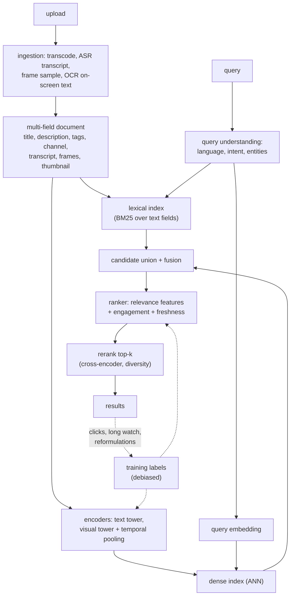

# Video and Multimodal Search

> **Style note.** This chapter follows the same teach-first arc as the rest of the
> book: one dialogue to gather requirements, then a consistent
> frame-data-model-evaluate-serve sequence, real production case studies with
> first-party links, "when to use which" tables, worked KaTeX, and an interview
> Q&A. Sections are split one-per-file so no single file grows long.

An interviewer rarely says "build a dual encoder." They say **"a user types 'how to
fix a leaking faucet in a rental' into our video app. We have 100 million videos and
most of them have a lazy title. Design search."**

That question is not one system. Half the traffic is navigational ("taylor swift
tiny desk") and a lexical index answers it in a millisecond. The other half is
semantic and long-tail, where the words the user typed appear nowhere in the title
and the answer is buried 90 seconds into a video whose transcript nobody indexed.
The design problem is spending your budget on the half that needs it while not
breaking the half that already works.

## Sections

1. [Clarifying the requirements](01-clarifying-requirements.md) - the dialogue that scopes the problem, and the two consequences that fall out.
2. [Framing it as an ML task](02-frame-as-ml-task.md) - a video is a multi-field multimodal document; the retrieval-then-rank funnel; what each representation can and cannot do.
3. [Data preparation](03-data-preparation.md) - fields and modalities, transcripts, frame sampling and its cost, label construction from behavior, negatives.
4. [Model development](04-model-development.md) - dual encoders per modality, temporal aggregation, fusion, hard negatives, cross-encoder reranking and distillation.
5. [Evaluation](05-evaluation.md) - retrieval recall vs ranking NDCG, graded relevance, query-type slices, online watch-based metrics.
6. [Serving and scaling](06-serving-and-scaling.md) - two indexes, the ingestion pipeline, index size math, the re-embedding problem, caching, bottlenecks.
7. [How teams do it in production](07-how-teams-do-it-in-production.md) - where designs diverge, with first-party links.
8. [Interview Q&A](08-interview-qa.md) - commonly asked, tricky, and commonly answered wrong.
9. [Summary](09-summary.md) - one-page recap, mermaid, and self-test.
10. [Putting it together: the complete build](10-putting-it-together.md) - the default stack, the costed build, three constraint sets, and a runnable hybrid-retrieval experiment.

## The whole system on one page

The dashed loop is where the interesting failures live: the labels that train the
system are produced by the system, so exposure, thumbnails, and video length all
leak into what the model learns "relevant" means.

## Companion chapters

- [Search ranking](../search-ranking/) owns query understanding, learning-to-rank, and position bias in general; this chapter specializes them to a multimodal document.
- [Embeddings](../embeddings/) owns contrastive training, negative sampling, and index choice.
- [Candidate retrieval](../candidate-retrieval/) owns the two-tower pattern and ANN serving at scale.
- [Computer vision](../computer-vision/) owns backbones, and the visual-search (image-to-image) case.
- [Speech](../speech/) owns the ASR system that produces the transcripts this chapter treats as a field.
