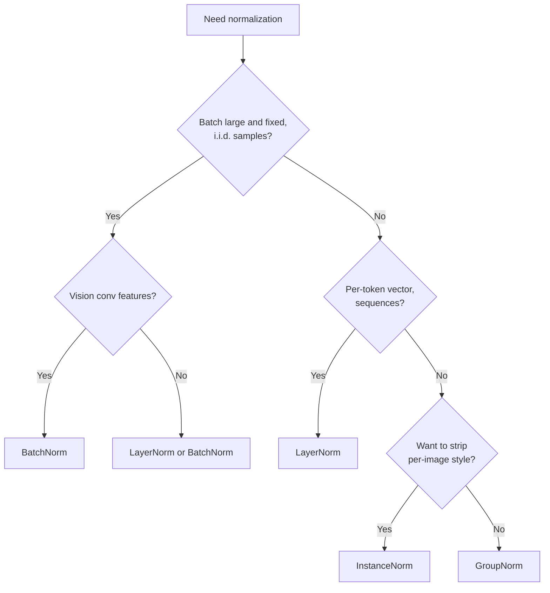
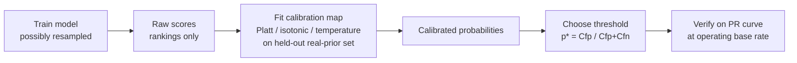
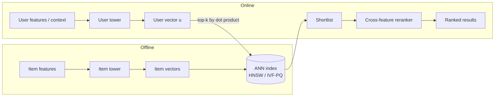
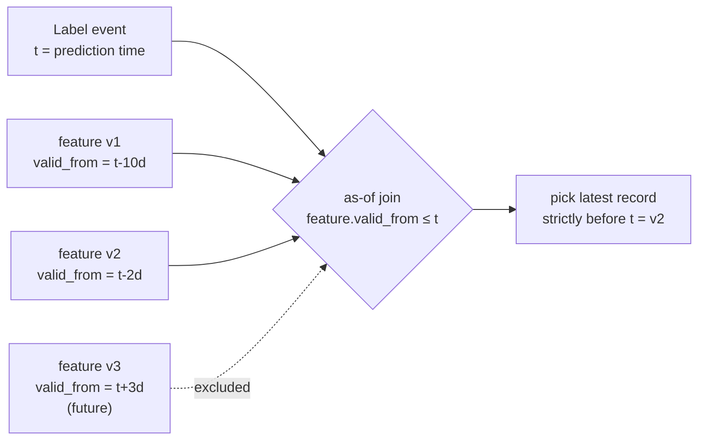
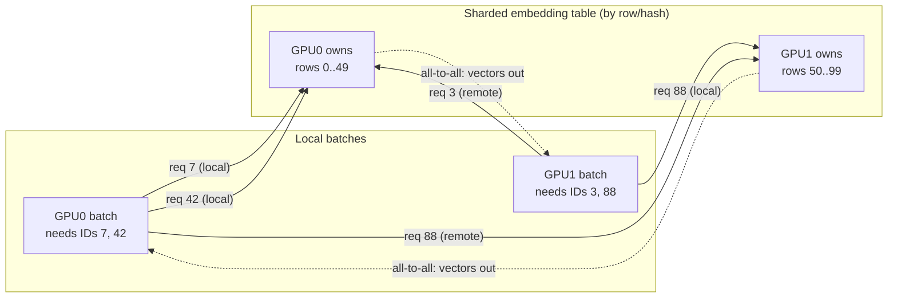

# Deep dives: the questions interviewers actually ask

Rapid-fire, depth-probing questions for applied-scientist and ML-engineer
interviews: the ones that come after the system-design whiteboard, when the
interviewer starts pulling threads on the modeling and the systems underneath.
Each answer leads with the mechanism, then the tradeoff. Formulas are written in
LaTeX and render on GitHub.

### By area

| Area | Themes |
| --- | --- |
| **Foundations and optimization** | [Normalization and regularization](#normalization-and-regularization) · [Classical models: when and why](#classical-models-when-and-why) · [Ensembles and boosting](#ensembles-and-boosting) · [Loss functions and objectives](#loss-functions-and-objectives) |
| **Statistics and probability** | [Statistics and probability for ML](#statistics-and-probability-for-ml) |
| **Evaluation and calibration** | [Class imbalance, calibration, and metrics](#class-imbalance-calibration-and-metrics) |
| **Representation and features** | [Embeddings and representation learning](#embeddings-and-representation-learning) · [Features, leakage, and training-serving skew](#features-leakage-and-training-serving-skew) |
| **Recsys and ranking modeling** | [Modeling depth: which architecture moves which metric](#modeling-depth-which-architecture-moves-which-metric) |
| **Training at scale** | [Distributed training and scaling classic ML](#distributed-training-and-scaling-classic-ml) |

---
## Normalization and regularization

**Q: BatchNorm normalizes across the batch dimension and LayerNorm across the feature dimension. Explain the mechanical difference and why it dictates where each is used.**

BatchNorm computes mean and variance for each channel across all examples in the batch (and spatial positions for conv maps), so the statistics of one example depend on the other examples in the batch. For a channel $c$ over a set of positions $\mathcal{B}$ (batch $\times$ spatial), it applies

$$\hat{x} = \frac{x - \mu_{\mathcal{B}}}{\sqrt{\sigma^2_{\mathcal{B}} + \epsilon}}, \qquad \mu_{\mathcal{B}} = \frac{1}{|\mathcal{B}|}\sum_{i \in \mathcal{B}} x_i, \qquad \sigma^2_{\mathcal{B}} = \frac{1}{|\mathcal{B}|}\sum_{i \in \mathcal{B}} (x_i - \mu_{\mathcal{B}})^2,$$

followed by a learned affine map $y = \gamma \hat{x} + \beta$. LayerNorm instead computes $\mu$ and $\sigma^2$ across the feature/channel dimension for each example independently (the sum runs over features within one token, not over the batch), so an example is normalized only by itself. This means BatchNorm needs a large, representative batch to get stable statistics, which fits CNNs on vision where batches are big and fixed. LayerNorm has no cross-example coupling, so it works for sequences, transformers, and RNNs where batch composition and sequence length vary and per-timestep independence matters. Use BatchNorm when you have large fixed batches of i.i.d. samples; use LayerNorm when batch size is small or variable, or examples must be normalized independently.

**Q: Why does BatchNorm behave differently at train time versus inference, and what class of bugs does this cause?**

During training BatchNorm uses the current mini-batch statistics $\mu_{\mathcal{B}}, \sigma^2_{\mathcal{B}}$, and simultaneously updates an exponential moving average of them (running mean/var), $\mu_{\text{run}} \leftarrow (1-m)\,\mu_{\text{run}} + m\,\mu_{\mathcal{B}}$. At inference it stops using batch statistics and instead applies the frozen running statistics, so the output for a given input no longer depends on its batch. The classic bugs come from forgetting to switch modes: leaving the model in train mode at eval makes predictions depend on batch composition and become nonreproducible, while calling eval before the running stats have converged (too few updates, or a train/test distribution shift) gives normalization that does not match the data. Another is fine-tuning on a new domain without updating running stats, so the frozen statistics are wrong for the new inputs. Always set eval mode for inference, and make sure running stats reflect the deployment distribution.

**Q: Why does BatchNorm break with tiny batch sizes, and why does it not compose cleanly with RNNs?**

With a tiny batch the per-batch mean and variance are high-variance, noisy estimates of the true statistics, so normalization becomes unstable and the running averages it feeds are also noisy; at batch size 1 the variance $\sigma^2_{\mathcal{B}}$ is undefined or zero and the layer is degenerate. This is why detection/segmentation with batch size 1 to 4 per GPU historically needed frozen BN or a switch to GroupNorm. RNNs are worse because the statistics would have to be maintained per time step, and sequences have variable length, so later time steps see fewer examples and there is no clean fixed running statistic to store. Use GroupNorm or LayerNorm when batches are small; use LayerNorm for recurrent and sequential models where per-timestep batch statistics are ill-defined.

**Q: In what sense is BatchNorm an implicit regularizer, and how does that interact with dropout?**

Because each example's normalization depends on the random composition of its mini-batch, BatchNorm injects stochastic noise into activations during training, which acts like a mild regularizer and often lets you reduce or drop other regularization. This is also why very large batches can slightly hurt generalization: less batch noise means less regularization. Stacking dropout directly with BatchNorm can hurt, because dropout shifts the variance of activations between train and test, which desynchronizes BatchNorm's running variance from what it sees at inference (the "variance shift"). The common practice is to rely on BatchNorm's own regularization and use little or no dropout in conv blocks, or place dropout only in the final fully connected layers. Treat BN's regularization as a reason to tune down, not stack, additional noise-based regularizers.

**Q: When would you reach for GroupNorm or InstanceNorm instead of BatchNorm or LayerNorm?**

GroupNorm splits channels into groups and normalizes within each group per example, so like LayerNorm it is batch-independent, but it keeps some channel structure rather than pooling all features together. It is the standard choice for vision models that must run at small batch sizes (detection, segmentation, high-resolution training) because its accuracy is stable across batch size while BatchNorm degrades. InstanceNorm normalizes each channel of each example over spatial positions only, which strips per-image contrast and color statistics, making it the default in style transfer and image generation where you want to remove instance-specific appearance. Use GroupNorm as a batch-size-robust BatchNorm replacement in vision; use InstanceNorm when you specifically want to discard per-example style/contrast information.

**Q: Summarize the four normalization layers in one place: what does each normalize over, is it batch-dependent, and where is it used?**

All four share the same normalize-then-affine form $y = \gamma \frac{x - \mu}{\sqrt{\sigma^2 + \epsilon}} + \beta$; they differ only in the set of elements over which $\mu$ and $\sigma^2$ are pooled. Take a feature map of shape $N \times C \times H \times W$ (batch, channels, height, width):

| Layer | Normalizes over | Batch-dependent? | Train vs inference | Where used |
|---|---|---|---|---|
| **BatchNorm** | $N, H, W$ per channel $C$ | Yes | Differs: batch stats in train, frozen running stats at inference | CNNs with large fixed batches (classification backbones) |
| **LayerNorm** | $C$ (and $H, W$) per example $N$ | No | Identical | Transformers, RNNs, variable-length sequences |
| **GroupNorm** | a group of channels $\times\, H, W$ per example $N$ | No | Identical | Vision at small batch (detection, segmentation) |
| **InstanceNorm** | $H, W$ per channel $C$ per example $N$ | No | Identical | Style transfer, image generation |

The single dividing line is the batch-dependent column: only BatchNorm couples an example's normalization to the rest of the batch, which is exactly why it alone needs the train/inference statistic switch and why it alone degrades at tiny batch size. The following diagram traces the decision:

**Q: Explain inverted dropout and why dropout is scaled at train time rather than test time.**

Dropout randomly zeros each activation with probability $p$ during training, which forces the network not to rely on any single unit and approximates averaging over an ensemble of subnetworks. Inverted dropout divides the surviving activations by the keep probability $1 - p$ during training, i.e. each retained activation is multiplied by $\frac{1}{1-p}$, so the expected value of each activation is preserved: $\mathbb{E}[\tilde{x}] = (1-p)\cdot \frac{x}{1-p} = x$. This means test time is a plain forward pass with nothing changed. The alternative (scaling by $1 - p$ at test time) works mathematically but pushes work into inference and is error prone, so inverted dropout is the standard. Dropout is disabled at test because you want the full, deterministic network and the expectation-matching correction has already been applied during training. Use dropout when a model overfits and you have capacity to spare, typically in fully connected layers or as structured variants elsewhere.

**Q: Are weight decay and L2 regularization the same thing, and why does that distinction force AdamW?**

For plain SGD they are equivalent: adding $\frac{\lambda}{2}\lVert w \rVert^2$ to the loss produces a gradient term $\lambda w$, so the update $w \leftarrow w - \eta(\nabla L + \lambda w) = (1 - \eta\lambda)\,w - \eta \nabla L$ is identical to directly shrinking each weight by $\eta\lambda$ each step. They stop being equivalent for adaptive optimizers like Adam, because Adam divides the gradient (including the $\lambda w$ term) by a per-parameter running estimate of its magnitude $\sqrt{\hat{v}} + \epsilon$, so weights with large gradients get less effective decay and the intended uniform shrinkage is distorted. AdamW fixes this by decoupling weight decay from the gradient, applying the shrinkage directly to the weights outside the adaptive-scaling path:

$$w \leftarrow w - \eta\left(\frac{\hat{m}}{\sqrt{\hat{v}} + \epsilon} + \lambda w\right) \quad \text{(Adam+L2)} \qquad\text{vs.}\qquad w \leftarrow w - \eta\,\frac{\hat{m}}{\sqrt{\hat{v}} + \epsilon} - \eta\lambda w \quad \text{(AdamW)}.$$

Use AdamW rather than Adam-plus-L2 whenever you want weight decay to actually behave like weight decay, which is now the default for transformers.

**Q: How does early stopping act as regularization, and what is its main tradeoff?**

Early stopping monitors validation loss and halts training when it stops improving, keeping the checkpoint at the validation minimum rather than the training minimum. Mechanistically, limiting the number of gradient steps limits how far weights can move from their small initialization, which for linear and near-linear regimes is closely related to an $L2$ penalty, so it constrains effective model complexity. Its big advantage is that it costs nothing extra and adapts automatically to when overfitting begins. The tradeoff is that it couples the regularization strength to the optimization trajectory and requires a held-out validation set plus patience tuning, and it can stop prematurely on noisy validation curves. Use it as a cheap default for almost any iterative training, ideally alongside (not instead of) explicit regularizers.

**Q: What does label smoothing actually do to the logits and to calibration, and when should you use it?**

Label smoothing replaces the hard one-hot target with a soft target that puts $1 - \epsilon$ on the true class and spreads $\epsilon$ uniformly over the remaining $K - 1$ classes, i.e. $y_k^{\text{LS}} = (1-\epsilon)\,y_k + \frac{\epsilon}{K}$, so the model is no longer pushed to drive the correct logit to infinity. This bounds the gap between the correct logit and the others, preventing the overconfident, saturated logits that hard labels encourage and generally improving calibration so predicted probabilities better match accuracy. The cost is that it deliberately makes the model less confident and tends to collapse the within-class spread of representations, which can hurt when you need the raw logits for downstream tasks like knowledge distillation or retrieval. Use it when you want better generalization and calibration on classification with many classes; avoid or reduce it when you need well-separated feature embeddings or faithful teacher logits.

**Q: Why is data augmentation a form of regularization, and where does it help most?**

Data augmentation applies label-preserving transformations (crops, flips, color jitter, mixup, noise) so the model sees many perturbed versions of each example, which enlarges the effective dataset and encodes invariances you know the task has. This penalizes solutions that are sensitive to those transformations, reducing variance and overfitting without adding parameters. It helps most when labeled data is limited and you have reliable priors about which changes should not alter the label, which is why it is central in vision and audio. The tradeoff is that augmentations that break the label assumption (too aggressive crops, flips that change semantics like digits or text) inject label noise and hurt. Use augmentation when you can specify true invariances of the domain and data is scarce relative to model capacity.

**Q: Frame the bias-variance tradeoff and state which side of it each regularizer moves you toward.**

Expected generalization error decomposes into bias (systematic error from a model too simple or too constrained to fit the true function), variance (sensitivity to the particular training sample), and irreducible noise:

$$\mathbb{E}\big[(y-\hat f)^2\big]=\text{Bias}(\hat f)^2+\text{Var}(\hat f)+\sigma^2.$$

Underfitting is high bias and low variance; overfitting is low bias and high variance, and you trade one for the other by changing effective capacity. Regularizers (weight decay, dropout, early stopping, label smoothing, augmentation) all reduce $\text{Var}(\hat f)$ at the cost of some added $\text{Bias}(\hat f)^2$, which helps only when you start in the overfitting regime. Adding capacity, training longer, or removing regularization moves you the other way, reducing bias at the cost of variance. The irreducible term $\sigma^2$ is a floor no model or regularizer can cross. The practical rule is to diagnose which regime you are in first, then apply the fix that moves you toward the other side.

**Q: How do you diagnose overfitting versus underfitting purely from training and validation loss curves?**

Underfitting shows both training and validation loss high and plateauing together, with a small gap between them: the model cannot even fit the training data, so bias dominates. Overfitting shows training loss continuing to fall (often near zero) while validation loss flattens then rises, producing a widening gap: variance dominates. A large persistent gap points to a capacity or regularization problem, while a small gap at a high loss floor points to insufficient capacity, bad features, or optimization issues. If validation loss is below training loss, suspect a leak, a train-only regularizer inflating training loss (dropout), or an easier validation split. Read the level of the floor and the size of the gap together: floor tells you bias, gap tells you variance.

**Q: A model overfits. Walk through how you would choose among more data, augmentation, weight decay, dropout, and early stopping.**

All five reduce variance, but they differ in cost and assumptions, so order them by leverage. More real data is the highest-quality fix because it reduces variance without adding bias, so prefer it when collection is feasible; data augmentation is the cheap proxy when you can articulate valid invariances. Weight decay is the low-risk default that gently constrains weight magnitude and pairs with almost any model (via AdamW for adaptive optimizers). Dropout adds stronger, tunable stochastic regularization but interacts badly with BatchNorm and needs its rate tuned, so reserve it for fully connected heads or when weight decay is not enough. Early stopping is the free catch-all you run alongside the others; in practice combine a mild weight decay plus augmentation plus early stopping first, then add dropout only if the validation gap remains.

**Q: Why can you not simply replace BatchNorm with LayerNorm in a CNN and expect the same accuracy?**

BatchNorm in a conv layer normalizes each channel using statistics pooled across the batch and all spatial positions, which both centers per-channel activations using cross-example information and provides its batch-noise regularization. LayerNorm on the same feature map normalizes across channels within a single example and position set, mixing together channels that represent different features, which discards the per-channel calibration that convolutions rely on and removes the batch-derived regularization. Empirically this usually lowers accuracy for standard CNNs, which is why the batch-independent replacement of choice in vision is GroupNorm, not LayerNorm. Swap in GroupNorm when you need BatchNorm's per-channel behavior without the batch dependence; reserve LayerNorm for architectures whose features are a single vector per token, like transformers.

**Q: Why do transformers place LayerNorm the way they do, and what breaks if you use BatchNorm instead?**

Transformers operate on variable-length sequences with padding and often small or uneven token batches, so per-example LayerNorm gives stable statistics regardless of how many real tokens are in the batch, whereas BatchNorm's statistics would be corrupted by padding and by batch/length variation. Modern transformers favor pre-norm (LayerNorm before each sublayer's residual branch), $x \leftarrow x + \text{Sublayer}(\text{LN}(x))$, because it keeps a clean identity path through the residual stream, which stabilizes gradients and lets very deep stacks train without careful warmup, at a small cost in final quality versus post-norm. BatchNorm also introduces train/inference statistic mismatch and cross-token coupling that make autoregressive decoding ill-defined, since generation happens one token at a time. Use pre-norm LayerNorm for deep or hard-to-train transformers; the point is per-example, sequence-length-agnostic normalization on a stable residual path.

**Q: What is normalization actually buying you at training time beyond a numerical trick, and which benefits carry which caveats?**

The main benefits are: it keeps activation distributions in a stable range across depth so gradients neither explode nor vanish, which lets you use higher learning rates and shortens training; it smooths the optimization landscape so training is less sensitive to initialization and hyperparameters; and, for BatchNorm specifically, the batch-noise term adds free regularization. The caveats track the earlier questions: the smoothing and speed benefits are real for all four variants, but the regularization benefit and the sensitivity to batch size are unique to BatchNorm, and every batch-dependent benefit comes paired with the train/inference statistic mismatch. Reach for normalization by default in deep networks for the optimization and gradient-scale benefits; choose the variant by the batch and data-shape constraints, not by chasing the regularization side effect, which you can supply more controllably with weight decay, dropout, or augmentation.

**Q: When is the right move to remove or relax normalization and regularization rather than add more?**

If both training and validation loss sit high and move together with a small gap, you are underfitting, and piling on dropout, weight decay, or aggressive augmentation only raises bias and makes it worse. In that regime you increase effective capacity: reduce weight decay, lower dropout, train longer or with a better learning-rate schedule, or grow the model. Normalization layers can themselves be the constraint, for example BatchNorm at tiny batch sizes injecting noise that swamps the signal, in which case switching to GroupNorm or removing BN helps. The discipline is to always locate the regime first from the loss curves, then move deliberately toward higher or lower capacity rather than reflexively adding regularizers.

## Class imbalance, calibration, and metrics

**Q: Why is accuracy a misleading metric under class imbalance, and what should you report instead?**

Accuracy weights every example equally, so with a 99:1 negative-to-positive split a model that predicts "negative" for everything scores 99% while catching zero positives. The metric is dominated by the majority class and is blind to the errors you actually care about. Report class-conditional metrics instead: precision $\text{P}=\frac{TP}{TP+FP}$, recall $\text{R}=\frac{TP}{TP+FN}$, and their curve (PR-AUC) for the rare class, plus a confusion matrix so both error types are visible. Use accuracy only when classes are roughly balanced and the two error types carry similar cost.

**Q: ROC-AUC vs PR-AUC, and when is PR-AUC the right choice?**

ROC-AUC plots TPR against FPR and equals the probability the model ranks a random positive above a random negative, $\Pr(\hat p_+ > \hat p_-)$; because FPR $=\frac{FP}{FP+TN}$ normalizes by the large negative pool, it stays optimistic when positives are rare. PR-AUC plots precision against recall, and precision directly reflects how many flagged items are truly positive, so it degrades honestly as the positive base rate shrinks. Prefer PR-AUC when the positive class is rare and you care about the quality of the positive predictions (fraud, disease screening, click prediction). Keep ROC-AUC when classes are balanced or when you want a threshold-independent ranking measure that is invariant to the base rate.

**Q: How can a model have high AUC yet be badly miscalibrated?**

AUC depends only on the ordering of scores, not their absolute values, so any monotone transform of the scores leaves AUC unchanged. A model can rank every positive above every negative (AUC near $1$) while emitting scores clustered at $0.6$ and $0.4$ that badly misstate the true probabilities. Ranking quality and probability quality are separate axes: AUC measures the first, calibration and proper scoring rules measure the second. If a downstream step consumes the score as a probability, high AUC alone does not tell you it is safe to use.

**Q: What does calibration mean, and why are raw scores from trees, SVMs, or resampled models not probabilities?**

A model is calibrated when, among examples it assigns score $p$, a fraction $p$ are actually positive; a $0.3$ score should be right $30\%$ of the time. Formally, $\Pr(y=1 \mid \hat p = p) = p$ for all $p$. SVM decision-function outputs are signed distances to a hyperplane with no probabilistic meaning, and margin-maximizing training pushes scores away from the middle. Boosted trees and many bagged ensembles produce sigmoid-shaped distortions, over-confident near the extremes or the reverse. Class weighting and resampling change the training base rate, so the model learns probabilities for the reweighted distribution, not the real one. Treat these raw scores as rankings until you fit a calibration map on held-out data.

**Q: Platt scaling vs isotonic regression vs temperature scaling, and when do you use each?**

Platt scaling fits a one-dimensional logistic regression (two parameters), $\hat p = \sigma(a\,s + b)$, mapping raw scores $s$ to probabilities; it is data-efficient and ideal for small validation sets and roughly sigmoidal distortion, as with SVMs. Isotonic regression fits any monotone step function, so it corrects arbitrary-shaped miscalibration but needs more data and can overfit on small sets. Temperature scaling divides logits by a single learned scalar $T$ before softmax, $\hat p = \text{softmax}(z/T)$; it fixes the confidence of modern neural nets without changing their argmax, so accuracy and ranking are preserved. Use Platt for small data or SVMs, isotonic for larger data with non-sigmoidal distortion, and temperature scaling for multi-class neural networks where you want to keep predictions unchanged.

**Q: How do resampling and class weighting distort calibration, and how do you correct it?**

Oversampling the minority, undersampling the majority, or up-weighting positive loss all raise the effective positive prior the model sees, so its output probabilities are inflated relative to the real base rate. The ranking may improve while the absolute probabilities become systematically too high. You can correct analytically with a prior-shift adjustment that rescales the odds by the ratio of true to training base rates,

$$\frac{p_{\text{true}}}{1-p_{\text{true}}} = \frac{p_{\text{train}}}{1-p_{\text{train}}}\cdot\frac{\pi_{\text{true}}/(1-\pi_{\text{true}})}{\pi_{\text{train}}/(1-\pi_{\text{train}})}$$

or empirically by fitting Platt or isotonic calibration on a held-out set that preserves the natural class distribution. The key rule: calibrate and threshold on data drawn from the real prior, never on the resampled set.

**Q: Why is choosing the decision threshold a cost-sensitive decision rather than defaulting to 0.5?**

The $0.5$ threshold is optimal only when the score is calibrated and false positives and false negatives cost the same, which is rarely true under imbalance. The optimal threshold sits at the point where the marginal expected cost of flagging equals the marginal cost of missing, which for a calibrated probability $p$ is

$$p^*=\frac{C_{fp}}{C_{fp}+C_{fn}}$$

If missing a positive is ten times costlier than a false alarm ($C_{fn}=10\,C_{fp}$), then $p^*\approx 0.09$, well below $0.5$, trading precision for recall. Pick the threshold from the cost structure and the calibrated probabilities, then verify it on the PR curve at the operating base rate.

**Q: Explain the precision-recall tradeoff and how you pick an operating point.**

Lowering the threshold flags more items, raising recall but admitting more false positives and lowering precision; raising it does the reverse, so the two move against each other along the PR curve. There is no universally best point: it depends on downstream capacity and the relative cost of misses versus false alarms. If a human team can only review 100 alerts a day, pick the threshold that maximizes recall within that precision-implied budget; if false positives are cheap, push recall higher. Choose the operating point from the business constraint, then read off the precision and recall it implies rather than optimizing a single scalar in isolation.

**Q: When do you use F1 vs F-beta vs weighted/macro F1?**

$F_1$ is the harmonic mean of precision and recall, $F_1=\frac{2\,\text{P}\cdot\text{R}}{\text{P}+\text{R}}$, weighting them equally, which suits a single rare class when both error types matter similarly. $F_\beta$ generalizes this,

$$F_\beta = (1+\beta^2)\,\frac{\text{P}\cdot\text{R}}{\beta^2\,\text{P}+\text{R}}$$

so $\beta>1$ (e.g. $F_2$) weights recall more, appropriate when misses are costlier, while $\beta<1$ favors precision. For multi-class, macro $F_1$ averages per-class $F_1$ unweighted so rare classes count as much as frequent ones, whereas weighted $F_1$ weights by support and can hide poor minority-class performance. Choose $\beta$ from your cost asymmetry, and macro over weighted when you specifically want to expose rare-class quality.

**Q: What do log-loss and Brier score measure, and how do they differ?**

Both are proper scoring rules, meaning they are minimized only by reporting the true probabilities, so they jointly reward calibration and discrimination. Log-loss is the negative log-likelihood,

$$\text{log-loss} = -\frac{1}{N}\sum_i\left[y_i\log\hat p_i+(1-y_i)\log(1-\hat p_i)\right]$$

and penalizes confident wrong predictions very harshly, growing unboundedly as a confident prediction approaches certainty on the wrong side. Brier score is the mean squared error between predicted probability and the 0/1 outcome,

$$\text{Brier} = \frac{1}{N}\sum_i(\hat p_i - y_i)^2$$

so its penalty is bounded and gentler on extreme mistakes. Use log-loss when confident errors are especially dangerous and you want the model punished for over-confidence; use Brier when you want a bounded, more robust probabilistic score. Note that under heavy imbalance both are dominated by the majority class, so pair them with class-conditional views.

**Q: What is Expected Calibration Error, and what are its limitations?**

ECE bins predictions by predicted probability, then averages the absolute gap between each bin's mean confidence and its empirical accuracy, weighted by bin population:

$$\text{ECE} = \sum_b \frac{|B_b|}{N}\,\bigl\lvert \text{acc}(B_b)-\text{conf}(B_b)\bigr\rvert$$

It gives a single scalar summarizing how far the model's stated probabilities drift from reality. Its weaknesses: the value depends on the binning scheme and bin count, it can hide compensating over- and under-confidence within a bin, and it is unstable when some bins are sparse. Use it as a quick calibration summary alongside a reliability diagram, which shows where the miscalibration lives rather than collapsing it to one number.

**Q: Which metric should I reach for? A quick reference.**

| Metric | What it measures | Ranking vs calibration | When to use |
| --- | --- | --- | --- |
| ROC-AUC | $\Pr(\hat p_+ > \hat p_-)$, ordering vs FPR | Ranking only | Balanced classes; base-rate-invariant ranking |
| PR-AUC | Precision across recall for the rare class | Ranking only | Rare positives; quality of positive predictions |
| Log-loss | NLL of stated probabilities | Both (proper score) | Confident errors are dangerous; punish over-confidence |
| Brier | MSE of probability vs 0/1 outcome | Both (proper score) | Bounded, robust probabilistic score |
| $F_1$ / $F_\beta$ | Balance of precision and recall at one threshold | Threshold decision | Single rare class; $\beta$ tunes cost asymmetry |
| ECE | Gap between confidence and accuracy | Calibration only | Quick calibration summary; pair with reliability diagram |

**Q: Why does calibration matter specifically when the score feeds a downstream decision or auction?**

When a score is only thresholded once, monotone distortions wash out and ranking is enough. But when the probability is multiplied by a value, as in expected-value bidding ($\text{bid} = p(\text{click})\times\text{value}$) or expected-loss ranking, a miscalibrated $p$ directly scales the decision and produces systematic over- or under-bidding. Two models with identical AUC can lose money at very different rates in an auction because one reports $0.2$ where the truth is $0.1$. Any pipeline that arithmetically combines the score with costs, values, or other probabilities requires calibrated outputs, not just correct ordering.

**Q: How does multi-class calibration differ from binary, and how do you measure it?**

In the multi-class setting each example has a full probability vector, so you can calibrate the top predicted probability (confidence calibration) or require every class probability to be correct (classwise calibration), and the two are not equivalent. Temperature scaling is the standard fix because a single scalar $T$ on the logits preserves the argmax and thus accuracy while shrinking over-confidence. Alternatives include Dirichlet calibration and one-vs-rest per-class calibration when you need each class probability to be trustworthy. Measure with classwise ECE or a per-class reliability analysis rather than only top-1 ECE, which can look fine while individual class probabilities are off.

**Q: What is the right order of operations: calibrate then threshold, or threshold then calibrate?**

Always calibrate first, then threshold, and do both on data drawn from the real class prior, never on the resampled training set. The threshold rule $p^*=\frac{C_{fp}}{C_{fp}+C_{fn}}$ is only valid when $p$ is a genuine probability, so applying it to raw uncalibrated scores silently picks the wrong operating point. The full flow:

Fit the calibration map on one held-out split and choose or verify the threshold on another so the operating point is not tuned on the same data that fixed the probabilities.

**Q: When do you use ranking metrics like NDCG or MAP instead of classification metrics?**

Use ranking metrics when the output is an ordered list and the user only sees the top few items, so the position of relevant results matters, as in search, recommendation, and retrieval. NDCG rewards placing highly relevant items near the top and supports graded relevance through a discount that decays with rank, $\text{DCG} = \sum_i \frac{2^{rel_i}-1}{\log_2(i+1)}$ normalized by the ideal ordering. MAP assumes binary relevance and averages precision at each relevant hit, rewarding both relevance and early placement across the ranking. Reach for classification metrics (precision, recall, PR-AUC, calibration) when you make an independent accept/reject decision per item, and for ranking metrics when relative order within a returned list is what the user experiences.

**Q: A model shows AUC 0.92 but log-loss got worse after you added class weighting. What happened and what do you do?**

Class weighting improved the model's ability to rank positives above negatives, which raised AUC, but it also inflated the output probabilities relative to the true base rate, and log-loss is a proper score that penalizes that miscalibration. So discrimination went up while calibration went down, and the two metrics moved in opposite directions as expected. Fit a calibration map (Platt or isotonic, or an analytic prior-shift correction) on a held-out set drawn from the real class distribution, then recheck log-loss and reliability. You typically keep the weighting for its ranking and recall benefit and recover the probability quality through post-hoc calibration.

## Embeddings and representation learning

**Q: How do you choose embedding dimensionality, and what actually trades off as you scale it up?**

Dimensionality sets the representational capacity of each embedding: too few dimensions and distinct entities collapse onto each other (underfit), too many and rare IDs memorize noise while the table dominates memory and ANN latency. Empirically returns diminish fast, so doubling from 128 to 256 often buys far less than the first jump from 32 to 64, and past some point offline recall flattens while serving cost keeps rising linearly. A practical rule is to size dimension by cardinality and frequency: high-cardinality, high-traffic fields (user, item) justify larger dims, while low-cardinality categoricals (device type, country) do fine at 8 to 32. Some systems even use frequency-based or mixed-dimension tables, giving head items wide vectors and tail items narrow ones to spend capacity where data supports it. The decision is capacity versus overfitting versus memory/latency, so tune it against both offline metrics and the p99 serving budget, not offline alone.

**Q: What is in-batch negative sampling and what bias does it introduce?**

In-batch negatives treat the other positives in a training minibatch as negatives for each anchor, which is nearly free because you reuse embeddings already computed for the forward pass and get a large effective negative set. For a batch of pairs $(x_i, y_i)$, the loss for anchor $i$ is a softmax over the batch's items:

$$\mathcal{L}_i = -\log \frac{\exp\big(s(x_i, y_i)\big)}{\sum_{j=1}^{B} \exp\big(s(x_i, y_j)\big)}$$

where $s(x, y)$ is the tower similarity (typically $s(x,y) = u_x \cdot v_y / \tau$). The catch is that items appear as negatives in proportion to how often they show up as positives, so popular items get penalized as negatives far more than their true prior warrants, which suppresses their scores and hurts calibration. This is popularity bias baked directly into the loss. The standard fix is a logQ correction (sampled-softmax correction): subtract an estimate of each item's log sampling probability from its logit so the gradient behaves as if negatives were drawn uniformly. Use in-batch negatives for cheap scale, but always pair them with logQ correction in retrieval or your model will systematically under-rank head items.

**Q: Explain the sampled-softmax / logQ correction more precisely and when it matters.**

A full softmax over millions of items is intractable, so you approximate it by sampling a subset of negatives; but sampling from a nonuniform distribution $Q$ biases the partition function toward frequently sampled items. The logQ correction replaces each logit $s(x, y)$ with the corrected logit

$$s'(x, y) = s(x, y) - \log Q(y)$$

which debiases the estimator so the sampled loss is an unbiased approximation of the full softmax gradient. The corrected in-batch loss becomes:

$$\mathcal{L}_i = -\log \frac{\exp\big(s(x_i, y_i) - \log Q(y_i)\big)}{\sum_{j=1}^{B} \exp\big(s(x_i, y_j) - \log Q(y_j)\big)}$$

It matters most when $Q$ is skewed, which is exactly the in-batch case where $Q$ tracks item popularity, and it matters less when negatives are drawn uniformly at random (where $\log Q(y)$ is constant and cancels). Getting $Q$ wrong (stale frequency estimates, ignoring temporal drift) reintroduces bias, so many systems maintain a streaming count-min estimate of item frequency. Skip the correction and popular items are unfairly demoted; over-correct with a bad estimate and you over-promote tail junk.

**Q: Why do hard negatives help, and how can they hurt?**

Hard negatives are items close to the anchor in embedding space but not true positives, and they help because they concentrate gradient near the decision boundary where random negatives are too easy to be informative, sharpening the model's ability to distinguish fine-grained relevance. Without them a two-tower model can look great on random-negative metrics yet fail in production where the ANN already returns only plausible candidates. The danger is false negatives: in implicit-feedback data an unlabeled item is often just unobserved, not truly irrelevant, and mining the hardest examples preferentially surfaces these mislabeled positives, teaching the model to push apart things that should be close. Overly aggressive hard mining also destabilizes training and can collapse representations. The usual compromise is a mix of many random or in-batch negatives plus a modest fraction of semi-hard negatives, with hardness capped so you avoid the top slice most likely to be false negatives.

The negative-sampling strategies compose rather than compete; most production retrieval stacks blend several:

| Strategy | What it buys | What it costs |
| --- | --- | --- |
| In-batch negatives | Nearly free (reuses forward-pass embeddings), large effective negative set, scales with batch size | Popularity bias: items appear as negatives $\propto$ their positive frequency, so head items are over-penalized |
| logQ-corrected | Debiases the in-batch softmax so gradients behave as if $Q$ were uniform; fixes head under-ranking | Needs an accurate, fresh estimate of $Q(y)$; a stale or wrong estimate reintroduces or inverts the bias |
| Hard negatives | Concentrates gradient at the decision boundary, sharpens fine-grained relevance the ANN will actually see | Surfaces false negatives (unobserved positives), destabilizes training, can collapse the space if over-mined |
| False-negative-filtered | Removes candidate negatives above a similarity threshold, so genuine positives are not taught as negatives | Threshold is a hyperparameter; too aggressive discards informative hard negatives, too loose lets noise through |

**Q: Why do two-tower architectures keep the user and item towers separate, and what do you give up?**

Separation means the item tower depends only on item features and the user tower only on user features, so item embeddings can be computed offline in bulk and loaded into an ANN index, and at request time you embed just the user once and do an approximate nearest-neighbor lookup. This is what makes retrieval over hundreds of millions of items feasible in single-digit milliseconds. A cross-feature model that lets user and item features interact in early layers cannot precompute anything, because every item's score depends on the specific user, forcing a full scoring pass that only scales to hundreds or low thousands of candidates. The tradeoff is expressiveness: the tower separation forbids early user-item feature crosses, so two-tower models are typically weaker per-candidate than cross models. The standard resolution is a funnel: cheap two-tower for retrieval, expensive cross-feature model for reranking the shortlist.

**Q: How do you handle cold start for new users and new items in an embedding system?**

The core problem is that a fresh ID has no learned embedding and its randomly initialized vector carries no signal, so pure ID-based models cannot place it meaningfully. The main fix is to lean on content and metadata: build towers from side features (text, categories, image embeddings, creator, price bucket) so a new item inherits a reasonable location from items with similar attributes even with zero interactions. For users, a metadata tower over demographics, device, and early-session context gives a starting point, and you can blend toward the learned ID embedding as interactions accumulate. Hashing or bucketing also gives new IDs a nonrandom fallback slot shared with similar entities. The tradeoff is that content towers dilute the sharp memorization that pure ID embeddings provide for head entities, so most systems combine both and let the ID term dominate once enough data exists.

**Q: How do you embed very high-cardinality categoricals, and what does hashing cost you?**

When a field has hundreds of millions of values, a dense embedding row per value is infeasible, so the common trick is the hashing trick: map each value through a hash into a fixed-size table, trading exact identity for bounded memory. The cost is collisions, where two unrelated values share a row and their gradients interfere, blurring both representations; the effect is worst for the tail because head values, being frequent, tend to dominate any row they share. Mitigations include multiple independent hash functions whose embeddings are summed (making a full collision across all functions unlikely), larger tables for higher-traffic fields, and reserving dedicated rows for the most frequent values while hashing only the tail. For distributed training the table itself is sharded across parameter servers or GPUs by row, so lookups become a scatter/gather across shards. The tradeoff is table size versus collision rate versus the communication cost of sharded lookups.

**Q: Why dot product or cosine similarity, and how do normalization choices change behavior?**

Dot product and cosine are used because they are cheap, decomposable across the two towers, and directly supported by ANN indexes, which is what lets you serve them at scale. The key difference is that dot product $u \cdot v$ is sensitive to vector magnitude while cosine

$$\cos(u, v) = \frac{u \cdot v}{\lVert u \rVert \, \lVert v \rVert}$$

normalizes it away, so an unnormalized dot product can encode popularity or confidence in the norm, letting frequently trained items grow larger vectors and win more retrievals. That is sometimes desirable (a built-in popularity prior) and sometimes harmful (runaway head bias), so the choice is really about whether you want magnitude to carry signal. Cosine or $L_2$-normalized embeddings ($\lVert v \rVert = 1$) make similarity purely directional, which stabilizes training and makes a fixed ANN threshold meaningful across items. Normalization also interacts with the loss temperature, since normalized vectors have $u \cdot v \in [-1, 1]$ that must be rescaled by $1/\tau$ to produce sharp softmax distributions.

**Q: What are Matryoshka / multi-resolution embeddings and when are they worth it?**

Matryoshka representation learning trains a single embedding so that its leading prefixes (say the first 32, 64, 128 dims) are each independently useful, by summing the loss computed at several truncation lengths during training:

$$\mathcal{L}_{\text{MRL}} = \sum_{d \in \{32, 64, 128, \dots\}} \mathcal{L}\big(v_{[:d]}\big)$$

This gives you one vector you can shorten at serving time to trade accuracy for speed and memory without retraining or maintaining separate models. In retrieval it enables adaptive two-stage search: run ANN on a short prefix over the whole corpus for a cheap first pass, then rerank the survivors with the full-length vector for precision. It is worth it when you have a wide latency/quality operating range or heterogeneous hardware, and less compelling when you only ever serve one fixed dimension, since forcing the prefix property costs a little peak accuracy versus a bespoke fixed-dim embedding. The win is operational flexibility from a single artifact.

**Q: Contrastive learning depends heavily on temperature; what does it control and how do you set it?**

Temperature scales the logits before the softmax in a contrastive loss. For an InfoNCE objective over one positive $v^+$ and a set of negatives $\{v^-_k\}$:

$$\mathcal{L}_{\text{InfoNCE}} = -\log \frac{\exp\big((u \cdot v^+)/\tau\big)}{\exp\big((u \cdot v^+)/\tau\big) + \sum_{k} \exp\big((u \cdot v^-_k)/\tau\big)}$$

The temperature $\tau$ controls how sharply the model separates positives from negatives: a low $\tau$ makes the loss focus intensely on the hardest negatives (large gradients for near-misses), while a high $\tau$ softens the distribution and treats all negatives more uniformly. Too low and training becomes unstable and over-penalizes semi-hard negatives that may be false negatives, collapsing or fracturing the space; too high and the model never sharpens, producing mushy embeddings that retrieve poorly. It interacts with normalization and batch size, because normalized vectors have a bounded dot-product range that $\tau$ must expand into a usable logit scale, and larger negative sets tolerate lower temperatures. Set it by sweeping on a validation retrieval metric, often landing in the $0.01$ to $0.1$ range for $L_2$-normalized embeddings. Some methods learn $\tau$, but a poorly bounded learned temperature can drift, so many teams clamp it.

**Q: When does a shared multi-task embedding beat per-task embeddings, and when does it backfire?**

A shared embedding lets related tasks pool their supervision, which is a large win when some tasks are data-poor, since the abundant task regularizes and transfers structure to the sparse one, and it also cuts memory and keeps one entity representation consistent across surfaces. It works best when the tasks are correlated (click and purchase share a lot of what makes an item good) and their notions of similarity align. It backfires under negative transfer: when objectives conflict (engagement versus long-term satisfaction), the shared space is pulled in incompatible directions and every task degrades relative to a dedicated embedding. The middle ground is a shared base embedding with lightweight per-task heads or adapters, giving transfer where tasks agree and task-specific capacity where they diverge. Decide by measuring per-task metrics under both, not by assuming sharing is free.

**Q: Embeddings drift as you retrain; what is the re-indexing cost and how do you manage it?**

Because the item tower is retrained periodically, the entire ANN index of precomputed item vectors becomes stale and must be recomputed and rebuilt, which is expensive at hundreds of millions of items and, critically, the user tower must be swapped atomically with the item index or the two live in incompatible coordinate systems and retrieval quality craters. That coupling is the real cost: partial or skewed rollouts silently break relevance even though nothing errors. Mitigations include versioning the index and query tower together and cutting over atomically, warm-starting from the previous checkpoint to limit how far vectors move, and regularizing against drift so old and new spaces stay roughly compatible. Rebuild cadence is itself a tradeoff between freshness (new items and shifting behavior) and the compute plus operational risk of frequent full re-indexes. Many systems separate a slowly rebuilt base index from an incrementally updated fresh-item index to get freshness without a full rebuild each time.

**Q: How does the ANN index sit on the recall-versus-latency curve, and what knobs move it?**

Approximate nearest-neighbor trades exact retrieval for speed, so the index never returns the true top-k; it returns a high-recall approximation, and how high is a tunable knob traded directly against latency and memory. For graph indexes like HNSW, raising the search-time beam (efSearch) or build-time connectivity (M, efConstruction) improves recall at the cost of query time and index size; for IVF you trade the number of probed lists (nprobe) against speed, and product quantization shrinks memory at some recall loss. The subtle point is that retrieval recall against the exact-dot-product neighbors is not the same as business recall against true relevance, so chasing ANN recall past a point buys nothing the ranker will notice. Set the operating point by sweeping efSearch/nprobe against end-to-end quality under the p99 latency budget, then stop where the metric curve flattens. The right choice also depends on corpus size and update rate, since some indexes rebuild cheaply and others do not.

**Q: How do false negatives specifically corrupt retrieval training, and what detects them?**

Implicit feedback only records positives, so any unobserved item is ambiguous, and sampling it as a negative asserts irrelevance that may be false; the model then learns to separate the anchor from items it should actually retrieve, directly degrading recall for exactly the good candidates. The damage concentrates where hard-negative mining operates, because the items most similar to a positive are the ones most likely to be genuine positives that simply were not shown or clicked. Symptoms include hard-mining that improves offline separation metrics but hurts online engagement, and popular relevant items being pushed down. Defenses include capping negative hardness below the very top, false-negative filtering that removes candidate negatives above a similarity threshold, and using in-batch negatives with logQ correction to dilute any single mislabeled item. The underlying tradeoff is informativeness versus label noise: the hardest negatives are the most informative and the most likely to be mislabeled, so you deliberately back off the extreme.

**Q: When should you prefer frequency-based mixed-dimension tables over a uniform embedding size?**

Uniform dimension spends the same capacity on a head item seen millions of times and a tail item seen twice, which wastes memory on the tail (it cannot fill a wide vector) and can underfit the head. Mixed-dimension tables assign width by frequency, wide vectors for frequent IDs and narrow ones for rare IDs, projected up to a common space so downstream layers are agnostic, which cuts table memory substantially at similar quality. Prefer this when the frequency distribution is heavily skewed (typical for user and item IDs) and the embedding table is a real memory bottleneck. The cost is engineering complexity and the projection overhead, plus a frequency estimate that must be maintained and can go stale as popularity shifts. If cardinality is modest or roughly uniform, a single dimension is simpler and the savings do not justify the machinery.

**Q: Why is dot product on ANN indexes usually reduced to a cosine or MIPS problem, and what breaks if magnitudes vary wildly?**

Most ANN libraries are tuned for either $L_2$ distance or cosine (angular) similarity, so maximum-inner-product search (MIPS) over unnormalized vectors is either unsupported or handled by a transform that appends an extra coordinate to fold magnitude into an angle. If you feed raw dot-product embeddings whose norms span orders of magnitude, a handful of large-norm items dominate the top-k for almost every query regardless of direction, which both wrecks diversity and defeats the graph/IVF structure that assumes roughly comparable scales. The practical resolutions are to $L_2$-normalize and serve cosine (magnitude discarded), or to keep magnitude deliberately as a popularity prior but bound it (clip norms, add a norm-regularizer) so no item runs away. The failure mode to watch for is a retrieval set that is high-recall against exact dot product yet monotonously popular, a sign the norm distribution, not relevance, is driving results.

**Q: What is the alignment-versus-uniformity view of contrastive embeddings, and why is it a useful diagnostic?**

Alignment measures how close positive pairs land, $\mathbb{E}\big[\lVert u - v^+ \rVert^2\big]$ over positives, and uniformity measures how evenly embeddings spread on the unit hypersphere, typically $\log \mathbb{E}\big[\exp(-t \lVert u - v \rVert^2)\big]$ over random pairs. A good contrastive space minimizes both: positives collapse together (low alignment loss) while the overall distribution stays spread out so distinct entities remain separable (low uniformity loss). The diagnostic value is that the two classic failure modes map cleanly onto these axes: representation collapse shows up as great alignment but terrible uniformity (everything piles into one region), while under-training or too-high temperature shows up as good uniformity but poor alignment (positives never pull together). Tracking both during training tells you which way to move temperature, batch size, or negative hardness, rather than staring at a single opaque loss curve.

## Features, leakage, and training-serving skew

## Features, leakage, and training-serving skew

**Q: What exactly is target leakage, and why is it more dangerous than a simple bug?**

Target leakage is when a feature carries information that would not be available at prediction time, usually because it is derived from the outcome itself or from events that happen after the prediction point. It is dangerous because it does not throw an error or crash; it silently inflates offline metrics and passes code review, so it survives all the way to production before failing. The model looks excellent in the notebook and then collapses on live traffic where the leaked signal does not exist. The guard is to fix a strict prediction timestamp for every row and ask of each feature: "could I have computed this value using only data that existed before this timestamp?" Any feature that fails that question is disqualified regardless of how much it helps the score.

**Q: Give concrete examples of sneaky leakage sources that are easy to miss in a feature table.**

Post-outcome features are the classic case: a `num_support_calls` column populated after a customer already churned, or an `account_closed_date` that only exists for defaulters. Aggregates computed over a window that includes the label period leak too, for example a 30-day average that spans days after the prediction date. IDs can encode the target when they are assigned by a process correlated with the outcome, such as sequential case numbers issued only to fraud cases or a record ID whose prefix marks the segment. Free-text and metadata fields sometimes embed resolution status, and joins to dimension tables refreshed nightly silently pull in the current (post-outcome) state of an entity. The guard is to trace the lineage and refresh cadence of every column, not just the obviously outcome-named ones.

### Leakage taxonomy: source and guard

Every leak below shares one signature (information from the future or from the label crosses into training) but each has a distinct source and a distinct guard. Memorize the mapping; interviewers probe whether you can name the specific fix, not just say "avoid leakage."

| Leakage type | Where the signal sneaks in | The guard |
| --- | --- | --- |
| Target / post-outcome | Feature derived from the label, or from an event after the prediction point (`account_closed_date`, post-churn support calls) | Fix a prediction timestamp; keep only values knowable strictly before it |
| Temporal | Random split lets training peek at future rows sharing entity state or drift | Time-based split (train before $T$, validate after $T$); split by entity too if entities recur |
| CV / preprocessing | Stateful transform (scaler, imputer, target encoder, selector) fit on all rows before splitting | Fit every stateful transform on the training fold only; use a `Pipeline` inside CV |
| Group | Same entity (user, patient, device) in both train and validation | Grouped splitting so each entity lands wholly on one side |
| Target encoding | A row's own label feeds the category mean used to encode it | Out-of-fold encoding + smoothing toward the global mean; fit inside the CV loop |

**Q: How do you actually catch leakage before shipping?**

The first tripwire is a metric that is too good to be true: near-perfect AUC on a problem known to be hard is a leak until proven otherwise. The second is feature importance sanity: if one feature dominates and it is something you would not expect to be that predictive, inspect its lineage and timing. The third is temporal holdout: train on the past, score a strictly future window, and watch whether the gain evaporates, because most leaks depend on future information that a temporal split removes. A useful mechanical check is to drop the suspect feature and see if performance falls back to a plausible level. None of these is conclusive alone, so treat suspiciously strong signals as guilty until their timing is verified.

**Q: Why do time-based splits beat random splits, and when is random genuinely wrong?**

Random splits assume rows are exchangeable, but most production models predict the future from the past, so a random split lets the model peek at future rows that share state with training rows. This leaks through slowly drifting features, entity-level state, and aggregates, producing an optimistic estimate that will not hold when you deploy against real future data. A time-based split (train on before $T$, validate after $T$) mirrors deployment and exposes both leakage and drift that random splits hide. Random splitting is only safe when rows are truly independent and there is no temporal generative process, which is rare in operational settings. When in doubt, split by time and, if entities recur, also by entity.

**Q: What is point-in-time correctness and how do you enforce it when building features?**

Point-in-time correctness means every feature value reflects only what was known as of that row's prediction timestamp, with no bleed from later updates. The failure is the "as-of-now" join: you join today's snapshot of a customer table onto a historical event, importing state that did not exist back then. Enforcing it requires event-time versioned data (append-only logs or slowly-changing dimensions with valid-from/valid-to ranges) and as-of joins that pick the latest record strictly before the prediction time. A feature store with time-travel semantics automates this, but the principle holds even with hand-rolled SQL: always bound the lookup by the label timestamp. Without it, your backtest is fiction.

A correct as-of join walks a label event back to the newest feature record that already existed at prediction time, never the current snapshot:

The v3 record, though it exists in today's table, is excluded because it became valid only after the prediction point; picking it is exactly the as-of-now leak.

**Q: What causes training-serving skew, and why does it hurt even when the model is correct?**

Training-serving skew is when the feature values a model sees in production differ from those it saw in training, so a perfectly trained model receives inputs it never learned on. The most common cause is two codebases: a batch pipeline (SQL/Spark) computes features offline and hand-written service code recomputes them online, and the two disagree on edge cases, null handling, rounding, or units. Other causes are data freshness differences (training uses fully-settled data while serving uses partial real-time data) and aggregation-window mismatches (a 7-day count that means calendar days offline but rolling 168 hours online). It hurts because the model's learned mapping is only valid on the training distribution; shift the inputs and the predictions degrade in ways that offline metrics never revealed. The fix is a single shared feature definition consumed by both paths.

**Q: How does a feature store or shared feature definition actually eliminate that skew?**

The core idea is one definition of a feature, authored once and executed for both training and serving, so there is no second implementation to drift. A feature store typically pairs an offline store (for point-in-time-correct training data) with an online store (for low-latency serving), both populated from the same transformation logic, guaranteeing parity by construction. It also centralizes freshness and windowing semantics so a "7-day sum" means the same thing in both worlds. You do not strictly need a heavyweight platform: a shared library that both pipelines import, plus contract tests that assert offline and online produce identical values on sample keys, achieves the same parity. The anti-pattern to kill is any feature logic that exists in two places.

**Q: How does improper cross-validation leak the label even when your features are clean?**

The leak comes from fitting any data-dependent transform on the full dataset before splitting, so validation-fold statistics contaminate training. Fitting a `StandardScaler`, an imputer, a target encoder, or a feature selector on all rows lets information from the validation fold flow into the model, inflating the CV score. The fix is to fit every stateful transform only on the training fold and apply it to the validation fold, which is exactly what an sklearn `Pipeline` inside cross-validation enforces. The other axis is group leakage: if the same entity (user, patient, device) appears in both train and validation, the model memorizes the entity rather than the pattern, so use grouped splitting to keep each entity wholly on one side. Both failures produce optimistic CV that will not reproduce on genuinely unseen data.

**Q: Target/mean encoding of categoricals is powerful but leaks. Explain the leak and the fix.**

Target encoding replaces a category with the mean of the label for that category, so if you compute that mean using a row's own label, the feature literally contains the answer, which is catastrophic for high-cardinality columns where many categories have one row. Even computed over the whole training set, it leaks because each row contributes to the statistic used to encode it, biasing the model toward memorizing the training targets. The fix is out-of-fold encoding: split the data and encode each fold using target means computed only from the other folds, so a row's own label never touches its encoding. You also smooth toward the global mean for rare categories, blending the category mean $\bar y_c$ over its $n$ rows with the global mean $\bar y$ through a prior weight $m$:

$$\hat y_c = \frac{n\,\bar y_c + m\,\bar y}{n + m}$$

so a category with few rows ($n \ll m$) is pulled toward $\bar y$ and only well-supported categories trust their own mean. You must fit the encoding inside the CV loop, not once beforehand. At serving time you apply the encoding learned from training data only.

**Q: Why can a "missing" value be informative, and how does imputation itself leak?**

Missingness is often not random: a blank income field may signal an applicant who declined to state it, and a null lab result may mean the test was never ordered, so the fact of absence carries signal that naive imputation destroys. The robust pattern is to add an explicit `is_missing` indicator alongside a filled value, letting the model use both the presence pattern and a placeholder. Imputation leaks when the fill statistic (mean, median, most-frequent) is computed over the entire dataset including validation and future rows, so fit the imputer on the training fold only and apply it forward. It also leaks temporally if you impute with a global mean that includes future data, so in time-series settings use only past-available statistics. Treat imputation as a fitted transform inside the pipeline, never a one-shot preprocessing step on the full table.

**Q: What are the main pitfalls in reading feature importance, and how do correlated features distort it?**

When two features are correlated, tree models split the importance between them somewhat arbitrarily, so each looks half as important as it is and you may wrongly prune a genuinely predictive signal. Gain/impurity importance is also biased toward high-cardinality and continuous features that offer more split points, inflating their apparent value regardless of true signal. Permutation importance measures the drop in performance when a feature is shuffled, which reflects real predictive contribution, but with correlated features it understates them because a shuffled feature's information still leaks through its correlate. SHAP gives consistent, locally-accurate attributions and handles interactions better, but it is more expensive and still splits credit among correlated features. The practical guard is to cluster correlated features and assess importance at the group level, and to compare methods rather than trusting a single ranking.

**Q: Why do offline metric gains so often vanish when the model goes live?**

The usual root cause is that the offline evaluation was optimistic: leakage, a random instead of temporal split, or training-serving skew made the backtest easier than reality. Distribution shift between the training window and the live window is another: the offline test set was from last quarter and live traffic has moved. There is also selection and feedback bias, where offline data reflects decisions made by the previous system, so a model tuned to that logged distribution behaves differently once it starts influencing which examples appear. Finally, offline metrics optimize a proxy (AUC, logloss) while the business cares about an online outcome (conversion, revenue) that the proxy correlates with imperfectly. The guard is temporal and even prospective validation, plus an online A/B test as the real arbiter rather than trusting offline lift.

**Q: Distinguish concept drift from data drift, and how would you monitor each?**

Data drift is a change in the input distribution $P(X)$, for example a new device type dominating traffic, while the relationship between inputs and target stays the same. Concept drift is a change in $P(y \mid X)$, the actual mapping from features to outcome, for example fraud tactics evolving so the same features now imply a different risk. Data drift you can detect without labels by tracking feature distributions and a population stability index (PSI) against a training baseline and alerting on divergence. PSI compares the training and live share of each of $k$ bins,

$$\mathrm{PSI} = \sum_{i=1}^{k} (p_i - q_i)\,\ln\frac{p_i}{q_i}$$

where $p_i$ and $q_i$ are the training and live fractions in bin $i$; the common rule of thumb is that $\mathrm{PSI} < 0.1$ is stable, $0.1$ to $0.25$ is moderate shift, and $> 0.25$ is a serious move worth alerting on. Concept drift requires labels or a proxy, so you monitor prediction quality over time (calibration, rolling AUC as labels arrive) and watch for degradation even when inputs look stable. The responses differ: data drift may need reweighting or retraining on fresh inputs, while concept drift needs relabeling and model updates, so distinguishing them tells you what to fix.

**Q: What is a feedback loop in an ML system, and how does it corrupt future training data?**

A feedback loop occurs when the model's own predictions influence the actions that generate the labels you later train on, so the training data reflects the model rather than the world. A fraud model that blocks flagged transactions never observes whether they were truly fraudulent, censoring exactly the region it most needs to learn, and a recommender that only shows top-ranked items collects clicks only for what it already promoted, reinforcing its current beliefs. Over time the model narrows, confidence rises on a shrinking slice, and it becomes blind to alternatives it stopped exposing. The guards are to log the propensity or decision context so you can reweight, to reserve a small randomized or exploration holdout that collects unbiased labels, and to track whether the input distribution is collapsing. Without deliberate exploration, the system optimizes itself into a self-confirming corner.

**Q: When logged data is biased by the old policy, how does importance weighting recover an unbiased estimate?**

Logged data is collected under the previous system's policy, so an offline metric computed naively estimates how the old policy behaved, not your new one. Inverse-propensity weighting corrects this: if the logging policy showed action $a$ with probability $\pi_{\text{log}}(a \mid x)$ and your target policy would show it with probability $\pi_{\text{target}}(a \mid x)$, you weight each logged reward by the ratio

$$w = \frac{\pi_{\text{target}}(a \mid x)}{\pi_{\text{log}}(a \mid x)}$$

so actions the new policy favors but the old one rarely showed get up-weighted, and the weighted average is an unbiased estimate of the target policy's value. This is why you must log the propensity at serving time; without $\pi_{\text{log}}$ the correction is impossible. The catch is variance: when the two policies diverge, a few records get enormous weights and the estimate becomes noisy, which is why practitioners clip weights or use self-normalized and doubly-robust estimators that trade a little bias for much lower variance.

**Q: You retrain nightly and CV looks great, but the model regresses in production within hours. What is the most likely cause?**

The pattern (strong CV, fast live regression) points at training-serving skew or a temporal leak rather than genuine overfitting, because true overfitting degrades gradually as the world drifts, not within hours of every deploy. Check first whether the nightly training pipeline uses fully-settled data while serving hits partially-populated real-time features, so a value that is reliably present at train time is often null or stale online. Then check for a subtle point-in-time break: a nightly-overwritten dimension table joined "as of now" during training gives labels that leak post-outcome state the live path cannot see. Confirm by replaying yesterday's logged serving-time feature vectors through the model and comparing predictions to what production actually emitted; a divergence localizes the skew to a specific feature or window definition. The durable fix is a single shared feature definition plus contract tests asserting offline and online produce identical values on sampled keys.

**Q: How do you audit a suspiciously high-performing feature to decide if it is leakage or a real signal?**

Start with timing: reconstruct the exact moment the feature's value becomes available in production and confirm it precedes the prediction timestamp for every row, not just on average. Check the lineage and refresh cadence of the source table, because a nightly-overwritten dimension can silently encode post-outcome state even if the column name looks innocent. Run a temporal holdout with and without the feature; if the gain is real it survives into a strictly future window, and if it is leakage it collapses. Inspect the feature's correlation with the target conditioned on time, and look for implausibly clean separation that no legitimate signal would produce. If you cannot prove it was knowable before the prediction point, drop it, because an unexplained strong feature is a liability, not a win.

## Distributed training and scaling classic ML

**Parallelism strategies at a glance.** The four schemes below answer different questions ("does the model fit?" vs. "how do replicas stay in sync?"), so real recsys systems mix them: model-parallel embeddings plus data-parallel MLP, with a parameter-server store for sparse rows and all-reduce for dense gradients.

| Strategy | What it shards | Communication pattern | When for recsys |
| --- | --- | --- | --- |
| Data parallel | The batch (full model replicated per worker) | All-reduce of dense gradients, volume $\approx 2\times$ gradient size | Default for the dense MLP tower; every worker holds a full copy |
| Model parallel | The parameters (each device owns different weights) | All-to-all / gather-scatter of activations and gradients | Required for embedding tables too large for one GPU's HBM |
| Parameter server | Parameters held authoritatively on server processes | Workers pull params, push gradients (star topology) | Sparse embedding rows with asynchronous or sparse updates |
| All-reduce (sync) | Nothing (replicated); shards only the batch | Ring/tree collective, bandwidth-optimal, synchronous barrier | The dense part where exact replica sync matters |

**Q: What is the difference between data parallelism and model parallelism, and when does a recsys model actually require model parallelism?**

In data parallelism every worker holds a full replica of the model and processes a different shard of the batch, then gradients are averaged so all replicas stay identical. In model parallelism the model itself is split across devices because it does not fit in one device's memory, so different workers own different parameters. A ranking model needs model parallelism specifically because its embedding tables are enormous: hundreds of millions of user and item IDs at 32 to 128 dimensions can be tens to hundreds of gigabytes, far beyond a single GPU's HBM. The standard pattern is hybrid: the giant embedding tables are model-parallel (sharded across GPUs), while the dense MLP on top is data-parallel and replicated. So the real trigger is embedding table size, not compute; the MLP alone would never need sharding.

**Q: Contrast parameter-server training with all-reduce (synchronous) SGD and their tradeoffs.**

In the parameter-server model, one or more server processes hold the authoritative weights; workers pull the current parameters, compute gradients on their shard, and push those gradients back for the server to apply. All-reduce instead has no central server: every worker computes a gradient and they collectively sum and redistribute the result (typically ring or tree all-reduce) so all replicas apply the same averaged update. Ring all-reduce is bandwidth-optimal because each worker sends and receives a total volume of $\approx 2\times$ the gradient size regardless of the worker count $N$ (a reduce-scatter of $\approx (N-1)/N$ of the gradient followed by an all-gather of the same). Parameter servers naturally support asynchronous and sparse updates and scale the number of workers independently, but the servers become bandwidth and consistency bottlenecks and often introduce staleness. All-reduce keeps replicas exactly in sync, but it is a synchronous barrier so the slowest worker gates every step. In practice dense deep models favor all-reduce, while sparse embedding-heavy recsys often keeps a parameter-server-style store for embeddings and all-reduce for the dense part.

**Q: Explain synchronous versus asynchronous SGD and the role of gradient staleness.**

Synchronous SGD waits for all workers to finish a step and averages their gradients before updating, so the effective gradient is computed against the current parameters and matches a large-batch update exactly. Asynchronous SGD lets each worker push its gradient and continue without waiting, so a gradient may be applied to parameters that have already moved since it was computed; that gap is staleness $\tau$, measured in how many updates happened in between. Staleness acts like added noise and an implicit momentum term, which can slow convergence or destabilize training when the number of workers (and thus average staleness $\mathbb{E}[\tau]\approx N-1$ for $N$ workers) is high. Async wins when workers are heterogeneous or stragglers are common because it never blocks, but it trades reproducibility and convergence quality. Modern setups mostly prefer synchronous all-reduce and instead fix straggler problems with backup workers or better hardware.

**Q: How do you shard a huge embedding table, and what is the resulting communication pattern?**

Two common schemes: shard by feature (each table, or column-wise slices of a table, lives on a specific GPU) or shard by hash bucket / row (IDs are partitioned across GPUs by a hash of the ID). At each step, a worker's local batch needs embeddings that may live on any GPU, so it must send lookup requests to the owning shards and receive the vectors back; this is an all-to-all (or gather/scatter) exchange whose per-step volume scales as $\approx B \times d \times s$ (batch size $\times$ embedding dimension $\times$ number of sparse features). After the forward pass the same all-to-all runs in reverse to route sparse gradients back to the owning shards. Row-wise sharding spreads a single hot table evenly and avoids one GPU owning a giant table, while table/column-wise sharding is simpler and keeps a feature's lookups local. The key point is that this all-to-all of embedding vectors, not the MLP matmuls, dominates the step's communication cost.

**Q: Why is the embedding lookup, rather than the MLP, the bottleneck in large recsys training?**

The dense MLP on top of a ranking model is small (a few million parameters) and runs as efficient, compute-bound matmuls that GPUs handle trivially. The embedding stage instead touches tens or hundreds of gigabytes of parameters with sparse, effectively random-access gather operations, so it is memory-bandwidth and communication bound, not compute bound. When tables are sharded, every step also pays an all-to-all to move the looked-up vectors and their gradients between GPUs, and that network exchange scales with $B \times d \times s$ (batch size $\times$ embedding dimension $\times$ number of sparse features). So even though the MLP does most of the FLOPs of "learning," wall-clock time is gated by embedding memory access and inter-GPU communication. Optimizations therefore target the embeddings: fusing lookups, quantizing vectors, and overlapping the all-to-all with dense compute.

**Q: State the linear scaling rule and explain why warmup is needed with it.**

The linear scaling rule says that when you multiply the batch size by $k$ (for example by adding more data-parallel workers), you should also multiply the learning rate by $k$ to keep the expected weight update per example roughly constant, i.e. $\text{lr}\propto \text{batch size}$. The justification is that a larger batch gives a lower-variance gradient estimate (its standard error falls as $1/\sqrt{k}$), so you can safely take a proportionally larger step in that direction. The problem is that at the very start of training the weights are random and the loss surface is sharp, so a large learning rate immediately can cause divergence. Warmup fixes this by ramping the learning rate linearly (or otherwise) from small to the target $k\times$ value over the first few hundred to few thousand steps, letting the model reach a region where the big step size is stable. This combination is what let large-batch training match small-batch accuracy in practice.

**Q: Why can very large batches hurt generalization even when they speed up training?**

Very large batches produce low-variance gradient estimates, which reduces the stochastic noise that SGD relies on to escape sharp minima; the optimizer tends to converge to sharp minima that fit the training set but generalize worse. Fewer, larger steps per epoch also mean fewer parameter updates (updates per epoch $= N_{\text{examples}} / \text{batch size}$), so the model explores less of the loss surface for the same amount of data. Empirically there is a critical batch size $B^\ast$ beyond which the linear scaling rule breaks down and accuracy degrades unless you retune. Mitigations include warmup, learning-rate decay schedules, longer training, and regularization, but past a point the extra hardware buys throughput without matching statistical efficiency. The practical lesson is that scaling batch size is a systems win only up to the point where per-step gradient noise stops helping optimization.

**Q: How is gradient-boosted decision tree training distributed, and why are exact splits expensive at scale?**

Modern distributed GBDT (LightGBM, XGBoost) is histogram-based: each feature's values are pre-bucketed into a fixed number of bins, and finding the best split only requires scanning bin-level gradient histograms rather than every raw value, which drops split-finding cost from $O(n\log n)$ (sorting every value) to $O(n_{\text{bins}})$ per feature per node once the histogram is built (histogram construction itself is $O(n)$ but done once per node). Exact split finding must sort every feature's values and evaluate every candidate threshold, which is $O(n\log n)$ per feature per node and requires moving or re-sorting the full sorted data across nodes, so it does not scale to billions of rows. In data-parallel training each worker holds a row shard, builds local histograms, and an all-reduce sums them into a global histogram whose communication volume is $O(n_{\text{features}}\timesn_{\text{bins}})$, independent of $n$. In feature-parallel training each worker owns a column subset and finds the best split for its features, then workers exchange best-split candidates. Data-parallel is the usual default because communication is only the fixed-size histograms, independent of the number of rows.

**Q: When should tabular/GBDT run on CPU versus GPU, and how does that compare to deep models?**

GBDT histogram construction is memory-bandwidth bound with irregular access, and for moderate-sized tabular datasets a well-optimized multi-core CPU (LightGBM) is often competitive with or cheaper than GPU. GPUs help GBDT mainly when datasets are very large and dense enough to keep the device busy, since building histograms in parallel across many bins can then win. Deep models, by contrast, are dominated by large dense matmuls (cost $\approx O(B\,d_{\text{in}}\,d_{\text{out}})$ per layer) that map perfectly onto GPU tensor cores, so they are almost always GPU-bound and see order-of-magnitude speedups. The practical rule: reach for GPU when the workload is dense linear algebra (deep nets, large embeddings) and stay on CPU for small-to-medium GBDT and classic ML where the bottleneck is branchy, cache-unfriendly work. Recsys often mixes both: CPU or parameter-server for sparse features, GPU for the dense tower and large embeddings.

**Q: What is online / incremental / continual training and what are its main pitfalls?**

Online or incremental training updates the model continuously (or in frequent mini-batches) on freshly arriving data instead of retraining from scratch on a fixed snapshot, which keeps a ranking model current with shifting user behavior and new items. The first pitfall is catastrophic forgetting: aggressive updates on recent data can overwrite patterns learned earlier, degrading performance on segments that are temporarily under-represented. The second is feedback loops: the model influences what users see, those impressions become the next training labels, and the model reinforces its own biases, narrowing exposure and corrupting the data distribution. There is also stability risk from data drift, bad batches, or logging bugs propagating instantly into the live model. Mitigations include replaying historical data, limiting update magnitude, exploration to break feedback loops, and continuous validation with rollback.

**Q: How do you serve huge embedding tables that do not fit on one machine?**

Serving splits the model into a dense predictor and a sharded embedding store: the embedding parameters live in a distributed key-value store (sharded parameter server or a system like a sharded in-memory store) keyed by feature ID, and the inference host fetches the relevant vectors per request. Because a single request only needs the embeddings for that user and the candidate items, you fetch a small sparse subset rather than the whole table. Embedding access follows a heavy power-law $P(\text{id})\propto \text{rank}^{-\alpha}$, so you cache hot embeddings (popular items, active users) in local memory to cut cross-network lookups, while cold IDs go to the sharded store. You often quantize vectors (int8) to shrink both memory and network cost by $\approx 4\times$ versus fp32, and you must keep the serving store consistent with training updates, either by streaming updates or periodic snapshots. The latency budget is dominated by the remote embedding fetch and its fan-out, so batching and caching there matter more than the MLP compute.

**Q: Why is training throughput often bound by data loading or the embedding all-to-all rather than by compute?**

Recsys and tabular training involve modest arithmetic per example but touch huge, sparse, irregularly-laid-out data, so the pipeline starves the compute units unless input feeding keeps up. Data loading includes reading records, decoding, feature transformation, and negative sampling, which is CPU and disk/network bound and can leave GPUs idle if not parallelized and prefetched. On the model side, sharded embeddings force an all-to-all exchange of looked-up vectors and their gradients every step, and that collective is bound by inter-GPU network bandwidth, not FLOPs. So a GPU that could do the MLP matmuls in microseconds sits waiting on input batches or on the network. The right diagnosis is to profile utilization: if GPU compute is under-used, the fix is faster data pipelines (more loader workers, prefetch, caching) or better overlap of the all-to-all with compute, not a bigger GPU.

**Q: How do you overlap communication with computation to keep distributed training efficient?**

The core idea is that communication (gradient all-reduce, embedding all-to-all) and computation (matmuls) use different hardware resources (network vs compute units), so they can run concurrently instead of serially. In data-parallel all-reduce, gradients for earlier layers are ready before the backward pass finishes, so frameworks bucket and launch all-reduce on those gradients while later-layer backward is still computing. For sharded embeddings, you can prefetch and start the input all-to-all for the next micro-batch while the current dense forward/backward runs, hiding the network latency behind compute. Effective overlap requires enough independent work to fill the gap and careful bucketing so collectives are large enough to be bandwidth-efficient but early enough to hide. When done well, the step time approaches $\max(\text{compute}, \text{communication})$ rather than their sum $\text{compute}+\text{communication}$, which is often the difference between 40 percent and 80 percent hardware utilization.

**Q: How do stragglers affect synchronous training and what mitigations exist?**

In synchronous training every step ends with a barrier (all-reduce or a sync point), so the step cannot complete until the slowest worker finishes; one slow machine sets the pace for the entire cluster, giving step time $\approx \max_i t_i$ over workers $i$ rather than the average. Stragglers arise from hardware variance, thermal throttling, network contention, imbalanced data shards, or garbage-collection and preemption. Because the penalty is the max over workers rather than the average, a single persistent straggler can cut throughput dramatically at scale. Mitigations include backup/redundant workers (run extra replicas and proceed once enough finish), balancing shard sizes so per-worker work is uniform, isolating noisy neighbors, and bounded-staleness schemes that allow limited asynchrony to absorb transient slowness. The tradeoff is that async tolerance trades reproducibility and convergence cleanliness for resilience, so most teams first try to eliminate stragglers before relaxing synchrony.

**Q: What consistency and correctness issues arise from sparse asynchronous embedding updates specifically?**

Embedding rows are updated sparsely: a given step only touches the IDs present in its batch, so hot IDs receive many updates and cold IDs almost none. Under asynchronous parameter-server updates, two workers can read the same embedding row, compute gradients, and write back, with one overwriting or racing the other, producing lost or stale updates concentrated on the most popular IDs. This staleness is uneven precisely where it matters most, on the high-traffic features that dominate predictions. Some systems accept this because embedding updates are additive and small, so occasional races are tolerable noise, while others use per-row atomic accumulation or sharding that assigns each ID to a single owner to serialize its updates. The design tradeoff is throughput (lock-free async) versus update fidelity on hot rows, and the right choice depends on how much the popular-ID embeddings drive the objective.

**Q: How does ZeRO / fully-sharded data parallelism differ from plain data parallelism, and what does it buy you?**

Plain data parallelism replicates the full model, optimizer states, and gradients on every worker, so per-device memory is fixed no matter how many workers you add; you scale throughput but not model size. ZeRO (and FSDP) instead shards the optimizer states, gradients, and optionally the parameters themselves across the $N$ data-parallel workers, cutting per-device memory for those tensors by up to $\approx 1/N$. It reconstructs each layer's full parameters on the fly with an all-gather just before that layer's forward/backward, then frees them, so the extra communication is an all-gather of parameters plus the usual reduce-scatter of gradients, roughly $1.5\times$ the volume of vanilla all-reduce. This matters when the dense part of the model (or a large embedding-free transformer tower) is itself too big to replicate; it is the standard way to train large dense models without hand-written model parallelism. For classic embedding-dominated recsys the win is smaller, because the memory pressure is the sharded embedding table rather than replicated optimizer state.

**Q: How do you pick the number of histogram bins in distributed GBDT, and what does it trade off?**

The bin count sets the granularity of candidate split thresholds: with $n_{\text{bins}}$ buckets per feature, split finding scans $O(n_{\text{bins}})$ candidates instead of the $O(n\log n)$ of sorting every distinct value, and the all-reduced histograms have communication volume $O(n_{\text{features}}\timesn_{\text{bins}})$. Fewer bins (say 63 or 255, the common defaults) shrink both compute and network cost and act as mild regularization by coarsening thresholds, at the risk of merging genuinely separable values and losing a bit of accuracy. More bins recover resolution on features with important fine structure but raise histogram build cost, communication, and overfitting risk. The practical rule is to start at the default 255 and only raise it when a feature is known to need fine thresholds, since past a point extra bins buy accuracy the all-reduce and memory cannot justify, especially at billions of rows where the fixed-size histogram is the whole point.

## Modeling depth: which architecture moves which metric

The unifying question in this theme is architecture-to-metric attribution: for any modeling change, name the single metric it most directly moves and the mechanism that links them. The table below is the headline map; the Q&A that follows defends each row.

| Architecture / change | Metric it moves | Why (mechanism) |
| --- | --- | --- |
| Two-tower (dual encoder) | Retrieval recall@K under a fixed latency budget | Item vectors precompute into an ANN index, so you score millions of candidates in milliseconds and afford a larger candidate pool |
| DLRM / DeepFM | Ranking AUC | Learns second-order and higher-order feature interactions that a linear model flattens away |
| Wide-and-deep | AUC on head (memorization) + coverage/AUC on the tail (generalization) | Wide arm memorizes frequent exact crosses; deep arm generalizes to rare or unseen combinations |
| Sequence model (SASRec / BST) | Engagement: CTR, next-item hit rate | Self-attention over ordered history recovers short-term intent that a bag-of-history average destroys |
| MMoE / PLE | The multi-task frontier (both task AUCs jointly) | Per-task gating over experts lets conflicting tasks route to different experts, cutting negative transfer |
| DCN-v2 (matrix cross) | AUC where signal lives in complex crosses | Matrix-parameterized cross layer models richer, higher-rank interactions than the original vector cross |
| Calibration layer (Platt / isotonic) | Business metric: revenue, ROI, pacing accuracy | Monotonic transform fixes absolute probability without touching ranking, so magnitude-consuming steps (auctions, budgets) behave |

**Q: You move retrieval from a single deep interaction model to a two-tower architecture. Which metric changes and why?**

Two-tower separates the user and item into independent encoders whose embeddings only meet at a final dot product, so item vectors can be precomputed and served through approximate nearest neighbor (ANN) indexes. This moves serving latency and throughput sharply, letting you score millions of candidates in milliseconds instead of running a cross-feature network per pair. The metric it most directly improves is retrieval recall at K under a fixed latency budget, because you can now afford a much larger candidate pool. The tradeoff is accuracy per pair: forbidding early user-item interaction caps how expressive the model can be, which is why two-tower is a candidate generator, not a final ranker.

**Q: Why does DLRM or DeepFM lift AUC over a well-tuned logistic regression, and what specifically is the linear model missing?**

A linear or logistic model scores each feature independently and cannot represent that "user in region X" times "item in category Y" is predictive unless you hand-craft that cross. DeepFM and DLRM learn these feature interactions automatically: the FM or dot-product component captures explicit second-order crosses over embeddings, and the deep tower captures higher-order nonlinear combinations. The metric that moves is ranking AUC, because the model now separates positives from negatives on interaction signal the linear model flattens away. The cost is that these interactions are learned in embedding space, so they need enough data per feature value and are harder to interpret than explicit crosses.

**Q: Wide-and-deep has two arms. Which metric does each arm defend, and what fails if you drop one?**

The wide arm is a linear model over crossed categorical features and provides memorization: it nails frequent, specific co-occurrences seen often in training. The deep arm generalizes through dense embeddings, giving reasonable scores to rare or unseen feature combinations. Together they balance AUC on head traffic (memorization) against AUC and coverage on the long tail (generalization). Drop the wide arm and you lose sharpness on high-frequency exact-match patterns; drop the deep arm and rare combinations collapse toward a poorly estimated prior, hurting tail recommendations.

**Q: When does adding a sequence model like SASRec or BST actually move engagement, and what signal is it exploiting?**

Sequence models consume the ordered history of user actions and use self-attention to weight which past items matter for the next one, so they capture order and recency that a bag-of-history average destroys. This moves engagement metrics like click-through and next-item hit rate when user intent is genuinely sequential: a user who just viewed running shoes wants socks, not the category they browsed last month. The architecture-to-metric link is that self-attention over the behavior sequence recovers short-term intent that a static user embedding averages out. If your traffic has weak sequential structure or very short histories, the added parameters buy little and can overfit.

**Q: Explain the seesaw effect in multi-task recommendation and why a shared-bottom model produces it.**

A shared-bottom model forces all tasks (say CTR and CVR) through one common set of lower layers, so the shared parameters must encode a single representation that serves conflicting gradients. When tasks are loosely correlated or anti-correlated, improving one task pulls the shared weights in a direction that degrades the other, and you observe a seesaw: CTR up, CVR down, or the reverse across checkpoints. The metric symptom is that you cannot lift both task AUCs at once, and negative transfer means the multi-task model underperforms independent single-task models. The root cause is representation contention in the shared bottom under conflicting task gradients.

**Q: How does MMoE reduce negative transfer, and where does PLE go further?**

MMoE replaces the single shared bottom with a set of expert networks plus a per-task gating network, so each task learns a soft, task-specific combination of experts instead of one forced-shared representation. This reduces negative transfer because conflicting tasks can route to different experts, improving the joint frontier of per-task AUCs. PLE (Progressive Layered Extraction) goes further by explicitly separating shared experts from task-specific experts and stacking extraction layers, which prevents the gates from collapsing all tasks back onto the same experts. The metric payoff is a better multi-task tradeoff: both task AUCs improve together rather than trading off, especially when task correlation is low.

**Q: A calibration layer changes no rankings. Why bother, and which metric does it move?**

An isotonic or Platt calibration layer applies a monotonic transform to scores, so the relative order of items is untouched and ranking metrics like AUC and NDCG do not change at all. What it moves is the absolute predicted probability: a calibrated 0.1 means the event happens roughly 10 percent of the time. This matters whenever the score enters a downstream computation that consumes the magnitude, such as an ad auction bid $\text{bid}=v\cdot p(\text{click})$ or a budget pacing decision, where miscalibration directly distorts spend and revenue. So calibration moves the business metric (revenue, ROI, pacing accuracy) without touching the ranking metric.

**Q: DCN-v2 versus the original DCN: what modeling limitation is being fixed and which metric responds?**

The original DCN cross network parameterizes each cross layer with a vector, which restricts the learned feature crosses to essentially a scalar reweighting and limits expressiveness. DCN-v2 replaces that vector with a weight matrix (optionally low-rank for efficiency) at each cross layer, giving the update $x_{l+1}=x_0\odot(W x_l+b)+x_l$, so it can model richer, higher-rank interactions between feature embeddings. The metric that moves is AUC on datasets where important signal lives in complex feature crosses, because the matrix-parameterized cross captures interactions the vector version cannot. The low-rank option lets you buy most of that AUC gain back at a controlled parameter and latency cost.

**Q: Position bias corrupts your click logs. What is the mechanism, and how does a position feature at training time fix it?**

Items shown higher get clicked more regardless of relevance, so raw click labels conflate "relevant" with "was positioned well," and a model trained on them learns to reproduce the old ranker's layout rather than true relevance. The fix is to feed position as an input feature during training so the model attributes the position-driven part of the click to that feature, then drop or fix the position feature at serving time so scores reflect relevance alone. The metric this protects is online relevance and long-term engagement, because you stop amplifying a self-reinforcing bias. The key discipline is that position must be trained-on but never served, otherwise you leak a value you cannot know at inference.

**Q: When would you use inverse-propensity weighting instead of a position feature to debias ranking?**

Inverse-propensity weighting (IPW) reweights each training example by $\frac{1}{p(\text{examine})}$, the inverse of the estimated probability that the item was examined at its position, so frequently-shown, high-position examples count less and under-examined ones count more. You reach for IPW when you want an unbiased estimate of the relevance objective itself rather than folding bias into a feature, and when you have a credible examination or propensity model (often from a small randomized or swap experiment). It targets the same metric, true relevance and offline unbiased evaluation, but through the loss rather than the input. The risk is variance: small propensities create huge weights, so IPW usually needs clipping or self-normalization to stay stable.

**Q: Why does a pure-exploitation recommender ossify, and what does that cost you?**

A pure-exploitation policy always serves the current best-estimated items, so it only ever collects feedback on what it already favors and never learns the value of items it has stopped showing. The system ossifies: new or under-served items get no impressions, their estimates stay stale, and the catalog collapses toward a shrinking popular core. The metric cost shows up over time as declining catalog coverage, weakening long-term engagement, and vulnerability to distribution shift, even while short-term CTR looks fine. Exploration exists to keep the estimates fresh and protect the long-horizon metric at a small short-term cost.

**Q: Epsilon-greedy, Thompson sampling, contextual bandits: how do you choose, and what does each optimize?**

Epsilon-greedy explores uniformly at random with probability $\epsilon$, which is simple but wastes exploration on obviously bad arms and is insensitive to context. Thompson sampling explores in proportion to each arm's posterior probability of being best, so it concentrates exploration where uncertainty actually could change the decision, giving better regret than epsilon-greedy. Contextual bandits condition the arm value on features, so the policy learns "which item for which user state" rather than one global best arm, which is what recommendation actually needs. You optimize cumulative reward (engagement) at minimal regret; move to contextual when reward depends on user or item features, and prefer Thompson-style uncertainty-driven exploration over uniform when you can maintain a posterior.

**Q: CVR models suffer delayed and biased feedback. What breaks, and how do you model around it?**

A conversion can arrive hours or days after the click, so at training time many true positives are still unlabeled and look like negatives, biasing the CVR estimate downward and miscalibrating it. Naively waiting for a long attribution window fixes labels but makes the model stale and slow to adapt. Practical approaches model the delay explicitly: a delayed-feedback model that jointly predicts conversion and the time-to-conversion distribution, or importance weighting that corrects for the fraction of conversions not yet observed. The metric at stake is CVR calibration and AUC; getting it wrong directly distorts bids and pacing because the auction consumes the predicted conversion probability.

**Q: Why does calibration matter more when the score enters an auction or a budget than when it only ranks a feed?**

In a pure feed, only the order of scores affects what the user sees, so a monotonic distortion of the scores is harmless and ranking metrics are invariant to it. In an auction the score is multiplied by a value to form a bid, $\text{bid}=v\cdot p(\text{click})$, and in budget pacing the score sets spend rate, so the absolute magnitude directly drives money. A model that ranks perfectly but predicts probabilities twice too high will systematically overbid and exhaust budget on low-value impressions. That is why auction and pacing systems require calibrated probabilities, and why calibration is a first-class metric there even though it is invisible in a ranking-only setting.

**Q: On a tabular problem, when do gradient-boosted trees beat neural nets, and what is the underlying reason?**

Gradient-boosted trees (XGBoost, LightGBM) tend to win on medium-sized tabular data with heterogeneous features, heavy-tailed numerics, and many informative but low-cardinality categoricals. The reason is that decision trees split on thresholds and are naturally invariant to monotonic feature transforms and robust to irrelevant or unscaled features, so they extract axis-aligned interactions with little preprocessing and little data. Neural nets need large data, careful normalization, and embedding design to match that, and they shine mainly when you have high-cardinality categoricals, sequences, or raw signals where learned embeddings pay off. The metric (AUC or RMSE) favors trees precisely when the signal is sparse threshold interactions rather than smooth high-dimensional structure.

**Q: Walk through candidate generation, ranking, and re-ranking. Which metric does each stage own?**

Candidate generation reduces millions of items to hundreds cheaply, so it optimizes recall at K: its job is to not lose the good items, and precision is deferred. Ranking scores those hundreds with a heavy feature-rich model and optimizes a pointwise or pairwise accuracy metric like AUC or NDCG, because here precision at the top is what the user sees. Re-ranking operates on the final short list and optimizes list-level objectives such as diversity, business rules, and calibrated blends across multiple predictions, because value depends on the set, not each item in isolation. Splitting the funnel this way lets each stage spend compute where its own metric demands it, which one monolithic model cannot do under latency limits.

**Q: You shipped an offline AUC gain but online engagement did not move. Give the main reasons this happens.**

Offline AUC is measured on logged data generated by the old policy, so a model that scores better on that distribution may not help once it changes what gets shown and shifts the distribution (feedback loop and off-policy gap). AUC is also a global pairwise-ordering metric, while users only ever see the top few items, so a lift concentrated in the middle of the ranking never reaches anyone. Calibration, position bias, and delayed labels can all inflate offline numbers that the live system does not honor, and the online metric may be gated by non-model factors like latency, exploration, or diversity. The lesson is that offline AUC is a screening filter, not a proxy for the online objective, which is why an A/B test remains the deciding metric.

**Q: Interviewers often ask you to defend adding a deep tower on top of an FM. When is the deep tower not worth its latency?**

The deep tower earns its cost only when there is higher-order, nonlinear interaction signal that the FM's second-order dot products cannot express and that you have enough data per feature value to learn. When the signal is dominated by strong pairwise crosses, or when data per feature is thin, the deep tower mostly adds parameters, latency, and overfitting risk while the AUC barely moves, so a wide FM with good crosses is the better operating point. The metric test is direct: ablate the deep tower and measure the AUC delta against the added p99 latency, and keep it only where the lift clears the serving budget. This is the same discipline as every other row in the table, name the metric, measure the mechanism, and do not pay for expressiveness the data cannot support.

**Q: Two candidates propose the same AUC lift, one from a richer architecture and one from a new feature. How do you reason about which to prefer?**

Prefer the feature when the lift comes from signal that was simply absent from the inputs, because a feature generalizes across model families, is cheaper to serve, and is easier to attribute and monitor than added architecture depth. Prefer the architecture change when the signal is already in the inputs but the current model cannot represent it, for example higher-order crosses that only a matrix cross or deep tower can capture, since no feature engineering will recover an interaction the model class cannot express. The deciding question is where the missing information lives: absent from inputs points to a feature, present but unrepresentable points to architecture. Either way validate the lift the same way, with a temporal split offline and an A/B test online, because an offline AUC delta from either source can evaporate under distribution shift.

## Classical models: when and why

**Q: Logistic regression passes a linear combination through a sigmoid, so why do we still call it a linear model?**

The sigmoid $\sigma(z)=\frac{1}{1+e^{-z}}$ is a monotonic squashing function applied to the score $z = w^\top x + b$, but the score itself is a plain linear combination of the features. The decision boundary sits where the predicted probability equals $0.5$, which happens exactly where $\sigma(z)=0.5$, i.e. where the linear score is zero, so the boundary is the hyperplane $w^\top x + b = 0$. The nonlinearity only reshapes how the score maps to a probability along the direction perpendicular to that hyperplane; it never bends the boundary in feature space. The model is "linear" in the sense that matters for separability: it can only carve the input space with flat surfaces, and it inherits the linear-in-parameters property that makes the log-likelihood concave. If you need a curved boundary you must add engineered features or interactions, because the raw model cannot produce one.

**Q: Linear regression and logistic regression share the same linear core, so what actually differs and why can't you just use linear regression for classification?**

Linear regression models a continuous conditional mean $\mathbb{E}[y \mid x] = w^\top x + b$ with an identity link and is fit by minimizing squared error, which assumes roughly Gaussian, homoscedastic residuals. Logistic regression models the probability of a class through a logit link, $\log\frac{p}{1-p} = w^\top x + b$, and is fit by maximizing the Bernoulli likelihood, which respects the fact that the target is bounded in $[0, 1]$. If you force linear regression onto a $0/1$ target it will predict values below $0$ and above $1$, its squared-error loss penalizes confident-correct predictions oddly, and its coefficients are distorted by points far from the boundary. Logistic regression instead produces calibrated-ish probabilities and a loss that is well behaved for classification. Reach for linear regression when the outcome is a real number and for logistic regression when it is a class label or event probability.

**Q: What is the SVM actually optimizing with its max-margin objective, and why does that framing matter?**

A linear SVM finds the separating hyperplane $w^\top x + b = 0$ that maximizes the distance to the nearest training points of either class. For a hard margin this is the width $\frac{2}{\lVert w\rVert}$, so maximizing the margin means minimizing $\lVert w\rVert$ subject to $y_i(w^\top x_i + b) \ge 1$. Those nearest points are the support vectors that alone define the solution. Maximizing the margin is a form of structural risk control: a wider margin tends to generalize better and makes the decision insensitive to points far from the boundary, so most of the data can move without changing the model. The soft-margin variant adds slack $\xi_i \ge 0$ so a few points can violate the margin, minimizing $\frac{1}{2}\lVert w\rVert^2 + C\sum_i \xi_i$, and the $C$ hyperparameter trades margin width against training violations. This is why SVMs are robust to outliers away from the boundary but sensitive to the handful of points that sit on it. Use it when you want a stable, well-regularized boundary in a moderate-sized dataset.

**Q: Explain the kernel trick and when kernels genuinely help versus when they are a trap.**

The kernel trick replaces every inner product $\langle x, x'\rangle$ in the SVM's dual formulation with a kernel function $K(x,x')=\langle \phi(x), \phi(x')\rangle$ that equals an inner product in some higher-dimensional feature space $\phi(\cdot)$, so you get a nonlinear boundary without ever materializing those features. It helps when the true boundary is nonlinear but the data still lives on a structure a kernel can capture, such as smooth curvature via an RBF kernel $K(x,x')=\exp\!\big(-\gamma \lVert x-x'\rVert^2\big)$, and when you have enough data to fit but not so much that the kernel matrix becomes unwieldy. It becomes a trap on very large datasets, because the Gram matrix is quadratic in the number of samples and training cost grows roughly cubically, and an RBF kernel with a poorly chosen bandwidth $\gamma$ will either overfit or blur everything. On high-dimensional, already-linearly-separable data like text bag-of-words, a linear kernel usually wins and the nonlinear kernel just adds cost and variance. Match the kernel to a real hypothesis about the geometry, not as a default upgrade.

**Q: Why do SVMs scale poorly to huge datasets when linear models do not?**

The kernel SVM depends on pairwise similarities, so the kernel matrix is size $n \times n$ and the dual optimization is superlinear, often cited near $O(n^3)$, in the number of training examples $n$, which makes millions of rows impractical. Prediction cost also scales with the number of support vectors, which itself tends to grow with dataset size and noise, so inference gets slower rather than faster. Linear logistic regression, by contrast, is trained with stochastic gradient methods whose cost is $O(n \cdot d)$ in samples times features and whose model size is fixed at one weight per feature. That is why at large scale practitioners drop to a linear SVM or logistic regression with SGD, or use approximate kernel expansions like random features. Kernel SVMs live best in the small-to-medium regime where their margin quality pays off.

**Q: Decision trees make axis-aligned splits and are famously high variance. Connect those two facts.**

A single tree partitions the space with thresholds on one feature at a time, so every boundary is a stack of axis-parallel cuts and a diagonal or correlated boundary must be approximated by a noisy staircase of many splits. Because each split is chosen greedily to best separate the current node, a small change in the data can flip an early split and cascade into a completely different tree below it, which is the source of the high variance. Left unpruned, a tree keeps splitting until leaves are nearly pure, memorizing noise and producing a jagged boundary that does not generalize, which is textbook overfitting. Their strengths are interpretability, no need for feature scaling, and native handling of mixed feature types and interactions. You tame the variance by pruning, limiting depth, or, far more effectively, averaging many trees in a random forest or boosting them.

**Q: kNN is called non-parametric and lazy. What do those terms buy you, and what do they cost?**

kNN stores the training set and defers all computation to query time, classifying a point by voting among its $k$ nearest neighbors, so there is no training phase and no fixed set of learned parameters, which is what "lazy" and "non-parametric" mean here. The payoff is flexibility: the decision boundary can take essentially any shape as data density dictates, with no assumption of linearity, and adding data can only sharpen it. The costs are that prediction is expensive because every query scans or indexes the whole dataset, memory scales with the data, and the model is sensitive to feature scaling and to the choice of $k$, where small $k$ is high variance and large $k$ oversmooths. It also has no compact model to inspect or ship. Reach for it on low-dimensional problems with a meaningful distance metric and enough data to fill the space locally.

**Q: Why does the curse of dimensionality break kNN specifically, in terms of distance?**

kNN rests on the premise that near points share labels, but in high dimensions distances concentrate: the ratio $\frac{d_{\max} - d_{\min}}{d_{\min}}$ between the farthest and nearest neighbor distances shrinks toward zero, so "nearest" stops being meaningfully closer than "farthest." Volume grows exponentially with dimension, so to keep the same fraction of neighbors inside a local ball you must widen it until the neighborhood is no longer local, destroying the locality assumption. Irrelevant or noisy features add to the distance sum $\lVert x - x'\rVert^2 = \sum_j (x_j - x'_j)^2$ and swamp the informative ones, since every dimension contributes equally to Euclidean distance regardless of relevance. The result is that neighbor votes become close to random and accuracy collapses. Mitigations are dimensionality reduction, feature selection, or a learned metric, but past a few dozen effective dimensions raw kNN is usually the wrong tool.

**Q: Naive Bayes assumes conditional independence of features given the class, which is almost always false. Why does it still work?**

The naive assumption lets the model factor the joint likelihood into a product of per-feature terms, $P(x \mid y) = \prod_j P(x_j \mid y)$, so it estimates each feature's class-conditional distribution separately and needs very little data to do so. Prediction is $\arg\max_y P(y)\prod_j P(x_j \mid y)$. It still classifies well because classification only requires the correct class to get the highest posterior, not accurate probabilities: even when correlated features make the model double-count evidence and produce overconfident, poorly calibrated scores, the argmax over classes often stays correct. It is fast, handles high-dimensional sparse inputs like text gracefully, and is a strong baseline when data is scarce. It fails when feature dependence actually reverses the ranking of classes, for example when strongly correlated features pile up spurious evidence for the wrong class, or when a probability estimate itself must be trusted for downstream decisions. Treat its outputs as decisions, not as reliable probabilities.

**Q: k-means quietly assumes a specific cluster shape. What is it, and when does that assumption bite?**

k-means minimizes within-cluster squared Euclidean distance to centroids, the objective $\sum_k \sum_{x \in C_k} \lVert x - \mu_k \rVert^2$, which implicitly assumes clusters that are roughly spherical, similar in size and density, and linearly separable by the Voronoi boundaries between centroids. It fails on elongated, non-convex, or unequal-variance clusters, because it will slice a long cluster in half or absorb a small dense cluster into a large loose one to keep the squared-distance objective low. It is also sensitive to feature scaling, since distance is dominated by high-variance features, so unstandardized data distorts the clusters. Use it when clusters really are compact and comparable, and switch to Gaussian mixtures for elliptical clusters or density-based methods like DBSCAN for arbitrary shapes. The tidy geometry is exactly what makes it fast and exactly what limits it.

**Q: Walk through why k-means is sensitive to initialization and to the choice of k, and how Lloyd's algorithm relates.**

Lloyd's algorithm alternates two steps: assign each point to its nearest centroid, then move each centroid to the mean $\mu_k = \frac{1}{|C_k|}\sum_{x \in C_k} x$ of its assigned points, repeating until assignments stabilize. This is coordinate descent on the non-convex objective $\sum_k \sum_{x \in C_k} \lVert x - \mu_k \rVert^2$, so it only guarantees convergence to a local optimum, and a bad random seeding can converge to a clearly wrong partition, which is why k-means++ spreads initial centroids apart and why practitioners run several restarts and keep the best inertia. The number of clusters $k$ is a fixed input the algorithm cannot discover: too few merges distinct groups, too many splits real ones, and inertia decreases monotonically with $k$ so you cannot just minimize it. You pick $k$ with external judgment or heuristics like the elbow of the inertia curve or the silhouette score. The method is cheap and scalable, but its answer is only as good as the seed and the $k$ you hand it.

**Q: What does PCA actually optimize, and when does it help versus hurt?**

PCA finds the orthogonal directions of maximum variance in the data, i.e. it maximizes $\text{Var}(w^\top x)$ subject to $\lVert w \rVert = 1$, equivalently the directions minimizing squared reconstruction error, and projects onto the top few so most of the variance is retained in fewer dimensions. The solution directions are the top eigenvectors of the covariance matrix, and the retained variance in direction $w$ equals its eigenvalue. It helps when features are correlated and the signal lives in a low-dimensional linear subspace: it decorrelates features, denoises, speeds up downstream models, and counters the curse of dimensionality. It hurts when the discriminative information sits in low-variance directions, because PCA is unsupervised and will happily discard a small-variance axis that happens to separate the classes, and when the true structure is nonlinear, since PCA can only capture linear subspaces. It also requires standardization, or high-variance features dominate the components for purely unit-related reasons. Use it for compression and decorrelation, not as a guaranteed accuracy boost, and never assume the top components are the useful ones for a supervised task.

**Q: Define parametric versus non-parametric models precisely, and why the distinction matters in practice.**

The clean definition is about how model capacity scales: a parametric model has a fixed number of parameters set before seeing the data, so its complexity does not grow as you add examples, while a non-parametric model's effective parameter count grows with the dataset. Logistic regression and linear regression are parametric, with one weight per feature no matter how many rows you have; kNN, kernel SVMs, and decision trees are non-parametric because the stored model or its structure expands with the data. The tradeoff is that parametric models are compact, fast, and data-efficient when their assumed form is right, but they underfit when it is wrong, whereas non-parametric models can fit arbitrary shapes given enough data at the cost of memory, compute, and higher variance. Choose parametric when you have a strong prior on the functional form or limited data, and non-parametric when you have abundant data and little idea of the shape. The label predicts the failure mode: bias for parametric, variance and cost for non-parametric.

**Q: Naive Bayes and logistic regression form the classic generative-versus-discriminative pair. What is the real difference and its consequences?**

A generative classifier like Naive Bayes models how the data is produced, learning the class-conditional feature distribution $P(x \mid y)$ and the class prior $P(y)$, then applying Bayes' rule $P(y \mid x) \propto P(x \mid y)\,P(y)$ to get the posterior. A discriminative classifier like logistic regression models the posterior $P(y \mid x)$ directly, spending no capacity on how the features are distributed. The consequence is a bias-variance and data-regime tradeoff: the generative model, leaning on stronger assumptions, converges faster and wins with little training data, while the discriminative model has lower asymptotic error and overtakes it once data is plentiful, because it is not penalized when the generative assumptions are wrong. Generative models also let you generate samples, handle missing features more naturally, and detect novelty, whereas discriminative models usually give better calibrated boundaries. Pick generative for scarce data or when you need the data model, discriminative for accuracy at scale.

**Q: When does a simple linear model actually beat a deep neural network?**

A linear model wins when the underlying relationship really is close to linear or the signal is dominated by a few additive effects, because then the deep net's extra capacity only adds variance and overfitting risk with no bias reduction to justify it. It wins with small datasets, where a deep net cannot estimate its many parameters reliably and a regularized linear model generalizes better from few examples. It wins on high-dimensional sparse data like bag-of-words text, where linear separability is common and linear models are both accurate and cheap. It also wins when you need interpretable coefficients, fast training and inference, calibrated probabilities, or a strong baseline under tight latency and compute budgets. Deep nets pull ahead only when there is abundant data and genuinely complex nonlinear structure, such as raw perceptual inputs, where learned feature hierarchies pay off.

**Q: What is multicollinearity and how does it damage a linear model's coefficients?**

Multicollinearity is when predictor features are highly correlated, so one feature is nearly a linear combination of others and the design matrix becomes close to rank-deficient. This makes the coefficient estimates unstable: the solution tries to divide shared credit between the correlated features, so their individual weights get large in magnitude, can flip sign, and swing wildly with small changes in the data, inflating their standard errors. The consequence is that you can no longer interpret a coefficient as the isolated effect of its feature, even though overall predictions and fit may remain fine, because the collinear features can substitute for each other. You diagnose it with the variance inflation factor $\text{VIF}_j = \frac{1}{1 - R_j^2}$, where $R_j^2$ is from regressing feature $j$ on the others, or with a look at the correlation structure, and you address it by dropping or combining redundant features, or by adding L2 regularization, which stabilizes the split by shrinking correlated weights toward each other. It hurts inference and coefficient trust far more than it hurts raw predictive accuracy.

**Q: Why does L2 regularization tame multicollinearity when ordinary least squares cannot?**

Ordinary least squares solves $\hat{w} = (X^\top X)^{-1} X^\top y$, and under multicollinearity $X^\top X$ is near-singular, so its inverse has huge entries and the coefficients blow up. Ridge (L2) regression instead solves $\hat{w} = (X^\top X + \lambda I)^{-1} X^\top y$, adding $\lambda I$ to the diagonal, which guarantees the matrix is invertible and well-conditioned even when features are collinear. Equivalently it minimizes $\lVert y - Xw \rVert^2 + \lambda \lVert w \rVert^2$, trading a little bias for a large drop in variance by shrinking correlated weights toward each other rather than letting them fight over shared credit. The result is stable, smaller-magnitude coefficients that generalize better, at the cost that individual weights are biased toward zero and no longer interpretable as isolated effects. Use it whenever features are correlated or the feature count approaches the sample count; use L1 instead when you also want sparsity and feature selection.

**Q: A model class always outputs the same single label no matter the input. Which classical model does this hint at, and what went wrong?**

This is the signature of a degenerate k-means-style or majority-class collapse, but for a supervised model it most often points at a Naive Bayes or logistic model swamped by a dominant class prior, or an SVM where $C$ is so small the margin term $\frac{1}{2}\lVert w\rVert^2$ dominates and drives $w \to 0$. When $w \approx 0$ the score $w^\top x + b$ collapses to the bias $b$, so $\sigma(b)$ is constant and every point gets the same label. The fixes track the cause: rebalance or reweight classes so the prior stops dictating the answer, raise $C$ so the SVM actually respects margin violations, standardize features so no single scale dominates, and check that the features carry signal at all. The diagnostic tell is that predicted probabilities cluster tightly around the base rate regardless of input, which means the linear score is contributing nothing.

### Model comparison at a glance

| Model | Key assumption | Strength | Failure mode | When to use |
|---|---|---|---|---|
| Linear / logistic regression | Target is linear-in-parameters; boundary $w^\top x + b = 0$ is flat | Fast, interpretable coefficients, calibrated-ish probabilities, data-efficient | Underfits nonlinear structure; unstable under multicollinearity | Real-valued or class targets with near-linear signal, high-dim sparse data, tight latency |
| SVM (kernel) | A max-margin separator exists; margin $\frac{2}{\lVert w\rVert}$ controls risk | Robust boundary, kernel $K(x,x')$ captures nonlinearity, few support vectors | $O(n^3)$ training, slow inference at scale, RBF bandwidth sensitivity | Small-to-medium data where a clean, well-regularized boundary matters |
| Decision tree | Axis-aligned thresholds capture the structure | Interpretable, no scaling needed, handles mixed types and interactions | High variance, staircases diagonal boundaries, overfits if unpruned | Quick interpretable baseline, or as base learner for forests/boosting |
| kNN | Near points share labels under the chosen metric | No training, boundary of any shape, sharpens with data | Distance concentration in high dim, costly queries, scaling-sensitive | Low-dimensional problems with a meaningful metric and dense data |
| Naive Bayes | Features conditionally independent given class, $P(x\mid y)=\prod_j P(x_j\mid y)$ | Extremely fast, tiny data need, strong text baseline | Overconfident/miscalibrated; wrong when correlations flip the ranking | Scarce data, high-dim sparse text, decision-not-probability tasks |
| k-means | Spherical, equal-size, equal-density clusters minimizing $\sum_k\sum_{x\in C_k}\lVert x-\mu_k\rVert^2$ | Cheap, scalable, simple to run | Breaks on elongated/non-convex/unequal clusters, seed- and $k$-sensitive | Compact comparable clusters; else use GMM or DBSCAN |
| PCA | Signal lives in a low-dim linear subspace of max $\text{Var}$ | Decorrelates, denoises, compresses, fights curse of dimensionality | Discards low-variance discriminative directions; only linear structure | Compression and decorrelation of correlated features, not accuracy guarantees |

## Ensembles and boosting

**Q: At a high level, which part of the bias/variance decomposition does bagging attack versus boosting, and why does the answer differ?**

Bagging trains many high-variance, low-bias learners (deep trees) on bootstrap resamples and averages them; averaging near-unbiased estimators leaves the bias roughly unchanged but shrinks variance by a factor that depends on how decorrelated the learners are. Boosting instead fits weak, high-bias learners sequentially, each one correcting the residual error of the running ensemble, so the additive model steadily reduces bias. The tradeoff is that bagging cannot fix a systematic bias no matter how many trees you add, while boosting can drive training bias to near zero but must be regularized (shrinkage, depth limits, early stopping) or it starts fitting noise and variance climbs. So the two methods are not interchangeable: you pick bagging when your base learner overfits and boosting when it underfits.

| Aspect | Bagging (random forest) | Boosting (GBDT) |
| --- | --- | --- |
| Error targeted | Variance | Bias |
| Base learner | Strong, low-bias, high-variance (deep trees) | Weak, high-bias (shallow trees) |
| Training structure | Parallel, independent | Sequential, each fits the residual of the running model |
| Combination | Equal-weight average / vote | Additive, $F_M=\sum_{m=1}^{M}\nu\,h_m$ |
| More trees | Plateaus, hard to overfit | Keeps lowering train loss, can overfit |
| Use when | Base learner overfits | Base learner underfits |

**Q: Bagging's variance reduction depends on decorrelating the learners. Show the mechanism quantitatively.**

If you average $B$ identically distributed estimators each with variance $\sigma^2$ and pairwise correlation $\rho$, the variance of the average is

$$\text{Var}=\rho\sigma^2+\frac{1-\rho}{B}\sigma^2.$$

As $B$ grows the second term vanishes, so the floor of the ensemble variance is $\rho\sigma^2$, set entirely by the correlation between learners. This is why simply adding more bagged trees gives diminishing returns once $B$ is large: you are stuck at the $\rho\sigma^2$ floor. The practical lever is therefore not $B$ but lowering $\rho$, which is exactly what random feature subsetting in a random forest does.

**Q: Why does a random forest beat a single decision tree, and what specifically does random feature subsetting buy you on top of plain bagged trees?**

A single unpruned tree is a low-bias, high-variance estimator; small data perturbations flip split choices and produce very different trees, so its test error is dominated by variance. Bagging averages that variance away, and a random forest goes further by restricting each split to a random subset of features (typically $\sqrt{p}$ for classification), which prevents a few dominant predictors from being chosen in every tree. From the variance formula, that lowers the pairwise correlation $\rho$ and thus the ensemble variance floor $\rho\sigma^2$, which is the real payoff. The cost is a slight increase in each individual tree's bias (it is denied its best split sometimes), but the net decorrelation gain usually wins, so `mtry` becomes the key tuning knob trading bias against decorrelation.

**Q: Compare random forests and gradient-boosted trees across training structure, which error they target, and overfitting behavior.**

Random forests build trees in parallel and independently, targeting variance via averaging, so they are hard to overfit by adding trees: more trees only sharpen the Monte Carlo estimate of the average and error plateaus. Gradient-boosted trees build shallow trees sequentially, each fitting the negative gradient of the loss, targeting bias, so adding trees keeps lowering training loss and can overfit if you add too many. Consequently RF is forgiving on hyperparameters (deep trees, large `mtry`, many trees all safe) while GBDT is sensitive: learning rate, tree count, and depth interact and must be tuned jointly, usually with a validation set and early stopping. The rule of thumb is that a well-tuned GBDT tends to have a higher accuracy ceiling on tabular data, but an RF is the more robust default that is far harder to misconfigure.

| Dimension | Random forest | Gradient-boosted trees |
| --- | --- | --- |
| Tree construction | Parallel, independent | Sequential, on $r_i=-\partial L/\partial F$ |
| Error targeted | Variance | Bias |
| Tree depth | Deep, low-bias | Shallow, high-bias |
| Effect of more trees | Error plateaus, safe | Keeps fitting, can overfit |
| Overfitting risk | Low | High without shrinkage / early stopping |
| Key knobs | `mtry`, tree count | learning rate $\nu$, tree count $M$, depth (tuned jointly) |
| Accuracy ceiling on tabular | Solid, robust default | Higher when well tuned |

**Q: Explain precisely how gradient boosting fits pseudo-residuals and why they equal the negative gradient.**

Gradient boosting treats the ensemble as a function $F$ that it optimizes by functional gradient descent on the training loss. At each stage it computes, for every sample, the pseudo-residual

$$r_i=-\left[\frac{\partial L(y_i,F(x_i))}{\partial F(x_i)}\right],$$

the direction in function space that most reduces loss. A new weak learner $h_m$ is fit by least squares to those pseudo-residuals, then added with a step size (learning rate) as $F_m=F_{m-1}+\nu\, h_m$, so each tree is one gradient step. For squared-error loss $L=\tfrac{1}{2}(y-F)^2$ the negative gradient is literally the ordinary residual $r_i=y_i-F(x_i)$, which is why the intuition "fit the residuals" is exactly correct there; for logistic or other losses the pseudo-residual is a loss-specific quantity, which is what lets the same algorithm handle classification and ranking.

**Q: What do XGBoost and LightGBM's histogram-based split finding actually change, and what is the tradeoff?**

Exact greedy split finding sorts every feature and scans all candidate thresholds, which is $O(n)$ per feature at each node and dominates training time on large data. Histogram methods pre-bucket each feature into a fixed number of bins (say 255) once, then evaluate splits over bins, turning the per-node cost into $O(\text{bins})$ and making gradient statistics accumulate cheaply. The tradeoff is a small loss of precision at bin boundaries, but because tree splits are coarse decisions anyway the accuracy hit is usually negligible while the speed and memory gains are large. LightGBM leans hardest into this and adds tricks like gradient-based one-side sampling and exclusive feature bundling to further shrink the effective data.

**Q: Contrast LightGBM's leaf-wise growth with the level-wise growth XGBoost uses by default, including the failure mode.**

Level-wise (depth-wise) growth expands all nodes at a given depth before going deeper, producing balanced trees and implicitly regularizing by uniform depth. Leaf-wise (best-first) growth always splits the leaf with the largest loss reduction regardless of depth, so it reaches lower loss with fewer leaves and is typically faster to a given accuracy. The failure mode is that leaf-wise can grow very deep, lopsided trees that overfit, especially on small datasets, so it must be constrained with `num_leaves`, `max_depth`, and `min_data_in_leaf`. So leaf-wise trades a higher accuracy ceiling for greater overfitting risk and more careful tuning, while level-wise is the safer, more uniform default.

**Q: How do XGBoost and LightGBM regularize a boosted ensemble beyond just limiting tree count?**

XGBoost adds an explicit regularization term to its objective: a penalty proportional to the number of leaves $T$ (weight $\gamma$) plus an $L_2$ ($\lambda$) and optional $L_1$ ($\alpha$) penalty on leaf weights $w$, so the regularized objective is $\mathcal{L}=\sum_i L(y_i,F(x_i))+\gamma T+\tfrac{1}{2}\lambda\lVert w\rVert_2^2+\alpha\lVert w\rVert_1$. This is baked into the gain formula so a split is only taken if its loss reduction exceeds the complexity cost. On top of that, shrinkage (the learning rate $\nu$) scales every tree's contribution as $F_m=F_{m-1}+\nu\, h_m$ so no single tree dominates, and stochastic subsampling of rows and columns per tree injects the same decorrelation bagging uses. These act on different axes: the leaf penalties control per-tree complexity, shrinkage controls how fast the ensemble commits, and subsampling controls correlation. The tradeoff is that heavier regularization or smaller $\nu$ needs proportionally more trees to reach the same fit, so you trade compute for generalization.

**Q: How do XGBoost and LightGBM handle sparsity and missing values, and why is that better than pre-imputation?**

They use a default-direction (sparsity-aware) split: at each node the algorithm learns, from the training data, whether missing or zero-implicit entries should go left or right by trying both and keeping whichever gives more gain. This means missingness is handled as a first-class signal learned per split rather than destroyed by a global mean or median imputation. It also makes training efficient on sparse matrices because the algorithm only iterates over the present (nonzero) entries and routes the rest via the default direction. The tradeoff is that the learned direction assumes the training missingness pattern generalizes to test time, which can mislead if the missingness mechanism shifts.

**Q: Why are GBDTs so strong on tabular data yet poorly suited to continual or online learning?**

Tabular features are often heterogeneous, unnormalized, and full of nonlinear interactions and irrelevant columns; trees handle all of that natively with scale-invariant, axis-aligned splits and built-in feature selection, which is why boosted trees remain a top choice on structured data. But a GBDT is an additive model of fixed, already-fitted trees: each tree was built against the gradient of the ensemble at that moment, so you cannot cheaply update the model with new data without the earlier trees becoming stale relative to the new distribution. There is no natural incremental gradient step over past trees the way stochastic gradient descent updates a neural network's weights in place, so continual learning usually forces a full or large retrain. That makes GBDTs excellent for batch tabular problems but awkward where data streams in and the model must adapt online.

**Q: Give the error-decomposition argument for why an ensemble of models generally beats any single member.**

For squared error, the ambiguity decomposition writes the ensemble error as the average member error minus a diversity term: $(\bar{f}-y)^2=\frac{1}{M}\sum_m (f_m-y)^2-\frac{1}{M}\sum_m (f_m-\bar{f})^2$, where the subtracted term measures how much the members disagree. The more their errors are decorrelated, the larger the diversity term and the lower the ensemble error. Intuitively, if individual models make independent mistakes, averaging lets those mistakes cancel while the shared correct signal reinforces, so the average is at least as good as the mean member and usually much better. The critical condition is decorrelation: averaging many copies of the same biased-in-the-same-way model buys nothing because the diversity term is zero. This is why ensemble design is really about manufacturing diversity (different data, features, algorithms, or seeds) rather than just stacking more of the same.

**Q: Explain stacking versus blending and what a meta-learner adds over simple averaging.**

Simple averaging weights every base model equally, which is suboptimal when models differ in accuracy or are correlated in specific regions of the input space. Stacking trains a meta-learner on the base models' out-of-fold predictions (generated via cross-validation so the meta features are not contaminated by in-sample fit), letting it learn data-dependent weights and even correct systematic base-model errors. Blending is the lighter variant that trains the meta-learner on a single held-out validation split instead of full cross-validation: simpler and leak-resistant, but it wastes data and gives a noisier meta-fit. The tradeoff is that stacking extracts more signal at the cost of a more complex, overfitting-prone pipeline, so the meta-learner is usually kept simple (linear or lightly regularized).

**Q: When are trees and tree ensembles the wrong tool, and why does the failure trace back to axis-aligned splits?**

Trees partition space with axis-aligned thresholds and predict a constant in each region, which means they cannot extrapolate beyond the range of the training targets and produce piecewise-constant, non-smooth outputs. On genuinely smooth or linear signals a tree needs many splits to approximate a trend a linear model captures in one coefficient, and it still flatlines outside the training range, so it is a poor choice when extrapolation or smoothness matters. On high-dimensional sparse data such as bag-of-words text, most single-feature splits are nearly useless and the $\sqrt{p}$ subsetting rarely lands on informative tokens, so linear models or neural nets that combine many weak features additively tend to win. The common thread is that the axis-aligned, piecewise-constant inductive bias that makes trees great on heterogeneous tabular data becomes a liability whenever the true function is smooth, extrapolating, or spread thinly across many sparse features.

**Q: How do learning rate (shrinkage) and early stopping interact in boosting, and how should they be set together?**

Shrinkage multiplies each new tree's contribution by a small factor $\nu$ so the ensemble approaches the target slowly, $F_m=F_{m-1}+\nu\, h_m$, which smooths the fit and improves generalization but requires more trees to reach a given training loss. Early stopping monitors validation loss and halts when it stops improving, which sets the effective number of trees automatically and prevents the overfitting that boosting will otherwise drift into. The two are coupled: a smaller $\nu$ needs a larger tree budget $M$ (roughly $M\propto 1/\nu$ to reach the same fit), so you set $\nu$ as low as compute allows and let early stopping choose $M$ rather than tuning the count by hand. The tradeoff is straightforward: lower $\nu$ plus more trees generally generalizes better but costs proportionally more training time, so the learning rate is really a compute-versus-accuracy dial.

**Q: In gradient boosting, why is the second-order (Newton) split gain used by XGBoost preferred over fitting trees to the raw gradient alone?**

First-order boosting fits each tree to the negative gradient $g_i=\partial L/\partial F(x_i)$ and takes a fixed step, which ignores how sharply the loss curves. XGBoost also uses the second derivative (Hessian) $h_i=\partial^2 L/\partial F(x_i)^2$ and, for a leaf holding instance set $I$, solves the local quadratic exactly: the optimal leaf weight is $w^\ast=-\frac{\sum_{i\in I} g_i}{\sum_{i\in I} h_i+\lambda}$ and the split gain is $\text{Gain}=\tfrac{1}{2}\left[\frac{(\sum_{L} g_i)^2}{\sum_{L} h_i+\lambda}+\frac{(\sum_{R} g_i)^2}{\sum_{R} h_i+\lambda}-\frac{(\sum_{I} g_i)^2}{\sum_{I} h_i+\lambda}\right]-\gamma$. Using the Hessian rescales each region by its curvature, so the leaf value is a proper Newton step rather than a heuristic average, which converges in fewer trees and makes the $\lambda$ (leaf $L_2$) and $\gamma$ (per-split leaf penalty) terms fall out naturally in the gain. The tradeoff is that the Hessian must be well defined and positive; for losses where it is near zero or unstable, first-order boosting is the safer fallback.

**Q: Why does a bagged ensemble give you out-of-bag error nearly for free, and how good an estimate is it?**

Each bootstrap resample draws $n$ points with replacement, so the probability a given point is left out of one tree is $(1-1/n)^n \to e^{-1}\approx 0.368$; on average about 37 percent of the data is out-of-bag for each tree. You can score every point using only the trees that did not train on it, aggregate those predictions, and get an out-of-bag (OOB) error estimate without holding out a separate validation set or running cross-validation. This makes OOB error a cheap, roughly unbiased proxy for test error in random forests, useful for tuning `mtry` or choosing tree count on a compute budget. The caveats are that OOB slightly overestimates error for small forests (each point is scored by fewer trees than the full ensemble) and that it assumes rows are exchangeable, so it is unreliable under grouped or time-series structure where naive resampling leaks information.

## Statistics and probability for ML

**Q: Why does correlation not imply causation, and what actually licenses a causal claim?**

Correlation measures that two variables move together, but that co-movement can arise from a confounder that drives both, from reverse causation, or from selection into the sample, none of which mean intervening on one changes the other. Ice cream sales correlate with drownings only because summer heat drives both. Formally, an observed association $P(Y \mid X)$ does not equal the interventional $P(Y \mid \text{do}(X))$ unless assignment is randomized. What licenses a causal claim is either a randomized controlled experiment, which breaks the link between treatment and confounders by design so groups differ only in the treatment, or a credible natural experiment or instrument where assignment is as-good-as-random for reasons outside the outcome. Absent randomization you need explicit assumptions (no unmeasured confounding, correct adjustment set) that are untestable from the data alone. The practical pitfall is adjusting for the wrong variables: controlling for a collider or a mediator can create or erase associations and make a null look causal or vice versa.

**Q: When would you prefer Spearman correlation over Pearson, and what does each actually detect?**

Pearson measures the strength of a linear relationship and is the covariance normalized by the two standard deviations,

$$r = \frac{\operatorname{cov}(X,Y)}{\sigma_X \sigma_Y} = \frac{\sum_i (x_i - \bar x)(y_i - \bar y)}{\sqrt{\sum_i (x_i - \bar x)^2}\,\sqrt{\sum_i (y_i - \bar y)^2}},$$

so it is maximized ($|r| = 1$) only when the points fall on a straight line. Spearman $\rho$ is Pearson computed on the ranks $\operatorname{rank}(x_i), \operatorname{rank}(y_i)$, so it detects any monotonic relationship and is invariant to any monotone transform of either variable. Prefer Spearman when the relationship is monotone but curved (for example saturating), when you have ordinal data, or when heavy tails and outliers are present, because a single extreme point can swing Pearson dramatically while barely moving ranks. The pitfall is reading a low Pearson as "no relationship": a perfect U-shape has $r \approx 0$ yet is fully deterministic, so always plot the data. Conversely a high Spearman with low Pearson signals nonlinearity worth modeling.

| Aspect | Pearson $r$ | Spearman $\rho$ |
| --- | --- | --- |
| Measures | Strength of a *linear* relationship | Strength of a *monotonic* relationship |
| Computed on | Raw values | Ranks of the values |
| Robust to outliers / heavy tails | No, a single point can dominate | Yes, ranks compress extremes |
| Invariant to | Linear rescaling $aX+b$ ($a>0$) | Any monotone transform (log, sqrt, ...) |
| Data type | Interval / ratio | Ordinal or better |
| Fails to detect | Nonlinear (e.g. U-shape) dependence | Non-monotone dependence |

**Q: Why does the central limit theorem justify so much of inference, and where does it break?**

The CLT says the sampling distribution of a sum or mean of many independent, finite-variance random variables approaches a normal distribution regardless of the shape of the underlying population:

$$\frac{\bar X - \mu}{\sigma / \sqrt{n}} \;\xrightarrow{d}\; \mathcal{N}(0, 1) \quad\text{as } n \to \infty.$$

This is what lets us attach normal-based standard errors ($\text{SE} = \sigma / \sqrt{n}$), confidence intervals, and $z$ or $t$ tests to means even when the raw data are not normal, which is why so many procedures "just work" at moderate sample sizes. It fails when variance is infinite or the tails are heavy enough that no finite variance exists (for example a Cauchy, or a power law with small exponent), where the mean does not stabilize and normal approximations are wrong. It also degrades under strong dependence, because the effective sample size $n_{\text{eff}} \ll n$, so naive standard errors are too small and confidence intervals are overconfident. The practical lesson is that CLT-based inference on the mean can be dangerous for revenue, latency tails, or network data where extremes and correlation dominate.

**Q: Distinguish bias, variance, and consistency of an estimator, and why does an unbiased estimator not always win?**

Bias is the difference between an estimator's expected value and the true parameter, $\operatorname{Bias}(\hat\theta) = \mathbb{E}[\hat\theta] - \theta$; variance is how much the estimator fluctuates across samples, $\operatorname{Var}(\hat\theta)$; and mean squared error decomposes into squared bias plus variance,

$$\text{MSE}(\hat\theta) = \mathbb{E}\big[(\hat\theta - \theta)^2\big] = \operatorname{Bias}(\hat\theta)^2 + \operatorname{Var}(\hat\theta).$$

Consistency means the estimator converges in probability to the true value as the sample grows, $\hat\theta \xrightarrow{p} \theta$, so bias and variance both vanish in the limit; an estimator can be biased in finite samples yet still consistent. An unbiased estimator does not always win because a slightly biased estimator with much lower variance can have smaller MSE, which is exactly the logic behind regularization and shrinkage estimators like ridge or James-Stein. The practical implication is that chasing unbiasedness can leave real predictive accuracy on the table, and that consistency is a weak guarantee that says nothing about how good you are at the sample size you actually have.

**Q: Compare maximum likelihood, MAP, and full Bayesian estimation, and what exactly does the prior do?**

Maximum likelihood picks the parameter that makes the observed data most probable,

$$\hat\theta_{\text{MLE}} = \arg\max_\theta \; p(\mathcal{D} \mid \theta),$$

MAP adds a prior and maximizes the posterior (which is likelihood times prior),

$$\hat\theta_{\text{MAP}} = \arg\max_\theta \; p(\mathcal{D} \mid \theta)\, p(\theta),$$

and full Bayesian inference keeps the entire posterior $p(\theta \mid \mathcal{D}) \propto p(\mathcal{D} \mid \theta)\, p(\theta)$ rather than a single point. The prior injects information you hold before seeing the data, and mechanically it acts as regularization: a Gaussian prior $\theta \sim \mathcal{N}(0, \tau^2)$ on weights gives MAP identical to $L_2$-penalized likelihood, and a Laplace prior gives $L_1$. As the sample grows the likelihood dominates and MAP and MLE converge, so priors matter most in the small-data or high-dimensional regime where the data underdetermine the parameters. The advantage of staying fully Bayesian is calibrated uncertainty and the ability to propagate it, while the cost is computation and the honest burden that a badly chosen prior biases conclusions in ways a point estimate hides.

**Q: What is a p-value, and what is it emphatically not?**

A p-value is the probability, computed under the null hypothesis $H_0$, of observing a test statistic at least as extreme as the one you got: $p = P(T \ge t_{\text{obs}} \mid H_0)$. It is not $P(H_0 \mid \mathcal{D})$, not the probability your result happened by chance, and not $1 - P(H_1 \mid \mathcal{D})$; those are posterior quantities that require a prior. A small p-value says the data are surprising if the null holds, which is evidence against the null but says nothing about effect size or practical importance. The most common abuses are treating $0.05$ as a bright line, interpreting a non-significant result as proof of no effect, and forgetting that with a large enough sample a trivially small effect becomes "significant." Report effect sizes and intervals alongside, because a p-value alone is nearly uninterpretable.

**Q: Explain type I versus type II error and statistical power, and the tension between them.**

A type I error is rejecting a true null (a false positive), controlled by the significance level $\alpha = P(\text{reject } H_0 \mid H_0 \text{ true})$, while a type II error is failing to reject a false null (a false negative), with probability $\beta = P(\text{fail to reject } H_0 \mid H_1 \text{ true})$. Power is

$$\text{power} = 1 - \beta,$$

the probability of detecting a real effect of a given size, and it rises with larger true effect, larger sample, lower noise, and a more lenient $\alpha$.

| Truth \ Decision | Reject $H_0$ | Fail to reject $H_0$ |
| --- | --- | --- |
| $H_0$ true | Type I error (prob $\alpha$) | Correct (prob $1-\alpha$) |
| $H_1$ true | Correct, power (prob $1-\beta$) | Type II error (prob $\beta$) |

The tension is that lowering $\alpha$ to avoid false positives raises $\beta$ and reduces power for fixed $n$, so you trade the two error types unless you buy more data. The practical failure mode is running underpowered studies: they not only miss real effects but, when they do reach significance, tend to overestimate effect sizes (the winner's curse), so power analysis before running an experiment is non-negotiable.

**Q: What is the multiple-comparisons problem, and how do Bonferroni and FDR differ in what they control?**

If you run $m$ tests each at $\alpha = 0.05$, the chance that at least one true null produces a false positive grows quickly; for $m$ independent nulls it is $1 - (1 - \alpha)^m$, so with $m = 20$ you expect about one spurious "discovery." Bonferroni controls the family-wise error rate $\text{FWER} = P(\text{at least one false positive})$ by testing each hypothesis at $\alpha / m$, which is safe but very conservative and kills power when there are thousands of tests. The Benjamini-Hochberg procedure instead controls the false discovery rate,

$$\text{FDR} = \mathbb{E}\!\left[\frac{\text{false positives}}{\max(\text{total rejections},\,1)}\right],$$

which is far more powerful and appropriate when you expect many true effects, as in genomics or feature screening. The practical point is to decide which error you care about: FWER when any single false positive is costly, FDR when you can tolerate a known fraction of false leads in exchange for finding more real ones.

**Q: How does a confidence interval differ from a Bayesian credible interval, and which answers the question people actually ask?**

A 95 percent confidence interval is a frequentist statement about the procedure: if you repeated the experiment many times, 95 percent of the intervals so constructed would contain the true fixed parameter, i.e. $P(\theta \in \text{CI})$ is over the random interval, not the fixed $\theta$, so any single realized interval either contains it or not. A 95 percent credible interval is a direct probability statement about the parameter given the data and a prior, $P(\theta \in [a, b] \mid \mathcal{D}) = 0.95$. People usually want the credible-interval interpretation ("there's a 95 percent chance the value is in here"), but that is only valid under the Bayesian construction, not for a confidence interval. With large samples and weak priors the two often nearly coincide numerically, but the interpretive gap matters whenever priors are informative or data are scarce, and misreporting a CI as a credible interval is a classic error.

**Q: Give intuition for entropy, cross-entropy, KL divergence, and mutual information, and where information gain shows up in ML.**

Entropy is the average number of bits needed to encode outcomes from a distribution,

$$H(p) = -\sum_x p(x) \log p(x),$$

so it measures uncertainty and is maximized by the uniform distribution. Cross-entropy is the cost of encoding data from $p$ using a code optimized for $q$, and KL divergence is the extra cost,

$$H(p, q) = -\sum_x p(x)\log q(x) = H(p) + D_{\mathrm{KL}}(p \,\|\, q), \qquad D_{\mathrm{KL}}(p \,\|\, q) = \sum_x p(x)\log\frac{p(x)}{q(x)} \ge 0,$$

so KL measures how far $q$ is from $p$, is zero only when they match, and is asymmetric ($D_{\mathrm{KL}}(p\|q) \ne D_{\mathrm{KL}}(q\|p)$). Minimizing cross-entropy loss in classification is exactly minimizing $D_{\mathrm{KL}}(p \,\|\, q)$ from the model to the data distribution since the data entropy $H(p)$ is fixed. Mutual information is the KL between a joint distribution and the product of its marginals,

$$I(X; Y) = D_{\mathrm{KL}}\!\big(p(x,y) \,\|\, p(x)p(y)\big) = H(X) - H(X \mid Y),$$

quantifying how much knowing one variable reduces uncertainty about another; in decision trees, information gain is the mutual information between the split feature and the label, which is why splits are chosen to maximize the entropy reduction they produce.

**Q: What is Simpson's paradox, and how do you decide whether to trust the aggregate or the subgroups?**

Simpson's paradox is when an association that holds within every subgroup reverses or vanishes once the subgroups are pooled, because a confounder is distributed unevenly across the groups being compared. The classic case is a treatment that helps in both mild and severe patients yet looks harmful overall because it was given disproportionately to severe cases who fare worse regardless. You cannot resolve it by statistics alone: you need the causal structure to know whether the subgrouping variable is a confounder you should condition on, or a mediator or collider you should not. The practical rule is that if the stratifying variable is a common cause of both treatment and outcome, the within-subgroup (adjusted) numbers are the honest ones; conditioning blindly on any available variable can just as easily create the paradox as remove it.

**Q: Distinguish sampling bias from selection bias, and why can you not fix them with more data?**

Sampling bias occurs when the mechanism that draws your sample makes it unrepresentative of the target population, for example a survey reaching only people who answer phones during the day. Selection bias more broadly refers to any distortion from who or what ends up in the analyzed set, including conditioning on a downstream outcome, which is why studying only surviving companies or only admitted patients skews conclusions (survivorship and collider bias). More data does not help because it drives your estimate toward the wrong target $\theta^\star \ne \theta$ with ever tighter confidence; you converge precisely on a biased answer. The fix is design and adjustment: reweighting to known population margins, modeling the selection mechanism, or collecting the missing stratum, and above all recognizing that the training distribution and deployment distribution differ, which is the same disease under the name dataset shift.

**Q: What is the difference between the law of large numbers and the central limit theorem?**

The law of large numbers says the sample mean converges to the true expected value as the sample grows, $\bar X_n \xrightarrow{p} \mu$, so it tells you the average eventually gets the location right. The CLT is a finer statement about the fluctuations around that limit: it says those deviations, scaled by $\sqrt{n}$, follow an approximately normal distribution,

$$\sqrt{n}\,(\bar X_n - \mu) \xrightarrow{d} \mathcal{N}(0, \sigma^2),$$

which quantifies how fast and in what shape the mean concentrates. So the LLN gives consistency while the CLT gives the rate ($\sim 1/\sqrt{n}$) and the error bars, and you need the CLT, not the LLN, to build confidence intervals. A subtlety is that the LLN can hold while the CLT fails: a distribution with finite mean but infinite variance still has a convergent average but no normal fluctuation law, so standard error formulas silently break.

**Q: Why does a left-skewed distribution have its mean below its median?**

Skew describes the direction of the long tail: a left-skewed (negatively skewed) distribution has a long tail stretching toward small values, so its third standardized moment is negative, $\mathbb{E}[(X - \mu)^3] < 0$. The mean is sensitive to every observation and is pulled in the direction of the tail because extreme low values contribute large negative deviations, while the median only cares about rank order and barely moves, so $\text{mean} < \text{median}$. This is the mirror image of right-skewed data like income, where a few huge values pull the mean above the median. The practical implication is that for skewed quantities the mean can misrepresent the "typical" case, so report the median for skewed metrics like latency or session length, and treat a gap between mean and median as a quick diagnostic of skew and of outlier influence.

**Q: Two variables have a Pearson correlation near zero. What are the distinct explanations, and how would you tell them apart?**

Near-zero Pearson ($r \approx 0$) can mean genuine independence, but it can equally mean a strong nonlinear relationship whose linear component cancels, such as a symmetric U-shape or a periodic curve where positive and negative slopes average out. It can also be an artifact of outliers or of mixing subpopulations with opposing slopes that cancel in aggregate, or of range restriction that flattens an existing trend. To tell them apart, plot the scatter first, then compute Spearman $\rho$ or distance correlation and mutual information $I(X; Y)$, which detect monotone and general dependence respectively, and check within subgroups for a canceling mixture. The key lesson is that $r = 0$ is a statement only about the linear projection, never a certificate of independence: independence implies $r = 0$, but $r = 0$ does not imply independence, and treating it as one is a frequent modeling mistake that hides real structure.

**Q: What is the bias-variance-noise decomposition of expected test error, and what is the irreducible term?**

For squared-error loss, the expected test error at a point decomposes into three additive pieces:

$$\mathbb{E}\big[(y - \hat f(x))^2\big] = \underbrace{\big(\mathbb{E}[\hat f(x)] - f(x)\big)^2}_{\text{Bias}^2} + \underbrace{\operatorname{Var}(\hat f(x))}_{\text{Variance}} + \underbrace{\sigma^2}_{\text{Irreducible noise}}.$$

Bias is systematic error from a model too simple to capture $f$, variance is sensitivity to the particular training sample, and $\sigma^2$ is the variance of the label noise $y = f(x) + \varepsilon$, which no model can remove because it is not a function of $x$. Increasing model complexity typically lowers bias but raises variance, so the total is U-shaped and the sweet spot minimizes their sum; regularization, bagging, and more data all attack the variance term. The practical takeaway is that a nonzero test-error floor is expected: if your error is already near $\sigma^2$, chasing it with a bigger model only adds variance, and the real gains come from better features or cleaner labels that shrink the noise itself.

**Q: What does Bayes' theorem say about updating a diagnostic-test result, and why do rare conditions fool intuition?**

Bayes' theorem inverts a conditional probability using the base rate:

$$P(D \mid +) = \frac{P(+ \mid D)\, P(D)}{P(+ \mid D)\, P(D) + P(+ \mid \neg D)\, P(\neg D)}.$$

Even a highly accurate test can yield a low posterior when the condition is rare, because the prior $P(D)$ multiplies the sensitivity: with a disease prevalence of $1\%$, a test at $99\%$ sensitivity and $99\%$ specificity gives $P(D \mid +) = \frac{0.99 \times 0.01}{0.99 \times 0.01 + 0.01 \times 0.99} = 0.5$, so a positive result is only a coin flip. The intuition trap is base-rate neglect: people anchor on the test accuracy and ignore that the pool of true negatives is so large that false positives swamp true positives. In ML this is exactly why precision collapses on imbalanced classes at a fixed recall, and why you report precision and recall or a PR curve rather than raw accuracy when positives are rare.

## Loss functions and objectives

**Q: Walk me through MSE vs MAE vs Huber. When would you reach for each?**

MSE squares the residual, $\text{MSE} = \frac{1}{N}\sum_{i}(y_i - \hat y_i)^2$, so its gradient scales linearly with the error and large residuals dominate the objective quadratically, making it exquisitely sensitive to outliers. MAE takes the absolute residual, $\text{MAE} = \frac{1}{N}\sum_{i}\lvert y_i - \hat y_i \rvert$, so every nonzero error contributes a constant-magnitude gradient regardless of size, which makes it robust to outliers but slow to converge near the optimum and non-differentiable at zero. Huber interpolates: it is quadratic within a band of width $\delta$ around zero and switches to linear beyond it,

$$
L_\delta(r) = \begin{cases} \frac{1}{2} r^2 & \lvert r \rvert \le \delta \\ \delta\left(\lvert r \rvert - \tfrac{1}{2}\delta\right) & \lvert r \rvert > \delta \end{cases}, \quad r = y - \hat y
$$

giving smooth gradients for small errors and bounded influence for large ones. Reach for MSE when errors are roughly Gaussian and large mistakes are genuinely worse; MAE when the target has heavy-tailed noise or corrupt labels; Huber when you want robustness but also stable optimization, tuning $\delta$ to the scale where you stop trusting the residual.

**Q: Why does minimizing MSE recover the conditional mean while MAE recovers the conditional median?**

For a fixed input, the value $c$ that minimizes expected squared error $\mathbb{E}[(y - c)^2]$ is the one where the derivative $2(c - \mathbb{E}[y])$ equals zero, which is exactly $c = \mathbb{E}[y]$, the mean of the conditional distribution of $y$. For absolute error $\mathbb{E}[\lvert y - c \rvert]$, the derivative is $P(y < c) - P(y > c)$, and this is zero when $c$ splits the mass in half, which is the median. This is why an MSE-trained regressor chases the average even when it is pulled by a few extreme targets, whereas an MAE-trained one tracks the typical value. Practically, if your target distribution is skewed and you care about typical outcomes, MAE gives a more representative point estimate; if you need an unbiased estimate of the mean for downstream aggregation, use MSE.

**Q: Why is MSE a bad loss for classification, and why is cross-entropy preferred?**

If you put a sigmoid on the output and apply MSE, the loss surface as a function of the weights is non-convex and riddled with flat regions, because the sigmoid saturates and its derivative $\sigma'(z) = \sigma(z)(1 - \sigma(z))$ multiplies into the gradient, so a confidently wrong prediction gets a near-zero gradient and the model stops learning exactly when it should learn most. MSE also encodes the wrong probabilistic model: it assumes Gaussian residuals around the target, but a class label is a Bernoulli or categorical outcome. Cross-entropy is the negative log-likelihood of that categorical model, and when paired with softmax or sigmoid the saturating factors cancel, leaving a gradient proportional to $(\hat p - y)$, which is strong precisely for confident mistakes. The result is a convex loss (for linear models) with well-behaved gradients and correctly calibrated probability semantics.

**Q: Explain cross-entropy as negative log-likelihood and its relationship to KL divergence.**

Cross-entropy is $H(p, q) = -\sum_c p(c)\log q(c)$, where $p$ is the true label distribution and $q$ the model's predicted distribution; for a one-hot label this reduces to $-\log q(c^\star)$, the negative log of the probability assigned to the correct class, which is exactly the negative log-likelihood of the data under the model. It decomposes as $H(p, q) = H(p) + D_{\mathrm{KL}}(p \,\|\, q)$, where $H(p)$ is the entropy of the labels and does not depend on the model. Since $H(p)$ is constant with respect to the parameters, minimizing cross-entropy is equivalent to minimizing $D_{\mathrm{KL}}(p \,\|\, q)$ from the true label distribution to the predicted one. So training pushes the predicted distribution toward the empirical label distribution in the KL sense, which is why cross-entropy is the natural objective whenever you are fitting a probability model.

**Q: How does focal loss address class imbalance, and what does the focusing parameter do?**

Focal loss multiplies the standard cross-entropy term by a modulating factor, $\text{FL}(p_t) = -(1 - p_t)^\gamma \log p_t$, where $p_t$ is the model's probability assigned to the true class. For easy, well-classified examples $p_t$ is near $1$ so the factor $(1 - p_t)^\gamma$ collapses toward zero and their contribution to the gradient shrinks, while hard or misclassified examples with low $p_t$ keep nearly full weight. This down-weights the flood of easy negatives that swamp dense detection problems, letting the sparse hard positives drive learning. The focusing parameter $\gamma$ controls how aggressively easy examples are suppressed: $\gamma = 0$ recovers plain cross-entropy, and larger $\gamma$ (commonly $\gamma = 2$) increases the suppression. Reach for it in extreme foreground-background imbalance such as object detection, often combined with an $\alpha$ class-weight term, $-\alpha_t (1 - p_t)^\gamma \log p_t$.

**Q: Contrast hinge loss and logistic loss for a linear classifier.**

Hinge loss, $\max(0,\, 1 - y\,f(x))$ with labels $y \in \{-1, +1\}$, penalizes a point only until it is on the correct side of the margin by at least one unit, then contributes exactly zero. This yields sparse support: only margin-violating and boundary points influence the solution, which is the SVM's defining property, but the output is an uncalibrated score, not a probability. Logistic loss, $\log\!\left(1 + e^{-y\,f(x)}\right)$, never reaches zero; even correctly classified points keep a small residual gradient, and it directly models the log-odds so its outputs are probabilities. Use hinge when you want a max-margin decision boundary and do not need probabilities; use logistic when you need calibrated probability estimates or want gradients everywhere for smoother optimization.

**Q: What is the pinball (quantile) loss and how does it give you quantile regression?**

The pinball loss for a target quantile $\tau$ weights positive and negative residuals asymmetrically,

$$
L_\tau(y, \hat y) = \begin{cases} \tau\,(y - \hat y) & y \ge \hat y \\ (1 - \tau)\,(\hat y - y) & y < \hat y \end{cases}
$$

so it charges $\tau$ times the residual when the prediction is too low and $(1 - \tau)$ times the magnitude when it is too high. Minimizing it drives the prediction to the point where the fraction of targets falling below it equals $\tau$, so the fitted value is the conditional $\tau$-quantile rather than the mean. Setting $\tau = 0.5$ recovers MAE (up to a factor of $\tfrac{1}{2}$) and hence the median; setting $\tau = 0.9$ fits the 90th percentile. Train several $\tau$ values (jointly or separately) to produce full predictive intervals without assuming a parametric noise model, which is invaluable when downstream decisions depend on tail behavior such as demand upper bounds or worst-case latency.

**Q: When would you use a Tweedie loss, and what makes it suited to that case?**

Tweedie loss corresponds to the negative log-likelihood of the Tweedie family of distributions, which for a power parameter $p \in (1, 2)$ is a compound Poisson-Gamma: a distribution with an exact point mass at zero plus a continuous positive right tail. This exactly matches zero-inflated, non-negative, right-skewed targets such as insurance claim amounts, per-user revenue, or rainfall, where most observations are zero and the rest are positive and heavy-tailed. Neither MSE (which assumes symmetric Gaussian noise) nor a pure Poisson loss (which only handles counts) models the spike-at-zero-plus-continuous-tail shape correctly. The power parameter $p$ tunes the mean-variance relationship $\mathrm{Var}(y) \propto \mu^p$, letting you move between Poisson-like ($p \to 1$) and Gamma-like ($p \to 2$) behavior to fit how the variance grows with the mean.

**Q: Compare pointwise, pairwise, and listwise ranking losses and when each is appropriate.**

Pointwise losses treat ranking as regression or classification on each item's relevance independently, which is simple and scalable but ignores that ranking quality depends on relative order, not absolute scores. Pairwise losses like BPR or RankNet operate on pairs and penalize any inversion where a less relevant item outscores a more relevant one, directly optimizing relative order; BPR maximizes the probability that a positive item ranks above a sampled negative, which fits implicit-feedback recommendation well. Listwise losses consider the whole ranked list at once: softmax cross-entropy over the list optimizes the full permutation distribution, and LambdaRank weights pairwise gradients by the change in a rank metric like NDCG so the loss aligns with the metric that actually matters. Use pointwise when you just need calibrated scores and have abundant labels, pairwise when relative preference is the signal (implicit feedback), and listwise when you want to directly optimize a position-sensitive metric like NDCG on top results.

**Q: What is label smoothing, mechanically, and why does it help?**

Label smoothing replaces the one-hot target with a soft target that puts $1 - \epsilon$ on the true class and spreads $\epsilon$ uniformly across the remaining $K - 1$ classes, $y_c^{\text{smooth}} = (1 - \epsilon)\,\mathbb{1}[c = c^\star] + \tfrac{\epsilon}{K - 1}\,\mathbb{1}[c \ne c^\star]$, then applies the usual cross-entropy. Because the target for the correct class is now less than one, the model is no longer driven to push its logit to infinity, which prevents the overconfident, large-logit solutions that plain one-hot cross-entropy encourages. This acts as a regularizer that improves calibration and often generalization, and it tightens the geometry of the learned representation by keeping the correct-class logit a bounded margin above the others. The tradeoff is that very aggressive smoothing can wash out genuine confidence and slightly hurt tasks like knowledge distillation that rely on the fine structure of the logits.

**Q: What is a proper scoring rule, and why do log-loss and Brier score reward calibration?**

A scoring rule is proper if its expected value is optimized only when the model reports the true probability distribution of the outcome, so a model cannot gain by hedging or exaggerating its confidence. Log-loss (cross-entropy) $-\sum_c y_c \log \hat p_c$ and the Brier score, $\frac{1}{N}\sum_i \sum_c (\hat p_{ic} - y_{ic})^2$ (the mean squared error between predicted probability and the outcome), are both proper: under each, the expected loss is minimized exactly when $\hat p = P(\text{event})$, which forces calibration as part of getting a good score. Accuracy is not proper because it only cares about the argmax and is indifferent to whether the probability is $0.51$ or $0.99$, so a model can be accurate yet badly miscalibrated. When you need trustworthy probabilities for decision-making or thresholding, evaluate and optimize with a proper scoring rule; Brier is bounded in $[0, 2]$ and less sensitive to confident mistakes, while log-loss penalizes confident errors much more harshly (it diverges as $\hat p_{c^\star} \to 0$).

**Q: How does class weighting in the loss work, and what is its side effect on calibration?**

Class weighting multiplies each example's loss by a factor $w_c$ inversely related to its class frequency, so the gradient contribution of rare-class examples is amplified and the model stops ignoring the minority. This shifts the effective decision boundary toward better recall on the rare class and counteracts the majority-class dominance of the raw objective. The side effect is that the model's output probabilities are no longer calibrated to the true base rate: by upweighting positives you are effectively training on a re-balanced distribution, so predicted probabilities are inflated relative to the real prevalence. If you need calibrated probabilities afterward, apply a post-hoc recalibration (such as adjusting the intercept for the sampling ratio, or Platt/isotonic calibration on a held-out set) or choose thresholds with the shift in mind.

**Q: Explain contrastive and triplet losses, and the roles of the margin and temperature.**

Contrastive and triplet losses train an embedding space by geometry rather than by predicting labels: they pull semantically similar examples together and push dissimilar ones apart. Triplet loss takes an anchor $a$, a positive $p$, and a negative $n$ and enforces that the anchor-positive distance is smaller than the anchor-negative distance by at least a margin $m$, $\max\!\left(0,\; \lVert a - p \rVert^2 - \lVert a - n \rVert^2 + m\right)$, so the margin sets how much separation is demanded and prevents the trivial collapse where all embeddings coincide. Contrastive/InfoNCE formulations instead use a softmax over cosine similarities scaled by a temperature $\tau$, $-\log \frac{\exp(\text{sim}(a, p)/\tau)}{\sum_{k}\exp(\text{sim}(a, k)/\tau)}$: a low temperature sharpens the distribution and heavily emphasizes the hardest negatives, while a high temperature softens it and treats negatives more uniformly. Choosing the margin (triplet) or temperature (InfoNCE) trades off how aggressively the model focuses on hard negatives against training stability, and hard-negative mining matters because easy negatives already satisfy the constraint and produce no gradient.

**Q: A model must both classify well and output trustworthy probabilities under heavy imbalance. How do you design the objective?**

Start from cross-entropy because it is a proper scoring rule and gives calibrated probabilities, then address imbalance with a method whose calibration cost you can control. Focal loss concentrates learning on hard examples and handles imbalance well, but its modulating factor $(1 - p_t)^\gamma$ distorts the output probabilities, so it typically needs post-hoc recalibration if you consume the probabilities directly. Class weighting similarly improves minority recall but shifts probabilities off the true base rate. A practical design is plain (or lightly focal) cross-entropy for a well-behaved, near-proper objective, optional mild class weighting or resampling for recall, then an explicit calibration step such as temperature scaling or isotonic regression on a held-out set to restore trustworthy probabilities, evaluated with Brier score or log-loss rather than accuracy.

**Q: How does the choice of loss interact with a mismatch between training loss and the evaluation metric?**

The loss you optimize is a differentiable surrogate for the metric you actually care about, and the gap between them determines how much your training signal aligns with success. Accuracy, $F_1$, AUC, and NDCG are non-differentiable step or rank functions, so you cannot descend on them directly; you pick a smooth surrogate (cross-entropy for accuracy, pairwise/listwise losses for ranking) whose minimizer is close to the metric's optimum. The mismatch shows up in concrete ways: cross-entropy optimizes calibrated probabilities, but if you are scored on $F_1$ at a fixed threshold, the loss-optimal model may still need threshold tuning; a model with lower log-loss can have worse accuracy if the errors it fixes are already on the correct side of $0.5$. The disciplined workflow is to train on a well-behaved surrogate, then tune the decision threshold (or the ranking cutoff) on a validation set against the true metric, and only reach for a metric-aware loss (LambdaRank for NDCG, or a soft-$F_1$ surrogate) when threshold tuning alone cannot close the gap.

**Q: Reference table: how the common losses compare.**

| Loss | Formula | Robust to outliers? | Optimizes | Use when |
| --- | --- | --- | --- | --- |
| MSE | $\frac{1}{N}\sum(y - \hat y)^2$ | No (quadratic penalty) | Conditional mean | Gaussian-ish errors; large mistakes genuinely worse |
| MAE | $\frac{1}{N}\sum\lvert y - \hat y\rvert$ | Yes | Conditional median | Heavy-tailed noise, corrupt labels |
| Huber | quadratic within $\lvert r\rvert \le \delta$, linear beyond | Yes (bounded influence) | Mean-like, robustified | Want robustness plus stable gradients near zero |
| Cross-entropy | $-\sum_c y_c \log \hat p_c$ | N/A (classification) | Calibrated class probability | Default for classification; proper scoring rule |
| Focal | $-(1 - p_t)^\gamma \log p_t$ | N/A (down-weights easy) | Class probability, hard-example focus | Extreme foreground-background imbalance |
| Hinge | $\max(0,\, 1 - y\,f(x))$ | Partly (zero past margin) | Max-margin decision boundary | Want SVM-style margin, no probabilities needed |
| Pinball | $\tau$ vs $(1 - \tau)$ weighted residual | Yes (asymmetric $L_1$) | Conditional $\tau$-quantile | Predictive intervals, tail-sensitive decisions |
