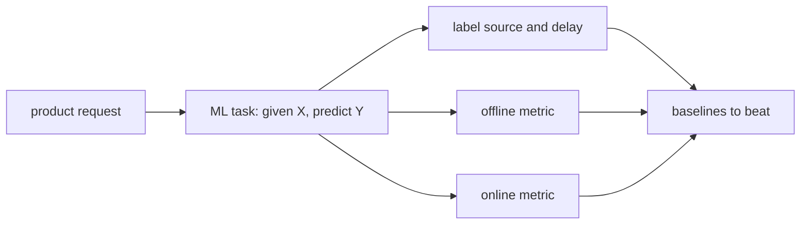

# 2. Framing it as an ML task

<!--
  This section turns a product request into something with a label and a metric. If a
  later section cannot point back to a decision made here, this section is not doing
  its job.
-->

## What the model predicts

One sentence: given X, predict Y. Then the four things that sentence hides.

| | |
|---|---|
| **Input** | What is available at prediction time, and only that |
| **Output** | A score, a probability, a ranking, a set |
| **Label** | Where it comes from, and how long it takes to arrive |
| **Unit** | Per user, per item, per user-item pair, per session |

## Where the label comes from

The most common way this whole design goes wrong. State it explicitly:

- **Source.** Explicit feedback, implicit feedback, a downstream event, or a human
  annotation budget.
- **Delay.** How long between the prediction and the label. Anything over hours changes
  the training pipeline and the evaluation.
- **Bias.** The label exists because something was shown. Say what showed it, because
  that is the logging policy every offline number is conditioned on.

## The two metrics, named separately

| | Offline | Online |
|---|---|---|
| What it measures | The model, on logged data | The system, on live traffic |
| Example | AUC, recall@k, NDCG, MAE | Engagement, revenue, latency, complaint rate |
| Fails when | The split leaks, or the candidate distribution differs | Novelty effects, network effects, seasonality |

The gap between them is what most of this book is about. A chapter that reports only one
is missing the part the interview is about.

## Baselines to beat

Name them before naming a model. Popularity, most-recent, a heuristic rule, and the
model already in production. If the answer does not clear those, nothing after it
matters.

