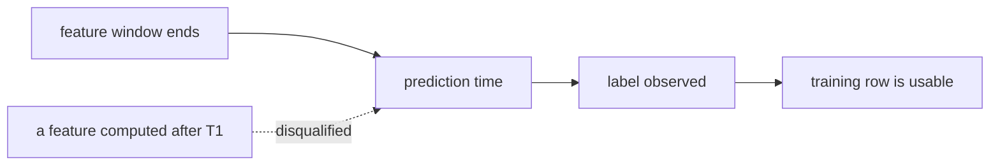

# 3. Data preparation

<!--
  Labels, features, splits. Most leakage lives here, so audit the temporal boundary
  before anything else.
-->

## Building the training set

- **Rows.** What one row is, and over what window.
- **Positives and negatives.** Where negatives come from: observed non-clicks,
  in-batch sampling, or explicit sampling. Say which, because the choice changes the
  loss and what the model learns.
- **Sampling.** Downsampling the majority class, capping heavy users, or nothing.
  Whatever you do here has to be undone at prediction time if the probability matters.

## Features

| Family | Example | Watch out |
|---|---|---|
| Entity attributes | Age of the item, category | Slow-changing, cheap to serve |
| Aggregates | Counts and rates over a window | The window must end before the prediction time |
| Sequence | The last N interactions | Fresh at serving, expensive to keep fresh |
| Cross | User segment by item category | Cardinality, and how you will serve it |

## The temporal boundary

<!--
  This is the paragraph an interviewer probes hardest. Be concrete about the audit.
-->

Fix a prediction timestamp per row and ask of every feature: could this value have been
computed using only data that existed before that timestamp? Any feature that fails is
disqualified regardless of how much it helps the score. Split by time, not at random.

## What gets stored, and where

The offline and online paths read the same features or the system does not work. Name
the store, the refresh cadence and the freshness guarantee for each family above.
