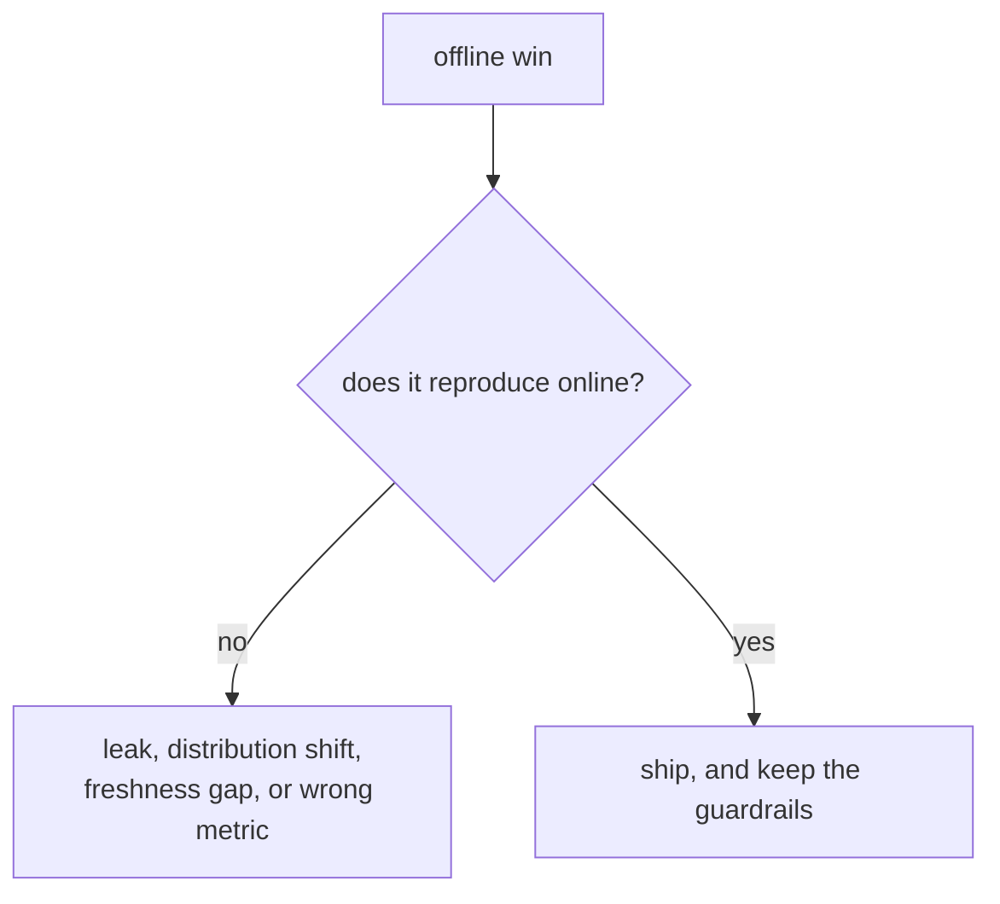

# 5. Evaluation

<!--
  Offline gate, online test, and the gap. Say what would make you not ship.
-->

## The offline gate

What is computed, on which split, and the threshold that decides. Include the interval:
a metric without one is not a decision.

| Metric | Why this one | The bar |
|---|---|---|
| | | |

## The online test

Randomization unit, primary metric, guardrails, duration and sizing. Name the guardrail
that would stop a launch even if the primary metric wins.

## Where the two disagree

The most valuable paragraph in the chapter. Common causes, in the order to check them:
a split that leaks, a candidate distribution that differs between offline and online,
a feature that is fresher offline than online, and a metric that is not the thing the
product wants.

## Slices

Report the slices where the effect and the risk actually live: new users, new items,
the tail, and whichever segment the business cares about. An aggregate hides both.
