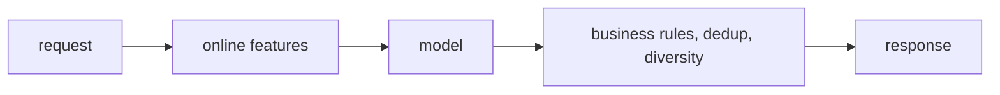

# 6. Serving and scaling

<!--
  The latency budget, the freshness budget, and what breaks first. Numbers, not
  adjectives.
-->

## The request path and its budget

| Stage | Budget | What it costs |
|---|---|---|
| | | |

## Freshness

What has to be fresh, how fresh, and what it costs to keep it that way. Distinguish
model freshness (retrain cadence) from feature freshness (streaming versus batch),
because they fail differently and cost differently.

## What breaks first

An ordered list, with the number at which each becomes the bottleneck. Ordering it is
the answer; listing it is not.

## Implementation pitfalls

| Pitfall | Symptom | Fix |
|---|---|---|
| | | |
