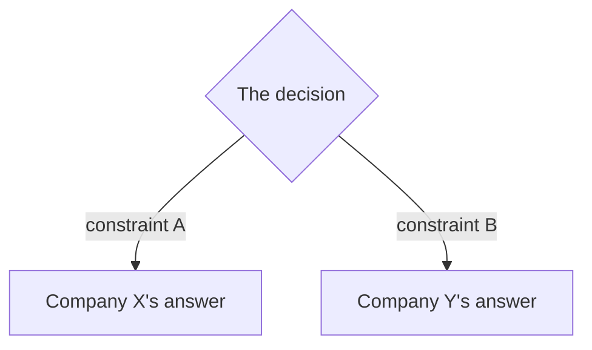

# 7. How teams do it in production

<!--
  First-party engineering writeups only: the company's own blog, paper, or talk.
  Not a summary, not a newsletter, not a vendor page about someone else's system.

  If this chapter has a matching topics/NN file, its `## Seen in production`
  section is the same list, and tools/build.mjs reads that one into the case
  indexes. Keep the two consistent.
-->

What the writeups below have in common, in two or three sentences. Then the more
useful half: where they disagree, and what decision made them disagree.

## Where the real designs diverge

| Team | Chose | Because | Gave up |
|---|---|---|---|
| | | | |

## The systems (first-party links)

- **Company** [Title of the writeup](https://example.com) - what it illustrates, and
  the one number worth remembering from it.
