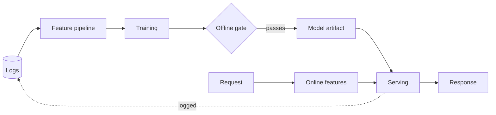

# Chapter Title

<!--
  Copy this folder to book/your-slug/ and delete every HTML comment.
  Then add the chapter to the table in book/README.md: that table is what the site's
  sidebar is generated from, so a chapter missing from it has no navigation.

  Files: 01 through 10 as named here. The fixed positions are the point. A reader who
  has finished one chapter knows where the production writeups and the interview
  questions are in every other one.
-->

> **Style note.** Keep or rewrite this note. It exists so a reader knows what kind of
> document they are in: teach-first, a Candidate/Interviewer dialogue to open, a
> consistent frame-data-model-evaluate-serve arc, one small figure per idea.

An interviewer rarely says "design a X model." They say **"..."**, the symptom-first
version of the question. Open with that sentence, then name the entry point the rest of
the chapter follows from: the metric, the constraint, or the arithmetic every later
section refers back to.

## Sections

1. [Clarifying the requirements](01-clarifying-requirements.md) -- the dialogue that scopes the problem.
2. [Framing it as an ML task](02-frame-as-ml-task.md) -- inputs, outputs, label, and the offline and online metrics.
3. [Data preparation](03-data-preparation.md) -- where labels come from, features, splits, leakage.
4. [Model development](04-model-development.md) -- baselines first, then the model families and what each buys.
5. [Evaluation](05-evaluation.md) -- offline gates, online tests, and the gap between them.
6. [Serving and scaling](06-serving-and-scaling.md) -- the latency budget, freshness, and what breaks first.
7. [How teams do it in production](07-how-teams-do-it-in-production.md) -- named companies, divergence table, first-party links.
8. [Interview Q&A](08-interview-qa.md) -- commonly asked, tricky, and commonly answered wrong.
9. [Summary](09-summary.md) -- one-page recap, mermaid, test-yourself, further reading.
10. [Putting it together: the complete build](10-putting-it-together.md) -- the default stack, the scenario costed, the same system under two other constraint sets, and a runnable reference.

## The whole system on one page

Read the sections in order the first time. They build on each other.

<!--
  Figures go in this folder's assets/ and are referenced as assets/fig-name.png.
  Every image reference must resolve to a file that exists, and CI checks it.
-->
